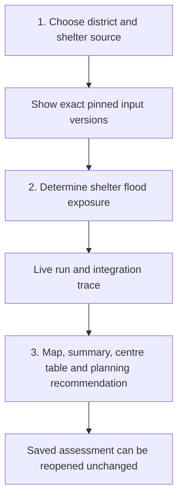
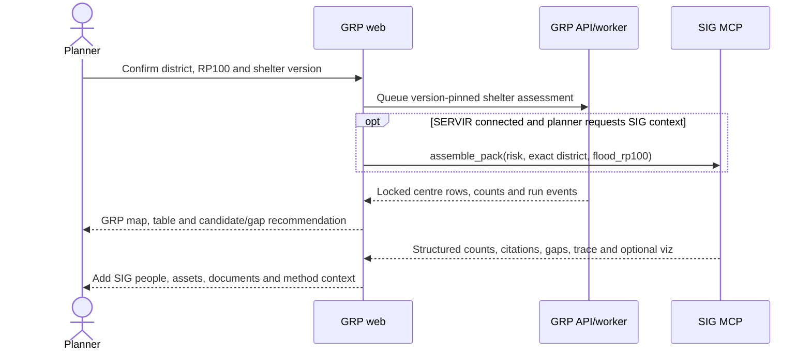
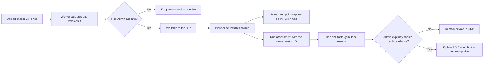

# ADR-0019: Reuse approved shelter uploads in maps and assessments

**Status:** Accepted for the developer-only Platform baseline slice; Hub-local selection deferred

**Date:** 2026-09-23

**Deciders:** Product Owner; Hub data owner; Technical Lead; SIG platform owner for the optional
public embed

## Context

ADR-0018 proves that a Platform Admin can upload the DDPM Shapefile ZIP once, validate it in a
worker and publish an immutable dataset version. That version deliberately remains technically
valid but non-current, so Planning and Assessments do not offer it yet. The product needs the next
flow: approve a validated upload, select it without uploading again, show the same named points on
the Planning map and pin that exact version into an assessment.

The SIG platform currently embeds only `hazard_map` and `provenance_graph`. It can accept and count
an `evacuation_centres` vector contribution. Its hazard-map payload can carry one severity-tagged
asset collection, but its current headline selector chooses only hospitals, schools or buildings;
there is no receipt-bound request to select evacuation centres for display. Hub-private source data
must not be sent to SIG automatically.

## Decision

Use one immutable shelter version from selection through display and calculation.

### Implementation status (23 September 2026)

The local Docker development slice is implemented: Platform Admin upload, worker validation,
explicit Platform Admin acceptance, selectable `assessment_ready` versions, one Planning
**Data & run** drawer, a persistent six-step assessment trace, and the existing locked map/table/
recommendation result. Migration `20260923_0013` stores the trace. Previously accepted shelter
versions remain selectable so old and deliberate replacement runs stay reproducible.

The production Hub-local candidate, Hub Admin selection record, reject/retire actions, and exact
GRP-to-SIG contribution mapping are not implemented. The current acceptance endpoint is therefore
limited to Platform-owned shelter versions and the browser upload remains enabled only in `dev`.

1. A production upload becomes a Hub-local candidate owned by the uploader's Hub. Technical
   validation never makes it usable by itself.
2. A Hub Admin accepts a technically valid candidate. Acceptance advances it to
   `assessment_ready` and records it as the Hub's selected evacuation-centre source. Platform
   baseline acceptance remains a Platform Admin action.
3. Add an explicit Hub dataset-selection record rather than inferring the Hub choice from
   `dataset_version.is_current`. This avoids ambiguity when both platform and Hub-local datasets
   have current versions.
4. Planning and Assessments list only visible, `assessment_ready` versions. The default is the
   Hub-selected version, falling back visibly to the platform baseline. A planner may deliberately
   choose another eligible version for one assessment.
5. The selected `evacuation_centers_version_id` is passed to both the district-scoped map endpoint
   and assessment submission. The assessment pins its ID and checksums. No resolver may silently
   replace it.
6. Before assessment, the GRP map and right panel show the exact source names and points with
   provenance and “not assessed” status. After assessment, those same feature IDs are augmented
   with flood status, reason and depth; no second centre collection is created.
7. GRP remains the map renderer for private or unshared shelter data. Optional SIG publication is
   a separate Admin-approved path: export an approved privacy-reduced GeoJSON, submit it once,
   record the SIG contribution/layer version, and reuse that reference. GRP may show centres in the
   SIG hazard embed only after SIG adds a receipt-bound asset-selection contract and GRP verifies
   the returned contribution and displayed layer.

## First delivery slice: district shelter screening

Deliver one complete vertical slice before adding other data types. It covers one exact supported
district, one selected evacuation-centre point version, the current RP100 flood layer and the
approved point-overlay method. Boundary and flood inputs are shown but automatically selected when
only one eligible version exists. The planner chooses the shelter source when genuine alternatives
exist. Vulnerability, capacity, routes and public SIG contribution are not inputs to this slice.

The primary experience lives in Planning's **Data & run** drawer so the person does not have to
assemble the workflow across pages. Assessments remains the history and detailed-result page.

### Configure

- District: one exact managed district selected by the planner.
- Boundary: accepted version, automatically selected and visibly named.
- Flood hazard: accepted RP100 version, automatically selected and visibly named.
- Evacuation centres: dropdown of accepted platform and own-Hub versions, with the Hub selection
  shown first. Each option shows title, provider and short version reference.
- Method: approved centre/flood overlay version, shown read-only for this slice.
- The run button stays disabled until all four exact version IDs are resolved.

### Run and integration trace

Store planner-safe assessment events rather than animating guessed steps. Polling is sufficient for
the first slice; server-sent events remain a later optimization. The visible trace is:

1. **Request recorded** — assessment and support reference created.
2. **Inputs resolved** — boundary, RP100, shelter and method IDs/checksums pinned.
3. **Worker started** — leased background GIS job claimed.
4. **District centres loaded** — number of selected-version points in the district.
5. **Flood overlay completed** — point/raster comparison finished.
6. **Result checked and saved** — count invariants passed and immutable result committed.

Each event has `queued`, `running`, `completed` or `failed`, plus a timestamp and safe detail. It
must never show a SIG call or an AI step that did not occur. Technical logs remain Admin-only.

### Result on the map

- Keep the district outline, selected RP100 display layer and selected-version shelter markers on
  the GRP Leaflet map.
- Use the same `feature_id` in the marker, complete centre table and locked result.
- Summary cards show centres in district, potentially exposed, lower mapped exposure and unable to
  assess. Counts come only from the locked result.
- The table lists every centre name, result status, reason and flood depth where available. A row
  focuses its marker and a marker focuses its row.
- A source strip names the district, scenario, shelter version, hazard version, method and support
  reference.

### Bounded planning recommendation

Generate this deterministically from the locked statuses; an LLM is not needed for the first slice.
Centres with `not_exposed_under_scenario` may be presented as **candidate movement options with
lower mapped flood exposure under this scenario**. Potentially exposed and unable-to-assess rows
are listed as follow-up concerns. The recommendation always states that capacity, accessibility,
services, routes, operating status and other hazards were not assessed. It never calls a centre
safe, suitable or approved and does not rank candidates without an approved ranking method.

The combined operational map is rendered by GRP. The current receipt-bound SIG `ui_embed` remains
a separate hazard/provenance evidence view because its iframe cannot accept GRP shelter markers and
does not currently select a contributed evacuation-centre layer. Do not attempt to visually overlay
private GRP points on that cross-origin iframe.

## Reuse of existing SIG runbook capabilities

Use the runbook as a capability inventory. Do not copy its temporary auto-approval behavior into
GRP. The integrated result may combine a locked GRP assessment with an independent SIG screening
pack, but it must keep their source identities and methods visible.

| Existing capability | Use in the district shelter slice | Display |
|---|---|---|
| `platform_capabilities` | Preflight which hazard, point, population, document and method sources are live | Availability badges and a typed missing-source message |
| `contribute_status` | For an Admin-approved public contribution, verify state, reviewer and contribution ID | Data-source detail; never call a preview “approved” |
| `evacuation_centres` vector | Count named public centres by flood severity and risk level | SIG screening cards/citations; merge with GRP rows only after exact version mapping |
| `assemble_pack` | Return deterministic counts, citations, gaps, AOI method, trace and visualization payload | SIG context tabs; the LLM does not supply the numbers |
| Population count grids | Total people and people in the flood zone, including severity breakdown | **People context** cards/table with source, vintage and denominator |
| Vulnerability class rasters and weights | Explain Layer-2 risk recipe, nominal/effective weights and coverage | **Risk method** disclosure; never call it a vulnerable-person headcount |
| Hospitals, schools, buildings and roads | Additional district exposure context | **Supporting assets** table; do not mix these counts with shelters |
| Risk-pack documents | Relevant forecast/retrospective passages with provenance | **Documents** list with temporal and validation badges |
| Declared gaps | Preserve everything SIG says is missing or could not be computed | Prominent **Gaps and follow-up checks** section |
| Receipt and `ui_embed(hazard_map)` | Optional public, reviewable hazard/risk evidence after explicit publication | Separate **SIG evidence map**; never required for the private GRP result |
| Damage/cost tables via `feeds_query` | Defer until a reviewed cost method and replacement-cost inputs exist | Not shown in this first slice |

### One integrated result experience

One run action may start two independent tracks. The local GRP assessment must not wait for SIG:

The final right panel uses these sections:

1. **Overview** — district, RP100, completion state, support reference and exact GRP input versions.
2. **Evacuation centres** — locked summary cards and every named centre row synchronized with the
   GRP map.
3. **People context** — SIG total/exposed population by severity when available. Show a
   vulnerability-class map separately; do not multiply it into a vulnerable headcount.
4. **Supporting assets** — SIG schools, hospitals, buildings and road kilometres by severity.
5. **Recommendation and gaps** — GRP lower-exposure candidate options first, followed by capacity,
   route, service, population and SIG declared gaps.
6. **Sources and methods** — provider, title, licence, vintage, review status, hazard legend, risk
   weights/effective coverage, citations and temporal labels for documents.
7. **Run trace** — separate GRP worker events and SIG pack steps; do not make one look like the
   other or show calls that did not run.
8. **SIG evidence map** — receipt-bound hazard/risk embed only after the planner explicitly creates
   a public record.

### Evidence identity gate

Add an optional mapping from a GRP dataset version to a SIG contribution: GRP version ID and SHA,
SIG contribution ID, layer name, review state and confirmation time. Only when this mapping matches
may the UI say the GRP and SIG centre evidence refer to the same source version. Otherwise show the
SIG evacuation-centre count as separate screening evidence and never reconcile or merge it with the
locked GRP centre table.

## User flow

## Options considered

| Option | Assessment |
|---|---|
| Upload for every assessment | Rejected: duplicates data and loses stable provenance |
| Automatically use the newest upload | Rejected: technical validity is not owner acceptance |
| Store one Hub selection plus allow an explicit per-assessment choice | Chosen: clear default, reproducible exceptions |
| Send every upload to SIG and use `ui_embed` | Rejected: privacy breach and no current centre embed contract |

## Consequences

- Users upload once and reuse the accepted version until it is replaced or retired.
- Multiple shelter sources stay separate; GRP never silently merges shelters, early-warning
  resources or volunteer centres.
- Planning, Assessments and the locked result use one source identity and one set of feature IDs.
- The existing Planning resolver must stop hard-coding the platform shelter dataset.
- Map authorization must allow the selected eligible version while preserving cross-Hub 404s.
- A GRP centre map can ship before the optional SIG embed asset-selection enhancement.
- The first release has a small, testable scope: point locations at district level under RP100.
- A persistent event record is required for a truthful user-facing trace; the existing assessment
  state and estimated browser progress alone are insufficient.

## Implementation plan

1. Add `hub_dataset_selection`, acceptance audit fields and planner-safe assessment run events in
   migrations.
2. Generalize the upload job to create a Hub-local dataset candidate while retaining the
   Developer-only Platform Admin route for local testing.
3. Add accept, select, reject and retire APIs with Hub Admin/Platform Admin permission tests.
4. Extend the catalog with readiness, provenance, district feature count and `selected_for_hub`.
5. Add the shelter source selector and run confirmation to Planning's **Data & run** drawer; keep
   the existing selector in Assessments. Both use the same catalog response and exact version ID.
6. Update the map layer/features APIs and Planning state so changing the source reloads its points
   and named list together.
7. Pass the chosen version into chat-started assessments; remove the platform dataset hard-code.
8. Add the stored trace endpoint/UI and deterministic candidate/gap recommendation.
9. Verify a real upload through selection, trace, display, assessment, reload and historical replay.
10. Add read-only SIG capability/evidence adapters for structured counts, sources, review status,
    population, supporting assets, documents and declared gaps. Keep the local result usable when
    SIG is disconnected or slow.
11. Define the optional GRP-version-to-SIG-contribution mapping and ask SIG to let
    `ui_embed(hazard_map)` select the receipt-bound `evacuation_centres` asset. Do not block steps
    1–10 on it.

## Acceptance criteria

- A valid ZIP is uploaded once and appears as a non-usable candidate after validation.
- A Hub Admin can accept it, and another Hub receives 404 for its records and actions.
- Planning shows the accepted dataset title, version and provider, then draws only its points for
  the selected district and lists every returned centre name.
- Assessments pin the selected version and old results reopen unchanged after a newer upload.
- The trace reflects persisted worker events and survives page navigation or browser reload.
- Summary counts and every centre row equal the locked assessment result exactly.
- The recommendation names lower-exposure candidates and missing checks without making a safety,
  capacity, route or suitability claim.
- Rejected, retired, invalid and merely technically valid versions cannot start new assessments.
- No Hub upload reaches SIG without a separate explicit Admin share action.
- SIG context failure cannot delay, change or invalidate a successful GRP result.
- Population, assets, risk method and document cards reproduce structured SIG evidence and cite
  their source, vintage, review state, scope and denominator where applicable.
- GRP and SIG centre counts are never merged unless the exact version/contribution mapping matches.
- If SIG does not return a verified centre asset in the embed, GRP continues to show the local map
  and does not substitute hospitals, schools or another layer.

## Explicitly deferred from this slice

- A GRP-calculated vulnerable-person map or headcount, age/household locations and
  centre-to-population proximity. A separately labelled SIG vulnerability-class layer may appear
  as screening context when returned with provenance.
- Shelter capacity, occupancy, services, accessibility, route safety or travel time
- Multi-scenario comparison beyond the available RP100 layer
- AI-generated recommendations, investment briefs and public receipts
- Automatic merge of shelter, volunteer-centre and early-warning datasets
- Receipt-bound selection of `evacuation_centres` in SIG `ui_embed` until its upstream contract
  exists
