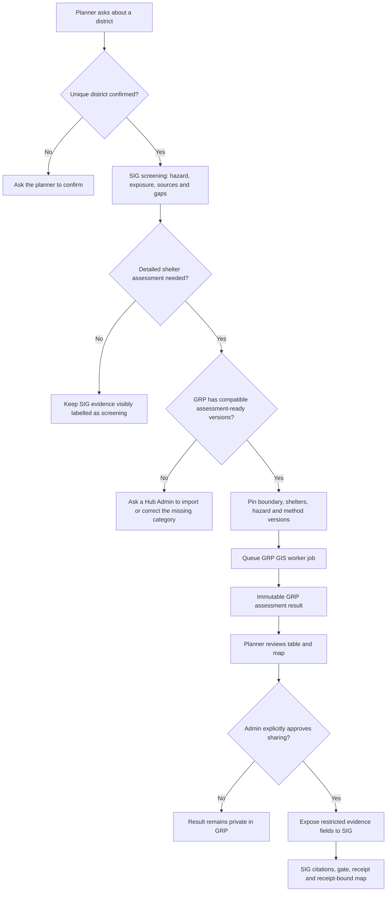
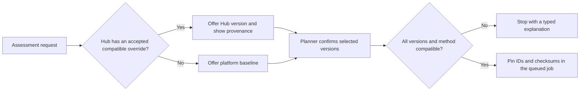
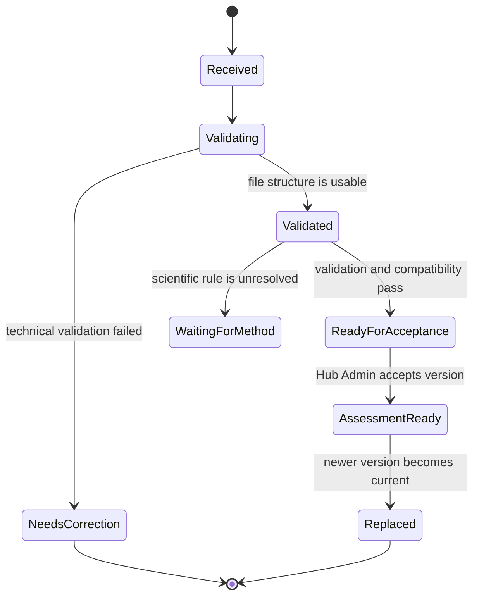
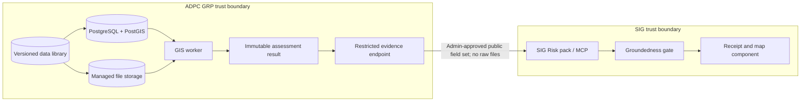
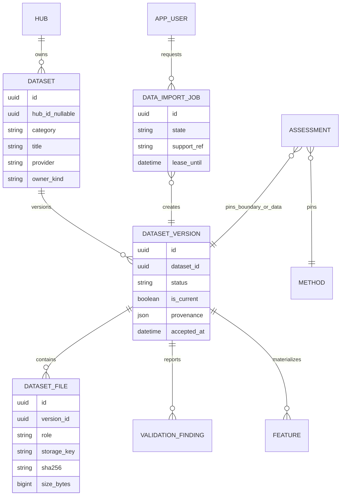

# Data library, SIG screening and GRP assessment design

**Status:** Proposed for product, Technical Lead, Data Science and SIG review.
**Date:** 19 September 2026.
**Decision record:** [`adr/0008-baseline-and-hub-data-overrides.md`](adr/0008-baseline-and-hub-data-overrides.md).

## 1. Purpose

GRP needs two related but different capabilities:

1. **SIG screening** for a quick view of flood hazard, general asset exposure, sources and gaps.
2. **GRP assessment** for reproducible classification of evacuation shelters using pinned data and an approved method.

The delivered Thailand files are accepted as the initial platform baseline under ADR-0007. Hubs may later contribute better local data for selected categories without overwriting the baseline or changing old results.

This design explains the workflow, ownership, technology, scaling path and the assumptions a reviewer should challenge before implementation.

## 2. Product workflow

The LLM may identify intent, place and return period and may explain evidence. Deterministic server rules decide which workflow is allowed. The LLM never chooses an authoritative dataset, reads map pixels or calculates exposure.

## 3. Data ownership and precedence

### 3.1 Baseline

The platform baseline is the accepted Data Science delivery:

- Thailand district boundaries;
- DDPM evacuation shelters;
- RP100 flood-depth tiles;
- vulnerability rasters, held outside assessments until their meaning is approved.

A baseline is a default source, not an eternal truth. Every imported version records provider, edition, acceptance, retrieval date, licence terms, checksums and validation report.

### 3.2 Hub overrides

Overrides are **Hub-owned, not privately owned by an individual user**. A person may upload a candidate, but a Hub Admin must accept it before it becomes the Hub default. This prevents two planners in the same Hub receiving different answers without knowing why.

A Hub may override one category while retaining the platform baseline for the others. For example:

| Input | Version used |
|---|---|
| Boundary | Platform baseline 2025-10 |
| Shelters | ADPC Hub local survey 2026-01 |
| RP100 flood | Platform baseline v2.1 |
| Method | Approved method v1 |

Rules:

- baseline versions are immutable;
- an override creates a new immutable version;
- accepting a new current version does not delete or edit its predecessor;
- every assessment pins the exact version of every input;
- there is no silent fallback from an invalid Hub override to the baseline;
- the assessment form shows the selected source and version before submission;
- old assessments always reopen with their original inputs;
- uploaded or Hub-local data remains private and cannot be shared with SIG unless policy explicitly permits its derived public fields.

### 3.3 Resolution policy

“Current” controls the default offered in a new assessment. It never rewrites a stored result.

## 4. Data-library workflow

“Uploaded successfully” means bytes were received. It does not mean assessment-ready.

### 4.1 Intake modes

1. **Import existing source data** — first release. An Admin selects known files already under the read-only `.local/data-in` delivery. The worker copies accepted inputs into managed immutable storage.
2. **Upload new dataset** — second release. An Admin selects files in the browser; GRP streams them into quarantine, then the worker validates and registers them.

Starting with existing-source import avoids transferring the current 2.1 GB delivery a second time and proves the full validation/versioning path before arbitrary uploads are accepted.

### 4.2 Category guidance

| Category | Person selects | Main validation | Ready when |
|---|---|---|---|
| District boundaries | Same-stem `.shp`, `.shx`, `.dbf`, `.prj`; optional `.cpg` | Polygon geometry, CRS, codes, names, duplicates, validity | Supported areas are reviewed |
| Evacuation shelters | Same-stem `.shp`, `.shx`, `.dbf`, `.prj`; optional `.cpg` | Point geometry, CRS, coordinates, names, geometric district membership | Field mapping accepted; mismatches reported |
| Flood depth | One or more `.tif`/`.tiff` files for one scenario | CRS, resolution, extent, overlap, NoData, range, return period | NoData and permanent-water rules belong to an approved method |
| Vulnerability | `.tif`/`.tiff`, with declared population group | CRS, resolution, extent, range, NoData | Scientific meaning and aggregation method are approved |

ZIP is excluded initially to avoid extraction and path-traversal risks. It can be added later with strict manifest and expansion limits.

## 5. GRP and SIG boundary

Raw Shapefiles, shelter attributes, private geometry and rasters do not go to SIG. After explicit sharing approval, SIG receives only the restricted fields of an already-completed result. MCP is the governed tool interface; it is not the GRP data store.

The current SIG generic map remains useful for screening. It cannot replace a GRP hazard input unless SIG later supplies a reviewed machine-readable contract with a stable version, return period, CRS, resolution, NoData meaning, licence and deterministic access for the worker.

## 6. Technical stack

| Concern | MVP technology | Scale path |
|---|---|---|
| Web/API | Python 3.12, FastAPI | Add API replicas after shared rate limits and token storage |
| Metadata and jobs | PostgreSQL 16 | Keep authoritative transactions in PostgreSQL |
| Spatial vectors | PostGIS | Spatial indexes; simplified map geometry |
| GIS processing | Existing Python worker with rasterio, pyogrio and shapely | Add worker processes; separate queues by job type |
| Job queue | PostgreSQL `FOR UPDATE SKIP LOCKED` with leases | Broker only after measured queue pressure |
| File storage | Existing storage protocol and managed local volume | S3-compatible object storage without changing domain callers |
| Raster format | Original file retained; working copy as Cloud-Optimized GeoTIFF | Optional TiTiler/rio-tiler service for national browsing |
| Frontend | Existing static HTML/CSS/JavaScript and Leaflet | Keep no-build UI unless product complexity justifies migration |
| Schema change | Alembic forward-only migrations | Same process in every environment |
| External evidence | SIG MCP plus protected GRP evidence endpoint | Machine identity, retries and recorded contract fixtures |
| Observability | Support references, audit events and job timings | Structured logs, metrics and distributed tracing before pilot |

A vector-embedding database is not part of this design. GIS vectors belong in PostGIS; large rasters belong in managed file/object storage.

## 7. Proposed data model

The existing `dataset`, `dataset_version`, `feature`, assessment and inspection tables should be extended rather than replaced. A migration is required for import jobs, multi-file manifests, validation status and Hub-current selection.

## 8. API and UI outline

Proposed protected routes, all covered by the permission matrix:

- `GET /api/v1/data-library/categories` — required files and explanations.
- `GET /api/v1/data-library/datasets` — visible baseline and own-Hub datasets.
- `POST /api/v1/data-library/imports/source` — queue import from the existing source folder.
- `POST /api/v1/data-library/uploads` — receive a candidate upload and queue validation.
- `GET /api/v1/data-library/imports/{id}` — status and safe findings.
- `POST /api/v1/data-library/versions/{id}/accept` — Hub Admin makes a validated version current.
- `POST /api/v1/data-library/versions/{id}/retire` — stop offering it for new work.

The shared `GRP.jobs` tracker reports import completion across pages. The Data library page shows provenance, validation, current/replaced state and exactly why a version is or is not assessment-ready.

## 9. Security and governance

- Hub Admins manage Hub-local data; Platform Admins manage platform baselines.
- Planners may select assessment-ready versions but cannot accept or replace them.
- Uploads enter quarantine and are never served by filename.
- Enforce extension, count, per-file and total-size limits while streaming; never load a whole upload into API memory.
- Sanitize names, generate storage keys and scan for malformed archives if archive support is later added.
- The API stores bytes but never imports GIS libraries or performs GIS validation.
- The worker checks the uploaded checksum again before registration.
- Audit receive, validate, accept, reject, make-current and retire actions.
- Another Hub receives 404, not confirmation that a dataset exists.
- No raw upload, private geometry, token or personal attribute enters logs, AI prompts or SIG evidence.

## 10. Scaling assessment

This design is ready for the pilot without introducing premature microservices:

- metadata and jobs stay transactional in PostgreSQL;
- slow work is already asynchronous;
- additional workers can claim jobs safely;
- file storage is behind a replaceable interface;
- COGs allow windowed raster reads;
- PostGIS supports indexed national vector data;
- immutable versions make caching and replay safe.

Measured triggers for additional infrastructure:

- move local files to S3-compatible storage when storage must span hosts;
- use direct-to-object-storage multipart upload when browser uploads regularly exceed API proxy limits;
- add a tile service when users need national continuous raster browsing;
- add worker pools when queue age misses service targets;
- add Redis or PostgreSQL shared state before a second API replica;
- introduce a broker only if PostgreSQL job claiming becomes a measured bottleneck.

## 11. Challenges reviewers should raise

| Challenge | Design response |
|---|---|
| Why store flood data if SIG already has a map? | Do not duplicate it merely for display. Store/use it only when GRP needs deterministic shelter classification and SIG lacks a machine-readable pinned hazard contract. |
| Why not let every user replace data? | Individual hidden defaults destroy reproducibility. Users may contribute candidates; Hub Admin acceptance establishes one visible Hub default. |
| Why not overwrite the baseline? | Old results would become irreproducible. New versions become current; old versions remain pinned. |
| Why not automatically fall back to baseline when an override fails? | Silent fallback can produce a plausible result with the wrong source. Stop and let the person choose. |
| Why not send raw data to SIG? | It expands the privacy and governance boundary unnecessarily. SIG needs approved result evidence, not source files. |
| Why not use a vector database? | The problem is spatial geometry/raster analysis, not embedding similarity. PostGIS and COGs provide the required operations. |
| Can “validated” mean scientifically correct? | No. Technical validation, source acceptance, method approval and assessment completion are separate states. |
| Will 2 GB browser uploads scale? | Import the existing delivery server-side first. Later use streaming/quarantine; move to direct object-storage multipart upload when measured. |

## 12. Implementation sequence

1. Approve ADR-0008 and the Hub-level override rule.
2. Extend the schema for import jobs, file manifests, version status and Hub-current selection.
3. Build existing-source import for district boundaries and shelters.
4. Add worker validation, PostGIS loading, checksums and audit events.
5. Add flood-tile registration and COG conversion; keep it waiting for method until DEP-05 is settled.
6. Add the Data library Admin page and background completion notices.
7. Connect assessment forms to compatible assessment-ready versions.
8. Add quarantined browser upload using the same worker pipeline.
9. Add vulnerability registration, but keep it out of results until DEP-07.
10. Implement the Admin-approved GRP evidence endpoint and SIG `assessment_ref` contract.

## 13. Acceptance criteria

- An Admin can import the delivered baseline without re-uploading 2.1 GB.
- A Hub can add a shelter override while continuing to use baseline boundary and hazard versions.
- A planner sees the provider and version selected for every assessment input.
- Two assessments can pin different versions and both reopen with unchanged results.
- Invalid or incompatible data stops with a typed explanation; no fallback occurs.
- A completed job produces one immutable result whose counts sum correctly.
- Raw files remain private; SIG receives only an explicitly shared result field set.
- Two workers do not process one import twice, and a crashed worker's lease can be reclaimed.
