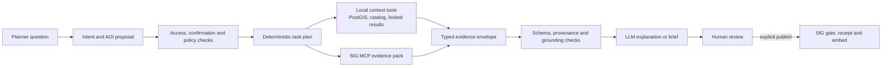

# Demo mock feature implementation plan

**Status:** Proposed implementation sequence  
**Source reviewed:** `example/The_Demo_Mock_Version.docx` (seven embedded mock-up/architecture images)
**Reviewed:** 20 September 2026

## 1. Purpose and guardrails

The mock-up is a product-direction reference, not evidence that the pictured data, calculations or integrations exist. Implement the workflow without copying illustrative values into production or weakening the approved GRP trust boundaries.

The following rules remain mandatory:

- Keep SERVIR/SIG OIDC as the configured identity provider. The note “log in with Google account” is interpreted as account-provider UX to confirm with the identity owner, not permission to add a separate Google login.
- API requests never perform GIS work. Raster processing, spatial joins, comparisons and exports run in workers.
- Every assessment and comparison pins immutable boundary, hazard, evacuation-centre, vulnerability and method versions.
- Display-only data cannot become an assessment input merely because it appears on the map.
- Do not reproduce the mock's invented geometries, centre counts, population values, risk classes or scenario results.
- A red/yellow/green **risk** map requires an approved vulnerability definition and method. The current red flood layer means depth only.
- SIG evidence and maps remain separately labelled unless a reviewed identifier contract proves that they represent the same GRP result.

## 2. Feature inventory from the mock

| Mock feature | Current repository state | Implementation disposition |
|---|---|---|
| “Evacuation preparedness planning” workspace | Planning chat/map exists | Safe UX enhancement; retain current trust labels |
| Thailand-wide AOI search | 928 district boundaries are imported; current assessment selector exposes only supported areas | Add a searchable browse selector that distinguishes **preview/SIG-only** from **assessment eligible** |
| District and sub-district AOIs | District collection imported; delivered source contains 7,436 sub-districts but they are not in the managed library | Add a versioned sub-district import and parent linkage before offering sub-district assessment scope |
| English/Thai switch | No localization framework | Add only after terminology catalogue and translated acceptance copy are approved |
| Feedback and help actions | Not implemented | Low-risk shell work; configure destinations rather than hard-code external URLs |
| Purpose cards: investment case / preparedness review | Opening chat suggestions exist, but outputs do not | Add as intent shortcuts now; keep blocked outputs visibly unavailable |
| Data & run configuration | Assessment form exists separately; no resolver preview in Planning | Build a server-resolved configuration drawer with compatibility reasons and exact pinned versions |
| Automatic platform source selection | Catalog resolves current eligible versions | Extend into an explicit input-resolution contract; never select display-only versions |
| Choice between platform and Hub evacuation centres | Hub selection schema exists; browser upload/acceptance is not built | Implement accepted Hub override selection after upload security gates |
| Saved local/Hub source indicator | Data library and Hub selections exist partially | Show accepted, immutable sources only; do not imply arbitrary local browser data is active |
| 20-, 50- and 100-year scenario cards | RP20/RP50 configured as unavailable; RP100 display-only and method-blocked | Keep unavailable until immutable source versions and method compatibility exist |
| Seven-scenario progression (RP10–RP500) | Assessment model permits the return periods; data is absent | Implement generic scenario ingestion first, then comparison; no synthetic fallback |
| Map layers count and legend | Layer panel exists | Add count/badges and grouped legend without changing layer semantics |
| Planning information drawer | Result card and context summary exist | Consolidate purpose, AOI, scenario, pinned inputs, output availability and limitations |
| Map-only mode | Not implemented | Safe responsive presentation feature after drawer state is modularized |
| Assessment run and integration trace | Background job tracking exists; SIG timing evidence exists | Add a persistent GRP job trace view; do not present proposed SIG compute/contribute calls as connected |
| Flood-scenario comparison | Not implemented | Requires at least two compatible hazard versions and approved NoData rules |
| Exposure share, flooded area and comparable set | Centre status totals exist for one synthetic result; flooded area does not | Add worker-derived comparison metrics with explicit denominator and excluded/NoData counts |
| Vulnerable-people indicators | Delivered rasters are unapproved and their meanings are unresolved | Block on DEP-07 and approved population/indicator sources; categories must retain overlap warnings |
| Shelter proximity and population gaps | Not implemented; no approved travel-distance method or population source | Define distance/network method and source before implementation |
| Risk map | SIG hazard/exposure embed and local flood-depth map exist; no GRP risk method | Block on vulnerability and approved risk classification; never relabel depth as risk |
| Investment brief | Mentioned as future; no export template | Build only from immutable results and cited evidence after DEP-12 templates |
| Upload | Source-folder imports exist; browser upload is gated | Implement quarantine, malware/type/size checks, worker validation and Hub Admin acceptance first |
| “Evolution of AI Agents” architecture | Current implementation is primarily diagram **#3: LLM with tools/retrieval**, with controlled session state resembling part of #4; it is not an autonomous #5 agent | Keep deterministic orchestration and evolve to a bounded, policy-controlled agent rather than a free-running autonomous agent |

## 3. Data and decision gaps

### Available now

- Versioned district boundaries: 928 features.
- Versioned DDPM evacuation centres: 10,303 points with geometry-derived district membership.
- One versioned RP100 baseline with red display product, still `waiting_for_method`.
- Delivered sub-district source: 7,436 polygons with population and year, not yet imported.
- Background assessment/import jobs, immutable storage, audit events and Hub selection foundation.

### Blocking real calculations

1. **DEP-05:** the RP100 NoData/modelled-area rule, permanent-water handling and approved flood method.
2. Immutable RP20/RP50 sources for the first mock workflow; RP10/RP75/RP200/RP500 for the full comparison chart.
3. Pilot districts/sub-districts approved as supported assessment areas.
4. **DEP-07:** approved meaning and combination of child, elderly and disability layers.
5. Authoritative population/age/disability counts and reference years for the mock's indicator totals.
6. Approved shelter-proximity definition: straight-line or network distance, threshold, road source and treatment of flooded routes.
7. **DEP-12:** approved investment-brief and map-output templates.
8. Identity-owner decision on whether “Google account” means Google as an upstream SERVIR identity or a separate client. Default is no separate client.
9. Approved Thai terminology and translation ownership before an EN/TH toggle claims complete localization.

## 4. Target architecture

### 4.1 AOI catalogue

Extend the boundary collection rather than creating a parallel place table.

- Import province and sub-district polygons as immutable managed versions.
- Add explicit parent relationships (`sub-district → district → province`) and stable administrative codes.
- Keep `is_supported` independent at every level.
- Return search results with `admin_level`, parent names, source/edition and `assessment_eligible` plus a reason.
- Use simplified PostGIS geometry for the browser and full geometry for worker calculations.

Suggested API:

```text
GET /api/v1/areas?q=&levels=district,sub_district&limit=20
GET /api/v1/areas/{id}
```

### 4.2 Assessment input resolution

Create one server-side resolver shared by Planning and the form-based Assessments page. Given Hub, AOI and scenario, it returns:

- chosen boundary, hazard, centres, optional vulnerability and method versions;
- whether each choice came from the platform baseline or an accepted Hub override;
- compatibility checks and blocking reasons;
- the exact request payload/fingerprints that will be pinned if the person confirms.

Suggested API:

```text
POST /api/v1/assessment-config/resolve
```

The browser may display alternatives returned by the resolver, but it must not infer compatibility or silently merge platform and Hub data.

### 4.3 Generic hazard scenario imports

Refactor the RP100-specific importer into a manifest-driven hazard importer:

- supported return period is explicit and checked against file metadata/registration;
- every scenario is a separate immutable version;
- original files, COGs, bounds, units, NoData policy, provider/licence and display product are recorded;
- red-depth palette stays consistent across return periods;
- availability means a managed version exists; assessment eligibility additionally requires method compatibility and acceptance.

### 4.4 Comparison domain

Do not calculate comparisons in JavaScript. Add a worker job that references two successful, compatible assessments or creates a paired run from one resolved configuration.

The locked comparison result should contain:

- IDs/fingerprints of both assessment results;
- comparable centre set and exclusion reasons;
- exposed/not-exposed/unable counts per scenario;
- exposure share with named denominator;
- newly exposed and exposed-in-both counts;
- flooded area only when the modelled-area/NoData rule is approved;
- method version and limitations.

A progression chart may plot only scenarios with locked comparable results. It must be labelled “scenario progression — not a time trend.”

### 4.5 Vulnerability, proximity and brief

These are separate increments, not presentation-only fields:

- convert/reproject vulnerability sources in a bounded worker process and register them as non-current until DEP-07;
- add machine-checkable method requirements and a new approved method version;
- preserve source year, unit, denominator and overlap behavior for every indicator;
- calculate proximity using an approved method and keep “distance” distinct from “safe route”;
- generate the investment brief as a background export from locked result fields and cited evidence; AI may explain but cannot create figures.

### 4.6 Recommended AI-agent architecture

The current implementation is closest to **#3, LLM with RAG and tools**, in the mock's “Evolution of AI Agents” diagram:

- one LLM call proposes a route;
- server policy validates area, access and permitted action;
- server code—not the model—invokes the allow-listed SIG MCP sequence;
- another LLM call drafts only from the returned evidence;
- local GRP assessments run through a separate deterministic resolver and GIS worker;
- session state and a ten-minute answer cache provide limited workflow memory, but the model does not inspect map imagery and there is no autonomous long-term agent memory.

Therefore it is not yet #4 in the full multimodal sense and is deliberately not #5's free-running advanced agent.

The recommended target is a **bounded evidence-orchestration agent**, conceptually between #3 and #5:



Important behavior:

1. **Do not always call MCP first.** Resolve intent and AOI first. If a locked local result fully answers the question, avoid the external call. If both sources are needed and independent, fetch local context and SIG evidence concurrently.
2. **Do not append arbitrary local data after drafting.** Normalize both sources into a typed evidence envelope before the final model call. Every item carries source, version/fingerprint, geographic scope, timestamp, readiness and permitted use.
3. **Keep meanings separate.** Local display-only baseline facts, locked GRP result facts and SIG screening evidence are separate sections. Never silently merge their counts or imply identifier equivalence.
4. **Give the model no direct database, filesystem or unrestricted MCP access.** It chooses only among server-approved intents; server policy constructs tool arguments and enforces step/time/token limits.
5. **Fail usefully.** A SIG timeout may return labelled local context when permitted; it must not block a valid GRP assessment. A local readiness failure may still permit labelled SIG screening.
6. **Publish only after review.** Existing signed-draft, SIG gate, receipt and sandboxed-embed controls remain.

#### Performance and reliability assessment

The current design is safe but a first SIG request is **not fast**: one observed Chiang Yuen request took 151 seconds, including 138 seconds in external SIG MCP. Exact repeats within one login are fast because ADR-0010 caches completed answers for ten minutes. Reliability is bounded by the external MCP service, an in-memory access token/cache and one synchronous HTTP request; estimated progress is not true streaming.

Before expanding agent autonomy, improve the workflow in this order:

- run independent local/SIG retrieval concurrently and skip SIG when it is unnecessary;
- move long evidence gathering to a durable background job and stream real step events with SSE;
- add per-tool timeout budgets, bounded retries with jitter, cancellation and a circuit breaker;
- cache validated SIG packs separately from drafted wording, keyed by confirmed AOI, hazard, pack contract and security scope;
- validate every tool response against versioned schemas and retain sanitized contract fixtures;
- expose trace IDs, tool durations, cache status and typed partial-failure reasons;
- keep an explicit maximum tool-step and token budget;
- move shared token/cache state out of process before multiple API replicas;
- provide a labelled local-only or SIG-only partial response rather than fabricating the missing half.

This gives most of the value pictured in #5—planning and multiple tools—without allowing an LLM to bypass scientific, security or publication controls.

## 5. Ordered implementation increments

### Increment M0 — reference acceptance and terminology

**Work**

- Review this inventory with the Product Owner, Scientific Authority, identity owner and Thai-language reviewer.
- Mark each mock element as MVP, later, or illustrative only.
- Approve labels for hazard, exposure, vulnerability and risk.

**Done when** the nine decisions in Section 3 have owners/status and nobody expects mock values or geometry to be loaded.

### Increment M1 — workspace shell and searchable district AOI

**Can start now.**

- Rename the workspace heading to “Evacuation preparedness planning” if approved.
- Add the AOI search/dropdown using managed districts.
- Clearly label preview/SIG-only districts versus assessment-eligible areas.
- Add Planning info and Map-only views, grouped layer count/legend, help/feedback configuration and purpose shortcuts.
- Preserve compact/wrapped navigation, keyboard access, phone behavior and the existing explicit preview flood checkbox.

**Likely files:** `web/planning.html`, `web/planning.css`, split modules from `web/planning.js`, `api/maps.py`, new `api/areas.py`, contract/fast browser-static tests.

**Done when** all 928 districts are searchable without becoming runnable assessments, selection fits the correct boundary, and every status is honest.

### Increment M2 — managed sub-district catalogue

**Can start after schema review.**

- Add parent/code metadata and indexes through a forward Alembic migration.
- Generalize the boundary worker import for province/district/sub-district collections.
- Import and reconcile the 7,436 delivered sub-districts.
- Add ambiguous-name handling and Thai/English parent-qualified display names.
- Keep every new area unsupported until explicitly activated.

**Likely files:** `core/assessment_models.py`, `core/boundary_import.py`, `api/areas.py`, `api/data_library.py`, `worker/main.py`, migration, PostgreSQL spatial tests.

**Done when** district and sub-district search is deterministic, parent linkage is complete, geometry is valid, and unsupported areas cannot start work.

### Increment M3 — configuration drawer and input resolver

**Can start with the synthetic assessment; real activation remains blocked.**

- Build the shared resolver and compatibility-reason contract.
- Replace duplicated browser-side assessment setup with the resolver.
- Show source owner, title, edition, readiness, method compatibility and exact selected version.
- Add confirmation before queuing and a real GRP run trace backed by stored job/audit timestamps.
- Show proposed/unconnected SIG calls only as unavailable, never as completed trace steps.

**Likely files:** new `core/input_resolution.py`, new API route/module, `api/catalog.py`, `api/assessments.py`, Planning modules and assessments UI.

**Done when** the synthetic case resolves and runs unchanged, and a real district/RP100 configuration stops with typed DEP-05/readiness reasons.

### Increment M4 — generic scenarios and comparison

**Blocked for real output until additional hazard sources and DEP-05 arrive.**

- Generalize hazard import for RP10/RP20/RP50/RP75/RP100/RP200/RP500.
- Add method compatibility by scenario and input unit.
- Add immutable comparison job/result tables and endpoints.
- Build RP cards, A/B selector, metric cards and accessible progression chart.
- Add golden fixtures with synthetic paired rasters; scientific golden values cannot be changed merely to satisfy tests.

**Done when** two synthetic scenarios produce reproducible locked comparisons, unavailable real scenarios remain disabled, and all denominators/exclusions are visible.

### Increment M5 — accepted Hub data and browser upload

**Blocked on the ADR-0008 upload security gates.**

- Quarantine uploads; enforce size, extension/MIME, archive-depth and path rules; scan before parsing.
- Run GIS validation only in workers.
- Require Hub Admin review/acceptance to create an immutable Hub-owned version.
- Make category override selection explicit and audited.
- Add reject/supersede flows; never overwrite platform data.

**Done when** a candidate cannot influence a map or assessment before acceptance and cross-Hub access tests pass.

### Increment M6 — vulnerability and shelter proximity

**Blocked on DEP-07 and indicator/proximity definitions.**

- Import/reproject approved sources with provenance.
- Add vulnerability-compatible assessment method and locked result fields.
- Compute indicators and proximity in workers.
- Implement the information panel with units, year, overlap warning, excluded population and limitations.

**Done when** an authority-approved golden case reproduces exactly and no displayed number comes from AI or mock data.

### Increment M7 — governed risk map and investment brief

**Blocked on M6 and DEP-12.**

- Implement approved risk classes independently of the red flood-depth palette.
- Add export jobs for investment brief and evacuation map.
- Include source/method trace, limitations, sharing state and approval status.
- Keep SIG publication as an explicit, receipt-bound action.

**Done when** downloadable output matches the locked result, risk wording is scientifically approved and private/Hub data cannot leak through SIG.

### Increment M8 — localization and pilot hardening

- Externalize all interface strings; add approved Thai translations and locale-aware numbers/dates.
- Test keyboard, screen reader, mobile layout and map alternatives.
- Benchmark 10,303 centres, sub-district boundaries and concurrent comparison/export jobs.
- Vendor or contract external map/geocoder dependencies before staging.

## 6. Test plan

- **Fast:** AOI ranking/ambiguity, parent labels, resolver decisions, unavailable scenarios, comparison arithmetic and translation-key completeness.
- **Contract:** every new route has `x-grp-access`; role matrix; schemas include readiness/limitations; no cross-Hub alternatives.
- **PostgreSQL:** spatial parent membership, indexes, two-worker claims, immutable publication and comparison finalization fencing.
- **Golden:** synthetic multi-scenario centre classifications, comparable set, denominator, flooded-area rule and vulnerability case when approved.
- **Security:** upload polyglots/path traversal/zip bombs, content limits, private source download denial and SIG redaction.
- **Browser:** AOI keyboard search, narrow navigation, drawer focus/close behavior, map-only recovery, all layer toggles, background-job navigation and complete centre rendering.
- **Load:** national AOI search, 10,303 points, 7,436 sub-district boundaries, two concurrent assessments plus import/export.

## 7. Recommended first delivery slice

Implement **M1 plus the synthetic portion of M3** first. It produces the visible mock workflow—searchable AOI, planning information, map-only mode and a trustworthy configuration drawer—without inventing RP20/RP50, vulnerability, population or risk results. In parallel, prepare M2's schema/import review. Do not start M4–M7 as UI-only simulations.

## 8. Explicit non-goals for the first slice

- Separate Google OAuth client.
- Real sub-district assessments.
- Enabling RP20/RP50 without source versions.
- Seven-point scenario chart from invented values.
- Vulnerable-people totals, shelter-distance totals or red/yellow/green risk.
- Browser upload before quarantine/acceptance controls.
- Investment brief generated from chat text.
