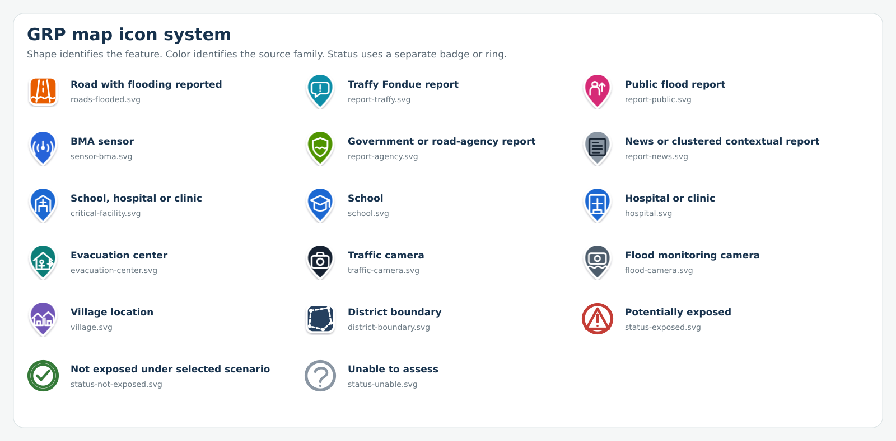

# GRP Map Icon and Legend UX Revamp — Implementation Brief

Version: 1.0  
Purpose: Replace ambiguous colored dots with symbols that can be recognized by shape, color, label and accessible text.



## 1. Design rule

Use three separate visual channels:

1. **Icon shape = feature type** — report, sensor, facility, shelter, camera, village, road or boundary.
2. **Icon color = source family** — retains the current map palette.
3. **Outer status ring or badge = assessment result** — potentially exposed, not exposed under the selected scenario, or unable to assess.

Do not use color alone to communicate meaning. A teal evacuation-center marker and a blue critical-facility marker must also have different glyphs and accessible names.

## 2. Files

| Meaning | SVG file |
|---|---|
| Road with flooding reported | `icons/roads-flooded.svg` |
| Traffy Fondue report | `icons/report-traffy.svg` |
| Public flood report | `icons/report-public.svg` |
| BMA sensor | `icons/sensor-bma.svg` |
| Government or road-agency report | `icons/report-agency.svg` |
| News or clustered contextual report | `icons/report-news.svg` |
| School, hospital or clinic | `icons/critical-facility.svg` |
| School | `icons/school.svg` |
| Hospital or clinic | `icons/hospital.svg` |
| Evacuation center | `icons/evacuation-center.svg` |
| Traffic camera | `icons/traffic-camera.svg` |
| Flood monitoring camera | `icons/flood-camera.svg` |
| Village location | `icons/village.svg` |
| District boundary | `icons/district-boundary.svg` |
| Potentially exposed | `icons/status-exposed.svg` |
| Not exposed under selected scenario | `icons/status-not-exposed.svg` |
| Unable to assess | `icons/status-unable.svg` |

The combined **critical-facility** symbol can be used while schools, hospitals and clinics remain one layer. If those records are separated later, use the dedicated school and hospital symbols.

## 3. Current color mapping

| Layer/source | Color | Hex |
|---|---:|---:|
| Flooded road | Orange | `#E85D04` |
| Traffy Fondue report | Cyan | `#078EA8` |
| Public/Floodboard report | Magenta | `#D62976` |
| BMA sensor | Blue | `#2563D9` |
| Government/road-agency report | Green | `#4F9400` |
| News/context only | Gray | `#8A96A3` |
| Critical facility | Blue | `#1D67D2` |
| Evacuation center | Teal | `#087E78` |
| Traffic camera | Near black | `#172331` |
| Flood camera | Slate | `#4E5D6C` |
| Village | Purple | `#7157B7` |
| District boundary | Navy | `#28415E` |

## 4. Status treatment

Status is independent of source and feature type.

| Assessment status | Treatment |
|---|---|
| Potentially exposed | Red outer ring plus warning badge |
| Not exposed under selected scenario | Green outer ring plus check badge |
| Unable to assess | Gray dashed outer ring plus question badge |

Never label a center as **safe**. Use **Not exposed under the selected scenario**.

## 5. Map behavior

- Default point marker: minimum 32 px wide; 36 px is preferred on touch screens.
- Selected marker: increase to 42 px and add a visible focus halo.
- Hover/focus tooltip: feature type, name, source, observation time and assessment status.
- Keyboard focus must show the same information as mouse hover.
- Use marker clustering at low zoom. A cluster must show its count and dominant feature icon; a mixed cluster uses a neutral cluster symbol.
- When markers occupy the same location, use spiderfy or an equivalent expansion interaction.
- Keep contextual or unverified reports visually muted and state **Not counted in assessment**.
- Camera points must use camera symbols; do not distinguish camera providers using several nearly identical dark dots.
- For roads and boundaries, show the line style in the legend rather than a circular point swatch.

## 6. Legend layout

Group the layer list in this order:

1. **Flood observations** — flooded roads, reports and sensors
2. **Facilities and communities** — critical facilities, evacuation centers and villages
3. **Cameras** — traffic and flood-monitoring cameras
4. **Boundaries and hazard layers** — districts, flood depth and other polygons
5. **Assessment status** — exposed, not exposed under the scenario and unable to assess

Each legend row should contain:

- Checkbox
- 28–32 px icon or line sample
- Short layer name
- Optional source name as secondary text
- Record count aligned right
- Information button for source, date and limitations

Avoid long labels such as **Cameras: BMA flood cameras (via BMA's relay)** in the main row. Use **BMA flood cameras** and move the relay/source detail into the information panel.

## 7. Suggested layer mapping

```javascript
export const GRP_MAP_SYMBOLS = {
  floodedRoads:       { icon: "roads-flooded.svg",      color: "#E85D04" },
  traffyReports:      { icon: "report-traffy.svg",      color: "#078EA8" },
  publicReports:      { icon: "report-public.svg",      color: "#D62976" },
  bmaSensors:         { icon: "sensor-bma.svg",         color: "#2563D9" },
  agencyReports:      { icon: "report-agency.svg",      color: "#4F9400" },
  newsContext:        { icon: "report-news.svg",        color: "#8A96A3" },
  criticalFacilities: { icon: "critical-facility.svg",  color: "#1D67D2" },
  evacuationCenters:  { icon: "evacuation-center.svg", color: "#087E78" },
  trafficCameras:     { icon: "traffic-camera.svg",     color: "#172331" },
  floodCameras:       { icon: "flood-camera.svg",       color: "#4E5D6C" },
  villages:           { icon: "village.svg",            color: "#7157B7" },
  districtBoundary:   { icon: "district-boundary.svg",  color: "#28415E" }
};
```

## 8. Leaflet example

```javascript
const icon = L.icon({
  iconUrl: "/assets/map-icons/evacuation-center.svg",
  iconSize: [36, 42],
  iconAnchor: [18, 42],
  popupAnchor: [0, -38],
  className: "grp-map-marker"
});

L.marker([lat, lng], {
  icon,
  title: "Evacuation center: Bang Sue Community Hall"
}).bindTooltip("Evacuation center · DDPM");
```

For analytical status, wrap the icon with a CSS class such as `status-exposed`, `status-not-exposed` or `status-unable`. Do not replace the underlying source/feature icon.

## 9. Claude implementation instruction

> Revamp every map marker and legend row using the SVG files in this package. Preserve all existing layer toggles, counts, data loading and map behavior. Replace colored dots with the mapped feature symbols. Keep the current source colors, but never use color as the only identifier. Add a separate ring/badge for assessment status. Group the legend into Flood observations, Facilities and communities, Cameras, Boundaries and hazard layers, and Assessment status. Use short primary labels and move provider, date and limitation details into an accessible information panel. Add tooltips, keyboard focus, ARIA labels, selected states, clustering and overlapping-marker handling. Do not change analytical calculations or dataset classifications as part of this UX change.

## 10. Acceptance checks

- A user can distinguish reports, sensors, facilities, evacuation centers, cameras and villages without reading the colors.
- Legend icons exactly match map icons.
- Every icon has a visible tooltip and accessible name.
- All controls are keyboard reachable.
- Status remains understandable in grayscale.
- Map icons remain visible on both light and satellite basemaps.
- Selected and focused points are clearly visible.
- Existing layer counts and toggle behavior remain unchanged.
- The UX change does not alter any analytical result.
