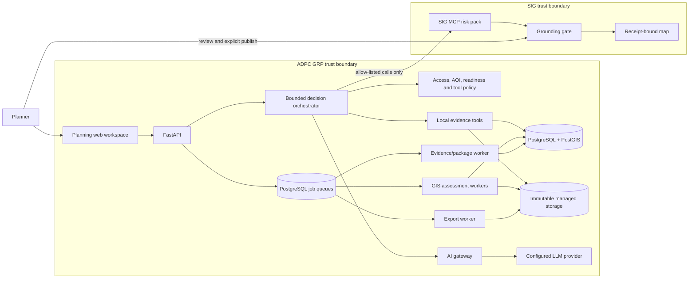
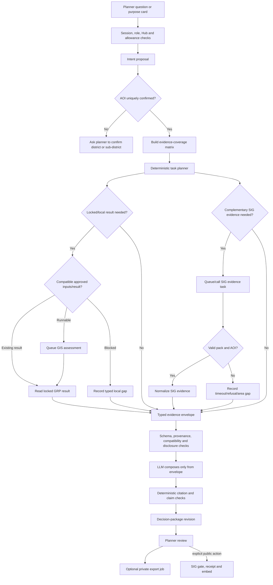
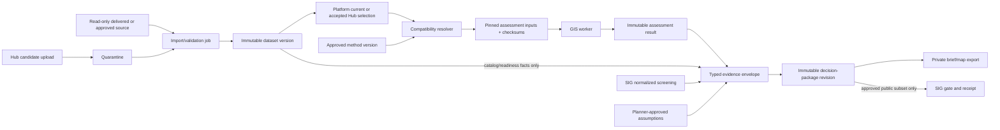
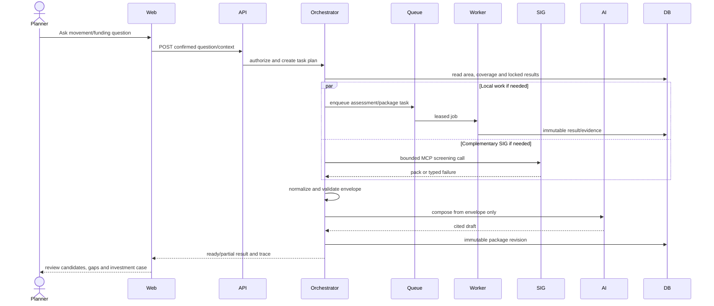

# Evacuation decision AI-agent and data architecture

**Status:** Developer blueprint implementing ADR-0013
**Date:** 20 September 2026
**Primary outcome:** candidate movement options for vulnerable people plus a traceable preparedness investment case

**Editable diagrams:** [`GRP_Evacuation_Decision_Agent_and_Data_Architecture.drawio`](GRP_Evacuation_Decision_Agent_and_Data_Architecture.drawio)
**Detailed Word handover:** [`GRP_Local_Data_Library_Implementation_and_Backlog.docx`](GRP_Local_Data_Library_Implementation_and_Backlog.docx)

## 1. Architecture principles

1. Build a **bounded evidence orchestrator**, not an unrestricted autonomous agent.
2. Confirm purpose, area of interest (AOI), flood scenario and Hub before tool execution.
3. Prefer a locked local GRP result when it answers the question; call SIG MCP only for complementary screening evidence.
4. Run independent local and SIG retrieval concurrently when both are required.
5. Normalize every source into one typed evidence envelope before asking the LLM to compose an answer.
6. Keep local baseline previews, locked GRP results and SIG screening visibly separate.
7. Let deterministic code select authoritative datasets, calculate classifications and enforce readiness. The LLM may route and explain; it may not calculate GIS results or invent missing figures.
8. “Candidate evacuation centre” means lower mapped exposure under the selected scenario, not certified safety.
9. Missing capacity, accessibility, route, vulnerable-population or cost evidence is an explicit preparation/funding gap.
10. GIS, comparison and export work runs in workers. HTTP handlers only validate, authorize, enqueue and read.

## 2. System context



### Trust-boundary rule

GRP does not send raw Hub files, private geometry or unrestricted local records to SIG or the model. Only the minimum approved evidence fields enter the envelope. SIG screening is not relabelled as a GRP result.

## 3. AI-agent architecture

### 3.1 Control flow



### 3.2 Agent responsibilities

| Component | May do | Must not do |
|---|---|---|
| Intent router | Propose `movement_options`, `investment_case`, `explain_result`, `sig_screening` or `general` | Execute tools, choose authoritative data or authorize access |
| Policy/task planner | Select a fixed, allow-listed workflow from confirmed inputs | Accept model-authored tool names or arbitrary arguments |
| Local context tools | Read area, catalog, readiness, coverage and locked result facts | Run raster GIS in the API or silently activate preview data |
| SIG adapter | Call reviewed MCP contracts with bounded arguments | Send private Hub files or treat screening as a GRP result |
| Evidence normalizer | Convert source responses to typed facts/gaps with provenance | Merge incompatible areas, return periods or identifiers |
| LLM composer | Summarize, explain and structure cited evidence | Invent figures, costs, capacities, beneficiaries, routes or safety claims |
| Claim checker | Enforce required sections, citations and prohibited claims | Decide scientific validity from prose |
| Human review | Confirm interpretation, add approved planning assumptions and initiate sharing/export | Convert missing evidence into facts |

### 3.3 Allow-listed tools

Use application functions with typed inputs; do not expose SQL or filesystem access to the model.

```text
area.resolve(query, allowed_levels)
area.get(area_id)
coverage.build(area_id, scenario, hub_id)
catalog.resolve_inputs(area_id, scenario, hub_id)
assessment.get_result(assessment_id)
assessment.queue(resolved_input_token)
sig.screen(confirmed_place, hazard, question_class)
evidence.validate(envelope)
package.compose(envelope, purpose)
export.queue(package_revision_id, template_id)
publish.sig(package_revision_id, reviewed_draft_token)
```

The model proposes only an intent and structured slots. Server code decides whether a tool is needed and constructs its arguments.

## 4. Evidence envelope

The LLM must receive one versioned structure rather than unrelated text blobs.

```json
{
  "contract_version": "decision-evidence-v1",
  "purpose": "movement_options",
  "area": {
    "id": "uuid",
    "name": "Area, District, Province",
    "admin_level": "district",
    "geometry_sha256": "..."
  },
  "scenario": {"hazard": "flood", "return_period_years": 100},
  "coverage": [
    {"dimension": "hazard", "status": "available", "reason": null},
    {"dimension": "capacity", "status": "missing", "reason": "No accepted source"}
  ],
  "grp_results": [],
  "sig_screening": [],
  "planning_assumptions": [],
  "gaps": [],
  "sources": [],
  "disclosure": {"may_send_to_llm": true, "may_publish_to_sig": false}
}
```

### Required fact metadata

Every numerical or categorical fact carries:

- stable evidence ID;
- source kind: `grp_locked_result`, `grp_catalog`, `sig_screening`, or `planner_approved_assumption`;
- source/version/reference and checksum where available;
- area and scenario scope;
- observed/generated timestamp;
- readiness and scientific approval status;
- unit and denominator;
- disclosure classification;
- citation label.

### Coverage dimensions

```text
hazard
centre_location
centre_capacity
centre_accessibility_services
route_condition
vulnerable_groups_population
intervention_options
cost_assumptions
```

Status is one of `available`, `partial`, `missing`, or `blocked`. The LLM cannot change this status.

## 5. Data architecture

### 5.1 Logical data model

```mermaid
erDiagram
    HUB ||--o{ HUB_MEMBERSHIP : has
    HUB ||--o{ HUB_DATASET_SELECTION : selects

    DATASET ||--o{ DATASET_VERSION : versions
    DATASET_VERSION ||--o{ DATASET_FILE : contains
    DATASET_VERSION ||--o{ FEATURE : provides
    DATASET_VERSION ||--o{ BOUNDARY : collection
    BOUNDARY ||--o{ BOUNDARY : parent_of
    HUB_DATASET_SELECTION }o--|| DATASET_VERSION : chooses

    METHOD ||--o{ ASSESSMENT : applies
    BOUNDARY ||--o{ ASSESSMENT : scopes
    ASSESSMENT ||--o{ ASSESSMENT_FEATURE : classifies
    FEATURE ||--o{ ASSESSMENT_FEATURE : assessed

    DECISION_PACKAGE ||--o{ DECISION_PACKAGE_REVISION : versions
    DECISION_PACKAGE }o--|| BOUNDARY : concerns
    DECISION_PACKAGE_REVISION }o--o| ASSESSMENT : uses
    DECISION_PACKAGE_REVISION ||--o{ EVIDENCE_ITEM : cites
    DECISION_PACKAGE_REVISION ||--o{ EVIDENCE_GAP : records
    DECISION_PACKAGE_REVISION ||--o{ INTERVENTION_OPTION : proposes
    DECISION_PACKAGE_REVISION ||--o{ PACKAGE_EXPORT : renders
    EVIDENCE_ITEM }o--o| DATASET_VERSION : derives_from
    EVIDENCE_ITEM }o--o| ASSESSMENT : derives_from
```



### 5.2 Existing records to retain

- `dataset`, `dataset_version`, `dataset_file`
- `boundary`, extended for parent administrative linkage
- `feature`
- `method`
- `assessment`, `assessment_feature`
- `hub_dataset_selection`
- `data_import_job`, audit and AI usage records
- immutable object-storage keys and SHA-256 fingerprints

### 5.3 Proposed records

#### `decision_package`

Mutable workflow header, scoped to one Hub and creator:

```text
id, hub_id, created_by, boundary_id, purpose,
return_period_years, state, support_ref, created_at, updated_at
```

`state`: `draft`, `gathering`, `ready_for_review`, `failed`, `archived`.

#### `decision_package_revision`

Immutable revision generated from one evidence envelope:

```text
id, package_id, revision, assessment_id nullable,
envelope_sha256, narrative_sha256, narrative_markdown,
scientific_status, sharing_state, created_at
```

Do not store unrestricted chat history. Store confirmed structured inputs, normalized evidence and generated reviewed output.

#### `evidence_item`

One normalized, citable fact or grouped result:

```text
id, revision_id, evidence_key, source_kind,
source_ref, dataset_version_id nullable, assessment_id nullable,
area_scope, scenario_scope, payload_json,
unit, denominator, readiness, disclosure,
source_sha256, observed_at
```

`payload_json` is schema-validated and size-limited. Generic SIG evidence stores only the approved normalized fields and citations, not credentials or unrestricted raw responses.

#### `evidence_gap`

```text
id, revision_id, dimension, status, reason_code,
message, blocking, required_owner
```

#### `intervention_option`

```text
id, revision_id, category, title, rationale,
evidence_keys, priority, planner_status,
cost_amount nullable, cost_currency nullable,
cost_source nullable
```

AI may suggest a category only from approved templates. A cost remains null until supplied by an authorized person or approved cost catalogue.

#### `package_export`

Background export job metadata; generated files remain in managed storage.

### 5.4 Data lineage



## 6. Movement and investment outputs

### 6.1 Candidate movement table

Each row should expose evidence, not a single opaque score:

```text
centre
flood classification/depth
capacity status/value
accessibility/services status
route status
vulnerable-group suitability status
candidate reason
unresolved checks
source references
```

Initial ordering may group `lower mapped exposure`, `unable to assess`, and `potentially exposed`. Do not optimize or rank across capacity, accessibility or route dimensions until methods and data are approved.

### 6.2 Investment case

The package contains:

1. decision and scenario;
2. current evidence coverage;
3. movement-option findings;
4. vulnerable groups and movement needs;
5. preparedness gaps;
6. intervention options tied to evidence gaps;
7. planner-supplied/approved costs and assumptions;
8. expected beneficiaries only from authoritative denominators;
9. implementation priorities and unresolved decisions;
10. sources, method, limitations and review status.

A missing data source can justify a data-preparation intervention, but it cannot justify an invented beneficiary count or benefit-cost claim.

## 7. Runtime and reliability



### Reliability requirements

- Make evidence/package generation a durable leased job before combining multiple slow tools.
- Publish real progress events with SSE; keep polling as fallback.
- Give each tool a deadline and bounded retry policy with jitter.
- Add cancellation and a SIG circuit breaker.
- Cache validated SIG evidence separately from prose, scoped by user/session/Hub until a broader sharing policy is approved.
- Idempotency key covers confirmed area, scenario, purpose and selected input versions.
- A partial package remains useful and clearly labelled when SIG or one local dimension is unavailable.
- Never let SIG failure cancel a valid GRP assessment.
- Record trace ID, support reference, tool duration, cache status and reason code without storing secrets.

## 8. API contracts to implement

```text
GET  /api/v1/areas?q=&levels=district,sub_district&limit=
GET  /api/v1/areas/{area_id}
POST /api/v1/assessment-config/resolve
POST /api/v1/decision-packages
GET  /api/v1/decision-packages/{id}
GET  /api/v1/decision-packages/{id}/coverage
POST /api/v1/decision-packages/{id}/gather
GET  /api/v1/decision-packages/{id}/events
GET  /api/v1/decision-packages/{id}/revisions/{revision}
POST /api/v1/decision-packages/{id}/interventions/{item_id}/review
POST /api/v1/decision-packages/{id}/exports
GET  /api/v1/decision-packages/{id}/exports/{export_id}
POST /api/v1/decision-packages/{id}/publish-sig
```

All documented operations require `x-grp-access`. Creation/gather/export routes require CSRF and idempotency keys. Reads are Hub-scoped; unknown or cross-Hub identifiers return 404.

## 9. Code boundaries

Suggested modules:

```text
core/area_catalog.py                 # deterministic AOI search and parent resolution
core/input_resolution.py             # compatible platform/Hub input selection
core/evidence_models.py              # envelope/fact/gap Pydantic contracts
core/evidence_policy.py              # disclosure, readiness and compatibility checks
core/decision_package_models.py      # SQLAlchemy package/revision records
core/decision_package_jobs.py        # leased/idempotent package work
core/intervention_rules.py           # approved categories; no generated costs
api/areas.py
api/assessment_config.py
api/decision_packages.py
api/sig_evidence.py                  # retained adapter/normalizer boundary
worker/assessment_tasks.py
worker/decision_package_tasks.py
worker/export_tasks.py
web/planning-area.js
web/planning-config.js
web/planning-package.js
web/planning-map.js
```

Split `web/planning.js` and `api/planning.py` as part of this work; do not add another complete workflow to either large file.

## 10. Implementation sequence

### Phase A — contracts and honest UX

- Add AOI API for managed districts with eligibility reasons.
- Add evidence-envelope and coverage contracts.
- Build the input resolver around the synthetic assessment.
- Show coverage and configuration before running.
- Keep SIG and local output separate.

### Phase B — sub-district catalogue

- Import 7,436 managed sub-district boundaries.
- Add parent district/province links and qualified Thai/English search.
- Keep unsupported areas non-runnable.

### Phase C — durable decision package

- Add package/revision/evidence/gap tables and migrations.
- Move multi-source evidence gathering to a leased worker job.
- Add SSE progress, partial results, timeout/retry/circuit-breaker behavior.

### Phase D — real movement screening

- Resolve DEP-05 and approve pilot areas/method.
- Activate compatible hazard/centre/boundary versions.
- Produce real candidate movement classifications with limitations.

### Phase E — vulnerability, capacity, accessibility and route evidence

- Implement only after source semantics and methods are approved.
- Add each dimension independently to coverage and candidate rows.
- Never create one composite score until its method is approved.

### Phase F — investment brief and scenario comparison

- Add approved intervention/cost catalogue or planner-entered assumptions.
- Add immutable multi-scenario comparison after additional hazard versions exist.
- Implement DEP-12 export templates and private background export jobs.

## 11. Definition of done

A developer increment is complete only when:

- the same confirmed inputs produce the same pinned result and package revision;
- every figure has an evidence key, source/version and denominator;
- unavailable dimensions appear as gaps rather than generated prose;
- candidate centres are never labelled safe;
- SIG outage yields a typed partial package and does not block local assessment;
- cross-Hub and private-data tests fail closed;
- GIS remains absent from web-request handlers;
- fast, contract, PostgreSQL, golden, browser and relevant load tests pass;
- ADRs, this architecture and `handovers.md` are updated.

## 12. Explicitly prohibited implementation shortcuts

- Giving the LLM SQL, filesystem or arbitrary MCP tool access.
- Calling every tool for every question.
- Appending local figures to an already drafted SIG answer.
- Using the national display PNG as an assessment input.
- Treating flood NoData as dry without DEP-05.
- Calling lower flood exposure “safe.”
- Inferring centre capacity or vulnerable population from names or map imagery.
- Generating costs, beneficiaries or return-on-investment figures without approved inputs.
- Combining district and sub-district evidence without exact parent/scope checks.
- Publishing private Hub evidence through SIG without explicit approved policy and review.
