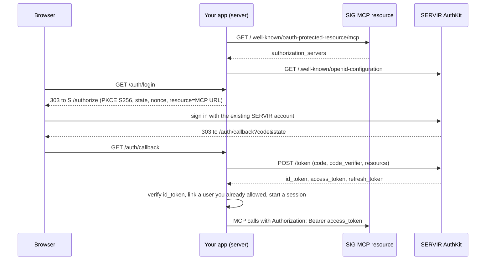

# Signing in with an existing SERVIR (SIG) account

How GRP lets a person sign in with the SERVIR account they already have, and then call the Global
Risk (SIG) MCP service as that person. Follow the steps below to build the same thing in your own
app. Each step links to the working code in this repository.

- **Repository:** <https://github.com/kovitad/ADPC_GRP> (ask the owner for access if it is
  private)
- **Every link is pinned to commit `19c0075`,** so the line numbers stay right as `main` moves on.
- **Using Claude Code?** Put this file in your project and paste the prompt from
  [Prompts to give Claude](#prompts-to-give-claude). The
  [implementation brief](#implementation-brief-for-claude) at the end has every detail Claude
  needs, even if it cannot open the GitHub links.

## What you need, and what you don't

| You need | You don't need |
|---|---|
| A SERVIR account, to sign in with when you test | Any WorkOS API key or token |
| A callback URL for your app, used exactly as registered | A client secret: the client is public and uses PKCE |
| Network access to `servirplatform.sig-gis.com` and the SERVIR sign-in site | A WorkOS account |
| A place in your app to mark which emails may sign in | Anything from SIG, for development and sandbox |

For production, ask SIG to register an application for you (ADR-0002). They give you a client ID,
and possibly a secret; the same code works with both.

## What you get

- The person clicks **Sign in**, signs in on SERVIR's own page (WorkOS AuthKit), and comes back
  signed in. No password ever touches your app.
- Your app receives a verified identity (issuer, subject, verified email) and, separately, an
  access token for SIG's MCP service. The access token lets your server call Global Risk tools
  (`assemble_pack`, `contribute_submit`, …) as that person.
- The token renews itself with a refresh token while the person's session lasts.

> **Read this first: interim flow.** The client is registered through dynamic client registration
> against SIG's MCP resource, and the login is addressed to that resource. ADR-0002 accepts this
> for development and sandbox only. Production needs an application that SIG registers for you.
> See [ADR-0002](https://github.com/kovitad/ADPC_GRP/blob/19c0075/docs/adr/0002-interim-sig-mcp-client-login.md).

## The flow



## Step 1: Register a client, once

SIG's authorization server supports dynamic client registration. Register a **public PKCE client**
(no secret) with your callback URL. GRP does it with one command and keeps the client ID, which is
not a secret, in a file.

```powershell
python -m grpcli.oauth register-client `
  --redirect-uri http://127.0.0.1:8000/api/v1/auth/callback `
  --client-name "My app local" `
  --output-file .local/servir_auth_client_id
```

- The command: [`grpcli/oauth.py`](https://github.com/kovitad/ADPC_GRP/blob/19c0075/grpcli/oauth.py)
- The registration request (`token_endpoint_auth_method: none`, grants `authorization_code` and
  `refresh_token`, scopes `openid profile email offline_access`):
  [`api/oidc.py#L423-L470`](https://github.com/kovitad/ADPC_GRP/blob/19c0075/api/oidc.py#L423-L470)
- Finding the authorization server from the MCP resource
  (`/.well-known/oauth-protected-resource/mcp`):
  [`api/oidc.py#L102-L143`](https://github.com/kovitad/ADPC_GRP/blob/19c0075/api/oidc.py#L102-L143)

## Step 2: Configure

| Setting | Local value | Purpose |
|---|---|---|
| `SIG_MCP_BASE_URL` | `https://servirplatform.sig-gis.com/mcp` | The resource every token is asked for |
| `SERVIR_AUTH_ISSUER` | `https://welcoming-splendor-62-staging.authkit.app` | Pins the issuer; must be one the resource advertises |
| `SERVIR_AUTH_CLIENT_ID` | from step 1 | Your public client |
| `SERVIR_AUTH_REDIRECT_URI` | `http://127.0.0.1:8000/api/v1/auth/callback` | Must equal the registered URI exactly |

- Settings: [`api/settings.py#L25-L29`](https://github.com/kovitad/ADPC_GRP/blob/19c0075/api/settings.py#L25-L29)
- Local wiring: [`scripts/run-local.ps1#L13-L41`](https://github.com/kovitad/ADPC_GRP/blob/19c0075/scripts/run-local.ps1#L13-L41)
- Template: [`.env.example`](https://github.com/kovitad/ADPC_GRP/blob/19c0075/.env.example)

## Step 3: Send the person to SERVIR

On `/auth/login`, make a `state`, a `nonce` and a PKCE pair, and put them in a short-lived,
signed, HttpOnly cookie. Then redirect to the authorization endpoint with
`code_challenge_method=S256` and `resource=<SIG MCP URL>`.

- PKCE pair: [`api/oidc.py#L76-L80`](https://github.com/kovitad/ADPC_GRP/blob/19c0075/api/oidc.py#L76-L80)
- Authorization URL: [`api/oidc.py#L283-L298`](https://github.com/kovitad/ADPC_GRP/blob/19c0075/api/oidc.py#L283-L298)
- The login route and the transaction cookie (10 minutes, path `/api/v1/auth`):
  [`api/auth.py#L60-L105`](https://github.com/kovitad/ADPC_GRP/blob/19c0075/api/auth.py#L60-L105)

## Step 4: Handle the callback

1. Compare `state` with the cookie in constant time.
2. Exchange the code at the token endpoint with the `code_verifier` and the same `resource`.
3. Verify the ID token against the JWKS:
   - the signature, with RS256 or ES256 only;
   - `aud` is your client ID, and `iss` is the discovered issuer;
   - `exp`, `iat` and `sub` are present;
   - `nonce` matches.
4. Require a **verified** email. If the ID token lacks it, read `userinfo` with the access token
   and check that its `sub` is the same.

- Token exchange and ID-token checks: [`api/oidc.py#L300-L384`](https://github.com/kovitad/ADPC_GRP/blob/19c0075/api/oidc.py#L300-L384)
- The callback route: [`api/auth.py#L108-L174`](https://github.com/kovitad/ADPC_GRP/blob/19c0075/api/auth.py#L108-L174)

## Step 5: Let in only people you already allowed

A valid SERVIR account alone grants nothing. GRP links the verified `(issuer, subject)` to a user
only when an administrator has already added that email and given it a role. Everyone else lands
on "pending". Keep this rule: it is what stops any SERVIR user from walking in.

- Linking rule: [`core/identity.py#L102`](https://github.com/kovitad/ADPC_GRP/blob/19c0075/core/identity.py#L102)
- Sessions and CSRF: [`api/sessions.py`](https://github.com/kovitad/ADPC_GRP/blob/19c0075/api/sessions.py)

## Step 6: Keep the SIG token on the server and renew it

The access token is **never** sent to the browser. GRP keeps it in server memory, keyed by the
session, with its refresh token (`api/auth.py#L163-L172`). Before each call it renews the token
when it is about to expire, one renewal per session at a time. It keeps the old refresh token when
the server does not rotate it. At sign-out the token is dropped.

- Token store: [`api/token_store.py`](https://github.com/kovitad/ADPC_GRP/blob/19c0075/api/token_store.py)
- Renewal: [`api/sig_connection.py#L64-L116`](https://github.com/kovitad/ADPC_GRP/blob/19c0075/api/sig_connection.py#L64-L116)
  and [`api/oidc.py#L386-L416`](https://github.com/kovitad/ADPC_GRP/blob/19c0075/api/oidc.py#L386-L416)

In-memory storage means a restart signs everyone out of SIG, and it does not work across several
server processes. That is acceptable only for the interim flow; see ADR-0002.

## Step 7: Call Global Risk as that person

Send MCP JSON-RPC over HTTP with `Authorization: Bearer <access token>`. Call `initialize` first,
keep the `mcp-session-id` header the server returns, then call tools.

- MCP client: [`api/mcp_client.py`](https://github.com/kovitad/ADPC_GRP/blob/19c0075/api/mcp_client.py)
  (Bearer header at line 63, `initialize` at line 96)
- A real call, `contribute_submit` from GRP's Share data page:
  [`api/contributions.py`](https://github.com/kovitad/ADPC_GRP/blob/19c0075/api/contributions.py)

## Try GRP's own example

```powershell
git clone https://github.com/kovitad/ADPC_GRP.git
cd ADPC_GRP
python -m pip install -e ".[dev,gis]"
.\scripts\run-local.ps1 -RegisterSigClient   # first time only; then .\scripts\run-local.ps1
```

1. Open <http://127.0.0.1:8000> and click **Sign in**.
2. Sign in with your SERVIR account.
3. If you land on "pending", ask a GRP administrator to add your email first.

The tests show every check passing and failing without a network:
[`tests/fast/test_oidc.py`](https://github.com/kovitad/ADPC_GRP/blob/19c0075/tests/fast/test_oidc.py)
and [`tests/fast/test_oidc_rejections.py`](https://github.com/kovitad/ADPC_GRP/blob/19c0075/tests/fast/test_oidc_rejections.py).

```bash
python -m pytest tests/fast/test_oidc.py tests/fast/test_oidc_rejections.py
```

## Checklist for your own app

- [ ] Public PKCE client registered, redirect URI exact
- [ ] `resource=<SIG MCP URL>` on the authorize, token and refresh requests
- [ ] `state` and `nonce` checked in constant time; PKCE `S256`
- [ ] ID token: signature (RS256 or ES256), `aud`, `iss`, `exp`, `nonce`; verified email required
- [ ] Only pre-approved emails get in; everyone else is "pending"
- [ ] Access and refresh tokens stay on the server, never in the browser or the logs
- [ ] Renew before expiry; drop the tokens at sign-out
- [ ] Production: replace dynamic registration with an application SIG registers for you
      (ADR-0002)

## Prompts to give Claude

Put this file in your project, for example as `docs/sig-login-existing-account.md`. Open Claude
Code in your project and paste:

```text
Read docs/sig-login-existing-account.md and implement the same "sign in with an existing
SERVIR (SIG) account" flow in this project. Follow its "Implementation brief for Claude"
section exactly, starting with the questions in step 0.
```

When you have signed in yourself in the browser:

```text
I signed in successfully. Add the read-only test call from step 7 of the brief: initialize the
Global Risk MCP session as the signed-in user, call platform_capabilities and show me the result.
```

If you land on "pending":

```text
I land on "pending" after signing in. Add my email <you@your-org> as an allowed user, as step 5
of the brief describes.
```

## Implementation brief for Claude

This section is written for an AI coding assistant implementing this guide in someone else's
project. It is self-contained. The links above are the reference implementation (Python,
FastAPI): read them if you can open them, but you do not need them.

### 0. Ask first, then stop until you have answers

Ask the person:

1. Which framework and language the project uses. Confirm by reading the project; do not guess.
2. The app's base URL and port locally, and the callback path to use (for example
   `http://127.0.0.1:8000/auth/callback`).
3. How the app stores users and sessions today, if at all.
4. Which email or emails may sign in at first.
5. Where the app keeps configuration and secrets, and which files git ignores.

Then show a short plan that maps steps 1-7 below to files in their project. Wait for their OK
before writing code.

### 1. Constants

| Name | Value |
|---|---|
| `SIG_MCP_URL` (the resource) | `https://servirplatform.sig-gis.com/mcp` |
| `SERVIR_ISSUER` (optional pin) | `https://welcoming-splendor-62-staging.authkit.app` |
| Scopes | `openid profile email offline_access` |
| PKCE | `S256` |
| ID-token algorithms allowed | `RS256`, `ES256` only |
| MCP protocol version | `2025-06-18` |

Make every value configurable. The client ID comes from step 2 and lives in a file or setting that
git ignores. It is not a secret, but it is per installation.

### 2. Discovery and client registration (a one-off command)

1. `GET https://servirplatform.sig-gis.com/.well-known/oauth-protected-resource/mcp`
   - Check `resource` equals `SIG_MCP_URL` (ignore a trailing slash). Refuse otherwise.
   - Take `authorization_servers`. If `SERVIR_ISSUER` is set, it must be in that list; use it.
     Otherwise use the first entry.
2. `GET <issuer>/.well-known/openid-configuration`. Check its `issuer` equals the one you chose.
   Read `authorization_endpoint`, `token_endpoint`, `jwks_uri`, `userinfo_endpoint`,
   `registration_endpoint` and `scopes_supported`. If there is no `registration_endpoint`, try
   `<scheme>://<host>/.well-known/oauth-authorization-server<issuer path>`.
3. Register once, as a separate command, never on each sign-in:

   ```http
   POST <registration_endpoint>
   Content-Type: application/json

   {"client_name": "<app name>", "redirect_uris": ["<callback URL>"],
    "token_endpoint_auth_method": "none",
    "grant_types": ["authorization_code", "refresh_token"],
    "response_types": ["code"], "scope": "openid profile email offline_access"}
   ```

   Refuse the result unless `token_endpoint_auth_method` is `none`. Save `client_id`, and do not
   overwrite an existing, different one. If registration is unavailable, stop and tell the person
   to ask SIG for a client ID.

Cache discovery in memory for a while; it is the same on every request. All endpoints must be
HTTPS, except a localhost callback during development.

### 3. `GET /auth/login`

1. Make `state` and `nonce` (32+ random bytes each, URL-safe). Make the PKCE verifier (64 random
   bytes, URL-safe), and the challenge = base64url(sha256(verifier)) without padding.
2. Store `state`, `nonce` and `verifier` in a signed or encrypted, HttpOnly, SameSite=Lax cookie
   that lasts 10 minutes and is scoped to the auth path. Server-side storage keyed by a random ID
   is fine too.
3. Redirect (303) to `authorization_endpoint` with: `client_id`, `redirect_uri`,
   `response_type=code`, `scope`, `resource=SIG_MCP_URL`, `state`, `nonce`, `code_challenge`,
   `code_challenge_method=S256`. Drop `offline_access` only if `scopes_supported` is published
   and lacks it.

### 4. `GET /auth/callback`

1. Read and clear the cookie. Refuse if it is missing, or if `error` is present, or `code` or
   `state` is missing. Compare `state` in constant time.
2. `POST token_endpoint`, form-encoded: `grant_type=authorization_code`, `code`,
   `redirect_uri`, `code_verifier`, `resource=SIG_MCP_URL`, `client_id`.
3. From the reply take `id_token`, `access_token`, `expires_in` (default 3600) and, if present,
   `refresh_token`.
4. Verify the ID token with the key from `jwks_uri` whose `kid` matches. Allow only RS256 or
   ES256. Check `aud` = client ID and `iss` = issuer, and require `exp`, `iat`, `iss`, `aud`,
   `sub` and `nonce`, with 30 seconds of leeway. Compare `nonce` in constant time.
5. Require a verified email. If the ID token lacks `email` or `email_verified: true`, call
   `userinfo_endpoint` with `Authorization: Bearer <access_token>`. Its `sub` must equal the ID
   token's `sub`, and it must say `email_verified: true`. Lower-case the email.
6. On any failure, show a plain "sign-in failed" page. Never show token contents or provider
   errors.

### 5. Let in only people already allowed

- Look the person up by `(iss, sub)`. The first time, link `(iss, sub)` to an existing user
  **only if** an administrator already added that verified email. Otherwise show "access
  pending", create no session, and record the attempt.
- A disabled user or identity is refused even if the login is valid.
- Then start the app's normal session: a new random session ID, HttpOnly cookie, CSRF protection
  on state-changing requests.

### 6. Keep the SIG token on the server

- Store `{access_token, refresh_token, expires_at}` on the server, keyed by the session ID.
  Never put either token in a cookie, the page, a URL or a log line.
- Before each use, renew when fewer than 120 seconds remain: `POST token_endpoint` with
  `grant_type=refresh_token`, `refresh_token`, `resource=SIG_MCP_URL`, `client_id`. Keep the old
  refresh token if the reply has none. Allow one renewal per session at a time (a lock).
- If renewal fails, keep what is left of the current token. Once it expires, ask the person to
  sign in again rather than raising a server error.
- Drop the tokens at sign-out, and stop renewing when the app session ends.
- In-memory storage is acceptable for a single development process only. Say so in a comment.

### 7. Call Global Risk (MCP over HTTP)

- Every request: `POST SIG_MCP_URL` with headers `Authorization: Bearer <access_token>`,
  `Content-Type: application/json`, `Accept: application/json, text/event-stream`,
  `MCP-Protocol-Version: 2025-06-18`, and `Mcp-Session-Id` once you have one.
- First send `{"jsonrpc":"2.0","id":1,"method":"initialize","params":{"protocolVersion":
  "2025-06-18","capabilities":{},"clientInfo":{"name":"<app>","version":"0.1.0"}}}`. Keep the
  `mcp-session-id` response header. Then send the notification
  `{"jsonrpc":"2.0","method":"notifications/initialized"}`.
- Call a tool with `{"method":"tools/call","params":{"name":"platform_capabilities",
  "arguments":{}}}`.
- The reply may be JSON or a server-sent event stream. For a stream, parse the `data:` line that
  holds the JSON-RPC response. Check that its `id` matches the request's.
- A 401 or 403 means the person must sign in again.
- Add one protected test route that calls `platform_capabilities`, which only reads. Do **not**
  call `contribute_submit`, `publish_answer` or `record_receipt` while testing: they publish.

### 8. Tests (offline)

Mock every HTTP call. Cover at least:

- the authorize URL carries PKCE S256, `state`, `nonce` and `resource`;
- a good callback creates a session for an allowed email;
- each of these is refused: wrong `state`, wrong `nonce`, wrong `aud`, wrong `iss`, expired
  token, an algorithm not allowed, an unknown `kid`, an unverified email, a `userinfo` `sub`
  mismatch;
- a valid login for an email nobody added gets "pending" and no session;
- renewal uses the refresh grant with `resource`, and keeps the old refresh token when none comes
  back;
- tokens never appear in responses or logs.

### 9. Rules while working

- Never sign in for the person, and never ask for, type or store their SERVIR password. When the
  code is ready, tell them how to start the app and sign in themselves.
- Never commit the client-ID file, secrets, tokens or cookies. Add them to `.gitignore`.
- Run the registration command only after the person confirms the callback URL. It creates a
  client on SERVIR's side.
- Commit only when asked.

### Done means

- [ ] Registration command run once, client ID saved and ignored by git
- [ ] `/auth/login`, `/auth/callback` and `/auth/logout` work; the person signed in themselves
- [ ] A new email gets "pending"; an allowed email gets a session
- [ ] The test route returns `platform_capabilities` as the signed-in person
- [ ] The offline tests pass
- [ ] No token appears in the browser, the logs or git
