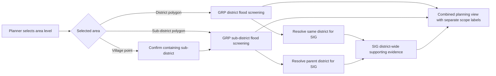

# Multi-level boundary planning design

**Status:** Proposed for MVP 1 extension

**Source inspected:** `.local/data-in/administrative_boundary` on 24 September 2026

## What the delivery can support

| Source | Features | Geometry | Proposed use |
|---|---:|---|---|
| Thailand | 1 | Polygon | National map extent and browsing only |
| Provinces | 77 | Polygon | Search filter and parent context |
| Districts | 928 | Polygon | Selectable assessment area |
| Sub-districts | 7,436 | Polygon | Selectable assessment area |
| Villages | 80,397 | Point | Location/search aid only; not an assessment boundary |

The district and sub-district collections are edition `2025-10`. Every sub-district has a unique
code and a parent code found in the district collection. The sub-district file also contains 2020
population, male, female and household counts; male plus female reconciles to total population for
all 7,436 rows.

The village source is materially different. It contains points, not polygons, so it cannot clip a
flood raster or define “inside the village.” Its `.cpg` declares UTF-8 but source text does not
decode correctly. Its codes cover only 878 of 928 current districts and 7,255 of 7,436 current
sub-districts. GRP must not manufacture village boundaries or silently treat a buffer as one.

## User experience

Planning should begin with **Choose an area level**:

1. **District** — current behaviour.
2. **Sub-district** — more local flood and evacuation-place screening.
3. **Village location** — find a village point, then confirm its containing sub-district as the
   actual analysis area.

The picker supports qualified Thai/English search and cascading browse:

```text
Province → District → Sub-district → optional village location
```

Every result shows a level badge and its parents, for example:

```text
Wat Chan · Sub-district
Parent: Mueang Phitsanulok District · Phitsanulok Province
```

When a village is chosen, confirmation must say:

> Ban Example is a mapped village location. Village boundaries are not available. The flood
> analysis will use Wat Chan Sub-district.

The application must never run an assessment from a village point alone.

## Scope-safe GRP and SIG presentation

GRP may calculate against the exact selected district or sub-district polygon because the existing
RP100 raster can be clipped to either polygon and point sources can be filtered geometrically.
SIG currently resolves and returns evidence at district level. For a sub-district selection, GRP
resolves its stored parent district and requests SIG context for that district.



The result header always shows two independent scopes:

- **GRP analysis area:** Wat Chan Sub-district — local RP100, evacuation places and 2020 local
  population attributes.
- **SIG supporting area:** Mueang Phitsanulok District — district-wide flood, population, schools,
  hospitals, roads and other returned evidence.

SIG district counts must not be clipped, divided, estimated or relabelled as sub-district counts.
GRP and SIG values keep their own denominators, source dates and citations. A user may hide either
section. Failure or delay in SIG cannot block the local GRP assessment.

## Boundary upload and activation

Replace the district-specific importer with a profile-driven administrative-area importer. Provide
five explicit profiles:

- `thailand-country/v1`
- `thailand-province/v1`
- `thailand-district/v2`
- `thailand-subdistrict/v1`
- `thailand-village-location/v1` (point catalogue, not boundary)

One ZIP contains one Shapefile collection and declares one level. Admins may queue multiple ZIPs.
For the delivered server folder, **Import delivered administrative geography** queues five
independent jobs, then runs one cross-level reconciliation job.

Technically valid collections remain inactive until a Platform Admin creates and accepts a
**boundary release** that pins compatible country, province, district and sub-district versions.
Village locations are attached as an optional catalogue version. This prevents a new sub-district
edition being combined silently with an old district edition.

Suggested API surface:

```text
POST /api/v1/uploads/administrative-areas/{level}
POST /api/v1/data-library/imports/administrative-areas/{level}
POST /api/v1/data-library/boundary-releases
POST /api/v1/data-library/boundary-releases/{id}/activate
GET  /api/v1/areas?q=&levels=district,sub_district,village_location&parent_id=&limit=
GET  /api/v1/areas/{area_id}
POST /api/v1/assessment-config/resolve
```

Keep the current district import endpoint as a temporary compatibility adapter.

## Data model

Generalize the existing versioned `Boundary` feature rather than creating an unrelated place
table:

- `admin_level`: country, province, district or sub_district;
- `admin_code` and `parent_area_id`;
- Thai and English names plus a qualified display name;
- full calculation geometry and simplified display geometry;
- collection version, edition and geometry checksum;
- independent `is_supported` and assessment-eligibility reason.

Add `BoundaryRelease` to pin one compatible collection version per polygon level. An assessment
pins the exact chosen area feature, its collection version, release ID, geometry checksum, hazard
version, point-source version and method version.

Village locations use a separate point model linked by source codes and geometric containment to
the accepted hierarchy. They are never stored as `Boundary` and never receive assessment
eligibility.

Point datasets from ADR-0020 gain versioned area memberships at district and sub-district levels.
The worker uses the selected polygon as the final authority; source text is retained only for
quality review.

## Validation rules

Polygon collection validation runs in the worker and requires:

- one declared level, EPSG:4326 polygon/multipolygon geometry and unique non-blank codes;
- one edition per collection and required Thai/English names;
- valid, non-empty geometry plus a safely simplified display copy;
- every child code resolving to exactly one parent in the proposed release;
- geometric parent containment within an approved tolerance;
- overlap, gap, duplicate-geometry and unexpected coverage reports without automatic repair;
- immutable source and normalized-geometry checksums.

The sub-district profile additionally validates population-year and the invariant
`male + female = population`. Population is displayed as **2020 administrative population**; it is
not automatically a vulnerability measure and is not substituted for SIG population evidence.

Village-location validation must first resolve the source encoding with the data owner. It checks
unique village code, point geometry, parent-code consistency, geometric containment, missing names
and incomplete hierarchy coverage. Until encoding and provenance are approved, the layer remains
review-only.

## Map and performance rules

- Never send all 7,436 polygons or 80,397 village points to the browser at once.
- Search and parent browsing are paginated and indexed by normalized Thai/English name and code.
- Map endpoints return simplified boundaries for the current viewport/parent only.
- Village points load only for a selected sub-district or district and cluster at small scale.
- The GIS worker clips the pinned hazard raster using full geometry; the API performs no GIS work.
- Local map layers and tables use the selected AOI, while a receipt-bound SIG embed retains its
  upstream district scope and label.

## Delivery slices

1. Generalize the boundary importer and add immutable province/sub-district collections plus
   parent relationships.
2. Add boundary releases and cross-level validation; activate the delivered `2025-10` hierarchy.
3. Add the AOI search/browse API and district/sub-district selector with eligibility reasons.
4. Generalize input resolution and assessment execution to a pinned sub-district polygon.
5. Add sub-district population context with source year and limitation labels.
6. Add parent-district SIG context with strict two-scope presentation and cache reuse by district.
7. Repair/confirm village encoding and provenance, then add village-location search that resolves
   to a confirmed sub-district. Do not make this a blocker for sub-district planning.
8. Generalize boundary browser upload only after the current developer-only upload security gate
   is approved.

## Acceptance criteria

- The imported hierarchy reconciles to 77 provinces, 928 districts and 7,436 sub-districts.
- Every selectable sub-district has exactly one stored district and province parent.
- District and sub-district searches display level and qualified parent names.
- A sub-district assessment pins its exact polygon/version and returns only points inside it.
- Running the same inputs reproduces the same fingerprint and locked result.
- SIG evidence for a sub-district selection is labelled with the parent district on every panel,
  download and trace; no district total is presented as a sub-district total.
- Choosing a village cannot start an assessment until the containing sub-district is confirmed.
- The village point source is not described as village boundaries.
- Old district assessments reopen unchanged after new hierarchy versions are activated.
- Unknown, incompatible, unsupported or cross-Hub areas fail closed.
