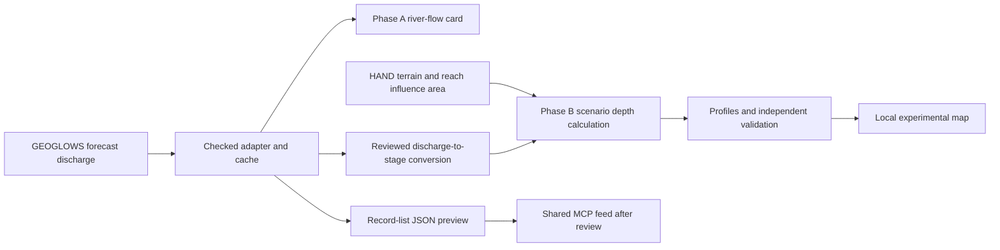

# Bang Bua Thong GEOGLOWS pilot and HAND inundation development plan

Version 2.1, updated 2 October 2026 after reviewing Daniel's workflow and all 11 slides of `Automated_Flood_Depth_Pipeline_Architecture.pptx`. Study area: Bang Bua Thong / Nonthaburi (บางบัวทอง / นนทบุรี). This is a development and validation plan, not a current flood forecast or a warning issued to the public.

**Recommended sequence:** build the existing seven-day river-flow card first; develop a small, separately labelled HAND depth experiment once the river mapping, terrain and discharge-to-stage conversion have been reviewed. A synthetic raster can test the mathematics earlier, but it does not establish a local flood forecast.

This update specifies the future Python pipeline. No HAND raster, local rating curve, hydraulic model or live inundation product has been created or validated by this document.

**Boundary for this task: read-only research and local preparation. Do not call `contribute_submit`, POST `/api/contribute`, register a feed, or publish a test layer. The user reports that the hosted deployment auto-approves contributions.**

## Implementation handoff for the other tab

Use this document as a specification in the existing GRP flood project. The architecture deck is supporting design material; its implementation instructions do not independently authorise changing code, deployment or contribution. When implementation is requested in the other tab, read that repository's instructions and inspect its existing backend, UI and tests before choosing file paths. Reuse its conventions and forecast adapter rather than creating a second flood application.

The next increment should have two clearly separated results:

1. **Phase A:** parse a captured GEOGLOWS response, produce the deterministic seven-day summary and chart, then add bounded live GET retrieval and caching. Use an exploratory reach only with a provisional label until local review selects the actual pilot reach. Check the acceptance criteria below; MCP registration is a later action.
2. **Phase B method fixture:** exercise the H=3 synthetic example, masks and raster export on a tiny synthetic grid. This can demonstrate software correctness before local HAND and curve data arrive. It must remain explicitly synthetic and cannot supply a Bang Bua Thong depth map.

Real Q-derived depth is a separate increment, blocked by a reviewed reach/domain, suitable HAND and an applicable Q-to-H relationship with compatible vertical reference. Record these as named dependencies; keep the working forecast card usable. Do not invent a curve or convert a static RP100 layer into forecast depth.

Start with one selected forecast time and one local job; inspect runtime and memory before adding more times, concurrent jobs or queues. The data fetch, stage conversion, raster calculation and summaries are deterministic Python work. An LLM may explain the saved results later, but must not choose hidden stage values, change masks or calculate the flood raster.

**Expected implementation evidence:** captured input and hashes, agreed configuration, meaningful parser/math/mask tests, reopened output checks, run metadata, and a local preview with separate software and hydraulic-validation states. Missing local hydrological evidence stays visibly incomplete. No public dataset, feed or platform registry changes are part of the first increment.


## What Daniel's suggestion adds

The pilot now has two delivery phases:

| Phase | User question | Deliverable | What enables it |
|---|---|---|---|
| A River Watch | What is the seven-day river-flow outlook and median peak? | One forecast evidence card and normalized feed preview | The previously checked GEOGLOWS access, a reviewed reach, and honest time/quality handling |
| B HAND experiment | Under an explicit discharge-to-stage relationship, what depth and extent does the HAND approximation produce in the reviewed river-influence area? | Local scenario depth GeoTIFF, wet-area layer, profile and validation record | Suitable HAND terrain, reach-associated drainage area, matching stage reference, rating curve, and hydraulic review |

The diagram supplied by Daniel describes a **HEC-RAS hydraulic modelling workflow**, with ArcMap/HEC-GeoRAS preparation and export. The accompanying text proposes a **HAND terrain-based approximation**. They share terrain, river-flow inputs and map/exposure outputs, but they are different modelling routes.

- **HAND route:** forecast discharge → locally applicable rating curve → stage relative to HAND drainage reference → scenario depth raster.
- **HEC-RAS route:** flow hydrograph plus geometry, terrain, structures and boundary conditions → hydraulic simulation → water-surface/depth results.

Use Daniel's diagram to explain the complete chain from data to maps and exposed assets. For this Python pilot, start with HAND only where its assumptions are acceptable. Do not require ArcMap, HEC-GeoRAS or DEM-to-TIN conversion for the HAND route. Current HEC-RAS supports raster terrain through RAS Mapper if a hydraulic route is selected later. [HEC-RAS terrain documentation](https://www.hec.usace.army.mil/confluence/rasdocs/rmum/latest/terrain-layer)

For Bang Bua Thong, ask the team to establish whether local flood behaviour is governed by river overflow, downstream/backwater levels, canal operations, barriers, pumps, local rainfall or a combination. These are **questions for local review**, not findings established by the two API lookup points. HAND synthetic rating curves can perform poorly when important hydraulic interactions are omitted, particularly on mild-gradient channels. [Yu et al. 2025](https://www.pnnl.gov/publications/assessing-role-hydrodynamics-enhancing-height-above-nearest-drainage-derived-synthetic)

If a discharge alone does not determine stage adequately in the selected reach, retain Phase A and ask for an existing locally reviewed hydraulic model or a stage-dependent method. Do not create an arbitrary Q-to-H equation to make the depth workflow run.

## Review of the automated architecture deck

**Verdict: useful conceptual blueprint, with corrections needed before implementation.** All 11 slides were reviewed visually. The file contains image-based slides and illustrative code fragments, with no executable pipeline, local input dataset, calibration results or performance measurements. Its final statement that execution is complete and the system is ready for scale is unsupported by the supplied material.

| Slides | Useful part | Correction adopted for this pilot |
|---|---|---|
| 1, 11 | Separates inputs, computation and outputs | Treat it as architecture context. Software completion, local flood skill and capacity must each be demonstrated. |
| 2–3 | HAND/stage subtraction and boundary identities | Require a common vertical reference and supported domain. Dry cells remain zero; unknown cells remain NoData. Channel depth H is a model identity, not measured bathymetric depth. |
| 4 | GEOGLOWS, NumPy, Rasterio and plotting responsibilities | `geopandas.clip` clips vector geometries, not raster pixels. Use Rasterio for raster masking; GeoPandas may prepare the AOI/reach vectors. [GeoPandas reference](https://geopandas.org/en/stable/docs/reference/api/geopandas.clip.html) |
| 5 | Modular data-to-output sequence | Put Q-to-H conversion explicitly before depth computation. A supported AOI/reach domain is an input; a calculated inundation footprint is an output, not a prerequisite. |
| 6 | Discharge and stage must be different variables | The import and `//` comments are illustrative pseudocode, not runnable Python. Implement and test actual retrieval, curve-range checks and reference conversion; Python comments use `#`. |
| 7 | Spatial masking limits model coverage | Preserve source validity and the correct cropped/window transform. Zero-fill defaults can create false HAND=0 cells; the raster contract below avoids that. |
| 8 | Array subtraction gives depth efficiently | Its H=8 matrix is a synthetic arithmetic fixture. Avoid per-pixel Python loops, but use loops over raster blocks/windows; the claim that all loops must be avoided is unnecessary. |
| 9 | Transects help detect numerical/spatial errors | An idealised smooth profile is not validation. Keep terrain discontinuities and NoData gaps; compare with independent local evidence before claiming flood accuracy. |
| 10 | Export a numerical depth raster for later analysis | Keep depth in metres and styling separate. The illustrated crop-loss curve has no supporting crop, event or calibration data; it is not adopted as a damage model. |

The deck therefore helps organise the Python modules and synthetic checks. It does not remove the local terrain, stage-reference, hydraulic-review or independent-validation dependencies. The revised execution contract below adds the practical parts missing from the slides.

**Review evidence:** the documented NumPy kernel was checked with synthetic data for H=0/H=3, the slide's H=8 matrix, dry/unknown/channel cells, invalid stage rejection, and equivalence across several array-block sizes. Primary library documentation was checked for clipping, masks and windows. Rasterio is not installed in this document-review runtime, so raster file I/O, geometric clipping and export were not executed. No local hydraulic accuracy or hosting-capacity result is claimed.

## Phase A one question and one useful output

> What does the latest GEOGLOWS forecast show for river flow over the next seven days on a locally agreed river reach relevant to Bang Bua Thong, and when does the median forecast reach its peak?

User: a district preparedness planner or ADPC analyst. Purpose: decide whether to review local river observations and official water-management information more closely. The first product is a read-only forecast evidence card in the existing flood application.

Show one reach, one seven-day chart, the forecast run, peak of the median series and its valid time, an ensemble range, and a clear source/quality state. Link to the existing ADPC and official maps/stations for follow-up. Keep the static RP100 exposure assessment in its own labelled section; do not turn live discharge into an RP100 inundation scenario.

The first version provides a forecast signal for human review. Discharge in m³/s is not water level, flood depth, a district inundation map, a shelter-safety result or an evacuation instruction. Local hydrology, drainage, water management and observed conditions must be assessed before it can support a calibrated warning rule.

## What has actually been checked

Public GET requests were made without credentials. No contribution was submitted.

| Check | Result on 2 October 2026 |
|---|---|
| API documentation | Embedded Swagger specification parsed from the official documentation page; base path `/api`, service version `2.3.0` |
| River lookup | `/api/v2/getriverid?lat=...&lon=...` returned JSON reach IDs |
| Forecast statistics | Both exploratory reach IDs returned HTTP 200 JSON from `/api/v2/forecaststats/<river_id>?format=json` |
| Run pinned by date | A request with `date=20261001` also returned HTTP 200 for the regional exploratory reach |
| Dates route | `/api/v2/dates` returned HTTP 200 **CSV**, despite the Swagger description saying JSON; parse the actual response |
| Forecast shape | Parallel arrays: `datetime`, `flow_med`, `flow_25p`, `flow_75p`, `flow_avg`, `flow_min`, `flow_max`, `high_res`, plus `metadata` |
| Timestamp cadence | The two captured responses had 280 points, with hourly and three-hourly intervals; do not hardcode a constant time step |
| Units | Response metadata identified streamflow in cubic metres per second |
| MCP feed contract | Current connected server advertises `generic_json` for a list of records, not parallel arrays. General `compute_run` remains planned in this instance |

### Exploratory reach IDs — not yet approved for this pilot

The query coordinates below were approximate research points selected to examine the service. They were not supplied as official gauge coordinates, and the returned river identities and hydrological relevance have not been verified.

| Exploratory point | Coordinates (lat, lon) | API-returned ID | Required follow-up |
|---|---|---|---|
| Approximate Bang Bua Thong town area | 13.917, 100.425 | `430392813` | Check which modelled watercourse this actually represents; proximity does not prove usefulness |
| Approximate river-side point near Nonthaburi | 13.840, 100.490 | `430537201` | Check the stream geometry, river identity, catchment and relevance to the district |

Use the GEOGLOWS network/Hydroviewer and a local hydrologist or water-management colleague to choose **one** reach. Do not label either candidate as a named river, official station or validated Bang Bua Thong forecast based only on the lookup response. If neither is appropriate, replace it with a locally nominated reach. This is the first decision needed from the team.

The official river-number tutorial explicitly notes that coordinate matching can be wrong near confluences or where stream geometry differs; it recommends checking the match against other evidence.

## Proposed architecture



Start with the app reading GEOGLOWS through a small backend adapter. That lets the team verify the data and output before registering anything on the shared platform. Keep the adapter reusable so the same checked data can later be exposed to MCP. Do not create another national water portal or modify the separate mangrove sprint repository for this flood experiment.

Two possible later integrations:

1. **ADPC adapter:** reshape the upstream result, compute the agreed summary deterministically, cache it and expose a public JSON record list once source-use terms and hosting are approved. This can fit the current generic feed pattern.
2. **SIG upstream adapter:** SIG adds a GEOGLOWS-specific adapter that handles parallel arrays, forecast run time and local reach relevance. Ask for this if maintaining a small ADPC feed endpoint would be undesirable.

Public accessibility is one condition for a live feed, not the whole contract. The response structure, time semantics, geographical relevance, availability and permitted use must also fit. A browser/private-window check is useful but does not establish those properties or prove access from the platform server.

## Phase A implementation steps

| Step | Work | Owner role | Completion evidence |
|---|---|---|---|
| 1. Choose the reach | Confirm the intended user, river/reach geometry, a reference gauge if available, and its relevance to Bang Bua Thong. Check source-use terms | ADPC analyst + local hydrology reviewer | Agreed reach ID, map, rationale and open limitations |
| 2. Build a local data check | Fetch and pin a forecast run; validate shape/units/times; preserve the raw response; reshape it into records | Developer | Reproducible local result, validation report and meaningful failure tests |
| 3. Add one evidence card | Seven-day median curve, P25–P75 band, median peak/time, source run, local time labels and quality states | Developer + planner | Planner can read the card and identify what needs follow-up without interpreting it as a local inundation prediction |
| 4. Review for sharing | Compare with appropriate observed information, settle the licence, confirm MCP forecast/freshness and location handling, and test from the actual hosting environment | ADPC reviewer + SIG | Approved integration specification; feed registration remains a separate explicit action |

No assumed staffing or guaranteed schedule is attached. Mapping, licence and local-review dependencies can proceed alongside the small technical prototype. The first demo can use captured responses clearly labelled as snapshots.

## Data and time rules for the developer

- Parse the actual Content-Type and body. The dates endpoint returned CSV in this check. Validate success/error bodies even when HTTP status is 200.
- Select a known available forecast run and request it explicitly. The tested date query was `date=20261001`; the dates-list entry was `2026100100`. Do not assume the raw date-list string is the accepted query syntax or fabricate an unavailable run. Preserve both the raw run identifier and the exact request URL.
- Keep three times distinct: **forecast run/initialisation**, **forecast valid time**, and **retrieval time**. In the pinned response, `metadata.gen_date` changed with retrieval while the selected run stayed the same. Do not use it as evidence of a new forecast run.
- Do not use the last future valid time as the feed's freshness date. A forecast extending two weeks ahead can still be from an old run.
- A seven-day window is `[decision_time_utc, decision_time_utc + 7 days)`. Pass and save that decision time explicitly. Use the same window for chart, summary and tests. Filter the valid timestamps actually present; do not silently invent intermediate data.
- Check array alignment, increasing unique UTC timestamps, finite non-negative discharge where present, missing values, unit metadata, quantile ordering and metadata reach ID. Treat invalid or empty responses as unavailable. Empty strings such as those seen in `high_res` are missing values, not zero flow.
- Use `flow_med` for the median and `flow_25p`/`flow_75p` for the P25–P75 band. Do not relabel them as P20/P80 or as a calibrated confidence interval for the real river.
- Define the headline peak as the maximum of the **median series** within the window, with a declared tie rule. Display P25/P75 at that same valid time. This is not the median of individual ensemble peak times or a probability of flooding.
- Keep UTC internally; display dates/times in Asia/Bangkok with clear labels.
- Make freshness policy explicit and reviewed. GEOGLOWS documentation says forecasts are daily and normally available by 12:00 UTC (19:00 Bangkok). Do not mark a morning query failed merely because that day's forecast has not yet been published; never label an old cache as a new run.
- Fetch once per selected reach/run and reuse a cache. Use bounded read retries and honest stale/unavailable states. Do not request GEOGLOWS again for every user question. If scaling to many rivers later, assess the official AWS access approach, which the package documentation recommends for speed/reliability.
- Save request URLs, raw-response hashes, selected run, decision window, validation result and execution timings. No LLM is needed to fetch, reshape, calculate the peak or draw this card. Add optional narrative only after these deterministic results work.


## HAND inundation experiment

### Scope and modelling decision

Implement a **local, reproducible Python scenario pipeline** for one reviewed reach and its reviewed influence area, intersected with the district reporting boundary. Build on the forecast adapter; keep the rating curve, terrain preparation and raster calculation as separate modules. A district boundary is an area of interest, not proof that every cell drains to the selected reach.

Work in three explicit modes:

| Mode | Permitted result | Required label |
|---|---|---|
| `forecast_only` | Phase A discharge chart and summary | River-flow forecast; no local inundation calculation |
| `synthetic_hand_demo` | Toy-array/fixture calculations using a stated synthetic H | Synthetic method demonstration; not Bang Bua Thong flood depth |
| `reviewed_hand_scenario` | Depth/extent for the supported local domain under a reviewed Q-to-H method | Experimental HAND scenario, with review status and assumptions |

There must be no silent switch to invented stage values or synthetic terrain when real inputs are missing. Keep the working forecast card available and show the depth module's missing dependency explicitly.

### Correct mathematical contract

For grid cell `i` that drains to an assigned reference channel cell `d(i)`:

```text
HAND_i = terrain_elevation_i - drainage_reference_elevation_d(i)
Q_r(t) = forecast discharge for reviewed reach r at valid time t, in m³/s
H_r(t) = reviewed rating_curve_r(Q_r(t)), in metres above that HAND reference
Depth_i(t) = max(H_r(t) - HAND_i, 0), within the supported model domain
```

HAND follows the drainage connection, not simply the closest stream by straight-line distance. Its terrain and drainage definition must be known. [Nobre et al. 2011](https://doi.org/10.1016/j.jhydrol.2011.03.051)

**H must share the HAND vertical reference.** A gauge reading in metres above gauge zero, an elevation above sea level, and metres above a raster drainage reference are different quantities. A surveyed river bed is also not automatically the drainage-cell elevation in a surface DEM. Record the conversion and datum evidence. Where an absolute water-surface relationship is available, the conceptual conversion is `H = water_surface_elevation - compatible_drainage_reference_elevation`; applying it across a reach still requires a reviewed longitudinal/reach representation.

The basic subtraction is a stage-based inundation approximation, not an unsteady hydraulic simulation. It does not solve flow routing, velocity, travel time or water-volume conservation. An observed or synthetic rating curve requires applicability checks; an uncalibrated synthetic curve is not a local measurement. [Zheng et al. 2018](https://doi.org/10.1111/1752-1688.12661)

Use these boundary conventions:

- `HAND < H`: positive modelled depth in a supported cell.
- `HAND == H`: zero-depth boundary; do not count it as positive-depth inundation.
- `HAND > H`: valid dry cell in the modelled domain, with depth `0`.
- Missing/invalid terrain or unsupported area: `NoData`, not dry and not evidence of safety.

For a single non-negative H and valid non-negative HAND, `0 <= depth <= H`. A represented channel cell with HAND exactly zero has depth H **by the model's definition**. The global raster maximum need not equal H if the channel is absent or clipped. The identity does not prove actual bathymetric water depth. Negative HAND values need a documented quality decision; do not silently clamp them to hide terrain/reference errors.

### Data to request from Daniel Pin and the local team

| Input | Evidence needed before using it | Current position |
|---|---|---|
| Study boundary | Authoritative district/AOI polygon, version, CRS and permitted use | Existing GRP boundary may be reusable; verify it |
| Reviewed GEOGLOWS reach | Geometry, river identity, catchment, local relevance, and mapping to the modelled channel | Two candidate IDs are API checks only |
| HAND GeoTIFF | Source DEM, resolution, vertical units/reference, generation method, drainage threshold/network, conditioning, NoData and quality assessment | No reviewed local HAND supplied |
| Terrain data if HAND must be built | Suitable bare-earth DTM/DEM; stream geometry and any surveyed channel/structure information; accuracy relative to intended shallow depths | Availability and suitability to confirm |
| Reach-associated drainage/influence area | Cell/reach association derived from the same drainage model; reviewed coverage and any connectivity exclusions | No verified mapping supplied |
| Q-to-H relationship | Applicable reach/gauge, Q in m³/s, stage definition, datum/reference conversion, valid Q range, calibration/date and reviewer | No local rating curve supplied; this blocks real Q-derived depth |
| Hydraulic context | Relevant barriers, canals, control structures, pumps and downstream water-level conditions; whether a single-valued rating curve is acceptable | Local review needed |
| Independent validation | Historical discharge/stage, inundation extent, flood marks or a locally reviewed hydraulic model, with time and datum information | Request suitable evidence |

Ask Daniel and Pin to help **nominate the hydraulic reviewer and identify existing datasets/models**. Do not assume either colleague has already approved the model or owns all inputs. Reuse suitable existing ADPC resources before proposing a new full modelling exercise.

The district clipping polygon is a required reporting boundary. A flood-footprint polygon is usually **derived** from the calculated positive-depth raster; it is not a mandatory pre-existing input. An observed flood polygon is valuable for independent validation. A HAND-threshold polygon generated from the same calculation cannot independently validate that calculation.

### Python pipeline work packages

| Package | Developer work | Completion evidence |
|---|---|---|
| B0 Modelling suitability | Record the nominated reach/domain, stage reference, available terrain, hydraulic limitations and reviewer decision | Model assumptions and missing-data list; real depth remains blocked if prerequisites are missing |
| B1 Input preparation | Validate or prepare terrain/HAND over a hydrologically adequate domain; establish drainage and GEOGLOWS reach correspondence | Versioned rasters, source metadata, grid specification and reach/influence map |
| B2 Forecast and stage | Reuse Phase A run handling; evaluate the reviewed rating curve only within its supported range | Original Q, converted H, curve version, datum conversion and range checks |
| B3 Depth and extent | Calculate block/window-based depth and wet masks on the reference HAND grid; derive an optional footprint vector | Reproducible GeoTIFFs, masks and summaries |
| B4 Validation | Run mathematical/grid checks and compare with independent local evidence | Numerical checks plus reviewed extent/depth/stage comparison and limitations |
| B5 App and sharing preview | Show the local experimental layer beside its forecast evidence and model details; prepare local-only registration notes | Clearly labelled app preview and proposed SIG integration contract |

Do not attach a guaranteed duration to these packages before terrain, calibration and reviewer availability are known. The arithmetic and file export can be tested early; obtaining and validating local hydraulic inputs is a separate dependency.

### Processing steps for the developer

1. **Load and validate configuration.** Require a selected mode, pinned forecast run, reach ID, AOI, reference grid, HAND version, stage method and review state. Reject incompatible/missing units and unknown vertical-reference conversions. Record input hashes and model/software versions.
2. **Prepare terrain and reach association.** If generating HAND, use a reviewed hydrologic conditioning, flow-direction and drainage-network method. Work over a sufficient hydrological domain before clipping to the reporting AOI; cutting the DEM to a district first can corrupt drainage at its boundary. Preserve structures that control flow according to the chosen method; depression filling or stream burning is not an automatic licence to erase barriers.
3. **Align grids and masks.** Use the HAND grid as the fixed calculation grid. Check CRS, dimensions, transform, pixel alignment and resolution; matching CRS alone is insufficient. Reproject vectors explicitly. Use nearest-neighbour treatment for categorical reach/mask rasters; keep any continuous-raster resampling method explicit and assessed. Use an appropriate projected CRS for area/distance measurements, with horizontal and vertical units handled separately.
4. **Select forecast scenarios.** Start with the time of the Phase A median-series peak in the seven-day window. Take P25, median and P75 discharge at that **same valid time**, if requested. Preserve their meaning as discharge ensemble summaries; do not label the maps as probabilities of district flooding. Retain a clear distinction between forecast scenarios and separately defined return-period/design scenarios.
5. **Convert Q to H.** Use a versioned local lookup/equation. For tabulated monotonic curves, a documented interpolation within the supported range is a reasonable initial option; reject out-of-range Q rather than silently extrapolate or clamp. Check that the GEOGLOWS discharge and curve refer to compatible river flow/location. If model bias correction is used, retain both the raw and corrected Q and the correction method. Do not invent Manning roughness, slope, coefficients or datum offsets.
6. **Calculate supported depth.** Apply the stage only to cells associated with the reviewed reach and supported hydraulic domain. Review connectivity/barriers separately; a low HAND value alone does not prove inundation across a levee or into an unrelated drainage area. A reach/influence mask by itself does not simulate hydraulic connectivity, overtopping or gates. If those processes matter and cannot be represented defensibly, stop at a method demonstration or use a suitable hydraulic model.
7. **Derive extent and summaries.** Use positive depth with an explicit threshold; do not confuse an optional visual minimum depth with a physical model. Compute area using the appropriate grid/geodesic calculation. Keep excluded/unknown coverage separately counted. Polygonize only when a vector footprint is needed; keep the original raster as the numerical source.
8. **Validate profiles and local evidence.** Plot HAND and calculated depth along documented transects; include original terrain or observed marks only with compatible references. Check the subtraction identity, dry/NoData handling and spatial artefacts. A profile need not decrease smoothly from channel to boundary: terrain steps, multiple channels and raster sampling can produce discontinuities. Do not smooth a graph to create an appearance of validation. Compare with independent observations/model results before assessing local flood skill.
9. **Export and display.** Write depth in metres to a floating-point GeoTIFF, retaining CRS, transform, resolution, mask and a declared NoData value. Give each map a unique forecast run, valid time, discharge statistic and model version. Use a consistent depth legend across scenarios, with a fixed or clearly disclosed scale. Show the experimental status and limitations in the app.

### Raster masking and memory contract

Use Rasterio to read/write raster cells. GeoPandas is for vector preparation. Select a calculation window on the HAND grid; keep every auxiliary reach/validity mask on that same grid. Missing CRS, non-overlap or incompatible grid must return an explicit input error, not an empty successful flood result.

- For a small fixture, `rasterio.mask.mask(..., filled=False, crop=True)` retains a masked array. Use its returned transform and dimensions for the output and align auxiliary rasters to the same window. When no source NoData is declared, the filled default can use zero: treating that fill as HAND would create depth H outside the polygon. [Rasterio masking API](https://rasterio.readthedocs.io/en/stable/api/rasterio.mask.html)
- For larger inputs, read source blocks/windows, compute with NumPy within each window and write that output window. Build each geometry mask with the window's transform. One scalar H broadcasts over a block; there is no need to allocate a whole-raster constant-stage array. [Rasterio windowed I/O](https://rasterio.readthedocs.io/en/stable/topics/windowed-rw.html)
- With `geometry_mask(..., invert=True)`, `True` means inside the supported polygon; its default convention is the reverse. Record the centre-based pixel selection policy (`all_touched=False` initially) and test boundary pixels. This polygon selection is coverage, not proof of hydraulic connectivity. [Rasterio geometry masks](https://rasterio.readthedocs.io/en/stable/api/rasterio.features.html)
- Derive source validity from the raster's mask/NoData definition, not just `np.isfinite`. NumPy masked-array `True` means invalid, whereas a GDAL valid-data mask uses nonzero for valid. HAND=0 is a legitimate channel value: if zero is also declared NoData, resolve the ambiguity from reliable mask/provenance before accepting the input. [Rasterio data masks](https://rasterio.readthedocs.io/en/stable/topics/masks.html)

Do not smooth or resample the output just to make its profile match the slide illustration. Preserve metres in a single-band float32 GeoTIFF with an explicit, tested NoData policy; store the colour ramp separately. Polygonize the wet-state mask only when a footprint is requested, rather than every floating-point depth value. For tiled polygonization, any topology/merge step must be tested separately.

The numerical kernel below operates on one already aligned block. It does not implement raster I/O, reference conversion, reach assignment or barrier modelling.

### Numerical example and vectorized kernel

This is a **synthetic arithmetic example**, not a Bang Bua Thong forecast. For H = 3 m:

| HAND m | Output depth m | Wet state |
|---|---|---|
| 0 | 3 | Positive depth |
| 1 | 2 | Positive depth |
| 2.5 | 0.5 | Positive depth |
| 3 | 0 | Zero-depth boundary |
| 3.2 | 0 | Valid dry cell |
| NoData | NoData | Unknown |
| Outside the supported domain | NoData | Outside model coverage |

Core calculation, after the input checks above:

```python
# Contract sketch, not an implemented or calibrated pipeline.
# hand_m: metres above the reviewed drainage reference.
# supported_mask: aligned cells that the local model is allowed to represent.
# stage_m: finite, non-negative H with the same reference as hand_m.
if not np.isfinite(stage_m) or stage_m < 0:
    raise ValueError("Invalid stage height")

valid = source_valid & supported_mask & np.isfinite(hand_m) & (hand_m >= 0)
depth_m = np.full(hand_m.shape, np.nan, dtype=np.float32)
depth_m[valid] = np.maximum(stage_m - hand_m[valid], 0.0)
wet = valid & (depth_m > 0.0)
```

The actual raster writer must retain an unknown mask separately from `wet=False`; otherwise unknown cells could be misread as dry. For example, a wet-state file may use `1=wet`, `0=valid dry/boundary`, and `255=NoData`. Do not use a single false value for all three. Implement the calculation by raster blocks/windows rather than loading every timestamp and the whole AOI into memory at once.

### Proposed modules and outputs

Use the existing GRP backend conventions rather than a new duplicate application. Proposed responsibilities:

- `forecast_adapter`: pinned retrieval, parsing, cache and provenance; shared with Phase A.
- `hand_inputs`: HAND/grid validation, domain/reach association and masks.
- `rating_curve`: range checks, interpolation and stage-reference conversion.
- `inundation`: vectorized raster-window computation and wet-mask handling.
- `validation`: profiles, spatial/numerical checks and independent event/model comparisons.
- `export`: GeoTIFF, optional footprint, summary JSON and run manifest.

Suggested stack: NumPy and Rasterio for arrays/windowed raster I/O; GeoPandas for vectors; Matplotlib for validation profiles; the existing checked GEOGLOWS REST adapter or a tested/pinned `geoglows` package for data access. `rioxarray` is optional where it fits the existing stack. HAND generation needs its own reviewed hydrological method/tool; raster clipping alone does not produce HAND. Pin and record the actual dependency versions after implementation.

Each run should produce a local folder such as `runs/<pilot_id>/<run_id>/`, containing:

- Original forecast response and normalized Q/H series.
- `depth_hand_<forecast_run>_<valid_time>_<statistic>.tif` in metres.
- `wet_state_<scenario>.tif` and an optional `extent_<scenario>.gpkg`.
- Profile PNG/CSV and numerical/spatial validation report.
- `run_manifest.json`: input hashes, AOI/reach/grid identifiers, HAND and curve versions, stage reference, issue/valid/retrieval times, Q/H values, processing versions, supported/excluded coverage and review status.
- A compact summary JSON for the app and local feed preview.

Store unsupported states as explicit statuses such as `missing_rating_curve`, `datum_unresolved`, `reach_mapping_unreviewed`, `out_of_curve_range`, `terrain_invalid` or `hydraulic_assumptions_unresolved`. Missing dependencies must not appear as zero depth or a successful district-wide prediction.

### Local execution and reproducibility contract

Keep invocation independent of a chat conversation: a local command or existing backend job accepts a configuration file and returns a run summary. Command names, routes and source paths are implementation decisions after repository inspection; no new public API is implied here.

| Configuration group | Required contract |
|---|---|
| Mode and identity | `pilot_id`, explicit mode, reach ID and pinned forecast run; no automatic synthetic fallback |
| Time and scenario | Decision window, selected valid UTC time, discharge statistic and raw/corrected-Q choice; all retained in the result |
| Spatial inputs | Versioned HAND, AOI and reach/domain association; reference grid, units and source-validity rules |
| Stage method | Curve/version, supported Q range, H definition and reference conversion; mandatory for real Q-derived depth |
| Review and output | Reviewer/decision reference where required, output directory, software version and mask/threshold policy |

Reject configuration before raster computation when required inputs are absent. Keep separate fields for execution state (`running`, `complete`, `failed` or `blocked`), result mode and hydraulic-validation state. A software-complete synthetic run is not a hydraulically validated local forecast.

Build a reproducibility key from the selected forecast/raw-input hash, decision time and scenario, HAND/curve/domain hashes, model configuration and code version. The same key should reuse or reproduce the same result; do not mix files from different scenarios. Write into a temporary run directory and mark the final run complete only after all required files reopen and pass checks. Interrupted/failed files must not appear as the latest successful layer.

Record timings, grid size, valid/excluded cell counts, block strategy and measured memory where available. On the actual development/staging host, benchmark a representative reviewed AOI before expanding the workload. Provisioned CPU/RAM or the deck's matrix example alone does not demonstrate capacity. Add background execution only if measurements show the job exceeds the existing request budget; a queue system is not an automatic prerequisite for the first local CLI/fixture.

The app reads the completed summary/manifest, with a clear latest-run and stale-state policy. A user question should reuse the existing forecast cache and completed raster, rather than re-fetch and recompute the same dataset. Automated publication and contribution stay outside this local execution contract.

### Validation and acceptance criteria for Phase B

1. **Inputs and reach mapping:** a named reviewer and a written domain/reach mapping decision are recorded. A nearby GEOGLOWS ID and a district polygon alone do not pass.
2. **Stage reference:** Q units, H definition, gauge/datum offsets and compatibility with HAND are documented and reviewed. Missing conversion prevents real depth generation.
3. **Terrain and grid:** raster units, provenance, vertical accuracy, CRS, grid alignment, drainage generation and NoData are checked. Negative/invalid HAND cells are reported, with the disposition explicit.
4. **Arithmetic:** the synthetic H=3 example above is reproduced. Equality gives zero depth; valid dry cells stay zero; missing and unsupported cells remain NoData. Under a common supported domain and valid non-negative HAND, depth stays in [0,H].
5. **Range and failure handling:** an invalid/out-of-range discharge, missing curve, changed upstream schema and mismatched reach cause an explicit failure/blocked depth result. No synthetic fallback occurs in real-input mode.
6. **Scenario consistency:** all three discharge statistics use the same run/time for the first comparison. If the curve is monotonic and domain treatment is the same, expected depth ordering is preserved. Model-derived uncertainty is not described as calibrated flood probability.
7. **Raster export and repeatability:** files reopen correctly with the specified units, CRS, transform, dtype and NoData; independent recomputation matches within declared numerical precision. Include a polygon-with-hole/cropped-grid fixture, true HAND=0 versus unknown/dry cells, and equivalence between whole-array and differently sized block calculations. Non-overlap and grid mismatch fail explicitly. Every map is traceable to its forecast, terrain and curve; interrupted output is not promoted to complete.
8. **Local model validation:** report stage/depth bias or errors where paired observations exist, and extent overlap/false positives/false negatives on a defined evaluation domain. Do not use the model's own threshold polygon as reference truth. The hydraulic reviewer sets acceptable performance/tolerances; mathematical tests alone cannot establish flood skill.
9. **Validation availability:** if independent local evidence is missing, the deliverable may pass as an explicitly labelled method experiment, but its local flood-performance validation remains incomplete. It cannot be reported as an operationally validated inundation forecast.
10. **App and platform boundary:** show method, valid time, units, supported domain and review state. Keep static RP100, forecast discharge and experimental HAND depth distinct. Software completion does not replace hydraulic validation. No operational warning, shelter-safety claim, automatic evacuation, financial-loss output or live contribution is issued by this experiment.

### Exposure and economic analysis after model review

A reviewed depth layer can later be overlaid with people, roads, buildings or agricultural assets. Start with transparent exposure counts and coverage limitations. A possible loss calculation also needs appropriate asset values, occupancy/crop information, depth-damage relationships, relevant event characteristics and local validation. Depth is one input, not a complete loss model. A static depth scenario is not an event probability or an annual expected loss.

For this pilot, retain economic-loss work as a separate future backlog item. A forecast-driven HAND experiment must not be promoted as a replacement for the existing static exposure assessment or as an insurance estimate.

## How the MCP feed should be shaped

Do not point the present `generic_json` adapter directly at `forecaststats`: the observed payload has arrays of primitives, not an object per time step. A CSV forecast URL does not automatically fit `generic_table`, whose advertised format is the NOAA year-by-12-months series.

For the first shared MCP use, prefer a small JSON list containing a **latest forecast summary record**. Keep the full time-series records available to the own-client chart and as evidence. The same summary calculation must be used by the UI and feed; preserve the returned summary for replay.

Suggested summary fields, subject to SIG's confirmed schema:

| Field | Meaning |
|---|---|
| `reach_id` | The locally reviewed GEOGLOWS V2 reach |
| `issued_at_utc` | Verified forecast run time, used for freshness |
| `retrieved_at_utc` | When upstream bytes were retrieved |
| `decision_time_utc`, `window_start_utc`, `window_end_utc` | Exact analysis window |
| `median_peak_m3s`, `median_peak_valid_at_utc` | Peak of the median curve and its valid time |
| `p25_at_peak_m3s`, `p75_at_peak_m3s` | Ensemble band at that same time |
| `quality_state`, `scope_note`, `source_url` | Provisional/stale/unavailable information and geographical limitation |

Use a stable endpoint with `records` as an array of record objects, and map `as_of_field` to the forecast run time. Keep unavailable states explicit; do not fabricate a zero-discharge record. Confirm how the current platform interprets freshness and quality fields before relying on its generic output to enforce them.

Future registration should specify `pack: risk`, relevant country/hazard tags, source attribution and reviewed source-use terms. These are necessary but insufficient for reach-level relevance: country=`Thailand` does not make one reach applicable to all Thai flood questions. The own client must enforce the agreed reach/AOI scope, and SIG must confirm how the shared assembler filters local feeds.

A registered feed being queryable through `feeds_query` does not prove that `risk.brief` calculates dynamic flood extent, evaluates local warning thresholds or automatically uses it in the intended workflow. Validate those as separate capabilities.


### Additional boundary for sharing HAND outputs

The forecast feed is structured JSON. A continuous depth GeoTIFF is a different product. The connected raster contribution contract inspected earlier on 2 October advertises selected risk/hazard/population raster kinds; it does not establish that a continuous flood-depth-in-metres layer can be submitted and correctly analysed. **Do not encode metres as hazard classes 1–5 or claim that a URL field makes MCP capable of reading the raster.**

Keep depth layers in the local/app preview until SIG confirms: supported raster semantics, units, NoData, tiling/storage, size limits, metadata, analytical consumption, access/attribution and withdrawal/versioning. A summary feed may carry a layer reference after review, but the reference is not evidence that the shared risk workflow performs depth-based analytics. Public endpoint/layer publication and `contribute_submit` remain separately authorised actions.

## Acceptance criteria for Phase A River Watch

1. A reviewer confirms the selected reach and its limitations. Nearest-point lookup alone does not count as geographical validation.
2. A pinned public forecast request succeeds without a GEOGLOWS key, and its original bytes, run identifier, units and timestamps are retained.
3. The array-to-record transformation preserves field/time alignment. Empty strings, empty responses, invalid numbers, changed schema and mismatched reach ID fail visibly.
4. Independent checking reproduces the seven-day window, peak of the median and peak time from the raw snapshot. Mixed time steps, tied peaks and time-zone conversion are tested.
5. The card shows the run, ensemble band and quality state, and clearly separates its forecast signal from the static exposure scenario.
6. The same calculation supplies the UI and any normalized feed preview. Future-valid dates and retrieval dates cannot make an old forecast appear freshly issued.
7. The planner can name the next local information to review. Phase A produces no operational alert, evacuation action, local inundation raster or loss estimate; Phase B has its own separate prerequisites and acceptance criteria.
8. There is no live feed submission, approval, deployment or change to the shared platform in either initial phase. A contribution or layer-registration draft remains local and visibly unsubmitted.

## Questions to settle with SIG and the data team

1. Can you support a native GEOGLOWS adapter, or should ADPC provide a normalized record-list endpoint?
2. How should the current feed contract distinguish forecast run time, valid time, expiry and unavailable states?
3. How will a single river reach be filtered by AOI/reach rather than country alone? Which risk queries will actually consume it?
4. Is a preview/review-only environment available while hosted auto-approve is active? What is the process to remove or withdraw test feeds?
5. What source-use terms apply to the specific GEOGLOWS output and any derived public summary? The official training catalog currently names **CC BY-NC-SA 4.0**, while the AWS registry names **CC BY 4.0**. Confirm the applicable terms before shared publication or future commercial/insurance use; do not enter a guessed licence in the manifest.
6. Which locally reviewed river/gauge is useful for Bang Bua Thong, and what observed data can be used to check or later bias-correct the discharge forecast?
7. Is there an existing suitable HAND raster or terrain/drainage model? How are its drainage cells mapped to GEOGLOWS reaches?
8. Who can supply/review a stage-discharge relationship and its vertical reference, usable discharge range and calibration?
9. Do barriers, backwater, canals or controls invalidate a simple single-reach HAND approximation here? Is a reviewed HEC-RAS/other hydraulic model already available?
10. Can the platform ingest continuous depth in metres as its own raster type, with an auditable model/run manifest and supported analytical behaviour?
11. Which historical events, flood extents or observed water levels can validate Phase B, and who agrees the acceptance tolerances?

## Later extensions, after the first card works

- Compare two forecast runs over the same valid-time window to explain revisions.
- Add one suitable observed discharge series and evaluate model bias/performance. Do not compare discharge in m³/s directly with a gauge level in metres.
- Agree locally validated thresholds and an authorised review/escalation process.
- Consider rainfall, reservoir operations, tide/water level and inundation modelling as distinct additional inputs/methods. Keep financial loss estimates for a later validated chain from forecast to hazard to exposed assets and vulnerability.


## First discussion with Daniel Pin and the data team

Bring the reach candidates and this plan to a short technical scoping discussion. Aim to finish with five recorded decisions:

1. The nominated river/reach and the part of Bang Bua Thong it can reasonably represent.
2. Which HAND/terrain, drainage and existing hydraulic resources are available and permitted for use.
3. The Q-to-H method and the person who can resolve its vertical-reference and hydraulic applicability.
4. Whether the next depth task is a synthetic demo, a local scenario experiment, or work with an existing hydraulic model.
5. The independent validation source, reviewer and follow-up tasks, with owners and dependencies.

If no usable local rating/reference exists, complete Phase A and the synthetic mathematical demonstration first. Record the missing hydraulic work explicitly; do not describe this as a complete automated Bang Bua Thong inundation forecast.

## References

- [Automated Flood Depth Pipeline Architecture](D:/adpcworkspace/02Oct2026/2026-10-02_Automated_Flood_Depth_Pipeline_Architecture.pptx): supplied architecture reference, all 11 slides visually reviewed on 2 October 2026. The currently stored filename has a date prefix; its SHA-256 matches the reviewed input. Slides are illustrations/pseudocode, not implementation or local calibration evidence. The source contents were not modified.
- [GeoPandas clip](https://geopandas.org/en/stable/docs/reference/api/geopandas.clip.html), [Rasterio masking API](https://rasterio.readthedocs.io/en/stable/api/rasterio.mask.html), [geometry masks](https://rasterio.readthedocs.io/en/stable/api/rasterio.features.html), [data masks](https://rasterio.readthedocs.io/en/stable/topics/masks.html) and [windowed I/O](https://rasterio.readthedocs.io/en/stable/topics/windowed-rw.html): primary documentation checked for the raster implementation corrections. The documentation check does not establish compatibility of an untested package environment.
- Daniel's supplied workflow image and HAND notes: design context provided by the team, not proof of local model validity. The numbered references [1]–[6] in the supplied notes had no bibliography; they are not treated as verified sources here.
- [Nobre et al. 2011](https://doi.org/10.1016/j.jhydrol.2011.03.051): HAND terrain/drainage reference definition.
- [Zheng et al. 2018](https://doi.org/10.1111/1752-1688.12661): reach geometry, synthetic rating curves and evaluation against hydraulic/gauge evidence.
- [Yu et al. 2025, PNNL](https://www.pnnl.gov/publications/assessing-role-hydrodynamics-enhancing-height-above-nearest-drainage-derived-synthetic): hydrodynamic/backwater effects and HAND rating-curve limitations on mild-gradient channels.
- [HEC-RAS terrain documentation](https://www.hec.usace.army.mil/confluence/rasdocs/rmum/latest/terrain-layer): raster terrain, channel/overbank information and features controlling floodplain flow.
- [HEC-RAS 2D boundary and initial conditions](https://www.hec.usace.army.mil/confluence/rasdocs/r2dum/latest/boundary-and-initial-conditions-for-2d-flow-areas): hydraulic boundary conditions; a discharge input alone does not define the whole model.
- [GEOGLOWS live API documentation](https://geoglows.ecmwf.int/documentation): exact routes and parameters; embedded Swagger read directly on 2 October 2026.
- [Candidate JSON technical check](https://geoglows.ecmwf.int/api/v2/forecaststats/430537201?format=json&date=20261001): a real response for an exploratory, unvalidated reach; not an operational Bang Bua Thong product.
- [API tutorial](https://training.geoglows.org/rfs/tutorials/data-service/): public data-service access and river-ID selection.
- [Finding river numbers](https://training.geoglows.org/rfs/tutorials/find-river-numbers/): V2 IDs and the need to verify coordinate-based matches.
- [Forecast data](https://training.geoglows.org/rfs/datasets/forecast/): discharge, forecast horizon, ensembles and publication timing. In this check, the actual timestamp intervals differed from the simple three-hourly description; use returned timestamps.
- [Python data access](https://geoglows.readthedocs.io/en/latest/api-documentation/data.html): forecast statistics and REST/AWS options.
- [Bias correction](https://training.geoglows.org/rfs/bias-correction/forecasted-bias-correction/): local observations and model-bias treatment.
- [GEOGLOWS data catalog](https://training.geoglows.org/rfs/datasets/catalog/) and [AWS registry](https://registry.opendata.aws/geoglows-v2/): conflicting licence descriptions to resolve.
- Current connected SERVIR MCP `platform_capabilities` and `contribute_submit` schema, inspected on 2 October 2026. This connection reports `stdio`; recheck the hosted target rather than assuming identical registry or approval settings.

The earlier raw GEOGLOWS response evidence is saved under `work/geoglows_plan/` in this chat workspace. This update edits the pilot planning document only. The existing GRP and mangrove projects have not been edited, and no HAND pipeline or live submission has been executed. The slide review and primary-library documentation validate design corrections; local raster I/O, hydrological performance and hosting capacity still require implementation and tests in the target project's environment.
