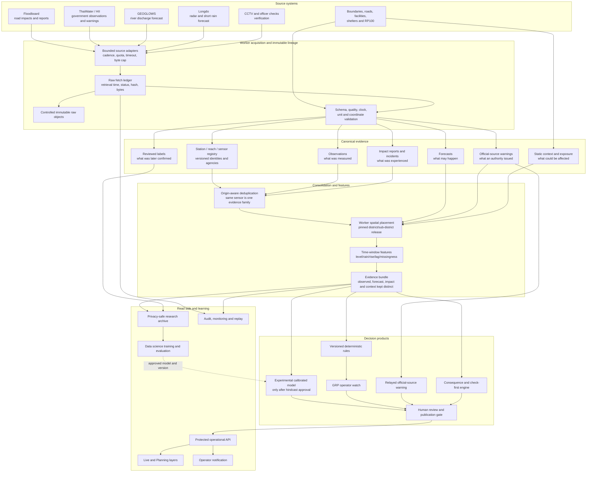

# Thailand multi-source flood early-warning architecture proposal

**Prepared:** 5 October 2026

**Audience:** ADPC product, data science, hydrology, emergency-management and platform teams

**Status:** Proposed for technical and scientific review. This document does not approve public
warnings, evacuation advice, new confidence weights or a scientific model.

**Related records:** ADR-0036 (GEOGLOWS River Watch), ADR-0038 (Floodboard lineage), ADR-0043
(grounded answers), ADR-0049 (Longdo rain context), ADR-0055 (research archive), ADR-0056
(Planner live evidence), ADR-0063 (sub-district scope), ADR-0064 (ThaiWater access gate), and
[`2026-10-05_ThaiWater_HII_Integration_Research_and_Plan.md`](2026-10-05_ThaiWater_HII_Integration_Research_and_Plan.md).

## Executive proposal

Keep the current sources as separate evidence layers and consolidate them in a lineage-preserving
GRP event pipeline:

- **Floodboard:** observed/reported road impacts;
- **ThaiWater/HII:** consolidated government observations and attributed official products;
- **GEOGLOWS:** modelled seven-day river-discharge outlook by reach;
- **Longdo Weather:** radar and short-horizon rainfall context;
- **RP100:** static planning scenario, never current conditions;
- **boundaries, roads and facilities:** exposure and administrative context;
- **officer checks and approved CCTV review:** outcome/verification labels.

GRP should first produce named, deterministic **operator watches**, not statutory warnings:
heavy rain, rapidly rising water, near-bank water, above-bank water, road flooding, forecast river
rise, official-source warning and data unavailable. Each watch shows exactly which observations,
forecast or official product triggered it.

After enough reviewed historical outcomes exist, the data science team may develop calibrated
nowcast models. A model cannot be called an early-warning model until event-based hindcasting,
lead-time testing, calibration and operational review pass. Public emergency warnings and
withdrawals remain with authorized Thai agencies unless a later governance decision delegates
that role to GRP.

## Implementation status

Stage 0 shadow capture began on 5 October 2026 under ADR-0065:

- worker-only, off-by-default ThaiWater water-level and 24-hour-rainfall polling;
- immutable raw fetches in the existing source ledger;
- versioned government station metadata and canonical observations in two new tables;
- originating-agency lineage, separate observation/retrieval times, unit/datum, provider quality,
  future-clock marking and worker-derived pilot district/sub-district placement;
- whole-response fail-closed parsing, response caps and idempotent/correction-preserving states;
- no API, map layer, incident-confidence change, watch or warning yet.

The implementation is fixture-tested but has not called TWA because no ThaiWater key is configured
in the local ignored `.env`. The switch remains false. PostgreSQL migration upgrade and downgrade
were tested independently; the running Desktop database was returned to the previous migration.

## The questions this architecture answers

1. What is being measured now?
2. What is forecast to happen next?
3. Where are impacts already reported?
4. What people, roads and facilities could be affected?
5. Are multiple records genuinely independent, or are they the same government measurement
   delivered through two aggregators?
6. Which deterministic watch rule fired, on which version, and with what freshness/quality?
7. How much lead time did the watch provide before a reviewed impact?
8. When data is missing or stale, can the platform say unknown instead of normal?

## Source responsibilities

### Source-role matrix

| Source | Original producer/aggregator | Spatial unit | Time horizon | GRP role | Must not be used as |
| --- | --- | --- | --- | --- | --- |
| Floodboard roads/reports | Floodboard aggregation of BMA sensors, Traffy, crowd and derived clusters | Road segment/report/incident | Recent observation, roughly hours | Current impact evidence and incident lifecycle | Rainfall, river forecast or independent evidence when the same BMA observation is also received directly |
| ThaiWater rainfall | HII aggregation with original agency preserved | Station | Observed/accumulated | Government rainfall observation and trend | Proof that flooding exists |
| ThaiWater river/canal level | HII aggregation of government telemetry | Station | Near-real-time observation | Level, rate of rise, verified bank-threshold status | Area-wide depth or automatic proof that a district is flooded |
| ThaiWater discharge | HII/source agency | Station/reach | Observation | Hydrological state at the measurement location | Street depth |
| ThaiWater road-flood sensor | Normally original agency such as BMA, through HII | Road station | Observation | Potential direct road-depth evidence after unit/QA review | A second independent source if Floodboard uses the same sensor |
| ThaiWater gates/weirs/pumps | HII/source agency | Structure/station | Observation | Operational drainage context | “Gate closed” or “pump off” when a value is null |
| ThaiWater official/derived warning | Named issuing agency through HII | Published area/station | Provider-defined | Attributed official-source warning or provider judgement | A warning issued by GRP |
| GEOGLOWS | GEOGLOWS/ECMWF model | Modelled river reach | Daily run, seven-day forecast | River-discharge outlook and forecast features | Observation, water level, street flooding, warning or local-canal forecast without a reviewed reach |
| Longdo radar/rain | Longdo Weather and its stated sources | Radar pixel/area | Now and +15/+30 minutes | Short-term weather context | Flood evidence or an independent gauge when based on the same upstream observation |
| RP100 | ADPC/local baseline or explicitly separate external SIG scenario | Raster/scenario | Long-term return-period scenario | Planning exposure and susceptibility | Current or forecast flooding |
| CCTV | BMA/approved camera owner | Camera view | Observation at image time | Human verification label; later, validated computer-vision assistance | Automatic truth without image time, visibility and model validation |
| Officer checks | Authorized GRP operator | Incident/road/facility | Verification time | Highest-value operational label with reviewer lineage | Anonymous or silently edited truth |
| Boundaries, roads, facilities and shelters | Versioned GRP baseline, OSM, DDPM/BMA as applicable | Polygon/line/point | Static version | Spatial placement and consequence analysis | Evidence that flooding is occurring |

### Source families and double-counting

A delivery channel is not necessarily an independent source. GRP needs two identities:

- `delivery_provider`: for example `thaiwater`, `floodboard` or `longdo`;
- `originating_agency_and_sensor`: for example BMA station `C00000002-FL.PNK.01`.

Two records are the same evidence family when they resolve to the same origin sensor/report and
observation time, even if one arrives through Floodboard and one through ThaiWater. They may be
compared for transport consistency, but they cannot count as two corroborations.

When identity is uncertain, mark `independence=unknown`; do not assume independence.

## Proposed warning products

### Product 1 — Source warning relay

Display warnings issued by HII, DDPM, TMD, BMA, RID or another named authority without changing
their meaning:

- issuing agency;
- issue/valid/expiry times;
- source area and geometry;
- severity/category exactly as issued;
- retrieval time and original reference;
- amendment/cancellation lineage.

Label: **Official-source warning, relayed by GRP**. GRP does not become the issuer.

### Product 2 — GRP operator watch

A deterministic, explainable trigger for trained users. Candidate watch types are:

| Watch | Candidate input | Required scientific decision |
| --- | --- | --- |
| Heavy rain observed | ThaiWater gauge accumulation; optionally Longdo radar as separate context | Accumulation window and location/season thresholds |
| Intense rain approaching | Longdo short forecast or an approved ThaiWater forecast | Forecast quality and probability threshold |
| Water rising rapidly | Consecutive valid ThaiWater levels at one station | Minimum samples, rate threshold and sensor precision |
| Near bank | Verified level and station-specific bank threshold on the same datum | Threshold owner, safety margin and correction rules |
| Above bank | Same as near bank | Confirmation duration and exception handling |
| Forecast river rise | GEOGLOWS median/percentile change on a reviewed reach | Relevant reach, material-change rule and model-bias treatment |
| Road flooding measured | ThaiWater road sensor | Units, calibration, valid ranges and persistence |
| Impact reported | Floodboard incident | Existing evidence/confidence rules and freshness |
| Compound watch | Two or more independent source families | Combination table; no unvalidated multiplication of weights |
| Data blind spot | Expected source is late, stale, invalid or absent | Expected cadence and outage thresholds |

Label: **GRP operator watch — not an official public warning**.

Every watch must contain `rule_id`, `rule_version`, trigger facts, source IDs, observation times,
calculation time, area-placement basis, expiry rule and state transitions.

### Product 3 — Calibrated flood nowcast (later research)

A data-science model could estimate outcomes such as:

- probability of a reviewed road-impact report in an area/time window;
- probability of a station exceeding an approved threshold within 1, 3 or 6 hours;
- probability that a critical access route needs inspection;
- expected lead time to a defined outcome.

It must not predict an undefined concept such as “probability the district is flooded.” Target,
unit, horizon and label must be explicit. Output remains experimental until calibrated and
operationally approved.

### Product 4 — Consequence watch (later)

Combine an active observed/forecast watch with versioned exposure:

- facilities near observed impacts;
- access routes intersecting affected roads;
- populations or assets inside a reviewed forecast domain;
- shelters requiring access checks.

Use “potentially affected” and “access to check,” never “unsafe” or “safe” without verification.

## End-to-end architecture



## Canonical data contracts

Do not force all source payloads into one ambiguous table. Use linked contracts.

### Observation

```text
observation_id
variable                 rainfall_1h | water_level_msl | discharge | road_depth | gate_opening | ...
value, unit, datum
observed_at
source_created_at
source_updated_at
retrieved_at
quality_flag, quality_control_level, quality_comment
station_version_id
originating_agency_id
delivery_provider
raw_fetch_id
is_estimated, is_derived
```

### Forecast

```text
forecast_id
model, model_version, run_at
valid_at, horizon
variable, value, unit
p25, median, p75 or provider probability where available
reach_or_station_version_id
originating_provider
raw_fetch_id
quality/status
```

A forecast run time, valid time and retrieval time are different fields.

### Impact evidence

```text
impact_evidence_id
impact_type               road_flood | closure | citizen_report | camera_review | officer_check
observed_at, retrieved_at
road_or_location
originating_report_or_sensor
freshness, quality
provider_judgement
raw_fetch_id
privacy_class
```

### Official-source warning

```text
source_warning_id
issuer, source_identifier, category, severity
issued_at, valid_from, valid_to, cancelled_at
source_geometry_or_area
retrieved_at, raw_fetch_id
original_text_or_safe_reference
```

### GRP watch

```text
watch_id, watch_type
rule_id, rule_version
status                    open | escalated | downgraded | expired | withdrawn
area_codes                worker-derived, with boundary version
opened_at, evaluated_at, expires_at
trigger_evidence_ids
contrary_evidence_ids
missing_expected_sources
explanation_facts
publication_scope          internal | partner | public
review_state, reviewer
```

A watch never overwrites its evidence. A changed rule creates a new evaluation/version.

## Time and spatial consolidation

### Time axes

Retain at least:

1. `observed_at` or forecast `valid_at` — when the physical state applies;
2. `issued_at`/`run_at` — when a warning or forecast was produced;
3. `source_updated_at` — when the provider changed it;
4. `retrieved_at` — when GRP received it;
5. `computed_at` — when GRP produced a feature/watch.

Freshness comes from observation/valid time according to product semantics, not download time.
Future-clock, backwards-clock and repeated-time anomalies are explicit quality states.

### Spatial units

- Measurements remain points or reaches; impacts remain roads/reports/geometries.
- The worker attaches district/sub-district codes against a pinned boundary release.
- Attaching a point to a sub-district does not make it a sub-district average.
- A station outside an area may influence it only through a hydrologist-approved reach/catchment
  relation, not nearest-distance alone.
- GEOGLOWS reaches require reviewed hydrological relevance. Bangkok's internal pumped/gated canals
  are often not represented by the model.
- RP100 remains a separate raster scenario and never becomes a live feature.

## Feature plan for the data science team

Features are generated for a declared entity and cutoff time, with no use of future information.
Candidate entities are station, river reach, road segment, incident and administrative area.

### Hydrometeorological features

- rainfall in the previous 15 min, 1 h, 3 h, 6 h, 24 h and 72 h where supported;
- rainfall intensity and change;
- water level and differences over 10/30/60/180 minutes;
- verified distance to bank threshold;
- discharge and discharge change;
- gate/pump state and change;
- GEOGLOWS median and percentile-band change at 1/3/6/24/72 hours;
- forecast spread and run age;
- radar/gauge disagreement;
- missingness, quality-flag and source-latency features.

### Impact and corroboration features

- number of fresh road impacts/reports in the area and nearby network;
- age of newest independent impact;
- count of independent origin families, not delivery providers;
- contrary evidence and dry officer checks;
- incident growth/recession and affected-road length;
- camera visibility and human-review result;
- nearest measured road depth where scientifically relevant.

### Static/context features

- RP100 depth/susceptibility as a static prior only;
- road class, underpass and critical-route attributes where authoritative;
- drainage/catchment, terrain and land cover after data review;
- facilities, shelters and population exposure;
- season, hour and antecedent conditions.

Static susceptibility can improve a model but cannot turn rain into an observed flood.

## Labels and research dataset

The existing privacy-safe archive is the starting point, not a complete labelled dataset.
Recommended labels include:

| Label | Positive definition | Negative definition | Main caution |
| --- | --- | --- | --- |
| Road impact | Officer-confirmed or calibrated road sensor above approved threshold | Time-matched officer/camera check confirms dry | Missing report is not negative |
| Incident onset | First corroborated impact time under a fixed rule | None | Reports may arrive late |
| Threshold exceedance | Valid station value crosses verified threshold | Valid station remains below threshold through horizon | Datum and sensor corrections |
| Access constraint | Officer/authority confirms route constrained | Officer confirms route passable at that time | Proximity alone is not a label |
| Official warning | Issuer creates warning | Issuer explicitly cancels/expires it | Absence is not “no risk” |

Store label source, reviewer, observation time, entry time, confidence/quality and later correction.
Do not train on report text, officer names, contact fields or protected imagery without an approved
privacy basis.

## Scientific development stages

### Stage 0 — Preserve and profile sources

- Add ThaiWater as a government-observation layer under its approved public-key use.
- Capture source health and station/reach coverage.
- Resolve units, datums, QA flags, station identity and originating agencies.
- Compare overlapping BMA records across ThaiWater and Floodboard to prove deduplication.
- Extend the research archive contracts without adding personal data.

**Output:** coverage, latency, missingness, clock, quality and overlap reports. No new warning.

### Stage 1 — Deterministic operator watches

- Data scientists and hydrologists specify each target and threshold.
- Implement one rule at a time with fixtures and historical replay.
- Start with data-unavailable, official-warning relay, rapid-rise and verified near-bank rules.
- Keep rain-only and GEOGLOWS-only notices as context/watch, not flood-impact declarations.
- Run shadow mode before notifying users.

**Output:** explainable internal watches with versioned triggers.

### Stage 2 — Retrospective validation

- Build event episodes and split training/validation by flood event and time, not random rows.
- Evaluate by province/basin, season, urban/rural setting and lead-time horizon.
- Compare against simple baselines: latest value, persistence and deterministic rules.
- Review false alarms and missed events with domain experts.

**Minimum reported metrics:** event recall, precision, false alarms per area/month, median and lower
quartile lead time, duration bias, Brier score/calibration for probabilities, availability and
performance by subgroup. Accuracy alone is unacceptable for rare events.

### Stage 3 — Experimental probabilistic nowcast

- Register training data hashes, feature code, model, hyperparameters and approval.
- Run alongside deterministic watches without affecting publication.
- Monitor calibration and drift; abstain when inputs are outside trained coverage.
- Explanations cite input evidence and model version, not generated narrative.

**Output:** experimental operator probability, visibly separate from official warnings.

### Stage 4 — Operational promotion

Requires named hydrology, data-science, emergency-management, product, security and data-owner
approvals; an incident response/runbook; retraining and rollback policy; agreed public language;
and a decision on who may acknowledge, escalate, withdraw and publish.

## Publication and safety policy

Suggested publication ladder:

| Level | Audience | Allowed output |
| --- | --- | --- |
| 0 | Data/operations team | Source health, raw/normalized comparison |
| 1 | Authorized operators | Experimental source signals and shadow rules |
| 2 | Hub operators/planners | Approved GRP operator watches and check-first actions |
| 3 | Partners | Approved watch feed with terms and attribution |
| 4 | Public | Only specifically approved products and official-source warnings |

A GRP-generated watch must never silently become an official warning. Avoid “safe,” “all clear,”
“evacuate” and guaranteed passability. Emergency action text comes from the authorized agency or
an approved operational playbook with human release.

AI may summarize a computed watch and cite its facts. It cannot select thresholds, change watch
state, calculate hidden confidence, issue/withdraw a warning or replace the deterministic/model
service.

## How this fits the existing implementation

1. Keep Floodboard ingestion, incident lifecycle and public live-feed output unchanged initially.
2. Add ThaiWater as a new worker-owned `government_observation` source family, not as Floodboard
   rows and not directly inside request handlers.
3. Keep GEOGLOWS as `forecast` and its exploratory reach labels. Do not merge it into observed
   water levels. A later worker capture can make its raw runs durable for research/replay while
   preserving the existing user view.
4. Keep Longdo as `weather_context`. If ThaiWater rainfall is available, show gauge and radar as
   different sublayers and record possible common upstream lineage.
5. Keep RP100 under planning scenarios.
6. Add canonical station/source identities and an origin-aware evidence-link table before any
   cross-source confidence rule.
7. Build a watch evaluator after normalized storage. It reads stored evidence only and writes
   immutable evaluations/state changes.
8. Extend `/api/v1/maps/live-flood` and the Live page with separate layer groups rather than one
   mixed “flood data” switch.
9. The existing outbound live feed remains a GRP incident product. Adding watch records or raw
   ThaiWater observations to a downstream feed requires an explicit schema, licence and sharing
   decision.

## Suggested operator map

```text
Live observations
  ├─ Reported road flooding (Floodboard)
  ├─ Government stations (ThaiWater)
  │    ├─ Rain gauges
  │    ├─ River levels
  │    ├─ Canal levels
  │    ├─ Road-flood sensors
  │    └─ Gates and weirs
  └─ Weather radar (Longdo; context)

Forecasts
  ├─ River outlook (GEOGLOWS; exploratory until reach review)
  └─ Provider rainfall/water forecasts (named model and agency)

Warnings and watches
  ├─ Official-source warnings (relayed)
  └─ GRP operator watches (rule/model and version shown)

Planning scenarios
  └─ RP100 and other approved return periods (not current)
```

## Operational controls

- Global kill switch and per-source/per-watch switches.
- Worker-only source access, bounded requests and documented quotas.
- Secrets/configuration outside Git; no key values in URLs or logs.
- Source-health dashboard: latest fetch, latest valid observation, lag, errors, bytes, station
  count/churn, schema drift, clock anomalies and quota headroom.
- Last-good data keeps its true age; outage becomes unavailable, not normal.
- Immutable raw hashes and normalized lineage support replay and dispute resolution.
- Corrections, removed values, warning cancellations and watch withdrawals are state transitions,
  not destructive edits.
- Replays perform no network calls.
- Cross-Hub and raw-source access remain restricted.
- Retention and downstream redistribution follow each source's approved terms.

## Decisions needed from the data science and domain workshop

### Outcome and users

1. Who is the first user: ADPC analyst, Hub operator, BMA/DDPM officer or public viewer?
2. Which first outcome matters: road impact, threshold exceedance, access constraint or official
   warning relay?
3. What lead times are useful: 30 minutes, 1 hour, 3 hours, 6 hours or days?
4. What action should an operator take for each watch?
5. Who may acknowledge, escalate, withdraw and publish it?

### Hydrology and data

6. Which ThaiWater stations and agency products are authoritative for each pilot area?
7. Are level, bank and ground values on the same datum? How are corrections published?
8. Which GEOGLOWS reaches are hydrologically relevant, and where is GEOGLOWS unsuitable?
9. Which ThaiWater forecasts use GEOGLOWS or another shared upstream model?
10. Which Floodboard records originate from the same BMA sensors available through ThaiWater?
11. What are expected cadence, latency, quality flags and valid ranges per product?
12. Are gates, pumps, tides and drainage needed for Bangkok-specific rules?

### Labels and evaluation

13. What is the positive and negative label, exactly?
14. How will late reports and missing observations be handled?
15. Which past events have enough trusted outcomes for hindcasting?
16. What false-alarm rate is operationally acceptable for each audience?
17. What minimum event recall and lead-time distribution are required?
18. Which subgroups/basins require separate validation?

### Governance

19. What wording distinguishes a GRP watch from an official Thai warning?
20. Which data may be retained, used for training and redistributed?
21. Who signs scientific approval and model/rule changes?
22. What conditions force the system to abstain or switch off?

## Recommended first 90-day plan

### Days 1–15: source inventory and contracts

- Record HII's confirmation that the public key may be used by GRP and configure it without
  committing its value.
- Agree endpoint/cadence/attribution/retention and identify original agencies.
- Produce ThaiWater station and product coverage for Bangkok and Nonthaburi.
- Map overlaps among ThaiWater, Floodboard, Longdo and GEOGLOWS.
- Select one station-level outcome and one road-impact outcome for evaluation.

### Days 16–45: shadow data foundation

- Implement worker capture and canonical normalization for the smallest approved ThaiWater set.
- Add station/reach registry, source-origin links, QA/clock validation and research archive rows.
- Persist GEOGLOWS run lineage for comparison without changing its semantics.
- Run no notifications; publish daily quality/coverage reports internally.

### Days 46–70: replay and deterministic rules

- Define and replay data-unavailable, rapid-rise and one verified station-threshold rule.
- Link Floodboard impacts and officer checks as outcomes without double-counting BMA sensors.
- Measure lead time, false alarms and missingness across historical episodes.
- Review failures with hydrology and operations.

### Days 71–90: controlled operator pilot

- Enable approved watches for named operators only.
- Add separate ThaiWater, GEOGLOWS, Floodboard and Longdo layers with source/freshness labels.
- Require acknowledgement and collect structured usefulness/false-alarm feedback.
- Hold a go/no-go review before any partner/public feed or probabilistic model.

## Acceptance gates

### Data foundation gate

- Station/source identity and overlapping origin are resolved.
- Units, datum, timezone, QA and freshness behavior are tested.
- Raw and normalized lineage replay correctly.
- Missing/stale/invalid input cannot become normal or zero.

### Rule gate

- Target, threshold, version, expiry and action are documented.
- Historical event evaluation and false-alarm review are complete.
- Domain owner approves the rule and wording.
- Shadow operation demonstrates source availability.

### Model gate

- Leakage-free event split and baseline comparison are documented.
- Calibration, lead time, false alarms and subgroup results meet agreed thresholds.
- Training data/model are reproducible and privacy/licence approved.
- Abstention, drift, rollback and retraining are operational.

### Publication gate

- Audience and issuing authority are unambiguous.
- Attribution and redistribution are approved.
- Human escalation/withdrawal and outage procedures are tested.
- No output implies safety from missing evidence.

## Proposed next action

Convene a 90-minute data-science/hydrology workshop using the 22 questions above. The required
output is not a choice of machine-learning algorithm. It is:

1. one precisely defined first prediction/watch target;
2. its users, horizon and operational action;
3. approved source/station/reach mappings;
4. label definitions and historical events;
5. acceptance metrics and accountable reviewers.

Then implement Stage 0 and one Stage 1 watch. Do not begin a general “flood risk score” model
before those decisions are recorded.
