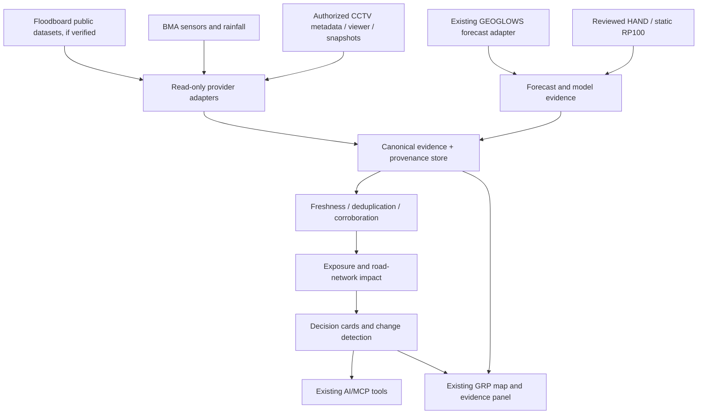

# GRP Bangkok Operational Evidence — Incremental Development Tweak

**Version:** 0.1 | **Date:** 2026-10-03 | **Status:** Development handoff, not implementation evidence

## Purpose and baseline
Extend the **existing** Bang Bua Thong GRP flood application; do not build a second flood app. The baseline documents are `2026-10-02_Bang_Bua_Thong_Flood_Pilot_Product_Manager_Guide_TH.docx` and `2026-10-02_Bang_Bua_Thong_GEOGLOWS_River_Watch_Plan.md` v2.1. The Bangkok pilot adds Floodboard, BMA observations and authorized CCTV as operational evidence, plus exposure, access-impact and grounded AI capabilities.

**Verified in the source plan:** public GEOGLOWS GET/river lookup/forecast statistics were tested for two *exploratory* reaches on 2026-10-02; these reaches are not locally approved. Synthetic HAND arithmetic was tested. The seven-day forecast card, local HAND terrain, suitable Q-to-H relationship, real inundation, calibration and shared MCP registration must not be described as implemented without repository/run evidence. The existing GRP repository has not been inspected as part of this specification.

**Geography:** Bang Bua Thong/Nonthaburi remains the hydrological modelling study area; Bangkok is the operational-data integration study area. Provider coverage is configured per area. Do not assume BMA sensors or cameras cover Bang Bua Thong.

## MVP question
For a selected Bangkok road corridor: **what is happening now, what evidence supports it, which critical assets or access routes may be affected, what changed, and what does the available forecast say?**

First demo: select one corridor, display a permitted live or captured observation with source/time, link an authorized nearby camera viewer, show a reproducible asset-exposure result, and label missing or conflicting evidence. A validated HAND flood-depth map and computer vision are **not prerequisites**.

## Architecture change

Floodboard is a **replaceable aggregator**, not the sole ground truth. If its report originates from BMA, count that report and the direct BMA feed as one underlying observation, not two independent confirmations.

## Canonical evidence contract
Use typed records with at least: `evidence_id`, `kind`, `provider`, `original_source_id`, `source_lineage`, `geometry`, `observed_at`, `forecast_run_at`, `valid_at`, `retrieved_at`, `value`, `unit`, `reference_datum` (when relevant), `status`, `quality_flags`, `source_url`, `license`, `raw_payload_hash`, `review_state`. Fields are conditionally required by evidence kind. UTC internally; Asia/Bangkok in UI. Distinguish **observed**, **forecast**, **static scenario** and **synthetic demonstration**. A missing measurement is never zero, and an unavailable camera never means the road is dry.

## T1 — Floodboard adapter (P0)
- Verify actual current URLs, formats, update cadence, CORS, licensing and permitted automated access before implementation. Previously discussed candidate files: `roads.geojson`, `reports.csv`, `stats.json`, `feed.json`; **do not assume these endpoints remain available**.
- Read-only GET, bounded retries, cache, schema validation, attribution and last-success timestamp. Preserve original confidence as *provider confidence*, not independently calibrated GRP confidence.
- Normalize road geometry and timestamps; deduplicate against original BMA observations using source lineage, original IDs and time/location matching.
- On failure, show stale cached data with its original timestamp or explicitly mark unavailable.

## T2 — BMA official observations (P0)
- Confirm authorized road-water, canal/gauge and rainfall endpoints, units, vertical references, sample times, device status and usage rights.
- Map each sensor to relevant road segments only after geographic/hydrological review; canal stage and road-surface flood depth are not interchangeable.
- Retain raw data and provide independent checks of Floodboard observations when the underlying sources differ.

## T3 — CCTV registry and viewer (P0)
Registry fields: `camera_id`, `provider`, `geometry`, `view_footprint` if known, `related_sensor_ids`, `viewer_url`, `snapshot_url`, `stream_url`, `access_mode`, `last_checked`, `health`, `rights`, `retention_policy`. Access modes: `external_viewer`, `embed`, `snapshot`, `hls`, `mjpeg`, `webrtc`, `unavailable`.
- Display cameras on the existing map and open approved viewers/embeds.
- Nearest camera is a discovery heuristic, **not proof it can see the incident**. Check field of view and timestamps before corroboration.
- Do not bypass authentication, scrape protected feeds, rebroadcast restricted streams or store video without permission.

## T4 — CCTV snapshots and visual corroboration (P1; permission gated)
- Only use public or expressly authorized snapshot/frame endpoints with documented processing and retention rights.
- Prefer bounded, event-triggered frame sampling rather than continuous recording. Log camera health, frame capture time, visibility, image provenance and CV model version.
- Classify `flood_visible`, `not_visible`, `indeterminate`; keep human-review state. A negative image is not proof of no flood. Never claim precise water depth, rising trend or safe vehicle passage from an uncalibrated single image.
- Apply privacy minimization, access controls, retention limits and face/plate masking where appropriate.

## Evidence fusion and validation
- Define source-specific spatial and temporal relevance windows and stale thresholds. Preserve disagreements rather than forcing one conclusion.
- Avoid double counting the same report through Floodboard and BMA. Keep observation quality, model skill and decision certainty distinct; do not invent an uncalibrated universal confidence score.
- For HAND validation, compare *independent, time-matched* flood observations with reviewed model outputs. CCTV can support qualitative flood occurrence; quantitative depth validation needs a calibrated reference.
- Human approval is required before high-consequence operational warnings or externally issued evacuation advice.

## Exposure, access and forecasting
- Reuse existing GIS, asset, RP100 and GEOGLOWS modules after inspecting their actual implementation and data provenance.
- Spatial overlay identifies **potential exposure**; road-network analysis with justified closure/passability rules identifies **possible access disruption**. Do not infer a hospital is inaccessible merely because a nearby road is flooded.
- Report states separately: `potentially_exposed`, `access_under_review`, `access_disrupted_confirmed`, `access_unknown`.
- GEOGLOWS discharge is a river-flow outlook, not a Bangkok street-depth forecast. Keep static RP100 separate from current observations and HAND experiments. A real Q-derived HAND depth product remains blocked pending approved reach, HAND domain, Q-to-H method, compatible vertical datum and hydraulic review.

## AI / MCP (after deterministic endpoints)
Proposed **read-only** tools: `get_current_incidents(aoi, as_of)`, `get_incident_evidence(id)`, `get_nearby_cameras(geometry, radius_m)`, `get_exposed_assets(id)`, `get_access_impact(id)`, `get_river_outlook(reach_id, window)`, `get_situation_changes(aoi, since, as_of)`. Return evidence IDs, timestamps, lineage, quality/review flags and source links. AI summarizes computed results; it must not invent flood depths, thresholds, confidence or evacuation instructions.

## Incremental backlog and acceptance
| Increment | Deliverable | Acceptance evidence |
|---|---|---|
| 0 — Repository audit | Inventory of actual backend, UI, map layers, forecast adapter, MCP tools, tests, permissions and one Bangkok corridor | File-level change plan; implemented vs planned explicitly distinguished |
| 1 — Evidence | Floodboard/BMA read-only adapter + canonical schema | Captured fixtures; parser, timeout, stale-state, timestamp and dedup tests pass |
| 2 — CCTV P0 | Camera registry + approved viewer link/embedded view | Camera appears on map; source, status and viewing coverage clear; no unauthorized stream retrieval |
| 3 — Impact | Asset exposure and network-access prototype | Reproducible spatial outputs; unknown/possible/confirmed states distinct |
| 4 — Forecast | Existing seven-day GEOGLOWS card linked to corridor context | Locally reviewed reach, pinned run, median/P25/P75, proper time labels and no street-depth claims |
| 5 — AI/MCP | Read-only incident/evidence/impact queries | Each answer traceable to deterministic results; missing/conflicting evidence disclosed |
| 6 — CCTV P1 | Authorized snapshots + reviewed CV | Processing permission, representative evaluation, privacy and indeterminate paths documented |
| 7 — HAND validation | Historical/model comparisons | Scientific reviewer approves inputs, reference compatibility, method and limitations |

**First vertical slice:** increments 0–2; implement increment 1 for one provider and one corridor before broadening. Work on the existing GEOGLOWS card can continue independently. Do not promise dates before the code audit and data-rights checks.

## Required test scenarios
1. Floodboard timeout/429/invalid schema; last successful cache is visibly stale.
2. One BMA event mirrored by Floodboard is not counted as two independent sources.
3. Canal level in metres is not silently treated as road flood depth in centimetres.
4. Nearby camera facing away from the road cannot confirm the incident.
5. Viewer-only camera is never passed to snapshot/CV processing.
6. A newly retrieved old forecast remains labelled as an old forecast run.
7. HAND NoData and unsupported cells stay unknown, not dry.
8. Missing road graph produces `access_unknown`, not `accessible`.
9. AI never presents a synthetic HAND scenario or RP100 as a current flood observation.

## Governance and release gates
Proposed roles (not confirmed assignments): Ole—MVP scope and acceptance; developer—repository audit/adapters/tests; Daniel or assigned GIS specialist—spatial and modelling integration; nominated hydrologist—reach, Q-to-H and HAND validation; source steward—licensing/CCTV rights; Pin—product priority and release scope.

- **Gate A: local demo.** Captured or permitted read-only data, clear provenance, no shared-feed registration.
- **Gate B: internal operational pilot.** Provider permission, reliability tests, data-quality review and documented limitations.
- **Gate C: public/partner use.** Security/privacy review, attribution and redistribution rights, human escalation and scientific sign-off for predictive claims.

**Do not** call `contribute_submit`, POST `/api/contribute`, register feeds, publish layers or change production configuration under this handoff. The existing plan notes hosted contributions may auto-approve.

## Open decisions before implementation
Actual repository modules and tests; chosen Bangkok corridor; live provider endpoints and licensing; camera field of view and stream/snapshot permissions; asset/road-network data; freshness thresholds; locally reviewed GEOGLOWS reach; HAND/rating-curve availability; assigned reviewers and acceptance tolerances.

## Developer handoff prompt
> Inspect the existing GRP repository and its instructions first. Report the current implemented state and a file-level impact plan. Preserve existing map, RP100 and GEOGLOWS/HAND behavior. Implement only the smallest read-only provider adapter and evidence normalization for one corridor, with captured fixtures and failure tests. Add the camera registry and authorized viewer as the next increment. No shared-feed registration, contribution submission, production deployment or restricted CCTV ingestion without separate approval. Report what was actually executed, what passed and which scientific or operational claims remain unvalidated.
