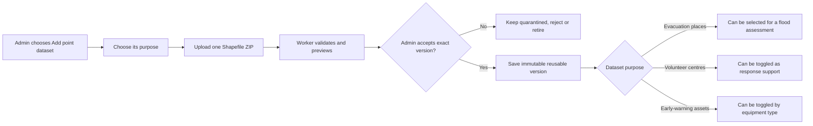

# Preparedness point data design

**Status:** Proposed for MVP 1 extension

**Source inspected:** `.local/data-in/evacuation_centers` on 24 September 2026

## What the delivery contains

The folder name is broader than the data's operational meaning. It contains three independent
point datasets, not three interchangeable kinds of evacuation centre.

| Source | Records | GRP role | MVP 1 use |
|---|---:|---|---|
| `ddpm_shelters` | 10,303 | Evacuation places | Selectable input to flood screening and movement-option display |
| `ddpm_civil_defense_volunteer_center` | 8,199 | Response coordination centres | Optional supporting map layer; not a destination recommendation |
| `ddpm_earlywarning_resources` | 1,533 | Warning and communication equipment | Optional supporting map layer grouped by equipment type |

The early-warning delivery contains six equipment labels. The volunteer delivery contains eight
organisation types. These source classifications must be retained. An `EVAC` equipment record is
still an early-warning resource; GRP must not infer that it is a shelter.

## User workflow

The Data Library should replace the single **Add a shelter dataset** block with **Add a
preparedness point dataset**. The user must select one purpose before uploading:

1. **Evacuation places** — where people could potentially move.
2. **Volunteer coordination centres** — organisations that may support response.
3. **Early-warning resources** — warning or communication equipment.

One ZIP represents one dataset and one purpose. The page may queue several ZIPs, but GRP must not
accept a mixed ZIP or silently merge versions. For this known server-side delivery, an **Import all
three delivered sources** action may queue three independent jobs and show three progress rows.

After validation, the review card shows purpose, source filename, record count, geometry/admin
coverage, duplicate-coordinate count, detected fields and privacy exclusions. Acceptance remains an
explicit Platform Admin decision. An accepted version is reusable without uploading it again.

## Planner experience

The **Data & run** drawer retains exactly one **Evacuation places** selector. Only an accepted
evacuation-place version is pinned into `center-flood-overlay`; existing assessment behaviour and
historical replay remain unchanged.

The Layers panel gains a separate **Preparedness support** group:

- Volunteer coordination centres, filterable by the source `TYPE_DESC`.
- Early-warning resources, filterable by `Equipment`.

Each supporting layer is loaded only for the selected district. Its table and marker popup state
what it is and its source. Supporting points do not change exposed/not-exposed shelter totals,
movement recommendations or the locked assessment fingerprint. The planning summary may say, for
example, “12 volunteer centres and 4 warning resources are mapped in this district,” but must not
claim that they are safe, operational, suitable, or available.

## Storage and domain model

Keep the current `Dataset`/`DatasetVersion` immutable-version pattern and shared storage protocol.
Add two dataset types while preserving the existing assessment type:

- `evacuation_centers`
- `volunteer_centers`
- `early_warning_resources`

All three use a shared normalized point-feature schema:

| Field | Meaning |
|---|---|
| `source_feature_id` | Stable ID from the source, or deterministic version-scoped fallback |
| `name` | Display label; generated fallback is visibly marked |
| `point_role` | One of the three controlled purposes above |
| `subtype_code`, `subtype_label` | Source classification such as volunteer-centre type or equipment type |
| `province`, `district`, `subdistrict`, `village` | Source labels retained for review |
| `area_memberships` | GRP district and sub-district memberships assigned from accepted geometry |
| `geometry` | EPSG:4326 point |
| `properties` | Allow-listed, type-specific operational fields |

Shelter-only attributes such as capacity stay on evacuation-place records. For volunteer centres,
`TEL`, `FAX`, `EMAIL`, and full street address are excluded from planner APIs, downloads, AI prompts,
SIG contributions and logs. MVP 1 should omit them from the normalized record entirely unless a
later access-controlled operational requirement is approved.

## Import profiles and validation

Build one point-import engine with explicit, versioned mapping profiles:

- `ddpm-shelters/v1`
- `ddpm-volunteer-centres/v1`
- `ddpm-early-warning-resources/v1`

The known Shapefile stem may suggest a profile, but the selected purpose and detected profile must
be confirmed on the review card. Validation runs in the worker and checks:

- a complete, path-safe Shapefile bundle and declared text encoding;
- Point geometry in EPSG:4326, Thailand bounds and finite coordinates;
- required identifying/type fields for the chosen profile;
- geometry-to-district/sub-district assignment, source-name mismatches and points outside managed boundaries;
- missing names, duplicate IDs and repeated coordinates;
- type-specific completeness, including shelter capacity or warning-equipment type;
- an immutable source checksum, normalized-feature checksum and mapping-profile version.

Technical validity never activates a version. A wrong purpose/profile combination fails validation
instead of being reinterpreted automatically.

## API and job changes

Keep `POST /api/v1/uploads/evacuation-centers` temporarily for compatibility. Introduce:

- `POST /api/v1/uploads/preparedness-points/{point_role}`
- `POST /api/v1/data-library/imports/preparedness-points/{point_role}`
- `POST /api/v1/data-library/versions/{version_id}/accept`
- `GET /api/v1/maps/preparedness-points?district_id=...&version_id=...`

The upload response identifies the selected purpose, detected profile and job ID. Import jobs use
the existing quarantine, idempotency, leasing, fencing and atomic-promotion controls. Authorization
and cross-Hub 404 rules remain unchanged. Supporting-map routes are protected and district-scoped.

## Delivery slices

1. Add the two new dataset types, normalized point model and mapping-profile registry.
2. Import the two delivered supporting datasets through separate worker jobs and expose review
   cards in Data Library.
3. Generalize browser upload to the three explicit purposes while keeping the shelter route as an
   adapter.
4. Add district-scoped supporting map layers, filters, popups and complete tables.
5. Add deterministic supporting counts to the planning summary without changing the assessment.
6. Add Hub-owned candidates and Hub Admin approval only after the existing developer-only upload
   security gate is approved.

## Acceptance criteria

- All three source files become three separately versioned Data Library entries.
- The source record counts reconcile to 10,303, 8,199 and 1,533 before acceptance.
- Only `evacuation_centers` appears in the assessment input selector.
- Supporting records appear only under their own labelled layers and tables.
- Changing a supporting layer does not alter an assessment ID, fingerprint, totals or locked rows.
- Contact fields never appear in planner responses, AI prompts, downloads, logs or SIG payloads.
- Old shelter-only uploads and locked assessments continue to work unchanged.
- No dataset is merged, activated or shared with SIG automatically.
