# Shared SIG contribution and planner parity plan

**Status:** Planned; no shared SIG write has been made.

## Outcome

Prove that the prepared DDPM evacuation-centre layer can be staged, reviewed, approved and used by the shared SERVIR SIG service, then make GRP present the returned evidence at least as clearly as Claude Desktop. This is a separate Admin publication workflow. A planner question must never publish or update a source.

## Why GRP currently looks weaker

Claude Desktop is an MCP host. It exposes the full tool result to the model, renders MCP App resources automatically and follows the tool's `next` guidance. GRP currently calls only `assemble_pack`, normalizes part of the response and renders its own smaller panel. It does not yet call `contribute_submit` or `contribute_status`, keep the SIG contribution ID beside the GRP dataset version, or render every source, coverage warning, centre record and display hint returned by SIG.

The remedy is not an unrestricted AI answer. GRP should retain and render the structured evidence first; the LLM may then explain those same facts. If the explanation fails validation, the deterministic view must still be complete and understandable.

## End-to-end flow

```mermaid
flowchart LR
    A[Accepted GRP shelter version] --> B[Privacy-reduced GeoJSON export]
    B --> C[Immutable public object URL]
    C --> D[Admin reviews manifest and confirms submit]
    D --> E[contribute_submit vector]
    E --> F[Staged source and contribution ID]
    F --> G[Contributor tests assemble_pack]
    G --> H[SIG reviewer approves]
    H --> I[contribute_status audit says approved and live]
    I --> J[Fresh user runs assemble_pack]
    J --> K[GRP evidence adapter]
    K --> L[Map, named-centre table, plain-language summary, sources and trace]
```

## Preconditions and release record

Before the external write, record one immutable release with:

- GRP shelter version ID, feature count, SHA-256 and GeoJSON bounds;
- a stable direct-download URL returning the GeoJSON bytes without login, cookies or an HTML interstitial;
- confirmed `title`, `description`, source agency, licence, vintage, countries and `name_field`;
- an explicit decision to correct, exclude or knowingly retain the 1,599 extra records at repeated coordinates;
- confirmation that contact names and phone numbers remain excluded.

The current YAML is a template only: its URL is a placeholder and its licence/vintage comments are not approvals. Upload only the privacy-reduced GeoJSON, never the raw Shapefile bundle or secret-bearing files.

## Shared-service test procedure

1. **Host and preflight the object.** Fetch the exact public URL from a separate process. Require HTTP 200, a GeoJSON body, expected byte size and SHA-256, 10,303 or the newly approved feature count, Point geometries, EPSG:4326 coordinates and Thailand bounds. Fail if the URL returns HTML or requires authentication.
2. **Run one external submission.** From the authenticated SERVIR contributor session call `contribute_submit(kind="vector", manifest=<confirmed manifest>)`. Save the complete safe response immediately. A successful reviewed deployment normally returns `status=staged` and a `contribution_id`; `approved` is acceptable only if that shared deployment explicitly reports auto-approval.
3. **Do not retry blindly.** If the call times out after sending, list the contributor's records with `contribute_status` and match the manifest before considering another submit. A second create can make a duplicate record.
4. **Test the staged preview.** As the contributor, run `assemble_pack(pack="risk", place="Mueang Phitsanulok District, Phitsanulok, Thailand", hazard="flood", focus=<shelter question>)`. Require a trace/finding for `evacuation_centres`, its source metadata and a count that can be reconciled with the GRP district subset. This preview is not public approval.
5. **Obtain human review.** A SIG reviewer uses `contribute_review` to approve or reject. If rejected, retain the reason and create a new candidate only after correcting it. Test before approval because the current MCP surface can withdraw a pending contribution but has no contributor rollback for an approved layer.
6. **Prove it is live.** Require `contribute_status(contribution_id)` to say approved and `contribute_status(action="audit")` to say the landed source is live. Then repeat `assemble_pack` from a fresh, non-contributor SERVIR session. This proves public selection rather than contributor-only preview behavior.
7. **Capture a contract fixture.** Store a reviewed, secret-free response fixture for submit status and `assemble_pack`. Never store access tokens, cookies or private URLs. Tests should assert the contribution ID/source/version mapping, centre exposure counts, AOI, citations, gaps and trace shape.

## GRP product integration after the proof

Add an Admin-only, asynchronous contribution job rather than calling SIG from planner chat. Persist a mapping containing the GRP dataset version, export SHA-256, public object URL, SIG contribution ID, status, reviewer decision, live audit state and timestamps. Every retry resumes from that record.

For planning, normalize the complete `assemble_pack` result into one evidence package:

- confirmed district and hazard scenario;
- evacuation-centre rows/counts and the mapped source version;
- hospitals, schools, buildings and roads as supporting context;
- population counts, vulnerability indicators and their coverage, without inventing a vulnerable-person headcount;
- citations, declared gaps, warnings, timings and technical trace;
- available receipt-bound components and their permitted display mode.

Render this package deterministically as **What SIG found**, **Where people could move**, **People and vulnerability**, **What is missing or uncertain**, **Sources** and **Technical trace**. The LLM explains the same package in plain language and cannot add facts. “Retry explanation” reuses the stored evidence and must not repeat a multi-minute SIG gather.

The combined operational map remains in GRP. If `assemble_pack` does not return centre coordinates/rows, GRP may show its exactly mapped local version only when the GRP-version-to-SIG-contribution mapping matches. SIG's current receipt-bound `ui_embed(hazard_map)` cannot be assumed to display `evacuation_centres`; that needs an upstream asset selector or a dedicated receipt-bound component.

## Acceptance checks

- One shared contribution has a recorded ID, reviewer decision and `live=true` audit result.
- A fresh user receives `evacuation_centres` from `assemble_pack` for the same district.
- GRP and SIG centre totals are reconciled or the reason for a difference is shown.
- Each number shows its source, vintage, coverage/denominator and scenario.
- Meaningful centre names are shown only after the source-field meaning is confirmed; otherwise the UI says that source names are unavailable instead of inventing them.
- The planner can understand the result without opening Technical trace; the trace remains available for audit.
- A failed AI brief never hides valid structured evidence.
- Slow work is asynchronous, and reopening an unchanged result uses cached structured evidence.
- No publication occurs from chat, no private Hub upload is sent automatically, and no result claims a centre or route is safe.

## Trade-offs and later review

Publishing to SIG gives one governed source and shared evidence, but it makes the cleaned file public and approval is not instantly reversible. Keeping a separate GRP copy supports private Hub work and richer centre tables, but requires an exact version mapping to avoid presenting two datasets as one. Revisit direct object storage, automatic cache expiry and an evacuation-centre `ui_embed` only after the first reviewed shared contribution exposes the real response shape and measured latency.
