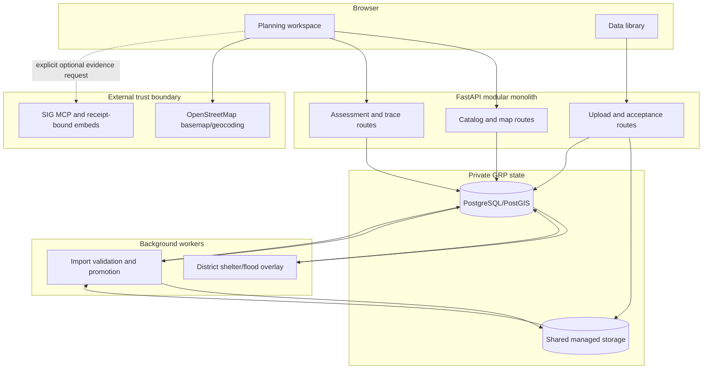

# Shelter upload-to-assessment architecture

**Status:** Implemented developer slice, 23 September 2026
**Decisions:** [ADR-0018](adr/0018-local-shelter-upload-quarantine.md) and
[ADR-0019](adr/0019-reuse-approved-shelter-uploads.md)

## Purpose

This document shows the working district-level shelter flow and separates it from the production
extension. A shelter Shapefile is uploaded once, validated outside the web request, accepted as an
immutable version, reused in assessments, and displayed as named points and rows. SIG evidence is
optional context; it is not the source of the private GRP shelter result.

## Current implemented flow

```mermaid
flowchart LR
    ADMIN[Platform Admin<br/>uploads Shapefile ZIP] --> API[FastAPI<br/>streams to quarantine]
    API --> IJ[(Queued import job)]
    IJ --> IW[Import worker<br/>validates files, CRS and points]
    IW --> FILES[(Managed file storage<br/>immutable source files)]
    IW --> DATA[(PostgreSQL/PostGIS<br/>dataset version and features)]
    DATA --> REVIEW[Technically valid candidate<br/>not usable yet]
    REVIEW --> ACCEPT[Platform Admin<br/>Use in new assessments]
    ACCEPT --> READY[Assessment-ready<br/>current recommended version]

    DISTRICT[Managed district boundary] --> PICK[Planner: Data & run]
    HAZARD[Current RP100 hazard] --> PICK
    READY --> PICK
    METHOD[Approved overlay method] --> PICK
    PICK --> SUBMIT[Assessment API<br/>pins IDs, versions and checksums]
    SUBMIT --> AJ[(Queued assessment<br/>six persisted steps)]
    AJ --> AW[GIS assessment worker]
    AW --> RESULT[(Locked assessment result<br/>feature rows and totals)]
    RESULT --> MAP[GRP map, named-centre table<br/>and deterministic recommendation]
    MAP -. optional, explicit .-> SIG[SIG risk pack and ui_embed<br/>separate evidence context]
```



The API does no GIS work. It streams the upload, validates the request, records jobs and returns
quickly. Import and assessment workers own Shapefile parsing, spatial joins and raster sampling.
The selected dataset version is pinned to the assessment, so a later upload cannot change an old
result.

## Runtime boundaries



Raw uploads and Hub-private geometry never enter an LLM prompt or SIG request. The GRP operational
map stays usable when SIG is unavailable.

## Asynchronous assessment trace

```mermaid
sequenceDiagram
    actor Planner
    participant UI as Planning UI
    participant API as FastAPI
    participant DB as PostgreSQL/PostGIS
    participant Worker as GIS worker

    Planner->>UI: Confirm district, RP100, shelters and method
    UI->>API: POST /api/v1/assessments
    API->>DB: Pin inputs; create job and six steps
    API-->>UI: 202 Accepted + assessment ID
    loop Poll while queued or running
      UI->>API: GET /assessments/{id}/trace
      API-->>UI: persisted step states
    end
    Worker->>DB: Load district shelter records
    Worker->>DB: Sample flood depth and classify each shelter
    Worker->>DB: Save locked rows, totals and completed steps
    UI->>API: GET result and map features
    API-->>UI: exact pinned result
```

The six user-visible steps are request recorded, inputs resolved, worker started, district shelters
loaded, flood overlay completed, and locked result saved.

## Current versus production extension

| Concern | Working developer slice | Production extension |
|---|---|---|
| Ownership | Platform dataset | Hub-owned candidate and `hub_dataset_selection` |
| Approval | Platform Admin accepts | Hub Admin accepts for that Hub; uploader is not automatically approver |
| Storage | Shared local Docker volume | S3-compatible object storage when size or multiple hosts require it |
| Selection | Planner explicitly selects an accepted shelter version | Same selection policy across forms and chat |
| Progress | Poll persisted six-step trace | Optional SSE after the polling contract is stable |
| Map | Protected GRP Leaflet map and complete centre table | Same, plus approved vulnerability/capacity/route layers when available |
| SIG | Optional separate hazard/risk evidence | Explicit Admin-approved contribution mapping; never automatic |

## Safety and result rules

- Reject unsafe ZIP paths, unexpected files, encryption, links and excessive expansion before GIS.
- Keep a technically valid upload inactive until an authorized acceptance action.
- Resolve district membership from geometry, not the inconsistent shelter district-name field.
- Classify flood NoData as **Unable to assess**; never turn missing evidence into “safe.”
- List repeated shelter names as separate records using `feature_id`.
- Recommend only lower mapped flood exposure and state that capacity, access, services, routes and
  other hazards still need human review.
- Preserve old dataset versions and old locked assessment results for replay and audit.

## Implementation map

| Responsibility | Main files |
|---|---|
| Upload quarantine | `api/uploads.py`, `core/browser_uploads.py` |
| Import validation and promotion | `core/shelter_import.py`, `core/data_import_jobs.py`, `worker/main.py` |
| Acceptance and catalog | `api/data_library.py`, `api/catalog.py` |
| Assessment submission and trace | `api/assessments.py`, `core/assessment_jobs.py` |
| Result/map APIs | `api/assessments.py`, `api/maps.py` |
| Browser workflow | `web/data-library.js`, `web/planning.js`, `web/planning.css` |
| Schema | `migrations/versions/20260923_0013_assessment_run_steps.py` and earlier data-library migrations |

Use [the handover](../handovers.md) for current run commands, verification evidence and the next
work item. Architectural changes require an ADR and a matching update to these diagrams.
