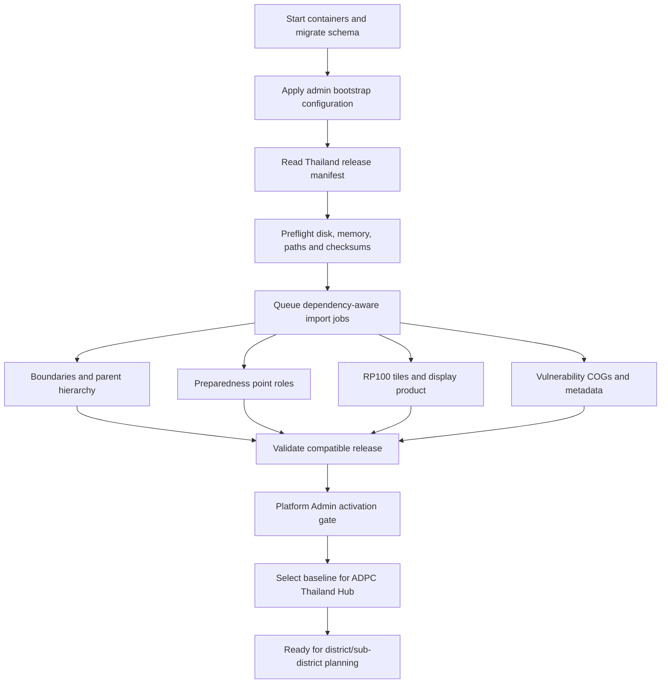

# Thailand Hub bootstrap data plan

**Status:** Proposed

**Scope:** Repeatable deployment of the delivered `.local/data-in` Thailand bundle, followed later
by reusable Hub-owned uploads.

## Desired outcome

A fresh GRP deployment should become a useful Thailand planning demonstration without manually
clicking every import button and without requiring SIG for the primary workflow. Bootstrap will:

1. start and migrate the application;
2. restore a small, approved administrator configuration;
3. validate and import every supported Thailand source into immutable managed versions;
4. activate one compatible Thailand baseline release for the ADPC/Thailand Hub;
5. leave uncertain data visible only at its approved readiness level; and
6. remain safe and idempotent when run again.

Users can later upload Hub-local versions, have them validated and accepted, and choose them in
place of one baseline category. Old assessments retain their exact pinned versions.

## Delivered bundle

The current folder is approximately 2.1 GB and must remain outside Git and the application image.

| Category | Delivered size | Bootstrap disposition |
|---|---:|---|
| Administrative geography | ~752 MB | Country/province/district/sub-district hierarchy; village location catalogue after data repair |
| Preparedness points | ~52 MB | Shelters, volunteer centres and early-warning resources as separate roles |
| RP100 flood hazard | ~108 MB | Six tiles converted and registered as one immutable logical scenario |
| Vulnerable people | ~1.22 GB | Three separate raster versions, COG/overview conversion, display-ready only until their meanings are approved |

The vulnerability files are:

- `childSensitivity_01.tif`: 12.5 m, EPSG:32647, sensitivity values 0–1;
- `elderlySensitivity_01.tif`: the same grid and value range; and
- `disability_total.tif`: 12.5 m, EPSG:32647, values 1–2 with NoData 255, but the scientific
  meaning is not yet confirmed.

Bootstrap may register and display all three separately. It must not add them, convert them into
people counts, calculate a composite vulnerability/risk score, or use them in recommendations
until an approved method version defines the semantics.

## Data package, not database backup

Use a versioned **Thailand baseline bundle** stored outside the database and containers:

```text
/srv/grp/bootstrap-data/thailand-mvp1-<release>/
  release.yaml
  administrative_boundary/
  evacuation_centers/
  floods/
  vulnerable_people/
```

For the first staging demo, copy this directory to the VM using an approved secure transfer. The
later production path may download a versioned archive from controlled S3-compatible storage. Do
not use a Google Drive web page URL, put raw data in Git, or bake 2.1 GB into the API image.

`release.yaml` contains no secrets. It records:

- release ID, jurisdiction `TH`, provider, licence, retrieval/edition dates and data owner;
- every relative source path, byte size and SHA-256;
- expected feature/tile count, CRS and importer-profile version;
- readiness requested for that item: review-only, display-ready or assessment-ready;
- dependencies and compatibility, including the boundary release and hazard method; and
- the expected transformed-artifact version/checksum when conversion is deterministic.

The source directory is mounted read-only. Converted files and immutable promoted versions go to
the existing managed storage volume or configured object store.

## Bootstrap workflow



Introduce an idempotent command such as:

```bash
python -m grpcli.bootstrap install-thailand \
  --manifest /srv/grp/bootstrap-data/thailand-mvp1-2026-09/release.yaml \
  --hub-code adpc --wait
```

It should be callable from `scripts/docker-ubuntu.sh --bootstrap-thailand-data <manifest>` and from
the Docker Desktop launcher. A rerun with the same manifest checksum reuses completed immutable
versions, resumes interrupted jobs and reports the already active release. It never creates a new
version merely because bootstrap was rerun.

The import graph is dependency-aware:

1. Import country, province, district and sub-district polygons; reconcile and activate one
   compatible boundary release.
2. Import shelters, volunteer centres and early-warning resources using that hierarchy for area
   membership.
3. Convert/register the six RP100 files as one scenario with its approved NoData/method contract.
4. Convert each vulnerability raster one at a time in a bounded worker process, add overviews and
   register it independently.
5. Reconcile source counts/checksums and create the Thailand baseline release.

Large raster work must report persisted progress, renew its lease and resume safely. The preflight
checks measured required working space before processing; it does not assume that the raw 2.1 GB is
the final disk requirement. No web request performs conversion or GIS calculations.

## Readiness and activation

Preloaded does not mean scientifically usable. Keep three independent states:

- **Review-only:** stored and inspected, but not shown to planners.
- **Display-ready:** may be shown with source, scope, date and limitations; cannot affect results.
- **Assessment-ready:** an approved method may pin and calculate with the exact version.

The expected initial release is:

| Input | Initial readiness |
|---|---|
| Province/district/sub-district polygons | Assessment-ready after hierarchy and authority checks |
| Village points | Review-only until encoding/provenance/coverage are resolved |
| Shelters | Assessment-ready under the existing approved assumption |
| Volunteer centres / warning resources | Display-ready supporting layers |
| RP100 | Assessment-ready only with the approved NoData/method version |
| Child / elderly / disability rasters | Display-ready, each separate; excluded from calculation |

Activation is atomic at the release level. A failed optional display layer may leave the release
in **partially ready** state, but missing required boundaries, shelters, hazard or method prevents
assessment activation. The Data Library shows the reason for every unavailable item.

## Preserving only administrator configuration

The database does not need to be backed up for this demo reset. Before an intentional reset, export
only an allow-listed configuration to a protected host file such as:

```text
/srv/grp/config/admin-bootstrap.yaml
```

The allow-list contains:

- Platform Admin email addresses;
- Hub code, name and active state;
- Hub membership email, role and active state;
- AI enabled/disabled setting and monthly per-person limit; and
- approved risk-recipe metadata only when its authority/source record is complete.

It excludes sessions, OAuth/SIG tokens, AI usage counters, audit events, assessments, results,
uploads, cached answers and user activity. API/Langfuse/database secrets already remain in
`/srv/grp/secrets` and are never written into this file.

Suggested commands:

```bash
python -m grpcli.bootstrap export-admin-settings \
  --output /srv/grp/config/admin-bootstrap.yaml

# Explicit destructive reset is a separate operation.

python -m grpcli.bootstrap apply-admin-settings \
  --input /srv/grp/config/admin-bootstrap.yaml
```

The Ubuntu launcher should normally use its existing `--admin-email` and `--hub-admin-email`
arguments as declarative configuration and then apply AI limits from the protected file. This makes
recovery independent of the old database.

**Important:** a deliberate database/storage reset will also remove later user-uploaded versions
and assessments unless backups are introduced. That is acceptable for the current demo only. It
must not be the production recovery policy.

## Baseline and later Hub uploads

The delivered Thailand release is a Platform-owned baseline scoped to jurisdiction `TH`. The ADPC
Hub selects it by default. It is never mutated in place.

Later uploads create Hub-owned candidate versions:

```text
Platform Thailand baseline
          ↓ default when no override exists
Hub candidate → worker validation → Hub Admin acceptance → Hub category selection
```

The selection key includes category and, where relevant, area level or scenario, for example:

- boundary release;
- RP100 hazard;
- evacuation places;
- volunteer centres;
- early-warning resources;
- child sensitivity;
- elderly sensitivity; and
- disability source.

Planning's **Data & run** drawer shows the resolved source for every input: **Thailand baseline** or
**Hub upload**, title, provider, version, coverage, readiness and limitations. Users may choose among
accepted compatible versions; uploading never makes a version current automatically. Each
assessment pins the exact resolved IDs/checksums and remains reproducible after selections change.

## Local-first product and optional SIG

After the bundle is installed, GRP can provide locally and deterministically:

- district/sub-district AOI selection and hierarchy;
- RP100 flood-depth display and shelter exposure screening;
- named shelters plus volunteer and warning-resource supporting layers;
- sub-district 2020 population attributes; and
- separately labelled child, elderly and disability raster displays.

The primary assessment must not require MCP. SIG remains useful when the planner requests evidence
not held locally—currently schools, hospitals, roads, documents, current/retrospective feeds or
other published sources—or when an Admin intentionally exchanges approved data with another Hub or
creates a public receipt. SIG results keep their own geographic scope and never modify the locked
local assessment.

The application should ask SIG only after showing what the local release already covers. Cache
validated structured SIG evidence by exact district/query/source version; never cache or publish an
ungated AI answer as evidence.

### External return-period screening

The reviewed SIG source at commit `6479521` registers contributed JRC Southeast Asia flood layers
for RP10, RP20, RP50, RP100, RP200 and RP500. It does **not** register RP25. The accompanying source
metadata says these are 1 km cells, vintage 2016-11, reclassified to common depth-severity bands and
intended for scenario comparison rather than siting.

At runtime, GRP must preflight the live deployment with `platform_capabilities`/the risk-pack
manifest rather than assuming the checked-out configuration is deployed. When an exact layer is
live, the scenario selector may offer it under a separate heading:

```text
Detailed GRP assessment
  RP100 · ADPC Thailand baseline

External SIG screening
  RP10 · JRC regional screening
  RP20 · JRC regional screening
  RP50 · JRC regional screening
  RP100 · JRC regional screening
  RP200 · JRC regional screening
  RP500 · JRC regional screening
```

The read-only evidence call is explicit, for example:

```text
assemble_pack(
  pack="risk",
  place="<confirmed parent district>, Thailand",
  hazard="flood_rp50"
)
```

GRP displays the returned source, vintage, resolution, area, severity counts and gaps as
**district-wide external screening**. It does not turn this into a locked GRP assessment and does
not combine its counts with the finer local ADPC RP100 result.

SIG's current `ui_embed(hazard_map)` is receipt-bound. Showing that iframe therefore requires the
existing two-step **Create public record and show SIG map** confirmation, followed by
`publish_answer` and `ui_embed`. A read-only lookup must not create a public receipt silently.

MCP does not give GRP a local immutable RP20/RP50 raster for its own worker. It also cannot classify
private Hub shelter points against the remote scenario merely because an embedded map is visible.
If the product later needs locked RP20/RP50 shelter assessments, acquire approved source rasters and
import them as local versioned hazard inputs. Use SIG meanwhile for contextual screening only.

## Implementation slices

1. Define and validate the secret-free Thailand release manifest and data-bundle preflight CLI.
2. Implement ADR-0021 hierarchy import/release activation.
3. Implement ADR-0020 preparedness point profiles and supporting layers.
4. Generalize the hazard importer/activation into the release graph.
5. Build one-raster-at-a-time vulnerability COG registration and display-only AOI rendering.
6. Add the idempotent `grpcli.bootstrap install-thailand` orchestrator and persisted progress.
7. Add allow-listed admin settings export/apply and launcher flags.
8. Add Hub dataset selections and compatible upload candidates.
9. Make Planning local-first and move SIG into an optional **Add external evidence** action.
10. Add capability-driven SIG RP10/RP20/RP50/RP100/RP200/RP500 screening options, with receipt
    confirmation separated from read-only evidence gathering.
11. Rehearse a blank-database staging deployment, rerun, interruption/resume and rollback to the
    previous active release.

## Acceptance criteria

- A fresh deployment reaches a healthy, signed-in Thailand Hub from one documented bootstrap
  command plus protected configuration/data paths.
- Source bytes are not in Git, container images, logs or the database.
- Rerunning bootstrap is idempotent and interrupted imports resume without duplicate versions.
- Counts/checksums reconcile to the approved manifest before activation.
- District and sub-district planning works without SIG availability.
- All three preparedness point roles are separate and correctly labelled.
- All three vulnerability rasters can be displayed separately without creating an unapproved risk
  or vulnerable-person result.
- The exact active baseline and every assessment input version are visible and auditable.
- Later accepted Hub versions override only their selected category and old results remain stable.
- A blank-database reset restores admin configuration and the data release without restoring user
  activity, sessions, usage, assessments or audit history.
- Failure of SIG never blocks the local assessment; external evidence and cross-Hub sharing remain
  explicit optional actions.
- RP25 is never offered without a real registered source; SIG scenario choices come only from live
  capability results and remain labelled regional screening.
