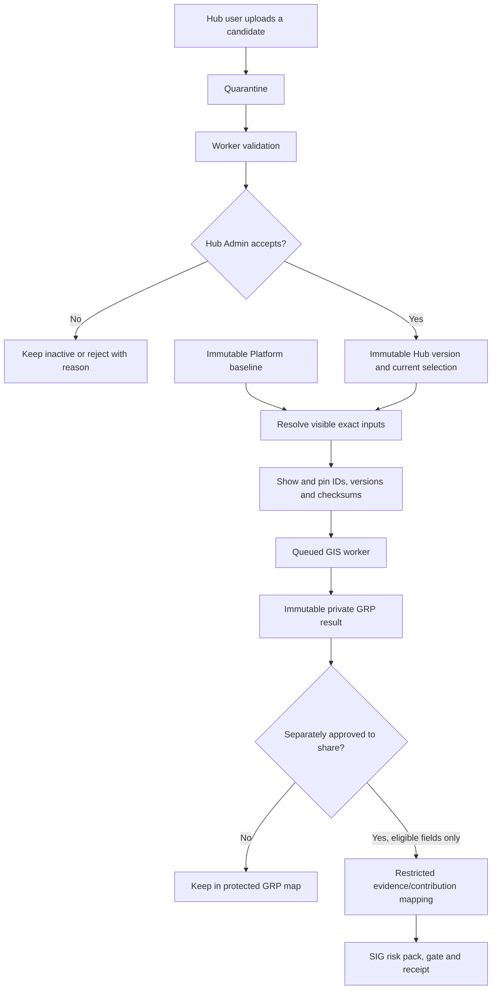
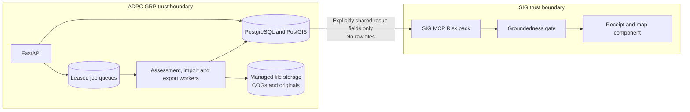

# GRP MVP 1 Project Handover

**Updated:** 23 September 2026 (`main`; shared SIG contribution proof and planner-parity plan added)

**Repository:** <https://github.com/kovitad/ADPC_GRP>

**Delivery status:** The developer-only shelter flow is complete in the working tree: upload a Shapefile ZIP once, validate it in the worker, explicitly accept its immutable Platform version, select it in Planning's **Data & run** drawer, follow six persisted background steps, and open the named-centre map/table/recommendation result. The Data Library and Planning selector now identify **Local upload**, **Platform baseline** and **Synthetic demo** sources in plain language, including which source is used for real districts. SIG context remains optional and separate. **428 tests pass and 2 PostgreSQL-only tests skip**; Ruff, JavaScript syntax and whitespace checks are clean. Migration `20260923_0013` is applied to the local Docker database. Static web assets are live-mounted; the API/worker image needs one rebuild for the latest source-label fields because the Docker Desktop engine CLI stopped responding during the final visual pass, although the existing app still answers `/api/v1/healthz`.

**Handing over:** first execute the reviewed shared-SIG proof in [`docs/shared-sig-contribution-e2e-plan.md`](docs/shared-sig-contribution-e2e-plan.md). The local preview proved file compatibility only; it did not write to the shared service. Before the external write, replace the placeholder direct URL and confirm the licence, vintage, source-name mapping and repeated-coordinate decision. Then record one real contribution ID, test its contributor-only preview, obtain SIG review, prove `live=true`, and repeat `assemble_pack` as a fresh user. Do not retry a timed-out submit blindly and do not send the raw Shapefile or contact fields. In parallel, restart Docker Desktop only if its CLI is still unresponsive, rebuild API/worker, sign in again, then run the local Data library → Planning browser acceptance. Production Hub-local ownership/approval is still deferred. The Ubuntu launcher still needs its first host execution.

**Baseline:** `GRP-ARC-001` v2.2. The secure copy `2026-09-15_GRP-ARC-001_MVP1_Solution_Architecture_Specification_v2.2.docx` is at the repo root and ignored by Git. On top of it sit the ADRs and product-owner decisions in Section 6.

> **Start here if you are a new agent:** read Sections 1, 3, 4 and 10, then `AGENTS.md`. Do not merge `experiment/planning-chat`. Do not store secrets, and do not print the `.env` values.

---

## 1. Where we are

| Area | State |
|---|---|
| Increment 0, servers ready | Done |
| Increment 2, access and admin | **Complete in code**: NDMO Planner, Hub Expert / GIS Specialist, Hub Admin and Platform Admin; security log, CSRF, session revocation, rate limits, AI usage limit, AI gateway, Langfuse |
| Increment 1, golden assessment | **Real baseline enabled under ADR-0015's approval assumption**: six-tile worker, 928 supported districts and 10,303 centres. Mueang Nan and Bang Bua Thong completed locally; the formal authority-signed Chiang Yuen artifact remains a production gate |
| Planner assistant and map (ADR-0004/0016/0019) | **Built, Docker Desktop only**: display-first OSM map, explicit accepted shelter-source selection, asynchronous assessment trace, district-scoped complete centre list synchronized with markers and locked assessment rows, deterministic planning summary, chat and optional SIG evidence |
| SIG live map embed | **Implemented**: receipt-bound `ui_embed(hazard_map)`, restricted SIG host/path and sandboxed iframe. Hazard layers remain hazard-only; an active ADR-0015 recipe additionally permits one exact declared SIG risk layer |
| Source data inspector (ADR-0006) | **Built, Docker Desktop only**: Admin-only page over the read-only `.local/data-in` mount; worker job, cached on a file fingerprint, neutral evidence-led confirmation points for the data team, points cross-checked against boundaries on a map |
| Thailand baseline (ADR-0009/0015) | **Built, imported and locally activated**: 10,303 DDPM evacuation centres plus one six-tile RP100 version, six COGs and a national display PNG. The same pinned versions now support queued real-district screening; NoData is Unable to assess |
| Ubuntu shared-host demo | **Built on current branch**: idempotent `scripts/docker-ubuntu.sh`, loopback port 8000, hidden AI-key prompt, ignored mode-0600 secret files, SIG localhost client registration and PuTTY tunnel runbook; needs first execution on Ubuntu |
| SIG risk/map contract (ADR-0014/0015) | **Built on current branch**: risk remains withheld without an approved recipe; the active versioned recipe enables cited SIG risk values and one explicitly declared risk layer, while missing/multiple/unknown layers still fail closed |
| UI shell | Shared left-aligned top bar, SERVIR Global Collaborative logo, one palette from the logo |
| Increment 3, SIG connection | Not started (needs DEP-01, DEP-08, DEP-09, DEP-13) |
| Increment 4, review and downloads | Not started (the evidence downloads in chat are not the Increment 4 PDFs) |
| Increment 5, seven scenarios and uploads | Developer-only shelter ZIP upload/reuse slice built; seven scenarios and production Hub uploads are not started |
| Increment 6, vulnerability and AI explain | AI explain exists; SIG population-by-age and approved recipe risk can be shown as labelled evidence. A local GRP vulnerability raster/result remains separate |
| Increment 7, pilot hardening | Not started |

**Product-owner browser testing is in progress.** The owner has seen and steered the Planning page (chat, SIG evidence, menu and professional theme) and authorized the stabilization plan. The stacked feature branch was merged to `main` after the 18 September validation pass.

---

## 2. Branches

The original feature branches were stacked through `feat/planning-chatbot-ux`; the complete stack through `codex/sig-embedded-flood-map` is now on `main`.

| # | Branch | Adds |
|---|---|---|
| — | `main` | Complete validated stack through the local baseline data library and display-only Thailand map layers |
| 1 | `feat/increment-2-complete` | Roles, SIG service login, Hub close, security log views, AI limit, manual reset, AI gateway, Langfuse, `/platform.html` |
| 2 | `feat/planner-chat-map` | ADR-0004 chat on SIG evidence, area check, opt-in receipts |
| 3 | `feat/increment-1-assessment` | Assessment tables, storage, method, worker, API, synthetic seed and golden test, `/assessments.html` |
| 4 | `feat/planning-map-workspace` | Map layers API, flood overlay picture, center points, explain API |
| 5 | `feat/planning-chatbot-ux` | Natural chat routing, chat-bot UI, SIG evidence panel and downloads, progress and timings, Thai place names, state kept across pages, shared top bar, SERVIR logo and theme |
| 6 | `codex/sig-embedded-flood-map` | Hardens the live SIG map embed; adds the local versioned data library and display-only real Thailand flood/shelter layers |

**Merge status:** `codex/sig-embedded-flood-map` was fast-forward merged into `main` and pushed at `b6b29ed`. Feature branches are retained temporarily for recovery. `experiment/planning-chat` is superseded; **never merge it**.

---

## 3. Run and test locally (Docker Desktop)

```powershell
# full start or rebuild (slow on this PC; was twice killed for low memory)
.\scripts\docker-desktop.ps1 -AdminEmail kovitad.janlakhon@adpc.net -HubAdminEmail kovitad.janlakhon@adpc.net

# faster: rebuild only API and worker after Python changes
$env:SERVIR_AUTH_CLIENT_ID = (Get-Content .local\servir_auth_client_id -Raw).Trim()
docker compose -f deploy/compose.desktop.yml up -d --build api worker

# stop (data stays in Docker volumes)
.\scripts\docker-desktop.ps1 -Down
```

**Important facts about the local stack:**
- `web/` is mounted from disk: HTML, JS and CSS changes need only a browser refresh. Pages are served with `Cache-Control: no-cache` in dev; asset query strings are bumped when their files change (`planning.js` and `planning.css` are currently `?v=20260923b`; Data Library JS is `?v=20260923c`). **Bump asset versions when changing shared CSS or JS.**
- **Python changes need an image rebuild.** The local `grp-api:desktop` image was successfully rebuilt on 18 September from the committed source, including `api/errors.py` and `api/rate_limits.py`; the API and worker were recreated from that image. No copied-file workaround remains.
- Local rate limit: `deploy/compose.desktop.yml` sets `RATE_LIMITS` with 300 API requests per person per minute, so quick menu switching does not hit 429. Servers keep the Section 13.1 value of 60.
- After any API restart, **sign in again**. The SIG MCP token and its refresh token live only in process memory (ADR-0002, ADR-0017). Within a running API they now renew themselves, so a session no longer stops working after an hour; only a restart ends it.
- The script copies `OPENAI_API_KEY` and `LANGFUSE_SECRET_KEY` from the ignored `.env` into `.local/docker/secrets/` without printing them. `LANGFUSE_BASE_URL` and `LANGFUSE_PUBLIC_KEY` pass through as environment variables. The model comes from `OPENAI_MODEL` (currently `gpt-5.2`).
- Desktop-only switches in `deploy/compose.desktop.yml`: `GRP_ENV=dev`, `AI_FEATURE_ENABLED=true`, `PLANNING_CHAT_ENABLED=true`, `DATA_INSPECTOR_ENABLED=true`, `ALLOW_DRAFT_METHODS=true`, `AI_MAX_OUTPUT_TOKENS=900`.
- **Background jobs in the browser** (`GRP.jobs` in `web/grp-common.js`): every page that starts a worker job (assessments on Planning and Assessments, Source data checks) calls `GRP.jobs.track({id, label, statusPath, href, ownerPath})`. The list is `grp.jobs.v1` in `localStorage`, shared by every tab and cleared on sign-out; every signed-in page polls it every 5 s, shows a top-bar pill while anything runs and a notice (plus a browser notification if allowed and the tab is hidden) when it ends. The owning page shows the result itself, so no notice there, and calls `GRP.jobs.done(id)`. Any new long job must use this, never make the user wait on the page.
- `.local/data-in` is bind-mounted **read-only** into the api and worker at `/srv/grp/data-in` (ADR-0006). Put the delivered files there; the app can never write to them. Adding or removing that mount needs `up -d` to recreate the containers, not a restart.

### Browser checklist

1. `http://127.0.0.1:8000/admin`: sign in with SERVIR (`kovitad.janlakhon@adpc.net` is Platform Admin and Hub Admin of `adpc`)
2. `/platform.html`: set a token limit (for example 50,000), AI **On**, Save; **Send test call**; **Reset now**; create, close and reopen a Hub; security log
3. `/planning.html`:
   - Select a district and open **Data & run**. Confirm the exact RP100, accepted shelter version and method, then start the job. The dark trace panel must advance through six persisted steps. On completion, the result opens the map, complete named-centre list and deterministic candidate/gap summary. **Add SIG context** is optional and must not affect the locked GRP result.
   - The page opens on Thailand with district boundaries and the available RP100 flood layer. It does **not** download all 10,303 centres. Select a managed district to load only its source records; the **Centres** tab must show every record as **Not assessed yet**, keep repeated names separate and focus the same marker when a row is selected. No assessment is required. RP20 and RP50 remain disabled because they are not imported.
   - "Which centers could not be assessed, and why?" explains the stored result
   - `show flood and population information for บางบัวทอง นนทบุรี`: confirm Bang Bua Thong and verify the map stays visible while SIG hazard, risk and population information opens in the right panel.
   - **Use my location**: allow the browser prompt; the map accepts only a real Thailand district returned by OpenStreetMap (not a city-wide or approximate result), focuses the managed local boundary when matched and offers **Check SIG flood exposure**. Location coordinates are not stored.
   - **Publish receipt & show SIG map** (two-step confirm, creates a public record): a declared hazard layer is shown; a declared recognized risk layer is shown only while an approved recipe is pinned
   - switch to Assessments and back: the conversation is kept
4. `/data-inspector.html` (**Source data** in the menu, Admins only): pick **All source data**. Expect a numbered set of evidence-led points asking the data team to confirm the interpretation, plus a map of shelters coloured by whether they sit in the district they name. The page and consultation exports do not label points as blockers, problems or known issues and do not approve or reject the accepted static delivery. A second visit to the same folder returns instantly from the cache. While it runs, switch to another menu: the top bar shows **Running: Source data check …** and a notice appears bottom-right when it is ready. Coming back to Source data picks up the same job (it does not start again). A finished report is shown straight away; pick the folder again to re-check for changed files.
5. `/data-preview.html` (**Preview one district** link on Source data, Admins only): press **Pua**. Expect the district outline, the flood picture hatched purple almost everywhere (99% no value), 29 purple shelters (on a no-value pixel), 1 orange shelter far away that names Pua, and a warnings panel led by the no-value blocker. **Mueang Nan** asks you to pick between districts only if the name is shared; **Bang Bua Thong** shows one shelter on a flooded pixel. A made-up name says it is not in the boundary file.
6. `/assessments.html`, `/workspace.html`: same top bar, same order
7. Langfuse Cloud: traces `planning-router-v1`, `planning-draft-v1`, `result-explain-v1`, `platform-test-v1`
8. After a SIG receipt: `hazard_flood` or `flood_rp10`–`flood_rp500` opens as hazard. With an active pinned recipe, exactly one recognized risk layer such as `risk_flood_l2` opens as SIG risk. Missing, multiple or unknown layer identifiers keep the receipt visible but withhold the iframe.

### Shared Ubuntu host (another application already uses port 80)

Use the demo launcher, not `deploy/bootstrap-ubuntu.sh`, when this is a test build sharing a host. It reuses `deploy/compose.desktop.yml`, binds only to `127.0.0.1:8000`, and does not install or modify Caddy:

```bash
chmod +x scripts/docker-ubuntu.sh
./scripts/docker-ubuntu.sh --register-sig-client --configure-ai --configure-langfuse \
  --admin-email <you> --hub-admin-email <you>
```

Reach it with a PuTTY local SSH tunnel from local port `8000` to VM destination `127.0.0.1:8000`; keep AWS port 8000 closed. The configure prompts collect the OpenAI model plus Langfuse URL, keys and environment. Raw keys go only into `.local/docker/secrets/` (mode `0600`), never `.env`; non-secret settings go into `.local/ubuntu-compose.env`. Use `--status` to check it and `--down` to stop only this Compose project while retaining volumes. Full instructions: [`deploy/UBUNTU_SHARED_HOST.md`](deploy/UBUNTU_SHARED_HOST.md).

---

## 4. Architecture map (what lives where)

### 4.0 Current shelter upload-to-assessment flow

The diagram below is the developer slice that works now. A Platform Admin uploads one shelter ZIP,
the API streams it to quarantine, the import worker validates and promotes it, and an explicit
acceptance makes that immutable version selectable. Planning pins the exact version into a queued
assessment and renders the locked worker result. The API never performs GIS work. SIG is optional
context and never receives the raw upload. See
[`docs/shelter-upload-assessment-architecture.md`](docs/shelter-upload-assessment-architecture.md)
for runtime boundaries, the six-step sequence, invariants and implementation file map.

```mermaid
flowchart LR
    ADMIN[Platform Admin uploads ZIP] --> API[API streams to quarantine]
    API --> IMPORT[Queued import worker]
    IMPORT --> DATA[Immutable shelter version and features]
    DATA --> ACCEPT[Platform Admin accepts exact version]
    ACCEPT --> PICK[Planner selects district, RP100, shelters and method]
    PICK --> JOB[Queued GIS assessment with six persisted steps]
    JOB --> RESULT[Locked feature rows and totals]
    RESULT --> MAP[GRP map, complete named-centre table and recommendation]
    MAP -. explicit optional context .-> SIG[SIG evidence and receipt-bound embed]
```



### 4.0.1 Target production extension (not implemented)

Production generalizes the candidate from Platform-owned to Hub-owned, requires Hub Admin
acceptance and records one current selection per category. It also adds object storage only when
measured upload size or multiple hosts require it. The same pinning and locked-result rules remain.





Scale path: keep the modular monolith for the pilot; add lease renewal and separate job classes first,
then shared state and S3-compatible storage before multiple API/worker hosts, and a tile service only
when national raster browsing is measured as necessary.

Design notes to read before large changes:

- [`docs/architecture-scaling-design.md`](docs/architecture-scaling-design.md) — why GRP is a modular monolith with background jobs, what keeps it ready to split into services later, and the measured triggers for doing so.
- [`docs/shelter-upload-assessment-architecture.md`](docs/shelter-upload-assessment-architecture.md) — the implemented upload, acceptance, selection, background GIS, trace and result flow, plus a clearly separated production extension.
- [`docs/thailand-dataset-inventory.md`](docs/thailand-dataset-inventory.md) — what the delivered Thailand files actually contain (928 districts, 10,303 shelters, six 90 m flood tiles in metres, two 12.5 m vulnerability rasters in UTM) and the six decisions they force. ADR-0015 now resolves MVP 1 flood NoData as Unable to assess under an explicit approval assumption.
- [`docs/thailand-dataset-ingestion-plan.md`](docs/thailand-dataset-ingestion-plan.md) — how the real Thailand boundaries, evacuation centers, RP100 flood raster and vulnerability raster are brought in, and the two options for drawing flood depth on the map.
- [`docs/data-library-sig-assessment-design.md`](docs/data-library-sig-assessment-design.md) — proposed SIG screening, GRP detailed assessment, versioned platform baseline, Hub-level category overrides, import/upload lifecycle, technical stack and scaling triggers.
- [`docs/data-library-solution-review.md`](docs/data-library-solution-review.md) — senior review, mandatory safeguards and scale gates. Its P0 policy/model choices are closed in ADR-0008 for local baseline work; browser upload and server rollout remain gated.
- [`docs/baseline-data-library-implementation-plan.md`](docs/baseline-data-library-implementation-plan.md) — exact local execution order: schema, lease/idempotency controls, managed staging, boundaries, shelters, six-tile RP100 manifest, Data library UI and the plan after baseline completion.
- [`docs/GRP_Local_Data_Library_Implementation_and_Backlog.docx`](docs/GRP_Local_Data_Library_Implementation_and_Backlog.docx) — stakeholder/developer Word handover covering baseline data, the ADR-0013 decision package, bounded AI-agent flow, evidence contract, proposed records/APIs/modules, technology, reliability and current Ubuntu VM deployment, with seven embedded diagrams. Regenerate it with `python tools/build_data_library_design_doc.py` after installing the documentation-only `python-docx` package and Graphviz.
- [`docs/demo-mock-feature-implementation-plan.md`](docs/demo-mock-feature-implementation-plan.md) — feature-by-feature review of the seven mock-up/architecture images in the local ignored file `example/The_Demo_Mock_Version.docx`, mapped to current capability, data/scientific gaps and ordered increments M0–M8. Start with M1 plus the synthetic part of M3; do not implement the illustrative comparison, population or risk values.
- [`docs/evacuation-decision-agent-data-architecture.md`](docs/evacuation-decision-agent-data-architecture.md) — developer blueprint for ADR-0013, with system context, bounded-agent control flow, tool allow-list, evidence-envelope contract, logical data model, lineage, runtime sequence, proposed APIs/tables/modules, reliability requirements and phased delivery. Its editable five-page source is [`docs/GRP_Evacuation_Decision_Agent_and_Data_Architecture.drawio`](docs/GRP_Evacuation_Decision_Agent_and_Data_Architecture.drawio), regenerated by `python tools/build_agent_architecture_drawio.py`.
- [`docs/adr/0006-admin-data-inspector.md`](docs/adr/0006-admin-data-inspector.md) — the Admin **Source data** page: a read-only look at `.local/data-in`, run as a worker job, cached on a file fingerprint, and presented as neutral evidence and questions for data-team confirmation. Dev only; nothing it reports is a GRP result or approval decision.
- [`docs/adr/0007-delivered-data-acceptance.md`](docs/adr/0007-delivered-data-acceptance.md) — the Data Science delivery is accepted source data; ingestion registers its provenance and checksums. ADR-0015 supplies the later MVP 1 method/activation assumption.
- [`docs/dataset-proof-results.md`](docs/dataset-proof-results.md) — what `tools/prove_dataset.py` found when run on real districts: the datasets line up, but in Pua every shelter sits on a no-value pixel, shelter district names cannot be joined, and at least one shelter is in the wrong province. Read this before writing any loader.
- **District preview (backlog Epic P)** — `core/district_preview.py` (worker only) builds one district's outline, shelters and RP100 flood picture from `.local/data-in`, with warnings. It reuses the `dataset_inspection` job table: the `district` column (migration 0007) is part of the cache key, so a folder report and a preview are never confused. The preview remains descriptive: flood pixel / no-value pixel / outside tiles. The queued assessment applies ADR-0015's rule that no-value is Unable to assess. Admin-only, behind `DATA_INSPECTOR_ENABLED`, with no export and no SIG path.
- [`docs/development-plan.md`](docs/development-plan.md) — how we work: definition of done, test layers, CI gates to add, observability, security and documentation habits, eight phases with finish lines, and the technical-debt register.
- [`docs/backlog.md`](docs/backlog.md) — the ordered work items for the dev team (epics A to H, sized, with what blocks each), and a suggested first sprint that is blocked on nobody.
- [`docs/flood-hazard-exposure-embed-design.md`](docs/flood-hazard-exposure-embed-design.md) — the SIG receipt-bound hazard map embed.


### 4.1 Backend (FastAPI, Python 3.12)

| Area | Files | Notes |
|---|---|---|
| App, errors, settings | `api/main.py`, `api/errors.py`, `api/settings.py` | Appendix D errors; dev-only no-cache middleware for web files |
| Sessions and access | `api/sessions.py`, `api/auth.py`, `api/oidc.py`, `core/identity.py`, `api/permissions.py`, `api/planning_access.py` | CSRF header `X-CSRF-Token`; POST sign-out; revocation via `app_user.sessions_valid_after` |
| Admin and platform | `api/admin.py`, `api/platform.py`, `api/audit.py`, `grpcli/admin.py` | CLI: `bootstrap-platform-admin`, `ensure-hub`, `assign-member`, `list-access-requests`, `rotate-sig-token` |
| AI | `core/ai_models.py`, `core/ai_allowance.py`, `api/ai_gateway.py`, `api/langfuse.py`, `api/ai.py` | The gateway is the only provider caller; reserve, call, settle; Langfuse is best effort |
| Data library and shelter upload | `api/uploads.py`, `api/data_library.py`, `core/browser_uploads.py`, `core/data_import_jobs.py`, `core/shelter_import.py` | Developer-only Platform upload; API streams to quarantine and the worker validates/promotes before explicit acceptance |
| Assessment | `core/assessment_models.py`, `core/assessment_jobs.py`, `core/gis.py`, `core/result_rules.py`, `core/storage.py`, `core/validation.py`, `api/assessments.py`, `api/catalog.py`, `worker/main.py`, `grpcli/seed.py` | The API never imports GIS; the worker claims with `SKIP LOCKED` |
| Map | `api/maps.py`, `core/hazard_overlay.py` | Display-only flood PNG drawn at seed time |
| Planner assistant | `api/planning.py`, `api/sig_evidence.py`, `api/mcp_client.py`, `api/token_store.py`, `api/sig_connection.py` | See 4.3; `sig_connection` renews the SIG access token before a lookup (ADR-0017) |
| Shelter labels | `core/shelter_labels.py`, `core/shelter_import.py`, `tools/show_shelter_record.py` | ADR-0020: `สถ_1` is the name, `รอง` the capacity; labels composed and ambiguity counted |
| Background SIG lookups | `api/sig_jobs.py`, `api/planning.py` | ADR-0021: a gather runs as a task in the API process and the browser polls it, because SIG exceeds the 45 s client timeout |
| SIG service login | `api/integrations/sig.py` | Evidence endpoint returns 404 until Increment 3 |
| Migrations | `migrations/versions/20260916_0001`…`20260923_0013` | Forward-only; `0008` adds the data-library foundation; `0010` adds shelter district membership and indexed PostGIS points; `0013` adds persistent assessment run steps |

### 4.2 Frontend (static, no build step)

| File | Role |
|---|---|
| `web/grp-common.js` | `window.GRP`: `request()` (CSRF, Idempotency-Key, typed errors), `me()` (cached identity), **shared top bar** (`<header data-grp-topbar>`; fixed order Planning · Assessments · My access · Administration · Platform), sign-out that clears `sessionStorage` keys starting with `grp.`, formatting helpers, §10.6 allowance text |
| `web/styles.css` | Global styles. The **SERVIR palette tokens** (`--servir-grey/blue/blue-dark/navy/green/green-soft`) are in `:root`; the older `--forest-*` and `--lime-*` names map to them. Top bar styles are under `/* Shared top bar */` |
| `web/planning.html/.css/.js` | Chat bot plus map (details in 4.3). `planning.css` tokens `--pw-*` follow SERVIR blue |
| `web/assessments.*` | Form-based assessment run and full result table |
| `web/platform.*`, `web/workspace.*` | Platform Admin page; My access, members and Hub security log |
| `web/index.html`, `register.html`, `admin-login.html` | Sign-in pages (photo plus card; SERVIR logo) |
| `web/assets/servir-global-collaborative.png` | Official logo (full colour, transparent) |

Rules: no `innerHTML` with server or user text (tests check this). Build DOM with `textContent`.

### 4.3 Planner assistant flow (`POST /api/v1/planning/chat`)

1. Checks: `PLANNING_CHAT_ENABLED` and `GRP_ENV=dev`; Planner or Hub Admin of the Hub; 20 AI requests per hour.
2. **Router** AI call (`planning-router-v1`):
   - Context sent: selected area, whether a result is shown, supported area names.
   - The model returns `{mode, reply, place (English romanized), return_period_years}`.
   - Its place is a proposal only. An explicit `place`, a matching user-selected boundary or a supported boundary named in the message is required for a GIS/SIG action. The automatically highlighted area is not sent as a selection. GRP matches full names (including province when present) and refuses ambiguous boundary matches. Otherwise the API returns `needs_area_confirmation` with no GIS/SIG call; the chat shows a confirmation button. The choice survives page navigation in this tab.
3. By mode:
   - `explain_result`: `explain_stored_result()` (`result-explain-v1`) using only stored result fields.
   - `run_assessment`: matches supported areas or the map selection, then `create_assessment()` and returns `assessment_started`.
     - **If the place is not a GRP area, it falls through to `sig_flood` with a `note`.**
   - `sig_flood`:
     - MCP `assemble_pack(risk, place, flood)`.
     - `check_area()` requires `aoi[...] via admin boundary` with a matching name; otherwise `area_rejected`.
     - Draft (`planning-draft-v1`).
     - If `publish_receipt`: `publish_answer`, then `ui_embed(hazard_map)`; a blocked draft is withheld.
     - Response includes `evidence` (see `evidence_bundle()`): citations, gaps, stats, SIG trace, GRP trace with `duration_ms`, `total_ms`, summary counts, receipt.
   - `chat` returns a reply; `cannot` returns server text (vulnerable people, investment brief and the red/yellow/green map are "coming next").
4. Frontend (`planning.js`):
   - progress card with timer (steps advance on typical timings);
   - status card (note, counts, timings, draft/receipt badge), with the brief rendered as headings and `[n]` citation buttons;
   - evidence panel with tabs and downloads (.md, .json, .txt);
   - SIG area outline from Nominatim (orientation only); SIG live hazard-and-exposure component after publish. The API accepts only HTTPS URLs on the configured SIG host at `/embed/hazard_map/{id}`; the iframe is sandboxed and carries no token.
   - **Use my location** requests browser permission only after the user clicks it. Its coordinates go to Nominatim solely to identify a Thailand district, are held only in memory, and must be followed by an explicit SIG lookup click. Browser session storage uses `grp.planning.v2`, deliberately leaving prior synthetic-demo transcripts in the old v1 key.
   - Natural-language requests for **current location** use the already confirmed browser district. A Thai place mention is geocoded with Nominatim and requires an on-screen confirmation before it becomes the SIG location. The canonical result-explanation prompt is routed to the stored-result flow even if the router model returns `cannot`.
   - State (transcript, selection, result, pending job, open evidence) is saved in `sessionStorage["grp.planning.v2"]`, scoped to the user email and capped at 40 entries.

### 4.4 Tests

- `tests/fast`: sessions, OIDC rejections, identity, AI limit and gateway, Langfuse, SIG service, platform admin, planning chat with fake SIG and model, UI static checks.
- The AI allowance reserves the whole estimated request before a provider call. If it does not fit, `AI_LIMIT_REACHED` is returned; an already-running call can still exceed its estimate and its actual tokens are counted (AI-09).
- `tests/contract/test_permission_matrix.py`: every route × role.
- `tests/golden`:
  - `test_synthetic_rp100.py` compares against the hand-designed `synthetic_rp100/expected_*`;
  - `test_planning_map.py` covers layers, PNG, explain privacy and chat intents.
- Run: `python -m pytest` (needs `.[dev,gis]`) and `python -m ruff check .`.

---

## 5. What changed in the last session block (17 Sep)

| Commit | Change |
|---|---|
| `e0b219e` | SIG answers: status card in chat; evidence panel (Evidence / What is missing / How it was produced); downloads; SIG area outline |
| `1d28bed` | "Where could people move" in a non-GRP area falls back to SIG evidence with a note; the brief says plainly when there are no evacuation centers |
| `ac1ec4e` | Progress card with timer; per-step durations from the API; formatted brief with citation buttons; dev no-cache for web files |
| `e174dfd` | Planning conversation kept when switching menu pages (`sessionStorage`) |
| `6832dbb` | One shared, left-aligned top bar for all signed-in pages |
| `54c29d5` | SERVIR Global Collaborative logo; one palette across the app and sign-in pages |
| `19b3e2c` | Top bar tests updated; handover; `AGENTS.md` pointer |
| Codex, committed here | **Area confirmation:** an AI-proposed place never starts SIG work without an explicit choice (full-name match, `needs_area_confirmation`); **Use my location** uses browser permission and a Nominatim district, matches the local boundary when possible, and is not stored; available map layers display first (ADR-0016); explicit Hub roles **NDMO Planner** and **Hub Expert / GIS Specialist** (ADR-0005); the AI reservation must fit the remaining allowance; session key `grp.planning.v2` |
| Claude Code, committed here | **Thai place confirmation now answers:** **Use [district] and answer** confirms the district *and* re-sends the original question, so the evidence panel and map appear (before, it only picked the place and nothing ran) |
| Claude Code, committed here | **Rate limit on menu switching:** 429 replies carry `Retry-After`; `GRP.request` waits and retries a GET once (max 10 s); assessment polling every 5 s instead of 2–3 s; My access reuses `GRP.me()`; local Docker limit 300/min |
| `06cda24` | SIG hazard-map embed hardened: receipt-bound only, SIG host and path restricted, sandboxed iframe, hazard-and-exposure wording, design note `docs/flood-hazard-exposure-embed-design.md` |
| Claude Code, committed here | **District field rule:** OpenStreetMap stores the Thai district in `county` outside Bangkok and `suburb` inside it, while `city_district` is often the sub-district (tambon). The lookup now takes the first field that reads as a district and rejects sub-districts, so Bangkok positions resolve and Chiang Mai no longer picks a tambon. Verified against live reverse-geocode samples for Bangkok, Nonthaburi and Chiang Mai |
| Claude Code, committed here | **Location fixes:** the district lookup now tries the administrative zoom levels OpenStreetMap actually uses for Thai addresses (10, 12, 14, 8) and accepts `state_district`/`district` as well, so **Use my location** stops failing with "no administrative district"; a confirmed district is announced in chat with a **Check SIG flood exposure** action; **clicking anywhere on the map** picks that point's district for SIG evidence (a click on a supported area still selects the GRP boundary); asking about "my current location" without a known district now offers the map instead of repeating the same refusal |
| Codex + Claude Code review, committed here | **Publish the reviewed draft:** publishing no longer re-runs the model. The draft the person read is signed into a short-lived, session-bound token (`api/planning_publish.py`, 15 minutes, bound to user, session and Hub) and `publish_answer` checks that exact text. A local preflight (`_draft_issues`) catches missing headings, empty sections, a self-written Sources section, phantom or missing citations, and withholds an incomplete brief instead of publishing it. Gate refusals list SIG's reasons and offer a retry. A two-step confirmation panel explains what a public receipt does and does not prove. Oversized packs drop the token with a clear reason (`PUBLISH_TOKEN_MAX_CHARS`) |

Earlier on 16–17 Sep: Increment 2 completion, ADR-0004 chat, Increment 1, map workspace, natural routing, chat-bot redesign and Thai romanization (see `git log`).

### 18 Sep — training-deck review and SIG embed hardening

- Reviewed the local `docs/Vulnerability Platform Training Presentation.pptx` as product/training
  context. It is not treated as an approved GRP method and remains uncommitted pending a decision on
  whether training material belongs in the source repository.
- Added `docs/flood-hazard-exposure-embed-design.md`: terms, governed MCP sequence, four status
  outcomes, trust cues, security controls, tests and staging gates.
- Kept SIG as the renderer: after `publish_answer` returns `status="ok"` and a receipt, GRP calls
  `ui_embed(component="hazard_map")`; GRP does not redraw or copy the hazard cells.
- Tightened embed parsing to the configured SIG HTTPS host and `/embed/hazard_map/{id}` path.
- Changed UI language from ambiguous “flood risk map” to **flood hazard and asset exposure**, with a
  visible warning that vulnerability weighting and safety certification are not present.
- Added an unavailable-map state so a valid cited answer and receipt remain usable when SIG returns no
  valid embed; no illustrative fallback is substituted.
- Full validation at that point: 210 tests, Ruff and `node --check web/planning.js`; Docker Desktop API and worker
  rebuilt and restarted successfully. Sign in again because the in-memory SIG token was cleared.

### 19 Sep — background-job continuity and district preview

- Background assessment and inspection jobs are tracked in `localStorage`, survive navigation and
  other tabs, and report completion from the shared top bar.
- Added the Admin-only `/data-preview.html`: one delivered district's outline, shelters and RP100
  flood picture, with no-value hatching, warnings and preview counts. It is not an assessment,
  cannot start one and has no SIG route.
- Added migration `20260919_0007` so folder inspections and district previews have distinct cache
  keys, and made the worker persist safe failure reports for malformed layers.
- Preview-page polling now yields to the global background-job tracker after roughly three minutes,
  rather than polling forever in the foreground.
- The product owner confirmed that the Data Science delivery is accepted source data (ADR-0007).
  The UI no longer calls the files unapproved or treats acceptance as a blocker. Registration of
  provenance/checksums is ingestion setup; at that date DEP-05 no-value meaning still blocked
  classification. ADR-0015 later resolved MVP 1 NoData as Unable to assess under the approval assumption.
  A direct worker preview of Pua confirms the remaining findings are the no-value blocker, one
  misplaced-shelter problem and the two unconfirmed shelter columns as a known issue.
- Designed the next data-library increment before coding it: SIG screening, GRP assessment,
  immutable platform baselines, and category-by-category Hub overrides accepted by a Hub Admin
  rather than hidden per-user defaults. ADR-0008 now accepts the bounded local baseline scope;
  its implementation safeguards are mandatory. Browser upload, flood activation and server rollout
  remain gated. The reviewed diagrams are retained in Section 4.0 of this handover.
- CI now migrates an empty PostGIS database and runs the golden suite, and Gitleaks scans full Git
  history on pull requests and pushes to `main` (backlog D1 and D4). The CI sequence was reproduced
  locally against a fresh PostGIS 16 container (all seven migrations and 22 golden tests), and a
  full-history Gitleaks scan found no leaks.
- Automated browser acceptance reached the local OAuth sign-in, but the prior API session had expired.
  A person must complete SERVIR sign-in before the protected preview and live publish checks can run.
  No receipt was created. The public staging health URL reset the connection; staging remains undeployed.
- Began the accepted local baseline implementation. Migration `0008` adds explicit readiness states,
  data import jobs, immutable file manifests, boundary collection-version links and unique Hub data
  selections. Import jobs now use attempt numbers as fencing tokens: an expired stale worker cannot
  renew or finalize after another worker reclaims the job. Requests are idempotent and successful
  finalization can happen only once.
- Managed staging and atomic publication are built. Worker copies are verified after writing, manifests
  and final keys are immutable and deterministic, stale attempts cannot publish, and any materializer
  failure rolls the complete database version back. Handled failures clean their unreferenced bytes.
- Migration `0009` adds boundary datasets plus full and simplified GiST-indexed PostGIS geometry. The
  loader requires the complete shapefile set, validates EPSG:4326, required fields, unique codes and
  polygon validity, and leaves every imported district unsupported pending scientific approval.
- Full validation: 293 repository tests pass and Ruff is clean; two PostgreSQL-only tests prove spatial
  schema creation and that two workers cannot publish one import twice. A fresh PostGIS 16 database
  migrated through all nine revisions. A real isolated Docker import produced 928 boundary records,
  928 valid PostGIS geometries, six immutable file records and one manifest. The persistent Docker
  Desktop database is now at `0009`; API and worker were rebuilt, recreated and health-checked. The
  protected Data library API/UI is now built for the boundary category, including Platform Admin
  import, audit, status polling and shared completion notices. The accepted baseline was imported into
  the persistent local library: edition `2025-10`, 928 districts, six files and 928 valid PostGIS
  geometries. Open `/data-library.html` after signing in to see it. Recreation cleared the SIG token.

### 20 Sep — real baseline flood and evacuation-centre map layers

- Added migration `0010`, the DDPM shelter worker loader and geometry-based district membership. The real local import materialized 10,303 points, all with PostGIS geometry and a boundary ID; 1,139 source-name conflicts are reported and no point falls outside all districts. At import time `สถา` and `รอง` were excluded; the 21 September review below also identified `สถ_1` as unconfirmed.
- Added the six-tile RP100 worker loader. It validates CRS, resolution, manifest order, gaps and overlaps; preserves six originals; creates six COGs sequentially with a 256 MB GDAL cache; and creates one 1,200 px national map PNG. It remained `waiting_for_method` at that date and was activated later by ADR-0015.
- ADR-0009 separates `map_preview` from assessment activation. Planning shows **Flood depth · 100-year** and **Evacuation centers**, with explicit preview/not-assessed language, while Catalog continues to exclude the non-current versions.
- Expanded the Data library UI/API with shelter and hazard imports, counts, findings, progress and shared notices. The Planning point layer uses Leaflet canvas for the 10,303 points. Evacuation centres remain visible by default; ADR-0011 makes flood depth explicitly checkbox-controlled and exposes RP20/RP50 as disabled until real versions are imported.
- Added ADR-0010's ten-minute exact-question cache, bounded by user, login, Hub and place. A repeat avoids SIG and AI calls; login/logout evict it, API restart clears it, and **Retry brief generation** bypasses it. The incomplete-brief message now explains that SIG's receipt-bound map cannot open and that no school/hospital/road geometry was returned.
- Added ADR-0011's map/menu UX: smaller desktop tabs, visible wrapped menu rows at 900 px and below, an explicit Flood depth checkbox, and an RP20/RP50/RP100 selector. Only RP100 is enabled because it is the only imported source; RP20/RP50 have no fallback picture.
- Added ADR-0012's result-map behavior: a completed assessment supplies its pinned hazard display metadata, checks flood/centres, loads every page of assessed centres and fits the pinned boundary. Flood pictures and legends use light-to-dark red depth tones; red does not mean risk. RP100 was re-imported with importer v2 as version `02e40c73-8b41-54bc-ad82-37d4e67add0c`; its display PNG has 123,470 red and zero blue visible pixels. The retained v1 version remains immutable.
- Inspected the product screenshots in the local ignored `example/The_Demo_Mock_Version.docx` and added `docs/demo-mock-feature-implementation-plan.md`. It inventories AOI search, sub-districts, configuration/input resolution, multi-scenario comparison, vulnerability, proximity, risk, upload, localization and investment brief features. The added AI-agent diagram was reviewed too: current GRP is closest to controlled tool/retrieval architecture #3, not autonomous #5. The recommendation is a bounded evidence orchestrator that resolves policy/AOI first, runs approved local and SIG tools concurrently when needed, normalizes both into a typed evidence envelope, and keeps human-reviewed publication.
- ADR-0013 changes the primary product outcome to an **Evacuation Preparedness Decision Package**: candidate movement options for vulnerable people plus a traceable preparedness investment case. The browser now leads with that purpose and treats missing vulnerability, capacity, accessibility, route and cost evidence as explicit preparation/funding gaps. It never calls a candidate centre “safe” or lets AI invent missing figures. The safe next implementation slice remains workspace/AOI UX plus a server-resolved synthetic configuration.
- Added `docs/evacuation-decision-agent-data-architecture.md` as the developer handoff for that approach. Five Mermaid diagrams cover context, orchestration, logical data, lineage and runtime. It specifies the evidence envelope, allow-listed tools, proposed package/revision/evidence/gap records, API surface, module boundaries and phases A–F. The design remains a modular monolith with workers, not new microservices.
- Expanded the generated DOCX through Section 25 with the decision architecture, evidence coverage, data model, API/module blueprint, tech stack, reliability, detailed current Ubuntu VM layout/deployment commands and phase acceptance gates. Added a reproducible five-page `.drawio` file covering context/trust, bounded agent workflow, data/lineage, VM deployment and implementation/technology.
- Real Docker results: shelter import 5.55 s and 29,987,922 managed bytes; hazard import 31.64 s and 279,132,713 managed bytes; complete managed datasets tree 325 MB. Full details are in [`docs/baseline-map-implementation-report.md`](docs/baseline-map-implementation-report.md).
- Validation: 302 tests pass (two PostgreSQL-only skips in the normal run), Ruff and both JavaScript syntax checks are clean. Docker image rebuilt, migration head is `0010`, real imports succeeded and API health is green. The Dockerfile now gives pip a 300-second read timeout and ten retries after slow package downloads caused a rebuild failure. The rebuild cleared browser/SIG sessions, so a person must sign in for the final protected visual acceptance pass.

### 21 Sep — portable CLI package name

- Renamed the Python package `grp` to `grpcli` because `grp` is a standard-library module on Unix and can prevent the API and tests from importing on Linux interpreters where it takes precedence.
- Updated application imports, packaging, Docker, scripts, tests and documentation. The rebuilt Docker Desktop API imports `grpcli` while the standard-library `grp` module remains available, and `/api/v1/healthz` is green.
- Added the Data library and map operations to the role matrix. A completeness ratchet now accounts for all 42 protected operations: 27 in the matrix and 15 explicitly commented as covered elsewhere; any new unaccounted protected route fails the suite.
- Enforced the ADR-0009 current-or-explicit-`map_preview` rule at the hazard-image and centre-feature byte endpoints, not only in the layer listing.
- Confirmed from the delivered schema that `สถ_1` is GDAL's de-duplicated name for a second truncated `สถ...` field. Its values look name-like but DEP-06 has not confirmed the source mapping. Shelter importer v2 therefore uses generated labels, the map API returns those stored labels without renumbering, and importer/inspector district mismatch checks now share one field-selection rule. A real-source cross-check still selects `อำเ` and reproduces 1,139 mismatches across 10,303 points.
- Removed the 2.4 MB demo mock DOCX from Git and ignored its local path; the derived implementation plan remains tracked.
- Validation: 346 tests pass with two PostgreSQL-only skips in the normal run; both PostgreSQL/PostGIS contract tests pass separately against the Docker database. Ruff and both JavaScript syntax checks are clean.

### 21 Sep — decision-first Planning summary

- Started branch `codex/planning-decision-summary` from pushed `main` at `95344c0`.
- Added a prominent Planning summary for both locked GRP assessments and live SIG evidence. Locked results lead with scenario counts and named lower-exposure candidate centres; SIG summaries explicitly state that they cannot recommend a movement destination.
- Added a human-readable funding-case coverage checklist for hazard, centre locations, movement screening, capacity/services, routes/accessibility, vulnerable groups and intervention costs. Missing evidence stays visible as a preparation or funding gap.
- Retained Evidence, Gaps and Technical trace as secondary tabs for SIG verification. Assessment summaries link back to the full sources, limits and centre table.
- Kept the safety boundary explicit: teal means lower mapped exposure under the selected scenario, not certified safety; red map shading communicates flood depth/hazard rather than a risk or safety rating.
- Validation: 346 tests pass with two PostgreSQL-only skips; Ruff, JavaScript syntax and whitespace checks are clean. Browser acceptance with mocked authenticated API responses passed at desktop and mobile widths; the panel now stays above Leaflet controls. Live protected acceptance still requires an interactive signed-in session.

### 21 Sep — useful SIG fallback when AI formatting fails

- Started branch `codex/sig-deterministic-fallback` from the decision-summary commit `0102645` so this remains a separate reviewable slice.
- Replaced the empty answer produced by a failed AI heading/citation preflight with a non-publishable deterministic digest. It copies up to six numbered computed findings from the structured SIG citations, leads with movement-decision availability, discards all failed model text and retains the normal caveats.
- The fallback cannot create a publish token or SIG receipt. A retry still requests a fresh AI brief; successful grounded drafts retain the existing publication path.
- Planning now puts SIG findings before movement and funding gaps, distinguishes generic SIG vulnerability screening from approved GRP vulnerability inputs, labels restored browser evidence while SIG is disconnected, and rechecks connection status when the tab regains focus.
- Added an evidence-contract warning for the observed contradiction where a citation labels a hazard with a return period while the same pack declares that return-period metadata is absent. The warning appears in Summary, Gaps and trace downloads.
- Updated ADR-0013. Validation: 350 tests pass with two PostgreSQL-only skips; Ruff, JavaScript syntax and whitespace checks are clean. Docker API and worker were rebuilt and are healthy. Mocked browser acceptance passed at 1440×900 with no console errors.
- Claude review found three presentation edge cases. Follow-up now truncates at a sentence boundary where possible and always marks truncation with “full text in Evidence,” preserves inline citation cross-references while removing only a duplicated trailing self-citation, and states how many findings remain in Evidence after the six-item summary limit. Tests cover all three rules.
- The return-period contradiction detector is intentionally recorded as known debt: it matches current SIG gap prose until SIG supplies typed contradiction flags.
- A raw `docker compose up` rebuild omitted the shell-only `SERVIR_AUTH_CLIENT_ID` and temporarily made login unavailable. Restarted with `scripts/docker-desktop.ps1`; the client ID and session secret are present, `/api/v1/auth/login` redirects to SERVIR again, and health is green. Use the launcher for full starts.
- The sole developer requested direct integration after review. The decision-summary and deterministic-fallback commits were fast-forwarded to `main` and pushed; feature branches remain only as references.

### 21 Sep — flexible, shareable source-data validation

- Source data now asks for an explicit validation purpose: General GIS, GRP baseline, GRP flood depth, or points versus boundaries. The profile is stored on `dataset_inspection` by migration `20260921_0011` and included in cache identity. General GIS does not invent GRP EPSG:4326, flood-depth or membership requirements for an unrelated local dataset.
- The non-specialist page and downloads now lead with a request for data-team confirmation. They number each automated observation, show its evidence and ask for advice point by point without exposing internal blocker/problem/known classifications or approving/rejecting the accepted static delivery.
- Reports download as a standalone escaped HTML file suitable for emailing/printing and as structured consultation JSON. Both include the review scope, timestamp, folder fingerprint, observations, layer inventory and exact file fingerprints; neither export includes internal severity classes.
- Any new supported GIS dataset can be placed in its own folder under the read-only `.local/data-in` mount and checked with the General profile. Current supported formats are Shapefile, GeoJSON, GeoPackage and GeoTIFF; unsupported-only folders fail visibly instead of producing an empty clean report.
- Raster minimum and maximum are now exact full-resolution statistics read in bounded 1024×1024 windows, fixing the reviewed risk that a 512×512 decimation could miss rare deep-water extremes. No-data share remains explicitly approximate and sampled. DEP-05-dependent “mostly empty” and depth rules run only under flood-aware profiles.
- Vector reads now use explicit text encoding. A same-name `.cpg` (including delivered `.dbf.cpg` variants) is honoured first; otherwise the worker tries UTF-8, TIS-620 and CP874. An assumed encoding produces a visible confirmation point. Exhausted decoding and truncated/corrupt files produce different observations and requests for advice. Real shelter and district Shapefiles were confirmed readable as declared UTF-8.
- Updated ADR-0006. Migration `0011` is applied locally; API, worker and database are healthy, and SERVIR remains configured. Validation: 359 tests pass with two PostgreSQL-only skips; Ruff, both JavaScript checks and whitespace checks are clean. Mocked browser acceptance confirmed the neutral page wording and downloaded both consultation formats; the HTML contains numbered observations/evidence/advice and neither export contains internal grades.

### 22 Sep — approved SIG recipe and real Thailand assessment path

- Added ADR-0015 and migration `20260922_0012`. The database stores an active versioned SIG
  Thailand flood-risk recipe. The MVP 1 seed records population 0.40, building density 0.35 and
  road distance 0.25 under the Product Owner's explicit approval assumption. Platform Admin can
  record a replacement only with a science owner, SIG source reference and change reason; weights
  must total 100%, every change is audited and the Planning cache is cleared.
- The Platform page now has one science-configuration card and an explicit **Activate approved
  baseline** action. Activation advances the latest imported boundaries, shelters and RP100 to
  `assessment_ready`, makes them current, supports all 928 districts, approves
  `center-flood-overlay` 1.0.0 and preserves NoData as **Unable to assess**.
- The worker now validates and reads the imported RP100 version's six immutable COGs as one pinned
  logical input. Imported WKB boundary fingerprints and feature-content fingerprints are checked
  without weakening the original synthetic-file checks.
- Planning retains SIG risk citations/statistics when an active recipe exists, pins that recipe in
  the evidence/download/publish token, rejects stale publication after a recipe change, accepts
  only an explicitly declared recognized SIG risk layer, and labels population-by-age values as
  demographic evidence. Safety certification remains prohibited.
- Docker Desktop migration/rebuild succeeded. Real worker proofs succeeded: Mueang Nan had 46
  in-scope centres, all Unable to assess on NoData; Bang Bua Thong had one in-scope centre and it
  was Potentially exposed. These prove the software path, not the unsigned external golden case.
- Validation: 394 tests pass with two PostgreSQL-only skips; Ruff, JavaScript syntax, Compose
  configuration and whitespace checks are clean. The protected browser needs a fresh SERVIR sign-in
  after the rebuild for the final visual acceptance pass.

### 22 Sep — display-first requirement correction

- Added ADR-0016 after the Product Owner clarified that MVP 1 should show available information
  first and does not need a safe/not-safe or assessment-availability decision before display.
- Planning now defaults district boundaries, RP100 flood and evacuation centres on. Selecting a
  local district or using browser location focuses the data without prompting for an assessment.
- The initial centre popup shows source information; the exposed/not-exposed classification legend
  appears only after an optional explicit assessment. SIG summaries lead with returned hazard,
  exposure, risk and population data instead of an assessment or safety warning.
- Fixed the zero-data regression observed in result `GRP-7KYD-CA`: a real Bang Bua Thong boundary
  had pinned the simultaneously-current synthetic hazard and centre fixtures. Real districts now
  resolve only the managed Thailand dataset IDs, while the synthetic boundary resolves only the
  synthetic provider. Display requests cannot start a job unless the user explicitly says to run,
  calculate, assess, classify or screen. Browser state moved to `grp.planning.v3` so the bad result
  is not restored into the new UI.
- Connected the formerly separate Assessments and Planning flows after `GRP-2TLD-V4` exposed the
  remaining manual-selection gap (real AO Luek + synthetic hazard + real DDPM centres). Dataset
  options now filter with the selected area's real/synthetic class, and `pin_inputs` enforces the
  same rule before a job exists. Both pages accept and link `?assessment_id=<uuid>`, while legacy
  mismatched results display a red do-not-use warning. Planning state moved to `grp.planning.v4`.

### 22 Sep — complete evacuation-centre list and SIG session renewal

- Product Owner asked to use the real centre names already present and make Planning useful like the
  supplied reference UI. Investigation confirmed the active DDPM dataset has 10,303 named points;
  the assessment-centres API already returns name, feature ID, coordinates, classification, reason
  and flood depth. AO Luek has 38 in-scope records in the historical result, including legitimate
  repeated names at different coordinates—never deduplicate by name.
- Implemented [`docs/evacuation-centre-planning-ui-plan.md`](docs/evacuation-centre-planning-ui-plan.md).
  The feature endpoint accepts `boundary_id` and resolves points by stable `admin_code` (with the
  boundary UUID fallback), so Planning does not download the 10,303-point national collection.
  One complete searchable/filterable list and one marker layer share `feature_id`; before an
  assessment rows say **Not assessed yet**, and a locked result upgrades the same rows with its
  exact status, reason and flood depth. Population-by-age remains a cited district aggregate in a
  separate People view, never a centre or household map.
- Local database verification: AO Luek admin code `8105` has 38 current source records and 9
  distinct stored names. Mocked browser acceptance kept both repeated `Ban Klang School` rows,
  synchronized row selection with a marker popup, and upgraded the same three sample rows to
  exposed/lower-exposure/unable-to-assess statuses from a locked result.
- Merged Claude's SIG connection repair and ADR-0017. Initial SERVIR sign-in now requests
  `offline_access`; the refresh token is held only in the process-local session token store and
  renews the access token under a per-session lock before expiry. Planning shows remaining time or
  an actionable **Sign in again** link. An API restart still clears both tokens by design.
- Combined validation: 411 tests pass with two PostgreSQL-only skips; Ruff, JavaScript syntax and
  whitespace checks are clean. The focused Claude branch suite passed 79 tests before integration.
- Critical data safeguard: the active `grp-shelters/1` version contains real Thai names, while the
  current `grp-shelters/2` importer deliberately emits generic labels pending DEP-06 confirmation of
  `สถา`, `สถ_1` and `รอง`. Do not replace the active version merely to build this UI. Resolve and
  record the source-field mapping first.
- The reference screenshots are layout inspiration only. Capacity, vulnerability zones, shelter
  proximity, services, route safety and ranked candidates are not present in the current locked
  data and must not be fabricated.

---

## 6. Decisions and ADRs

| Record | Decision | Status |
|---|---|---|
| ADR-0002 | Interim SERVIR sign-in via a self-registered SIG MCP client; MCP token kept in memory for local chat | Proposed; remove before Beta (DEP-01) |
| ADR-0003 | Platform Admin manual reset of current-month AI usage | Accepted by owner; spec AI-11 text to update |
| ADR-0004 | Interim Planner chat and map on SIG generic evidence, Docker Desktop only | Accepted for local testing; Technical Lead review pending |
| ADR-0005 | Explicit NDMO Planner and Hub Expert / GIS Specialist roles | Accepted by product owner; local migration `20260917_0005` applied |
| ADR-0006 | Admin data inspector over a read-only source folder | Accepted for local Docker Desktop testing; browser acceptance pending |
| ADR-0007 | Data Science delivery is accepted source data; provenance is registered during ingestion | Accepted by Product Owner; ADR-0015 adds the explicit MVP 1 method/activation assumption |
| ADR-0008 | Immutable platform baseline plus Hub-level, category-by-category accepted overrides | Accepted for bounded local baseline implementation; browser upload, scientific activation and server rollout remain gated |
| ADR-0009 | Technically validated, non-current baseline versions may be display-only Planning map previews | Accepted for local validation; does not activate assessment inputs |
| ADR-0010 | Cache repeated SIG evidence answers for ten minutes within one user/login/Hub | Accepted for local validation; login, logout and API restart evict it; refresh bypasses it |
| ADR-0011 | Flood map is checkbox-controlled; RP20/RP50/RP100 availability is explicit; compact menu wraps on small screens | Accepted for local validation; unavailable scenarios never get illustrative fallback data |
| ADR-0012 | Completed assessment opens its pinned hazard picture and all in-scope assessed centres; flood depth uses sequential red tones | Accepted for local validation; red is depth, not vulnerability-weighted risk |
| ADR-0013 | Primary output is an Evacuation Preparedness Decision Package: candidate movement options plus a traceable investment case | Accepted by Product Owner; candidate never means certified safe and missing figures are not inferred |
| ADR-0014 | Withhold unapproved SIG risk levels and verify the exact `ui_embed` displayed layer | Superseded for an active approved recipe by ADR-0015; retained as the fail-closed fallback |
| ADR-0015 | Version the approved SIG recipe and explicitly activate the imported Thailand baseline | Accepted under the Product Owner instruction to presume the supplied data and current SIG recipe are approved for MVP 1 |
| ADR-0016 | Show available map and SIG data before any optional assessment | Accepted by Product Owner; data visibility no longer depends on assessment readiness or classification |

Owner decisions (16–17 Sep):
- remove the pending access list;
- Increment 2 includes the AI limit, gateway and Langfuse;
- the Data Science delivery in `.local/data-in` is accepted source data; do not call the files unapproved (ADR-0007);
- OpenStreetMap only;
- vulnerable people stays a placeholder;
- the Planning map before Increment 4;
- chat-bot UX with the opening question "What decision are you preparing for?";
- a natural language flow with no mode switches;
- SIG fallback for non-GRP areas;
- keep state across pages;
- fixed left-aligned menu;
- the SERVIR Global Collaborative logo and palette.

---

## 7. Known gaps, risks and technical debt

- **Staging is not deployed yet:** the validated build is running locally. Use the release/bootstrap workflow and staging secrets on the Ubuntu VM; do not copy the local `.env` or token files.
- **Shared-host launcher is not yet host-tested:** its Bash syntax, Compose model and offline tests pass on Windows, but the user must still run it on Ubuntu and report the first failing command/log if Docker, SIG registration or host permissions differ.
- **Live SIG embed metadata is not captured:** ADR-0014/0015 requires a typed displayed-layer identifier. Approved exact identifiers include `risk_flood_l2`; if the live response omits or changes the field, the public receipt works but the iframe is intentionally withheld. Record a sanitized response before extending the contract.
- **G-16 (risk recipe configuration) is implemented under an explicit assumption:** the active seed is population 0.40, building density 0.35 and road distance 0.25, with missing coverage kept Unable to assess. Platform Admin changes create a new version and audit event. Replace the placeholder science-owner/source wording with the formal SIG approval reference before production acceptance.
- **Rate limit is per process and per person:** a page load makes about 5–7 API calls. The 60/min spec value may be tight for real use; review it with the product owner before staging.
- **Live end-to-end not formally confirmed:** OpenAI, Langfuse and SIG MCP work was observed by the owner in the browser but is not captured in tests; there is no recorded SIG fixture for the chat.
- **Area check** relies on SIG trace wording `via admin boundary` (from the 14 Sep capture).
- **Area confirmation** blocks model-only locations before SIG/GRP work. It requires a browser pass with a real SERVIR account after rebuilding the API image; the Python tests use fake SIG and model responses.
- **First SIG requests can still be slow.** A Chiang Yuen request spent 138 of 151 seconds in external SIG MCP. ADR-0010 makes the same question in the same login immediate, but a new question still waits; true streaming (SSE) is not built and progress steps remain estimated.
- **SIG flood cells** appear only after publishing a receipt (the pack has no geometry). The outline before that comes from Nominatim, for orientation only.
- **SIG risk is screening evidence, not a GRP safety result.** With ADR-0015 active, GRP may show SIG's vulnerability-weighted classes and population-by-age values with the pinned recipe. GRP still does not locally calculate that risk or certify destinations.
- The embed URL shape is currently based on SIG's advertised `ui_embed` contract and the prototype
  fixture. Capture a sanitized live response before staging and adjust the allow-list only through a
  reviewed contract change.
- **External browser calls:** `unpkg.com` (Leaflet) and `openstreetmap.org` (tiles, Nominatim). Acceptable for local use only; vendor Leaflet and use a contracted tile and geocoder before staging.
- **Real assessment now runs under the approval assumption:** the latest imported boundary, shelter and RP100 versions are current; 928 districts are supported and the six COG tiles are one pinned input. Local proof: Mueang Nan `46 / 0 / 0 / 46` and Bang Bua Thong `1 / 1 / 0 / 0` for in-scope / potentially exposed / not exposed / unable. A signed external golden artifact is still required before production acceptance.
- **Single-process memory** holds rate limits, the planning answer cache and the SIG token store (access and refresh token); there is no lease renewal for long jobs. A restart still ends every SIG connection, and a second API instance would not see the first one's tokens.
- `web/planning.js` (~2,350 lines) and `api/planning.py` (~650 lines) are large. Split them before adding much more.
- **Spec text** needs updating for ADR-0003, ADR-0004 and the Increment 2 scope change.
- **Phone layout** of the new top bar and sign-in pages is not visually verified.

---

## 8. Dependencies to chase

| ID | Needed | Owner | Blocks |
|---|---|---|---|
| DEP-01 | GRP registered as its own app in SIG WorkOS | SIG platform owner | Removing ADR-0002; Beta |
| DEP-04, DEP-06 | Formal Chiang Yuen signed golden artifact and final facility-field dictionary | Scientific and Data Authority | Production acceptance; MVP 1 implementation proceeds under ADR-0015's approval assumption |
| DEP-05 | Formal JRC licence/method record and any RP10–RP500 layers beyond imported RP100 | Scientific and Data Authority | Production evidence and additional scenarios; RP100 currently treats NoData as Unable to assess |
| DEP-07 | Formal local vulnerability-raster method/source record | Scientific and Data Authority | Local GRP vulnerability result; SIG risk/demographic evidence is already labelled separately |
| DEP-08, DEP-09, DEP-13 | Risk pack `assessment_ref`, SIG machine login | SIG platform owner | Increment 3 |
| DEP-11 | AI key per Hub, starting token limit | Product Owner, Technical Lead | AI outside local |
| DEP-12 | Summary and map download templates | Product Owner with planners | Increment 4 |

---

## 9. What to build next (recommended order)

Each item has a clear "done when". Keep the spec guardrails (Section 11).

> For a **team** rather than one agent, work from [`docs/backlog.md`](docs/backlog.md): the same work split into sized epics with what blocks each, plus a first sprint that needs no answers from anyone. This list stays as the single-threaded order for whoever picks the session up next.

### Current implementation track: local baseline data library

Execute [`docs/baseline-data-library-implementation-plan.md`](docs/baseline-data-library-implementation-plan.md) in order:

1. ~~Migration and readiness/domain states.~~ **Built:** migrations `0008`–`0009` pass from an empty PostGIS database.
2. ~~Safe import queue.~~ **Built:** idempotency, lease renewal, fencing and two-worker PostgreSQL publication test.
3. ~~Managed staging, checksums and atomic promotion.~~ **Built and tested.**
4. ~~Versioned district-boundary collection and PostGIS loader.~~ **Built and imported: all 928 real features are now visible in the Data library UI.**
5. ~~DDPM shelter loader with geometric membership and mismatch reporting.~~ **Built and imported:** 10,303 points, 1,139 reported name conflicts, zero outside all districts.
6. ~~One logical RP100 version containing the ordered six-tile manifest and bounded COG processing.~~ **Built, imported and activated under ADR-0015:** six originals, six COGs, one national preview; NoData remains Unable to assess.
7. ~~Extend Data library API/UI to shelters and hazard.~~ **Built:** import cards, status, counts, audit and notices for all baseline categories.
8. ~~District-scoped Planning display.~~ **Built:** the browser no longer renders 10,303 points;
   selection loads one district's complete named list and a locked result upgrades those rows.
   **Next:** signed-in owner acceptance of the Platform recipe/activation card, AO Luek list and one
   fresh real-district assessment. See [`docs/baseline-map-implementation-report.md`](docs/baseline-map-implementation-report.md).

Do not import the local vulnerability rasters merely to duplicate SIG risk. Real RP100 assessment
is enabled under ADR-0015 and must keep NoData as Unable to assess. Do not add browser raster upload
or deploy this feature to a server before its security gates pass.

### Existing product acceptance and release queue

0. **Browser acceptance of the publish flow** (small, do this first)
   - On Docker Desktop: ask a district question, open the evidence panel, then **Verify & create public receipt** and confirm.
   - Expect: the exact brief you read is gated, a receipt link and SIG's live hazard map appear, and the chat status card shows the receipt instead of "Unverified draft".
   - Also try a refusal path (ask again after the draft is stale, over 15 minutes) and check the message says to run the evidence check again.
   - *Done when* the owner accepts the publish, block and retry paths against live SIG.
1. **Prepare the staging release** (small)
   - Build and publish a versioned container package from `main`, then deploy with `deploy/bootstrap-ubuntu.sh` rather than building application code on the VM.
   - Configure staging secrets under `/srv/grp/secrets`, run migrations once and execute the Section 3 browser checklist against the staging URL.
   - *Done when* staging runs the exact `main` revision, health is green and the owner accepts the browser checklist.
2. **Record a SIG contract fixture for the chat and live map** (small)
   - Capture one real `assemble_pack`, `publish_answer` and `ui_embed(hazard_map)` response (public area, no secrets) under `tests/fixtures/sig/`, reviewed as a diff.
   - Replay it in tests of `sig_evidence`, `evidence_bundle` and the embed host/path allow-list.
   - *Done when* area check, counts, trace and map URL shape are tested against real SIG responses.
3. **Real streaming progress** (medium)
   - Server-Sent Events for `/planning/chat` (router done, pack gathering, area checked, draft, publish), replacing estimated steps.
   - *Done when* the progress card shows true step states and durations live.
4. **Increment 4: review and download** (medium to large; spec Section 16)
   - Job trace screen for Admin (`GET /admin/assessments/{id}/trace`).
   - One-page summary PDF and evacuation map PDF/PNG as export jobs (`assessment_export` table, `POST/GET /assessments/{id}/exports`).
   - *Done when* the synthetic case downloads match the locked result exactly (templates need DEP-12).
5. **Real Thailand data and data library — implemented locally under ADR-0015** (production acceptance still needs the formal authority records)
   - The files are inspected and proved already: see [`docs/thailand-dataset-inventory.md`](docs/thailand-dataset-inventory.md) and [`docs/dataset-proof-results.md`](docs/dataset-proof-results.md). Re-run the check any time with `python -m tools.prove_dataset --district "<name>"`.
   - Current choice: the worker reads six pinned COGs as one logical RP100 input; the national preview image remains the browser display layer.
   - **Shelter membership must be decided by geometry, not by the district name field** — the proof shows the name join loses almost every point.
   - PostGIS geometry, boundary and evacuation-centre loaders, COG conversion and provenance are complete; 928 districts are supported under the approval assumption.
   - Vulnerability raster deferred to a separate deployment-VM command and kept out of assessments until DEP-07.
   - Two workers claiming at once; lease renewal and idempotent import promotion.
   - *Done when* a real Thailand district is assessed end to end and the map shows real flood depth for it; full acceptance still needs the signed result (DEP-04).
6. **Increment 3: SIG connection** (medium; waits on SIG)
   - Sharing approval (Admin), evidence endpoint with the public field set, SIG machine login (client credentials), `assessment_ref` call, receipt linking, retry every 15 minutes for 24 hours, contract tests.
   - *Done when* the pack numbers equal the golden result, private items return 404, and one receipt is issued by hand.
7. **Planner assistant extensions** (as the owner prioritises)
   - "Which vulnerable people need support?" once DEP-07 lands.
   - Preparedness investment brief (a traceable document from the result and evidence; export .md/.pdf).
   - Red/yellow/green risk map (needs a risk-level method; SIG says L1/L2 is not in the pack yet).
8. **Hardening before any server**
   - Vendor Leaflet; move to a contracted tile and geocoder.
   - Replace in-memory limits and token store.
   - Split `planning.js`/`planning.py`.
   - Update spec text for the ADRs.

### After the local baseline is finished

1. Replace ADR-0015's approval assumption with formal science-owner, source/licence and method records.
2. Run the authority-signed Chiang Yuen case; never alter its expected values to match the implementation.
3. Prove one Hub shelter override without changing any old result.
4. Generalize the developer-only upload to a quarantined Hub-owned candidate with Hub Admin acceptance after security review.
5. Build the deployment-VM vulnerability conversion command; activate it only after DEP-07.
6. Build result exports, then the protected SIG `assessment_ref` evidence path for platform-input results only.
7. Move to S3-compatible storage/direct multipart upload only when a second host or measured size requires it.
8. Complete load, restore, security and alert rehearsals before pilot deployment.

### Shelter names and capacity confirmed (23 September 2026, ADR-0020)

- The product owner confirmed the truncated delivery columns: **`สถ_1` is the evacuation-centre
  name and `รอง` is its capacity**. `core/shelter_import.py` no longer writes
  `Evacuation centre 1..10303`; `IMPORTER_VERSION` is now `grp-shelters/3`.
- A supporting-unit column was proposed as the name and rejected on measured evidence over all
  10,303 records: the name is never blank and leaves 2,522 records ambiguous inside their
  district, while the supporting unit is blank 792 times and leaves 8,344 ambiguous, because it
  names the responsible organisation rather than the place. Eleven temples and schools in
  นายายอาม all record `อบต.นายายอาม`.
- `core/shelter_labels.py` composes the planner-facing label: the name where it is unique in the
  district, plus the village where it repeats, plus the source number where that is still not
  enough. On the delivery that is 2,447 villages and 942 numbers, and every label is unique
  inside its district. Nothing is invented, and the import report counts what stayed ambiguous.
- Capacity, supporting unit, subdistrict, village and the raw source name are kept as feature
  attributes and returned by `/api/v1/maps/...` beside the label. Capacity is missing on 1,688
  records and is reported as unknown, never as zero.
- `tools/show_shelter_record.py` profiles any delivery or contribution candidate through the
  importer's own reader, which is how the numbers above were measured.
- **Next:** re-import the delivery. This is a sandbox, so the fastest route is a full reset:

  ```powershell
  .\scripts\docker-desktop.ps1 -Reset -AdminEmail you@example.org -HubAdminEmail you@example.org
  ```

  `-Reset` removes the database and object volumes after asking, then rebuilds and loads the
  baseline. Without a reset, run the loader alone against a running stack:

  ```powershell
  docker compose -f deploy/compose.desktop.yml exec api python -m grpcli.baseline load --actor-email you@example.org
  ```

  `grpcli/baseline.py` queues the three platform imports in order, waits on the worker, prints
  each report (feature counts, district mismatches, label statistics, missing capacity) and then
  calls `activate_mvp1_baseline`, which is the same activation the Platform page performs. It
  reuses an import that already succeeded, so it is safe to run twice.
- **Owed by DDPM before any public contribution:** province is wrong on about 22 records
  (`DDPM-SHELTER-119`–`-140` say จันทบุรี but sit in ชลบุรี districts); `#REF!` appears as a
  centre name; `DDPM-SHELTER-164` is about 100 km east of its stated subdistrict; 1,599 records
  share a coordinate with another record.

### Handing over to Codex (23 September 2026)

The work order is [`next-action-for-codex.md`](next-action-for-codex.md); the measurements behind
it are [`docs/sig-platform-gaps.md`](docs/sig-platform-gaps.md). Slice 1 is the shelter re-import
on a reset sandbox, which is what makes the confirmed names and capacity visible to a planner.
Nothing on this branch has been run against the live Docker Desktop stack yet.

### Shared SIG service, measured (23 September 2026)

- **`assemble_pack` takes about six minutes for a Thai district.** Measured end to end on
  23 September for Mueang Phitsanulok (728 km²): 2 s to understand the question, **347 s** for
  the SIG gather, 12 s to write the brief, **367 s** in total (pack `53b0ea5fd81baa6b`). It does
  complete, and the answer is good. Earlier calls that appeared to fail were a client giving up
  at 60 s, not the service failing. ADR-0021 moves the gather to a background task so no web
  request has to carry it; making it faster is SERVIR's, and nothing reports progress meanwhile.
- SIG resolves Mueang Nan as an OpenStreetMap admin boundary of **1,095 km²**. GRP's own
  district comes from the delivered file, so GRP and SIG counts must be reconciled, not assumed
  equal. The synthetic fixture in `tests/fast/test_planning_chat.py` says 41 km².
- The live flood recipe is `pop_all_total` 0.4, `blddensity` 0.35, `road` 0.25, crossing rule
  `clip(round(hazard * V / class_max), 1, class_max)`. SIG already publishes age-disaggregated
  vulnerability layers (`F/M_above60`, `F/M_infant`) that carry **no weight** today, so a
  vulnerable-weighted flood risk needs only a `weights` contribution, not a raster upload.
- The shared service carries no `evacuation_centres` layer; its assets are OSM via Overpass.
- Recorded, secret-free fixtures are in `tests/fixtures/sig/`.

### SIG evacuation-centre contribution preparation (23 September 2026)

- Refreshed the public `SERVIR-AI/global-platform` checkout to `6479521`. Its risk pack now
  accepts `population_*` count grids and sums people by flood class. It still does not calculate
  a vulnerable-person headcount (`population count × vulnerable share`).
- Inspected `.local/data-in/evacuation_centers`: `ddpm_shelters` (10,303 points) is the suitable
  evacuation-centre layer. Early-warning resources (1,533) and volunteer centres (8,199) are
  distinct datasets and must not be silently merged into it.
- Prepared an ignored, privacy-reduced structural candidate at
  `.local/data-out/sig/ddpm_shelters_upload_candidate.geojson` plus a YAML template and QA files.
  The real SIG point validator accepts its shape: EPSG:4326 Point FeatureCollection, 10,303
  features, Thailand bounds, 5.5 MB (under the 50 MB contribution cap).
- **Do not publish it yet.** The source has 1,599 extra records at repeated coordinates across
  961 groups; 70 groups span multiple districts and 22 span multiple provinces. SIG would accept
  and count these records, so the data owner must confirm/correct them first. Contact name/phone
  fields were intentionally excluded. The review list is
  `.local/data-out/sig/ddpm_shelters_repeated_coordinates.csv`.
- Ran the candidate through the actual SERVIR `contribute_submit(kind="vector")` implementation
  in an isolated local cache with local-only auto-approval. Run `20260923-105554` was accepted as
  contribution `31893e187f57b012`, landed `evacuation_centres`, and reported 10,303 features with
  bounds `[97.559352, 5.7409892, 105.596775, 20.437451]`. The full ignored result is
  `.local/data-out/sig/preview-runs/20260923-105554/contribution-result.json`; rerun with
  `.venv/Scripts/python .local/run_sig_shelter_manifest_preview.py`. This proves the contribution
  path, but it did **not** call or change the shared SIG service.
- Intended deployment flow: validate/clean locally → upload the one GeoJSON to a controlled
  direct-download S3 URL → replace the manifest URL and confirm licence/vintage → call
  `contribute_submit(kind="vector")` → verify `contribute_status` → test `assemble_pack` for one
  known district. No S3 credentials are currently configured in this workspace.

### Next proof: real shared SIG submit and Claude Desktop-level presentation

The executable plan and acceptance criteria are in
[`docs/shared-sig-contribution-e2e-plan.md`](docs/shared-sig-contribution-e2e-plan.md). The next
session must treat this as an external publication test, not repeat the isolated preview:

1. Freeze one approved, privacy-reduced GeoJSON release and record its GRP version, SHA-256,
   feature count, bounds, direct-download URL and confirmed provenance. Resolve the current
   placeholder URL plus the licence, vintage, field meanings and repeated-coordinate decision.
2. Preflight the public object from outside the application. It must return the expected GeoJSON
   bytes without login, cookies or an HTML interstitial.
3. Make exactly one authenticated `contribute_submit(kind="vector")` call and persist the safe
   response/contribution ID immediately. If the result is uncertain, inspect `contribute_status`
   before any retry so a timeout cannot create a duplicate contribution.
4. While staged, test `assemble_pack` as the contributor for Mueang Phitsanulok and require a real
   `evacuation_centres` finding/trace plus reconcilable district counts. Then obtain SIG human
   review; do not call a staged preview approved.
5. Require both approved status and `contribute_status(action="audit")` reporting the landed source
   live. Repeat `assemble_pack` from a fresh non-contributor session and capture a secret-free
   contract fixture.
6. Only after the response shape is proved, add GRP's Admin-only asynchronous contribution record
   and complete evidence renderer. Planner chat remains read-only and must never publish a source.

Why the current GRP experience is weaker than Claude Desktop: Claude Desktop is a full MCP host and
automatically exposes the complete tool result, MCP App panel and `next` guidance. GRP currently
calls only `assemble_pack`, reduces its response into a narrower custom schema and discards some
source, coverage, centre and display metadata. Fix the orchestration and deterministic renderer;
do not compensate with a freer LLM. The target UI shows **What SIG found**, **Where people could
move**, **People and vulnerability**, **What is missing or uncertain**, **Sources** and **Technical
trace** from one stored evidence package. The LLM explains those same facts, and a failed AI brief
must not hide them. Retrying the explanation must reuse cached structured evidence rather than
repeat the multi-minute SIG gather.

The operational map stays in GRP. Show local centre rows on it only when the GRP version is exactly
mapped to the approved SIG contribution. Do not claim that SIG's current
`ui_embed(hazard_map)` displays `evacuation_centres`: upstream still needs a receipt-bound asset
selector or dedicated component for that layer.

### Developer-only shelter ZIP upload and reusable assessment flow (23 September 2026)

- ADR-0018 chooses the existing shared `STORAGE_ROOT` volume for source bytes and PostgreSQL for
  job/provenance metadata. Do not put Shapefiles in database BLOBs. S3-compatible storage remains
  the scale-out option; Google Drive is not part of ingestion.
- The Data Library now shows **Upload a local shelter dataset** when `GRP_ENV=dev` and
  `SHELTER_BROWSER_UPLOAD_ENABLED=true` (enabled by `deploy/compose.desktop.yml`). A Platform Admin
  uploads one ZIP containing the exact `ddpm_shelters` Shapefile components. The version table
  states whether source names are confirmed or generated, and the acceptance confirmation repeats
  the generated-label warning before an Admin makes that version current.
- Shelter versions are shown as decision-oriented cards instead of a dense technical table. Each
  card identifies **Local upload**, **Platform baseline** or **Synthetic demo**, shows its centre and
  quality counts, and says **Used for real districts**, **Used for test district** or **Available to
  select**. Planning repeats the selected source type, filename/title, feature count, short version
  and generated-name warning; accepted uploads are reused without uploading again.
- `POST /api/v1/uploads/evacuation-centers` streams the ZIP under the 64 MB cap into a generated
  quarantine subtree. It refuses paths/folders, extra or duplicate files, links, encryption,
  suspicious expansion, more than 12 members, missing sidecars and over 128 MB extracted data.
  The API never runs GIS work. A repeated Idempotency-Key returns the same import ID, file list,
  byte count and support reference as the original request, with `reused=true`.
- The existing worker reads that generated quarantine source, validates/assigns districts, promotes
  immutable component files and removes quarantine after success or handled failure. The version
  stays non-usable until a Platform Admin chooses **Use in new assessments**. That action advances
  it to `assessment_ready`, records acceptance/audit metadata and makes it the recommended Platform
  shelter version. It never publishes to SIG.
- Planning's **Data & run** drawer lists every visible `assessment_ready` shelter version, pins the
  selected version into the assessment, reloads the same district features on the map, and submits
  the existing asynchronous worker job. Old accepted shelter versions remain selectable; hazards
  still require the current version.
- Migration `20260923_0013` adds six `assessment_run_step` rows per job. `GET
  /api/v1/assessments/{id}/trace` returns the safe progress shown in Planning. The result reuses the
  existing synchronized markers/table and deterministic candidate/caution summary.
- Real-file smoke proof: the delivered DDPM archive is 994,072 compressed bytes and 29,987,922
  extracted bytes across eight accepted components; the existing reader returned 10,303 points.
- Verification: Ruff and JavaScript syntax checks pass; `428 passed, 2 skipped` with PostgreSQL-only
  tests skipped because `GRP_POSTGRES_TEST_URL_FILE` is not configured. On this workstation, run the
  suite with a D: basetemp because the Windows C: temporary directory is full.

### ADR-0019 status and remaining hardening

- [`docs/adr/0019-reuse-approved-shelter-uploads.md`](docs/adr/0019-reuse-approved-shelter-uploads.md)
  is accepted for the developer-only Platform slice described above. The complete production
  decision still requires a Hub-local candidate model, Hub Admin acceptance and a
  `hub_dataset_selection` record.
- Chat-started assessments still use the recommended current Platform shelter version. A later
  production increment must pass an explicit Hub-selected version through chat as well as the
  direct **Data & run** form.
- Show uploaded centres directly on the protected GRP map. The public SIG source currently embeds
  only `hazard_map` and `provenance_graph`; an evacuation-centre `ui_embed` needs an upstream,
  receipt-bound contract and is not a prerequisite for the GRP MVP flow.
- Never send Hub-private uploads to SIG automatically. Optional contribution remains a separate
  Admin-approved export/contribute/receipt workflow.
- The Product Owner narrowed the first implementation to one district-level shelter-point vertical
  slice: choose an accepted shelter version, confirm automatically resolved boundary/RP100/method,
  run the background overlay, show a persisted six-step integration trace, and then display the
  locked markers, summary cards, complete centre table and a deterministic candidate/gap
  recommendation. Vulnerability, capacity, routes, proximity and AI recommendations are deferred.
- The combined operational map stays in GRP. SIG's current `ui_embed` cannot receive the private
  GRP shelter markers and remains a separate hazard/provenance evidence view. Its payload can carry
  one asset layer, but the current headline selector only chooses hospitals, schools or buildings;
  ask SIG for receipt-bound `evacuation_centres` asset selection rather than assuming the iframe
  shows the contributed centres.
- Maximize existing runbook features without coupling the local result to SIG: add structured SIG
  population-by-severity, schools/hospitals/buildings/roads, risk recipe and coverage, documents,
  citations, review status and declared gaps to separate result tabs. Use a GRP-version-to-SIG-
  contribution mapping before describing their centre counts as the same source. The runbook's
  temporary auto-approval behavior is not a GRP approval model.

---

## 10. Working rules for the next agent

- Follow `AGENTS.md`. Every route declares `x-grp-access`; the permission matrix test must cover new routes.
- Every new route uses the Appendix D error format, 404 for other Hubs, the CSRF header for state changes, and security log events where Section 13.3 requires.
- AI calls go **only** through `api/ai_gateway.run_ai_call`, and prompts contain only the fields allowed by Section 10.5.
- Numbers come from the worker's locked result (AD-03, AD-04). Never present SIG generic evidence as a GRP assessment. Never say "safe"; say "not exposed under this scenario".
- Never invent golden or scientific values; synthetic data must be labelled.
- Never commit `.env`, keys, tokens, `.local/`, captures with secrets, or the spec `.docx`.
- Commit messages: `feat:`, `fix:`, `docs:`, `test:`.

## 11. Architecture guardrails (spec summary)

- The GIS worker is the only calculator; every assessment is a background job with pinned inputs and fingerprints.
- Stop safely with typed errors; never substitute a fallback area, dataset, route or provider.
- SERVIR sign-in proves identity; GRP membership decides Hub and role; a Platform Admin flag is not a Hub role.
- Nothing goes to SIG unless an Admin shares it (Increment 3); receipts are public and prove traceability only.
- AI explains; it never decides. AI is off unless the build switch and the Platform Admin setting allow it.

## Resume commands

```powershell
git fetch; git switch main; git pull --ff-only
python -m venv .venv; .\.venv\Scripts\Activate.ps1
python -m pip install -e ".[dev,gis]"
python -m ruff check .
python -m pytest --basetemp .local/pytest-full  # expect 428 passed, 2 PostgreSQL-only skips
.\scripts\docker-desktop.ps1 -AdminEmail <you> -HubAdminEmail <you>
```
