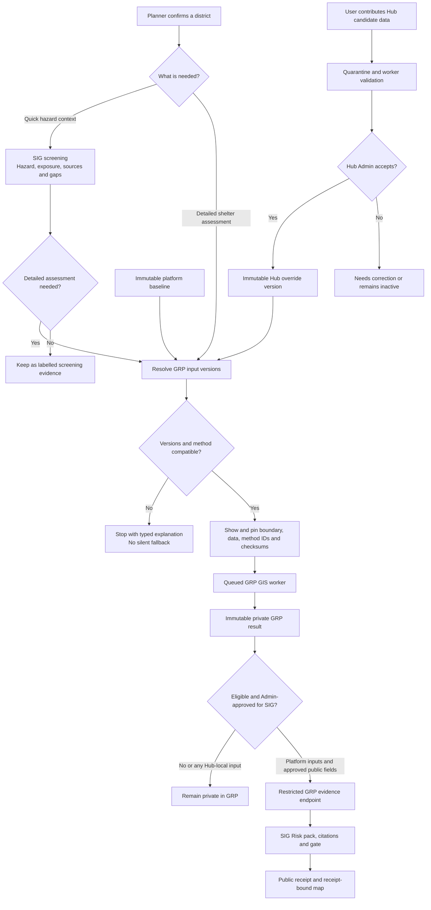
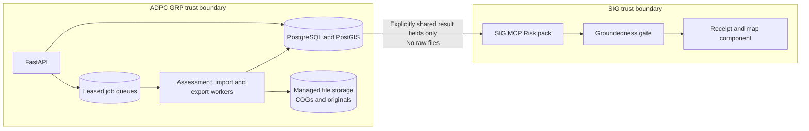

# GRP MVP 1 Project Handover

**Updated:** 20 September 2026 (real RP100 flood depth and evacuation centres imported for display on the Planning map)

**Repository:** <https://github.com/kovitad/ADPC_GRP>

**Delivery status:** `feat/planning-chatbot-ux` was validated and fast-forward merged into `main`; the feature branch is retained as a recovery reference. Work continues on `codex/sig-embedded-flood-map`. The branch includes the Source data inspector, persistent background-job notices, one-district data preview, display-only national RP100 and evacuation-centre layers, and a login-bound SIG answer cache. **301 tests pass**; Ruff and JavaScript syntax checks are clean. Two additional PostgreSQL-only data-library tests pass in the Docker database job.

**Handing over:** nothing is half-finished in the tree. The next person should start at Section 9, and first do the browser acceptance pass in Section 3 (nothing on this branch has been confirmed against live SIG and OpenAI yet).

**Baseline:** `GRP-ARC-001` v2.2. The secure copy `2026-09-15_GRP-ARC-001_MVP1_Solution_Architecture_Specification_v2.2.docx` is at the repo root and ignored by Git. On top of it sit the ADRs and product-owner decisions in Section 6.

> **Start here if you are a new agent:** read Sections 1, 3, 4 and 10, then `AGENTS.md`. Do not merge `experiment/planning-chat`. Do not store secrets, and do not print the `.env` values.

---

## 1. Where we are

| Area | State |
|---|---|
| Increment 0, servers ready | Done |
| Increment 2, access and admin | **Complete in code**: NDMO Planner, Hub Expert / GIS Specialist, Hub Admin and Platform Admin; security log, CSRF, session revocation, rate limits, AI usage limit, AI gateway, Langfuse |
| Increment 1, golden assessment | **Built on a synthetic case**: job, worker, locked result, API, screen, golden test. Real acceptance needs DEP-04, DEP-06 and method approval |
| Planner assistant and map (ADR-0004) | **Built, Docker Desktop only**: chat bot plus OSM map, SIG MCP evidence, evidence panel, downloads, progress, Thai input; browser location accepts a confirmed district only |
| SIG live hazard-map embed | **Implemented on `codex/sig-embedded-flood-map`**: receipt-bound `ui_embed(hazard_map)`, restricted SIG host/path, sandboxed iframe and explicit hazard/exposure—not full risk—education |
| Source data inspector (ADR-0006) | **Built, Docker Desktop only**: Admin-only page over the read-only `.local/data-in` mount; worker job, cached on a file fingerprint, findings graded blocker / problem / known, points cross-checked against boundaries on a map |
| Baseline map preview (ADR-0009) | **Built and imported locally**: 10,303 DDPM evacuation centres plus one six-tile RP100 version, six COGs and a national display PNG. Planning can draw both without making them assessment inputs; DEP-05 still blocks classification |
| UI shell | Shared left-aligned top bar, SERVIR Global Collaborative logo, one palette from the logo |
| Increment 3, SIG connection | Not started (needs DEP-01, DEP-08, DEP-09, DEP-13) |
| Increment 4, review and downloads | Not started (the evidence downloads in chat are not the Increment 4 PDFs) |
| Increment 5, seven scenarios and uploads | Not started |
| Increment 6, vulnerability and AI explain | AI explain exists early; vulnerability is a placeholder (DEP-07) |
| Increment 7, pilot hardening | Not started |

**Product-owner browser testing is in progress.** The owner has seen and steered the Planning page (chat, SIG evidence, menu and professional theme) and authorized the stabilization plan. The stacked feature branch was merged to `main` after the 18 September validation pass.

---

## 2. Branches

The original feature branches are **stacked** through `feat/planning-chatbot-ux`. Current work continues from that baseline on `codex/sig-embedded-flood-map`.

| # | Branch | Adds |
|---|---|---|
| — | `main` | Increment 0, access foundation, Phase A and B security fixes, Docker Desktop stack |
| 1 | `feat/increment-2-complete` | Roles, SIG service login, Hub close, security log views, AI limit, manual reset, AI gateway, Langfuse, `/platform.html` |
| 2 | `feat/planner-chat-map` | ADR-0004 chat on SIG evidence, area check, opt-in receipts |
| 3 | `feat/increment-1-assessment` | Assessment tables, storage, method, worker, API, synthetic seed and golden test, `/assessments.html` |
| 4 | `feat/planning-map-workspace` | Map layers API, flood overlay picture, center points, explain API |
| 5 | `feat/planning-chatbot-ux` | Natural chat routing, chat-bot UI, SIG evidence panel and downloads, progress and timings, Thai place names, state kept across pages, shared top bar, SERVIR logo and theme |
| 6 | `codex/sig-embedded-flood-map` | Hardens the live SIG map embed; adds the local versioned data library and display-only real Thailand flood/shelter layers |

**Merge status:** `feat/planning-chatbot-ux` has been fast-forward merged into `main` and pushed. The feature branch is retained temporarily for recovery. `experiment/planning-chat` is superseded; **never merge it**.

---

## 3. Run and test locally (Docker Desktop)

```powershell
# full start or rebuild (slow on this PC; was twice killed for low memory)
.\scripts\docker-desktop.ps1 -AdminEmail kovitad.janlakhon@adpc.net -HubAdminEmail kovitad.janlakhon@adpc.net

# faster: rebuild only API and worker after Python changes
$env:SERVIR_AUTH_CLIENT_ID = (Get-Content .local\servir_auth_client_id -Raw).Trim()
docker compose -f deploy/compose.desktop.yml up -d --build api worker

# stop (data stays in Docker volumes)
.\scripts\docker-desktop.ps1 -Down
```

**Important facts about the local stack:**
- `web/` is mounted from disk: HTML, JS and CSS changes need only a browser refresh. Pages are served with `Cache-Control: no-cache` in dev; `grp-common.js`, `planning.js` and `planning.css` now carry `?v=20260917n`. **Bump asset versions when changing shared CSS or JS.**
- **Python changes need an image rebuild.** The local `grp-api:desktop` image was successfully rebuilt on 18 September from the committed source, including `api/errors.py` and `api/rate_limits.py`; the API and worker were recreated from that image. No copied-file workaround remains.
- Local rate limit: `deploy/compose.desktop.yml` sets `RATE_LIMITS` with 300 API requests per person per minute, so quick menu switching does not hit 429. Servers keep the Section 13.1 value of 60.
- After any API restart, **sign in again**. The SIG MCP token lives only in process memory (ADR-0002).
- The script copies `OPENAI_API_KEY` and `LANGFUSE_SECRET_KEY` from the ignored `.env` into `.local/docker/secrets/` without printing them. `LANGFUSE_BASE_URL` and `LANGFUSE_PUBLIC_KEY` pass through as environment variables. The model comes from `OPENAI_MODEL` (currently `gpt-5.2`).
- Desktop-only switches in `deploy/compose.desktop.yml`: `GRP_ENV=dev`, `AI_FEATURE_ENABLED=true`, `PLANNING_CHAT_ENABLED=true`, `DATA_INSPECTOR_ENABLED=true`, `ALLOW_DRAFT_METHODS=true`, `AI_MAX_OUTPUT_TOKENS=900`.
- **Background jobs in the browser** (`GRP.jobs` in `web/grp-common.js`): every page that starts a worker job (assessments on Planning and Assessments, Source data checks) calls `GRP.jobs.track({id, label, statusPath, href, ownerPath})`. The list is `grp.jobs.v1` in `localStorage`, shared by every tab and cleared on sign-out; every signed-in page polls it every 5 s, shows a top-bar pill while anything runs and a notice (plus a browser notification if allowed and the tab is hidden) when it ends. The owning page shows the result itself, so no notice there, and calls `GRP.jobs.done(id)`. Any new long job must use this, never make the user wait on the page.
- `.local/data-in` is bind-mounted **read-only** into the api and worker at `/srv/grp/data-in` (ADR-0006). Put the delivered files there; the app can never write to them. Adding or removing that mount needs `up -d` to recreate the containers, not a restart.

### Browser checklist

1. `http://127.0.0.1:8000/admin`: sign in with SERVIR (`kovitad.janlakhon@adpc.net` is Platform Admin and Hub Admin of `adpc`)
2. `/platform.html`: set a token limit (for example 50,000), AI **On**, Save; **Send test call**; **Reset now**; create, close and reopen a Hub; security log
3. `/planning.html`:
   - The page opens on Thailand, with no assessment area selected. **Flood depth · 100-year** and **Evacuation centers** are shown by default from the real display-only baseline; expect a preview warning and centre popups saying they are not assessed. They can be hidden under **Layers**. **Use my current district** / **Use my location** identifies a real Thailand district for SIG-only evidence. The synthetic fixture remains available only as the demo assessment area; selecting it explicitly runs the 7 / 3 / 2 / 2 test assessment.
   - "Which centers could not be assessed, and why?" explains the stored result
   - `where could people move if flood happen in บางบัวทอง นนทบุรี`: confirm the AI-proposed district before any SIG request; then the progress card, status card with a note that this is not a GRP area, evidence panel and Bang Bua Thong outline appear
   - **Use my location**: allow the browser prompt; the map accepts only a real Thailand district returned by OpenStreetMap (not a city-wide or approximate result), labels it as SIG-only and offers **Check SIG flood exposure**. Location coordinates are not stored and cannot start a GRP assessment.
   - **Publish receipt & show SIG flood map** (two-step confirm, creates a public record): SIG hazard map over the map
   - switch to Assessments and back: the conversation is kept
4. `/data-inspector.html` (**Source data** in the menu, Admins only): pick **All source data**. Expect eight blockers, ten problems and five known issues in about ten seconds (ADR-0007 makes source/provenance registration known setup work, not a data-approval blocker), a map of shelters coloured by whether they sit in the district they name, and a second visit to the same folder returning instantly from the cache. While it runs, switch to another menu: the top bar shows **Running: Source data check …** and a notice appears bottom-right when it is ready. Coming back to Source data picks up the same job (it does not start again). A finished report is shown straight away; pick the folder again to re-check for changed files.
5. `/data-preview.html` (**Preview one district** link on Source data, Admins only): press **Pua**. Expect the district outline, the flood picture hatched purple almost everywhere (99% no value), 29 purple shelters (on a no-value pixel), 1 orange shelter far away that names Pua, and a warnings panel led by the no-value blocker. **Mueang Nan** asks you to pick between districts only if the name is shared; **Bang Bua Thong** shows one shelter on a flooded pixel. A made-up name says it is not in the boundary file.
6. `/assessments.html`, `/workspace.html`: same top bar, same order
7. Langfuse Cloud: traces `planning-router-v1`, `planning-draft-v1`, `result-explain-v1`, `platform-test-v1`

---

## 4. Architecture map (what lives where)

### 4.0 Proposed data-library and SIG flow

This is the retained target design. Its import foundation, managed storage publication, boundaries,
shelters, RP100 hazard and local API/UI are implemented. Real assessments are not. ADR-0008 is accepted
for the bounded local baseline scope; browser upload, scientific activation and server rollout remain gated. SIG
screening is optional; a SIG outage must never block a valid GRP assessment. Hub data overrides are visible Hub-level choices accepted by a Hub Admin, not
hidden per-user defaults.





Scale path: keep the modular monolith for the pilot; add lease renewal and separate job classes first,
then shared state and S3-compatible storage before multiple API/worker hosts, and a tile service only
when national raster browsing is measured as necessary.

Design notes to read before large changes:

- [`docs/architecture-scaling-design.md`](docs/architecture-scaling-design.md) — why GRP is a modular monolith with background jobs, what keeps it ready to split into services later, and the measured triggers for doing so.
- [`docs/thailand-dataset-inventory.md`](docs/thailand-dataset-inventory.md) — what the delivered Thailand files actually contain (928 districts, 10,303 shelters, six 90 m flood tiles in metres, two 12.5 m vulnerability rasters in UTM) and the six decisions they force, including the blocking no-data rule.
- [`docs/thailand-dataset-ingestion-plan.md`](docs/thailand-dataset-ingestion-plan.md) — how the real Thailand boundaries, evacuation centers, RP100 flood raster and vulnerability raster are brought in, and the two options for drawing flood depth on the map.
- [`docs/data-library-sig-assessment-design.md`](docs/data-library-sig-assessment-design.md) — proposed SIG screening, GRP detailed assessment, versioned platform baseline, Hub-level category overrides, import/upload lifecycle, technical stack and scaling triggers.
- [`docs/data-library-solution-review.md`](docs/data-library-solution-review.md) — senior review, mandatory safeguards and scale gates. Its P0 policy/model choices are closed in ADR-0008 for local baseline work; browser upload and server rollout remain gated.
- [`docs/baseline-data-library-implementation-plan.md`](docs/baseline-data-library-implementation-plan.md) — exact local execution order: schema, lease/idempotency controls, managed staging, boundaries, shelters, six-tile RP100 manifest, Data library UI and the plan after baseline completion.
- [`docs/GRP_Local_Data_Library_Implementation_and_Backlog.docx`](docs/GRP_Local_Data_Library_Implementation_and_Backlog.docx) — stakeholder-ready Word handover covering the current implementation, local data/storage/database workflows, verification, technology recommendations, dependencies and ordered backlog, with three embedded diagrams. Regenerate it with `python tools/build_data_library_design_doc.py` after installing the documentation-only `python-docx` package and Graphviz.
- [`docs/adr/0006-admin-data-inspector.md`](docs/adr/0006-admin-data-inspector.md) — the Admin **Source data** page: a read-only look at `.local/data-in`, run as a worker job, cached on a file fingerprint, findings graded blocker / problem / known. Dev only; nothing it reports is a GRP result.
- [`docs/adr/0007-delivered-data-acceptance.md`](docs/adr/0007-delivered-data-acceptance.md) — the Data Science delivery is accepted source data; ingestion registers its provenance and checksums, while method decisions such as flood no-value remain separate blockers.
- [`docs/dataset-proof-results.md`](docs/dataset-proof-results.md) — what `tools/prove_dataset.py` found when run on real districts: the datasets line up, but in Pua every shelter sits on a no-value pixel, shelter district names cannot be joined, and at least one shelter is in the wrong province. Read this before writing any loader.
- **District preview (backlog Epic P)** — `core/district_preview.py` (worker only) builds one district's outline, shelters and RP100 flood picture from `.local/data-in`, with warnings. It reuses the `dataset_inspection` job table: the `district` column (migration 0007) is part of the cache key, so a folder report and a preview are never confused. It never classifies a shelter as "not exposed": shelters are reported on a flood pixel / on a no-value pixel / outside tiles, because what no-value means is DEP-05. Admin-only, behind `DATA_INSPECTOR_ENABLED`, with no export and no SIG path. The picture is stored under `previews/<id>/flood.png` and served by `GET /api/v1/data-inspector/previews/{id}/flood.png`.
- [`docs/development-plan.md`](docs/development-plan.md) — how we work: definition of done, test layers, CI gates to add, observability, security and documentation habits, eight phases with finish lines, and the technical-debt register.
- [`docs/backlog.md`](docs/backlog.md) — the ordered work items for the dev team (epics A to H, sized, with what blocks each), and a suggested first sprint that is blocked on nobody.
- [`docs/flood-hazard-exposure-embed-design.md`](docs/flood-hazard-exposure-embed-design.md) — the SIG receipt-bound hazard map embed.


### 4.1 Backend (FastAPI, Python 3.12)

| Area | Files | Notes |
|---|---|---|
| App, errors, settings | `api/main.py`, `api/errors.py`, `api/settings.py` | Appendix D errors; dev-only no-cache middleware for web files |
| Sessions and access | `api/sessions.py`, `api/auth.py`, `api/oidc.py`, `core/identity.py`, `api/permissions.py`, `api/planning_access.py` | CSRF header `X-CSRF-Token`; POST sign-out; revocation via `app_user.sessions_valid_after` |
| Admin and platform | `api/admin.py`, `api/platform.py`, `api/audit.py`, `grp/admin.py` | CLI: `bootstrap-platform-admin`, `ensure-hub`, `assign-member`, `list-access-requests`, `rotate-sig-token` |
| AI | `core/ai_models.py`, `core/ai_allowance.py`, `api/ai_gateway.py`, `api/langfuse.py`, `api/ai.py` | The gateway is the only provider caller; reserve, call, settle; Langfuse is best effort |
| Assessment | `core/assessment_models.py`, `core/assessment_jobs.py`, `core/gis.py`, `core/result_rules.py`, `core/storage.py`, `core/validation.py`, `api/assessments.py`, `api/catalog.py`, `worker/main.py`, `grp/seed.py` | The API never imports GIS; the worker claims with `SKIP LOCKED` |
| Map | `api/maps.py`, `core/hazard_overlay.py` | Display-only flood PNG drawn at seed time |
| Planner assistant | `api/planning.py`, `api/sig_evidence.py`, `api/mcp_client.py`, `api/token_store.py` | See 4.3 |
| SIG service login | `api/integrations/sig.py` | Evidence endpoint returns 404 until Increment 3 |
| Migrations | `migrations/versions/20260916_0001`…`20260920_0010` | Forward-only; `0008` adds the data-library foundation; `0009` adds boundary PostGIS geometry; `0010` adds shelter district membership and indexed PostGIS points |

### 4.2 Frontend (static, no build step)

| File | Role |
|---|---|
| `web/grp-common.js` | `window.GRP`: `request()` (CSRF, Idempotency-Key, typed errors), `me()` (cached identity), **shared top bar** (`<header data-grp-topbar>`; fixed order Planning · Assessments · My access · Administration · Platform), sign-out that clears `sessionStorage` keys starting with `grp.`, formatting helpers, §10.6 allowance text |
| `web/styles.css` | Global styles. The **SERVIR palette tokens** (`--servir-grey/blue/blue-dark/navy/green/green-soft`) are in `:root`; the older `--forest-*` and `--lime-*` names map to them. Top bar styles are under `/* Shared top bar */` |
| `web/planning.html/.css/.js` | Chat bot plus map (details in 4.3). `planning.css` tokens `--pw-*` follow SERVIR blue |
| `web/assessments.*` | Form-based assessment run and full result table |
| `web/platform.*`, `web/workspace.*` | Platform Admin page; My access, members and Hub security log |
| `web/index.html`, `register.html`, `admin-login.html` | Sign-in pages (photo plus card; SERVIR logo) |
| `web/assets/servir-global-collaborative.png` | Official logo (full colour, transparent) |

Rules: no `innerHTML` with server or user text (tests check this). Build DOM with `textContent`.

### 4.3 Planner assistant flow (`POST /api/v1/planning/chat`)

1. Checks: `PLANNING_CHAT_ENABLED` and `GRP_ENV=dev`; Planner or Hub Admin of the Hub; 20 AI requests per hour.
2. **Router** AI call (`planning-router-v1`):
   - Context sent: selected area, whether a result is shown, supported area names.
   - The model returns `{mode, reply, place (English romanized), return_period_years}`.
   - Its place is a proposal only. An explicit `place`, a matching user-selected boundary or a supported boundary named in the message is required for a GIS/SIG action. The automatically highlighted area is not sent as a selection. GRP matches full names (including province when present) and refuses ambiguous boundary matches. Otherwise the API returns `needs_area_confirmation` with no GIS/SIG call; the chat shows a confirmation button. The choice survives page navigation in this tab.
3. By mode:
   - `explain_result`: `explain_stored_result()` (`result-explain-v1`) using only stored result fields.
   - `run_assessment`: matches supported areas or the map selection, then `create_assessment()` and returns `assessment_started`.
     - **If the place is not a GRP area, it falls through to `sig_flood` with a `note`.**
   - `sig_flood`:
     - MCP `assemble_pack(risk, place, flood)`.
     - `check_area()` requires `aoi[...] via admin boundary` with a matching name; otherwise `area_rejected`.
     - Draft (`planning-draft-v1`).
     - If `publish_receipt`: `publish_answer`, then `ui_embed(hazard_map)`; a blocked draft is withheld.
     - Response includes `evidence` (see `evidence_bundle()`): citations, gaps, stats, SIG trace, GRP trace with `duration_ms`, `total_ms`, summary counts, receipt.
   - `chat` returns a reply; `cannot` returns server text (vulnerable people, investment brief and the red/yellow/green map are "coming next").
4. Frontend (`planning.js`):
   - progress card with timer (steps advance on typical timings);
   - status card (note, counts, timings, draft/receipt badge), with the brief rendered as headings and `[n]` citation buttons;
   - evidence panel with tabs and downloads (.md, .json, .txt);
   - SIG area outline from Nominatim (orientation only); SIG live hazard-and-exposure component after publish. The API accepts only HTTPS URLs on the configured SIG host at `/embed/hazard_map/{id}`; the iframe is sandboxed and carries no token.
   - **Use my location** requests browser permission only after the user clicks it. Its coordinates go to Nominatim solely to identify a Thailand district, are held only in memory, and must be followed by an explicit SIG lookup click. Browser session storage uses `grp.planning.v2`, deliberately leaving prior synthetic-demo transcripts in the old v1 key.
   - Natural-language requests for **current location** use the already confirmed browser district. A Thai place mention is geocoded with Nominatim and requires an on-screen confirmation before it becomes the SIG location. The canonical result-explanation prompt is routed to the stored-result flow even if the router model returns `cannot`.
   - State (transcript, selection, result, pending job, open evidence) is saved in `sessionStorage["grp.planning.v2"]`, scoped to the user email and capped at 40 entries.

### 4.4 Tests

- `tests/fast`: sessions, OIDC rejections, identity, AI limit and gateway, Langfuse, SIG service, platform admin, planning chat with fake SIG and model, UI static checks.
- The AI allowance reserves the whole estimated request before a provider call. If it does not fit, `AI_LIMIT_REACHED` is returned; an already-running call can still exceed its estimate and its actual tokens are counted (AI-09).
- `tests/contract/test_permission_matrix.py`: every route × role.
- `tests/golden`:
  - `test_synthetic_rp100.py` compares against the hand-designed `synthetic_rp100/expected_*`;
  - `test_planning_map.py` covers layers, PNG, explain privacy and chat intents.
- Run: `python -m pytest` (needs `.[dev,gis]`) and `python -m ruff check .`.

---

## 5. What changed in the last session block (17 Sep)

| Commit | Change |
|---|---|
| `e0b219e` | SIG answers: status card in chat; evidence panel (Evidence / What is missing / How it was produced); downloads; SIG area outline |
| `1d28bed` | "Where could people move" in a non-GRP area falls back to SIG evidence with a note; the brief says plainly when there are no evacuation centers |
| `ac1ec4e` | Progress card with timer; per-step durations from the API; formatted brief with citation buttons; dev no-cache for web files |
| `e174dfd` | Planning conversation kept when switching menu pages (`sessionStorage`) |
| `6832dbb` | One shared, left-aligned top bar for all signed-in pages |
| `54c29d5` | SERVIR Global Collaborative logo; one palette across the app and sign-in pages |
| `19b3e2c` | Top bar tests updated; handover; `AGENTS.md` pointer |
| Codex, committed here | **Area confirmation:** an AI-proposed place never starts GRP/SIG work without an explicit choice (full-name match, `needs_area_confirmation`); **Use my location** (browser permission, Nominatim district only, SIG-only, not stored); synthetic area hidden as a **Demo** layer; explicit Hub roles **NDMO Planner** and **Hub Expert / GIS Specialist** (ADR-0005, migration `20260917_0005`); the AI reservation must fit the remaining allowance; "explain the result" routing safeguard; session key `grp.planning.v2` |
| Claude Code, committed here | **Thai place confirmation now answers:** **Use [district] and answer** confirms the district *and* re-sends the original question, so the evidence panel and map appear (before, it only picked the place and nothing ran) |
| Claude Code, committed here | **Rate limit on menu switching:** 429 replies carry `Retry-After`; `GRP.request` waits and retries a GET once (max 10 s); assessment polling every 5 s instead of 2–3 s; My access reuses `GRP.me()`; local Docker limit 300/min |
| `06cda24` | SIG hazard-map embed hardened: receipt-bound only, SIG host and path restricted, sandboxed iframe, hazard-and-exposure wording, design note `docs/flood-hazard-exposure-embed-design.md` |
| Claude Code, committed here | **District field rule:** OpenStreetMap stores the Thai district in `county` outside Bangkok and `suburb` inside it, while `city_district` is often the sub-district (tambon). The lookup now takes the first field that reads as a district and rejects sub-districts, so Bangkok positions resolve and Chiang Mai no longer picks a tambon. Verified against live reverse-geocode samples for Bangkok, Nonthaburi and Chiang Mai |
| Claude Code, committed here | **Location fixes:** the district lookup now tries the administrative zoom levels OpenStreetMap actually uses for Thai addresses (10, 12, 14, 8) and accepts `state_district`/`district` as well, so **Use my location** stops failing with "no administrative district"; a confirmed district is announced in chat with a **Check SIG flood exposure** action; **clicking anywhere on the map** picks that point's district for SIG evidence (a click on a supported area still selects the GRP boundary); asking about "my current location" without a known district now offers the map instead of repeating the same refusal |
| Codex + Claude Code review, committed here | **Publish the reviewed draft:** publishing no longer re-runs the model. The draft the person read is signed into a short-lived, session-bound token (`api/planning_publish.py`, 15 minutes, bound to user, session and Hub) and `publish_answer` checks that exact text. A local preflight (`_draft_issues`) catches missing headings, empty sections, a self-written Sources section, phantom or missing citations, and withholds an incomplete brief instead of publishing it. Gate refusals list SIG's reasons and offer a retry. A two-step confirmation panel explains what a public receipt does and does not prove. Oversized packs drop the token with a clear reason (`PUBLISH_TOKEN_MAX_CHARS`) |

Earlier on 16–17 Sep: Increment 2 completion, ADR-0004 chat, Increment 1, map workspace, natural routing, chat-bot redesign and Thai romanization (see `git log`).

### 18 Sep — training-deck review and SIG embed hardening

- Reviewed the local `docs/Vulnerability Platform Training Presentation.pptx` as product/training
  context. It is not treated as an approved GRP method and remains uncommitted pending a decision on
  whether training material belongs in the source repository.
- Added `docs/flood-hazard-exposure-embed-design.md`: terms, governed MCP sequence, four status
  outcomes, trust cues, security controls, tests and staging gates.
- Kept SIG as the renderer: after `publish_answer` returns `status="ok"` and a receipt, GRP calls
  `ui_embed(component="hazard_map")`; GRP does not redraw or copy the hazard cells.
- Tightened embed parsing to the configured SIG HTTPS host and `/embed/hazard_map/{id}` path.
- Changed UI language from ambiguous “flood risk map” to **flood hazard and asset exposure**, with a
  visible warning that vulnerability weighting and safety certification are not present.
- Added an unavailable-map state so a valid cited answer and receipt remain usable when SIG returns no
  valid embed; no illustrative fallback is substituted.
- Full validation at that point: 210 tests, Ruff and `node --check web/planning.js`; Docker Desktop API and worker
  rebuilt and restarted successfully. Sign in again because the in-memory SIG token was cleared.

### 19 Sep — background-job continuity and district preview

- Background assessment and inspection jobs are tracked in `localStorage`, survive navigation and
  other tabs, and report completion from the shared top bar.
- Added the Admin-only `/data-preview.html`: one delivered district's outline, shelters and RP100
  flood picture, with no-value hatching, warnings and preview counts. It is not an assessment,
  cannot start one and has no SIG route.
- Added migration `20260919_0007` so folder inspections and district previews have distinct cache
  keys, and made the worker persist safe failure reports for malformed layers.
- Preview-page polling now yields to the global background-job tracker after roughly three minutes,
  rather than polling forever in the foreground.
- The product owner confirmed that the Data Science delivery is accepted source data (ADR-0007).
  The UI no longer calls the files unapproved or treats acceptance as a blocker. Registration of
  provenance/checksums is ingestion setup; DEP-05 no-value meaning still blocks classification.
  A direct worker preview of Pua confirms the remaining findings are the no-value blocker, one
  misplaced-shelter problem and the two unconfirmed shelter columns as a known issue.
- Designed the next data-library increment before coding it: SIG screening, GRP assessment,
  immutable platform baselines, and category-by-category Hub overrides accepted by a Hub Admin
  rather than hidden per-user defaults. ADR-0008 now accepts the bounded local baseline scope;
  its implementation safeguards are mandatory. Browser upload, flood activation and server rollout
  remain gated. The reviewed diagrams are retained in Section 4.0 of this handover.
- CI now migrates an empty PostGIS database and runs the golden suite, and Gitleaks scans full Git
  history on pull requests and pushes to `main` (backlog D1 and D4). The CI sequence was reproduced
  locally against a fresh PostGIS 16 container (all seven migrations and 22 golden tests), and a
  full-history Gitleaks scan found no leaks.
- Automated browser acceptance reached the local OAuth sign-in, but the prior API session had expired.
  A person must complete SERVIR sign-in before the protected preview and live publish checks can run.
  No receipt was created. The public staging health URL reset the connection; staging remains undeployed.
- Began the accepted local baseline implementation. Migration `0008` adds explicit readiness states,
  data import jobs, immutable file manifests, boundary collection-version links and unique Hub data
  selections. Import jobs now use attempt numbers as fencing tokens: an expired stale worker cannot
  renew or finalize after another worker reclaims the job. Requests are idempotent and successful
  finalization can happen only once.
- Managed staging and atomic publication are built. Worker copies are verified after writing, manifests
  and final keys are immutable and deterministic, stale attempts cannot publish, and any materializer
  failure rolls the complete database version back. Handled failures clean their unreferenced bytes.
- Migration `0009` adds boundary datasets plus full and simplified GiST-indexed PostGIS geometry. The
  loader requires the complete shapefile set, validates EPSG:4326, required fields, unique codes and
  polygon validity, and leaves every imported district unsupported pending scientific approval.
- Full validation: 293 repository tests pass and Ruff is clean; two PostgreSQL-only tests prove spatial
  schema creation and that two workers cannot publish one import twice. A fresh PostGIS 16 database
  migrated through all nine revisions. A real isolated Docker import produced 928 boundary records,
  928 valid PostGIS geometries, six immutable file records and one manifest. The persistent Docker
  Desktop database is now at `0009`; API and worker were rebuilt, recreated and health-checked. The
  protected Data library API/UI is now built for the boundary category, including Platform Admin
  import, audit, status polling and shared completion notices. The accepted baseline was imported into
  the persistent local library: edition `2025-10`, 928 districts, six files and 928 valid PostGIS
  geometries. Open `/data-library.html` after signing in to see it. Recreation cleared the SIG token.

### 20 Sep — real baseline flood and evacuation-centre map layers

- Added migration `0010`, the DDPM shelter worker loader and geometry-based district membership. The real local import materialized 10,303 points, all with PostGIS geometry and a boundary ID; 1,139 source-name conflicts are reported and no point falls outside all districts. Unconfirmed `สถา` and `รอง` fields are not planner-facing.
- Added the six-tile RP100 worker loader. It validates CRS, resolution, manifest order, gaps and overlaps; preserves six originals; creates six COGs sequentially with a 256 MB GDAL cache; and creates one 1,200 px national map PNG. The version remains `waiting_for_method` for DEP-05.
- ADR-0009 separates `map_preview` from assessment activation. Planning shows **Flood depth · 100-year** and **Evacuation centers**, with explicit preview/not-assessed language, while Catalog continues to exclude the non-current versions.
- Expanded the Data library UI/API with shelter and hazard imports, counts, findings, progress and shared notices. The Planning point layer uses Leaflet canvas for the 10,303 points. Real flood and evacuation-centre previews are now enabled by default, rather than leaving the right-hand map blank.
- Added ADR-0010's ten-minute exact-question cache, bounded by user, login, Hub and place. A repeat avoids SIG and AI calls; login/logout evict it, API restart clears it, and **Retry brief generation** bypasses it. The incomplete-brief message now explains that SIG's receipt-bound map cannot open and that no school/hospital/road geometry was returned.
- Real Docker results: shelter import 5.55 s and 29,987,922 managed bytes; hazard import 31.64 s and 279,132,713 managed bytes; complete managed datasets tree 325 MB. Full details are in [`docs/baseline-map-implementation-report.md`](docs/baseline-map-implementation-report.md).
- Validation: 301 tests pass (two PostgreSQL-only skips in the normal run), Ruff and both JavaScript syntax checks are clean. Docker image rebuilt, migration head is `0010`, real imports succeeded and API health is green. The rebuild cleared browser/SIG sessions, so a person must sign in for the final protected visual acceptance pass.

---

## 6. Decisions and ADRs

| Record | Decision | Status |
|---|---|---|
| ADR-0002 | Interim SERVIR sign-in via a self-registered SIG MCP client; MCP token kept in memory for local chat | Proposed; remove before Beta (DEP-01) |
| ADR-0003 | Platform Admin manual reset of current-month AI usage | Accepted by owner; spec AI-11 text to update |
| ADR-0004 | Interim Planner chat and map on SIG generic evidence, Docker Desktop only | Accepted for local testing; Technical Lead review pending |
| ADR-0005 | Explicit NDMO Planner and Hub Expert / GIS Specialist roles | Accepted by product owner; local migration `20260917_0005` applied |
| ADR-0006 | Admin data inspector over a read-only source folder | Accepted for local Docker Desktop testing; browser acceptance pending |
| ADR-0007 | Data Science delivery is accepted source data; provenance is registered during ingestion | Accepted by product owner; DEP-05 method decision still blocks real results |
| ADR-0008 | Immutable platform baseline plus Hub-level, category-by-category accepted overrides | Accepted for bounded local baseline implementation; browser upload, scientific activation and server rollout remain gated |
| ADR-0009 | Technically validated, non-current baseline versions may be display-only Planning map previews | Accepted for local validation; does not activate assessment inputs |
| ADR-0010 | Cache repeated SIG evidence answers for ten minutes within one user/login/Hub | Accepted for local validation; login, logout and API restart evict it; refresh bypasses it |

Owner decisions (16–17 Sep):
- remove the pending access list;
- Increment 2 includes the AI limit, gateway and Langfuse;
- the Data Science delivery in `.local/data-in` is accepted source data; do not call the files unapproved (ADR-0007);
- OpenStreetMap only;
- vulnerable people stays a placeholder;
- the Planning map before Increment 4;
- chat-bot UX with the opening question "What decision are you preparing for?";
- a natural language flow with no mode switches;
- SIG fallback for non-GRP areas;
- keep state across pages;
- fixed left-aligned menu;
- the SERVIR Global Collaborative logo and palette.

---

## 7. Known gaps, risks and technical debt

- **Staging is not deployed yet:** the validated build is running locally. Use the release/bootstrap workflow and staging secrets on the Ubuntu VM; do not copy the local `.env` or token files.
- **Rate limit is per process and per person:** a page load makes about 5–7 API calls. The 60/min spec value may be tight for real use; review it with the product owner before staging.
- **Live end-to-end not formally confirmed:** OpenAI, Langfuse and SIG MCP work was observed by the owner in the browser but is not captured in tests; there is no recorded SIG fixture for the chat.
- **Area check** relies on SIG trace wording `via admin boundary` (from the 14 Sep capture).
- **Area confirmation** blocks model-only locations before SIG/GRP work. It requires a browser pass with a real SERVIR account after rebuilding the API image; the Python tests use fake SIG and model responses.
- **First SIG requests can still be slow.** A Chiang Yuen request spent 138 of 151 seconds in external SIG MCP. ADR-0010 makes the same question in the same login immediate, but a new question still waits; true streaming (SSE) is not built and progress steps remain estimated.
- **SIG flood cells** appear only after publishing a receipt (the pack has no geometry). The outline before that comes from Nominatim, for orientation only.
- **This is not yet a vulnerability-weighted risk map.** SIG Risk v0 declares hazard/exposure only;
  full risk wording and red/yellow/green decision classes wait for DEP-07 and an approved method.
- The embed URL shape is currently based on SIG's advertised `ui_embed` contract and the prototype
  fixture. Capture a sanitized live response before staging and adjust the allow-list only through a
  reviewed contract change.
- **External browser calls:** `unpkg.com` (Leaflet) and `openstreetmap.org` (tiles, Nominatim). Acceptable for local use only; vendor Leaflet and use a contracted tile and geocoder before staging.
- **Real assessment still blocked:** real boundaries, shelters and RP100 are imported with PostGIS geometry, but no real district is supported, the imported versions are not assessment-current and DEP-05/method approval remain open. The only runnable GRP assessment is synthetic.
- **Single-process memory** holds rate limits and the SIG token store; there is no lease renewal for long jobs.
- `web/planning.js` (~1,200 lines) and `api/planning.py` (~650 lines) are large. Split them before adding much more.
- **Spec text** needs updating for ADR-0003, ADR-0004 and the Increment 2 scope change.
- **Phone layout** of the new top bar and sign-in pages is not visually verified.

---

## 8. Dependencies to chase

| ID | Needed | Owner | Blocks |
|---|---|---|---|
| DEP-01 | GRP registered as its own app in SIG WorkOS | SIG platform owner | Removing ADR-0002; Beta |
| DEP-04, DEP-06 | Chiang Yuen boundary, center dataset, signed golden result | Scientific and Data Authority | Increment 1 acceptance |
| DEP-05 | JRC flood layers for seven return periods, licence | Scientific and Data Authority | Increment 5, real flood map |
| DEP-07 | Vulnerability layer and meaning | Scientific and Data Authority | Vulnerable people layer |
| DEP-08, DEP-09, DEP-13 | Risk pack `assessment_ref`, SIG machine login | SIG platform owner | Increment 3 |
| DEP-11 | AI key per Hub, starting token limit | Product Owner, Technical Lead | AI outside local |
| DEP-12 | Summary and map download templates | Product Owner with planners | Increment 4 |

---

## 9. What to build next (recommended order)

Each item has a clear "done when". Keep the spec guardrails (Section 11).

> For a **team** rather than one agent, work from [`docs/backlog.md`](docs/backlog.md): the same work split into sized epics with what blocks each, plus a first sprint that needs no answers from anyone. This list stays as the single-threaded order for whoever picks the session up next.

### Current implementation track: local baseline data library

Execute [`docs/baseline-data-library-implementation-plan.md`](docs/baseline-data-library-implementation-plan.md) in order:

1. ~~Migration and readiness/domain states.~~ **Built:** migrations `0008`–`0009` pass from an empty PostGIS database.
2. ~~Safe import queue.~~ **Built:** idempotency, lease renewal, fencing and two-worker PostgreSQL publication test.
3. ~~Managed staging, checksums and atomic promotion.~~ **Built and tested.**
4. ~~Versioned district-boundary collection and PostGIS loader.~~ **Built and imported: all 928 real features are now visible in the Data library UI.**
5. ~~DDPM shelter loader with geometric membership and mismatch reporting.~~ **Built and imported:** 10,303 points, 1,139 reported name conflicts, zero outside all districts.
6. ~~One logical RP100 version containing the ordered six-tile manifest and bounded COG processing.~~ **Built and imported:** six originals, six COGs, one national preview; `waiting_for_method`.
7. ~~Extend Data library API/UI to shelters and hazard.~~ **Built:** import cards, status, counts, audit and notices for all baseline categories.
8. **Next:** signed-in browser acceptance of the Planning layers and Data library, including measured browser rendering time for 10,303 points. See [`docs/baseline-map-implementation-report.md`](docs/baseline-map-implementation-report.md).

Do not import the vulnerability rasters in this slice. Do not enable a real flood assessment until
DEP-05 is resolved. Do not add browser upload or deploy this feature to a server before its security
gates pass.

### Existing product acceptance and release queue

0. **Browser acceptance of the publish flow** (small, do this first)
   - On Docker Desktop: ask a district question, open the evidence panel, then **Verify & create public receipt** and confirm.
   - Expect: the exact brief you read is gated, a receipt link and SIG's live hazard map appear, and the chat status card shows the receipt instead of "Unverified draft".
   - Also try a refusal path (ask again after the draft is stale, over 15 minutes) and check the message says to run the evidence check again.
   - *Done when* the owner accepts the publish, block and retry paths against live SIG.
1. **Prepare the staging release** (small)
   - Build and publish a versioned container package from `main`, then deploy with `deploy/bootstrap-ubuntu.sh` rather than building application code on the VM.
   - Configure staging secrets under `/srv/grp/secrets`, run migrations once and execute the Section 3 browser checklist against the staging URL.
   - *Done when* staging runs the exact `main` revision, health is green and the owner accepts the browser checklist.
2. **Record a SIG contract fixture for the chat and live map** (small)
   - Capture one real `assemble_pack`, `publish_answer` and `ui_embed(hazard_map)` response (public area, no secrets) under `tests/fixtures/sig/`, reviewed as a diff.
   - Replay it in tests of `sig_evidence`, `evidence_bundle` and the embed host/path allow-list.
   - *Done when* area check, counts, trace and map URL shape are tested against real SIG responses.
3. **Real streaming progress** (medium)
   - Server-Sent Events for `/planning/chat` (router done, pack gathering, area checked, draft, publish), replacing estimated steps.
   - *Done when* the progress card shows true step states and durations live.
4. **Increment 4: review and download** (medium to large; spec Section 16)
   - Job trace screen for Admin (`GET /admin/assessments/{id}/trace`).
   - One-page summary PDF and evacuation map PDF/PNG as export jobs (`assessment_export` table, `POST/GET /assessments/{id}/exports`).
   - *Done when* the synthetic case downloads match the locked result exactly (templates need DEP-12).
5. **Real Thailand data and data library** (medium to large; ADR-0008 is accepted for the bounded local scope; execute [`docs/baseline-data-library-implementation-plan.md`](docs/baseline-data-library-implementation-plan.md), then follow [`docs/data-library-sig-assessment-design.md`](docs/data-library-sig-assessment-design.md) and [`docs/thailand-dataset-ingestion-plan.md`](docs/thailand-dataset-ingestion-plan.md))
   - The files are inspected and proved already: see [`docs/thailand-dataset-inventory.md`](docs/thailand-dataset-inventory.md) and [`docs/dataset-proof-results.md`](docs/dataset-proof-results.md). Re-run the check any time with `python -m tools.prove_dataset --district "<name>"`.
   - Decide Option A (per-district flood picture, recommended) or Option B (tile service).
   - **Shelter membership must be decided by geometry, not by the district name field** — the proof shows the name join loses almost every point.
   - PostGIS geometry columns and a boundary loader (admin level, source, edition, fingerprint); load only approved districts.
   - Evacuation-center loader; flood raster converted to COG and registered with its provenance.
   - Vulnerability raster deferred to a separate deployment-VM command and kept out of assessments until DEP-07.
   - Two workers claiming at once; lease renewal and idempotent import promotion.
   - *Done when* a real Thailand district is assessed end to end and the map shows real flood depth for it; full acceptance still needs the signed result (DEP-04).
6. **Increment 3: SIG connection** (medium; waits on SIG)
   - Sharing approval (Admin), evidence endpoint with the public field set, SIG machine login (client credentials), `assessment_ref` call, receipt linking, retry every 15 minutes for 24 hours, contract tests.
   - *Done when* the pack numbers equal the golden result, private items return 404, and one receipt is issued by hand.
7. **Planner assistant extensions** (as the owner prioritises)
   - "Which vulnerable people need support?" once DEP-07 lands.
   - Preparedness investment brief (a traceable document from the result and evidence; export .md/.pdf).
   - Red/yellow/green risk map (needs a risk-level method; SIG says L1/L2 is not in the pack yet).
8. **Hardening before any server**
   - Vendor Leaflet; move to a contracted tile and geocoder.
   - Replace in-memory limits and token store.
   - Split `planning.js`/`planning.py`.
   - Update spec text for the ADRs.

### After the local baseline is finished

1. Get DEP-05's NoData, modelled-area and permanent-water decisions.
2. Approve a compatible method version and run one real district against the proof tool and signed golden case.
3. Prove one Hub shelter override without changing any old result.
4. Add quarantined browser upload using the same import pipeline after security review.
5. Build the deployment-VM vulnerability conversion command; activate it only after DEP-07.
6. Build result exports, then the protected SIG `assessment_ref` evidence path for platform-input results only.
7. Move to S3-compatible storage/direct multipart upload only when a second host or measured size requires it.
8. Complete load, restore, security and alert rehearsals before pilot deployment.

---

## 10. Working rules for the next agent

- Follow `AGENTS.md`. Every route declares `x-grp-access`; the permission matrix test must cover new routes.
- Every new route uses the Appendix D error format, 404 for other Hubs, the CSRF header for state changes, and security log events where Section 13.3 requires.
- AI calls go **only** through `api/ai_gateway.run_ai_call`, and prompts contain only the fields allowed by Section 10.5.
- Numbers come from the worker's locked result (AD-03, AD-04). Never present SIG generic evidence as a GRP assessment. Never say "safe"; say "not exposed under this scenario".
- Never invent golden or scientific values; synthetic data must be labelled.
- Never commit `.env`, keys, tokens, `.local/`, captures with secrets, or the spec `.docx`.
- Commit messages: `feat:`, `fix:`, `docs:`, `test:`.

## 11. Architecture guardrails (spec summary)

- The GIS worker is the only calculator; every assessment is a background job with pinned inputs and fingerprints.
- Stop safely with typed errors; never substitute a fallback area, dataset, route or provider.
- SERVIR sign-in proves identity; GRP membership decides Hub and role; a Platform Admin flag is not a Hub role.
- Nothing goes to SIG unless an Admin shares it (Increment 3); receipts are public and prove traceability only.
- AI explains; it never decides. AI is off unless the build switch and the Platform Admin setting allow it.

## Resume commands

```powershell
git fetch; git switch codex/sig-embedded-flood-map
python -m venv .venv; .\.venv\Scripts\Activate.ps1
python -m pip install -e ".[dev,gis]"
python -m ruff check .
python -m pytest            # expect 293 passed, 2 PostgreSQL-only skips
.\scripts\docker-desktop.ps1 -AdminEmail <you> -HubAdminEmail <you>
```
