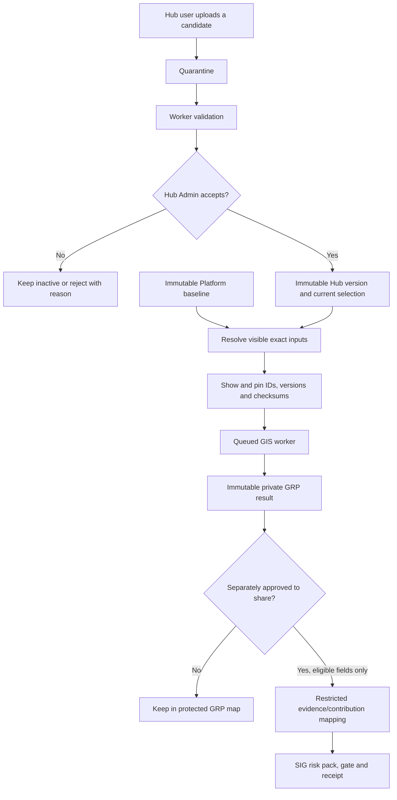
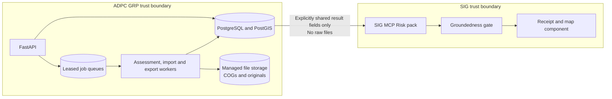

# GRP MVP 1 Project Handover

**Updated:** 4 October 2026. Whole Bangkok (ADR-0053); daily research archive (ADR-0055); live flood evidence in the Planner, steps 1-4 (ADR-0056); Global Risk live-feed plan revised against its source code; DDPM reports design; proposal for the dev team in `docs/proposals/`. Branch `pilot/river-watch-and-bangkok-flood`, not pushed. **Next agent: read Section 0, "4 October (latest): roadmap input for the dev team", first.** Before that: 3 October 2026 (Bangkok flood pilot slices 1-7, ADR-0038 to 0051).

**Repository:** <https://github.com/kovitad/ADPC_GRP>

**Delivery status:** The complete Thailand Hub bootstrap is implemented and proven against the
real local bundle. `python -m grpcli.bootstrap install-thailand` hashes all nine supported source
collections, queues them in dependency order, waits for the worker and activates one compatible
immutable release. The successful local release contains **77 provinces, 928 supported districts,
7,436 supported sub-districts, 10,303 shelters, 8,199 volunteer centres, 1,533 early-warning
resources, 80,397 village points, RP100, and separate child, older-person and disability display
layers**. Re-running the installer reuses completed imports and safely retries only failed,
unpublished jobs. The Data Library shows the activation state of every source. The assessment and
Planning selectors now group one exact **Recommended · Ready** shelter version above clearly
labelled previous versions, with bilingual title, record count and short immutable version ID.
The current real shelter version is `a18b19dd` (`grp-shelters/7`, assessment-ready, 10,303 records); on 28 September the older identical copies, including `61a17773`, were deleted from the sandbox (Section 0).
It correctly maps the delivered `สถา` column to facility name, `สถ_1` to supporting unit and `รอง`
to capacity. A fresh Chiang Yuen assessment `01a0d226-8c97-7278-8b2e-f4f1cd947e71` completed with
all nine real names, including `อบต.นาทอง`; older versions remain immutable for reproducibility.

Claude's `claude/vibrant-tesla-5iarzt` through `12a3fa7` is integrated by reviewed merge `2ecc733`.
This includes the bounded background SIG queue, lookup timeout cleanup, resilient profiler,
baseline-loader support reference, label-length guard and safer Docker reset. The merge preserved
the user-owned untracked planning documents. Its shelter-field ADR originally reversed two
truncated Thai columns; that was corrected against the real source and proven by re-import and a
fresh assessment. The nine-source installer remains the deployment path for the complete release.
**457 tests pass, 2 PostgreSQL-only tests skip, Ruff is clean, and the local API/database/worker
stack is healthy.**

**Latest planning integration fix:** short assessment labels are no longer sent directly to SIG.
The selected catalogue boundary supplies administrative level, province and country (for example,
`KANTHARAROM District, SI SA KET, Thailand`), while the returned SIG AOI must still pass the exact
area gate. The decision panel now reports area-scoped volunteer centres, early-warning resources
and villages, exposes the three local vulnerability rasters as display-only context, and shows
reported shelter capacity/supporting-unit details. Volunteer contact fields are excluded from map
API responses. Supporting context never changes a locked assessment or creates a risk score.
For Kanthararom, the current local data resolves to 34 evacuation centres, 18 civil-defence volunteer centres, no
early-warning resource records and 175 village locations; the three national vulnerability
indicator maps are available as display context.

**VM deployment readiness:** both Ubuntu modes now carry the data workflow. The shared-host
launcher uses ignored `.local/data-in`; the dedicated staging Compose mounts
`/srv/grp/bootstrap-data` read-only at `/srv/grp/data-in` for API/worker. The dedicated bootstrap
accepts `--admin-email` plus `--bootstrap-thailand-data`, provisions the Platform Admin/ADPC Hub,
runs the installer, and prints its status. Worker raster scratch is disk-backed at `/srv/grp/tmp`
rather than the previous 64 MB in-memory `/tmp`. This is implemented and Compose/shell validated,
but has not yet been executed on the staging VM or pushed from the current branch.

**Implemented point-data decision:** `.local/data-in/evacuation_centers` contains three different operational
point sources, not three interchangeable shelter files: 10,303 shelters, 8,199 civil-defence
volunteer centres and 1,533 early-warning resources. They are imported as three explicit,
independently versioned roles. Only shelters appear in the assessment input selector; volunteer
centres and early-warning equipment are separately labelled optional map layers. See
[`docs/preparedness-point-data-design.md`](docs/preparedness-point-data-design.md).

**Multi-level planning implementation:** the administrative delivery contains 77 province, 928 district
and 7,436 sub-district polygons from edition `2025-10`. District and sub-district are now
user-selectable levels inside one version-pinned hierarchy. The importer derives the Thailand
country outline from the 77 provinces because the delivered `nation` file contains only Samut
Songkhram; the original file is retained for provenance and never presented as national coverage.
The 80,397 village records remain point context, not boundaries. When GRP analyzes a sub-district,
optional SIG evidence remains parent-district-wide context; its totals are never disaggregated or
combined. See
[`docs/multi-level-boundary-planning-design.md`](docs/multi-level-boundary-planning-design.md).

**Thailand Hub bootstrap implementation:** ADR-0022 defines importing the complete ~2.1 GB Thailand source
tree from a checksum-pinned external bundle during deployment: boundaries/hierarchy, all three
preparedness-point roles, RP100 and three separate vulnerability rasters. Source bytes stay out of
Git/images/database. An idempotent CLI validates, converts and activates one compatible baseline
release for the ADPC Hub; future Hub uploads remain immutable explicit overrides. The hierarchy,
three point roles, RP100 and three vulnerability display conversions are now implemented and
activated locally. `release.yaml` authority metadata, admin-settings export/apply and production
Hub-local approval remain next.
The local bundle
becomes the primary planning evidence, while SIG is optional for missing schools/hospitals/roads,
documents/feeds and explicit cross-Hub/public exchange. A demo database may be rebuilt without a
backup after exporting only allow-listed admin/Hub/AI/approved-recipe configuration; secrets remain
in protected files. See
[`docs/thailand-hub-bootstrap-data-plan.md`](docs/thailand-hub-bootstrap-data-plan.md).

**External flood scenarios:** the supplied runbook itself names only regional RP100, but the
reviewed SIG implementation at `6479521` registers JRC regional RP10, RP20, RP50, RP100, RP200 and
RP500 layers (no RP25). ADR-0023 treats these 1 km, 2016-11 layers as optional district-wide
screening, discovered from live capabilities and fetched with an exact `assemble_pack` hazard.
They are not local assessment inputs and their counts are not merged with ADPC RP100. A read-only
lookup creates no receipt; `ui_embed(hazard_map)` remains behind explicit public-record confirmation.
See [`docs/adr/0023-sig-return-period-layers-are-external-screening.md`](docs/adr/0023-sig-return-period-layers-are-external-screening.md).

**Handing over:** first execute the reviewed shared-SIG proof in [`docs/shared-sig-contribution-e2e-plan.md`](docs/shared-sig-contribution-e2e-plan.md). The local preview proved file compatibility only; it did not write to the shared service. Before the external write, replace the placeholder direct URL and confirm the licence, vintage, source-name mapping and repeated-coordinate decision. Then record one real contribution ID, test its contributor-only preview, obtain SIG review, prove `live=true`, and repeat `assemble_pack` as a fresh user. Do not retry a timed-out submit blindly and do not send the raw Shapefile or contact fields. In parallel, restart Docker Desktop only if its CLI is still unresponsive, rebuild API/worker, sign in again, then run the local Data library → Planning browser acceptance. Production Hub-local ownership/approval is still deferred. The Ubuntu launcher still needs its first host execution.

The three point roles and multi-level hierarchy are now implemented. Keep volunteer centres and
early-warning resources out of the evacuation-place selector, and never expose volunteer `TEL`,
`FAX`, `EMAIL` or full address. Villages remain point context rather than boundary coverage. The
next data-governance work is a signed release manifest, production Hub approval and a generic
role-aware upload flow; browser boundary uploads remain behind the existing upload security gate.

For the next deployment-data slice, add the secret-free signed/approved `release.yaml` authority
manifest on top of the runtime byte inventory; do not copy `.local/data-in` into Git or the
container image. The three vulnerability rasters are registered separately and remain display-only
until DEP-07 supplies an approved calculation method. Add the allow-listed admin settings export/apply command
before rehearsing a destructive blank-database reset. The no-backup rule applies only to this
rebuildable demo, not production.

For additional return periods, implement ADR-0023 after recording the live risk-pack capability
fixture. Offer only layers reported live, under **External SIG screening**. The likely requirement
is RP20 and RP50, not RP25. Keep local shelter assessment on the imported RP100 until approved local
RP20/RP50 rasters and methods exist.

**Baseline:** `GRP-ARC-001` v2.2. The secure copy `2026-09-15_GRP-ARC-001_MVP1_Solution_Architecture_Specification_v2.2.docx` is at the repo root and ignored by Git. On top of it sit the ADRs and product-owner decisions in Section 6.

> **Start here if you are a new agent:** read Sections 1, 3, 4 and 10, then `AGENTS.md`. Do not merge `experiment/planning-chat`. Do not store secrets, and do not print the `.env` values.

---

## 0. Start here (sessions of 24 September-4 October 2026)

### 4 October (latest): roadmap input for the dev team

This repo is the owner's exploratory test bed. This section is written so the owner can turn it
into a roadmap for the dev team: what was proven, the workstreams, and the open decisions.
Branch `pilot/river-watch-and-bangkok-flood`, not pushed. 1,064 fast and contract tests pass,
2 skip; Ruff is clean. Stack rebuilt with `scripts/docker-desktop.ps1`.

#### Done and verified today

| What | Evidence | Record |
| --- | --- | --- |
| In-page bmatraffic camera pictures | checked by the owner in a signed-in browser | ADR-0051 |
| **Whole Bangkok:** 50 districts; rain stays on 4 to keep Longdo calls flat | first live run (03:24 UTC): **123 active incidents across 21 districts**, 878 ms; 1,067 OSM facilities | ADR-0053, `100931d` |
| **Research archive:** each finished UTC day saved as state-change tables, no personal data | first real day (3 Oct): 2.9 MB; 17,493 road states, 4,316 reports, 158 incidents, 784 incident events, 146 facility changes, 2 labels; no links or provider IDs | ADR-0055, `2e0adf9`, data card `docs/data/flood_research_archive_datacard.md` |
| Backup capture cleaned | `reports.csv` IDs and text hashed, links dropped; the 29 earlier files cleaned with the owner's yes; capture restarted (PID 11660) | ADR-0055 |
| Global Risk live-feed plan, revised against its source code | `SERVIR-AI/global-platform` at `a8a43c2` read | `docs/pilot/2026-10-03_Global_Risk_Live_Feed_Plan.md` |
| DDPM reports design | four reports by planning horizon from one fact bundle | `docs/pilot/2026-10-04_DDPM_Planner_Reports_Design.md` |

Facts that shape the roadmap:

- **Shared codes.** GRP's boundary codes and the flood pilot's are the same (Chatuchak `1030`,
  sub-districts `1030xx`), so live data joins the DDPM baseline directly.
- **No DDPM shelters in Bangkok.** The delivery names 75 provinces, not Bangkok. The 8 points first counted in Bangkok are records from other provinces whose coordinates land there, all flagged `district_name_mismatch` (309 such records nationwide); they are now left out. There are 55 volunteer centres
  in Bangkok, and no villages. That BMA holds the capital's local data is an inference, to
  confirm with DDPM.
- **Global Risk feeds have two traps.** `generic_json` feeds are cached for **6 hours**, and an
  **empty list counts as a failure**. Unknown manifest fields are refused, the URL must be
  anonymous, and staging and withdrawal work.
- **GEOGLOWS is rivers only.** It forecasts river flow, not Bangkok street flooding. It has no
  "high" threshold, because upstream return periods fail, and its 2 reaches are not confirmed.

#### Workstreams (for the roadmap)

**W1. Live flood monitoring, Bangkok** (built; Gate A local demo)
- **Has:**
  - Floodboard evidence, incidents and confidence;
  - facilities, cameras (bmatraffic relay locally) and officer checks;
  - replay, grounded answers and whole Bangkok.
- **Next:**
  - a downloadable **shift report** from the fact bundle;
  - the **camera check** (water, partial water or dry): up to 2 cameras per active incident every
    15 minutes, through `api/ai_gateway.py`, about $1.70 a day at worst (example priced with
    Claude Haiku 4.5). It needs BMA's permission first.
- **Blocked by:** BMA terms for cameras (request drafted); the relay is local only.

**W2. Global Risk live feed** (planned; drafts ready)
- **Has:** the plan; two manifest drafts (`docs/pilot/global_risk_manifests/`); maintainer
  questions; the Floodboard credit note.
- **Next:**
  - **Step 1:** the feed endpoint `GET /api/v1/pilot/flood/{pilot_id}/feed.json`, protected for
    now, with ADR-0052;
  - then the districts feed first (never empty), and incidents on a flooding day.
- **Blocked by:**
  - a **public HTTPS host** (the Ubuntu deployment, never run yet);
  - the maintainers' answers on the **6-hour cache** and **empty lists**;
  - sending the drafts.

**W3. DDPM planner reports** (designed)
- **Has:** the district Word document (ADR-0033); replay; grounded answers.
- **Next:**
  - the fact bundle shared by every output;
  - the live shift report;
  - a province pre-season roll-up;
  - an event (after-action) summary from the archive.
- **Blocked by:** DDPM sample reports (D1) and who the Bangkok live report is for (D2).

**W4. River forecasts (GEOGLOWS)** (Phase A built; display only)
- **Next:**
  - hydrologist-confirmed reaches and the districts each affects (D3);
  - a daily reach summary, which is the easiest first Global Risk contribution, since it is daily
    and never empty (D4);
  - HAND (Phase B) is still blocked on local hydrology data.
- **Rule:** any "high" threshold is a scientific-method change, so it needs an ADR and scientific
  approval.

**W5. Research archive for data scientists** (built today)
- **Next:**
  - add GEOGLOWS runs and camera-check labels once they run;
  - one external backup (it is a single copy on a laptop);
  - move to the Ubuntu host;
  - an optional GeoParquet copy;
  - read-only access for ADPC data scientists.
- **Watch:** the worker archives before retention every hour. `python -m grpcli.flood_pilot
  archive` does it by hand.

**W6. Insurance and partners** (future; nothing to build)
- **Already secured:** the archive and pinned rule versions.
- **Still needed:**
  - a GRP-side audit trail (Global Risk receipts keep no fetched rows);
  - licences for commercial use: OSM share-alike, DDPM permission, GEOGLOWS to confirm;
  - a separate partner channel.
- **Limits:** crowd reports are never a payout trigger, and no report states a loss.

**W7. Live flood evidence in the Planner, Bangkok** (steps 1-2 built 4 October: `5f18f81` stores `district_codes` in the worker, and was checked live with 145 of 145 active incidents coded; `75adfbf` adds the Planner live layer `GET /api/v1/maps/live-flood`; step 3 adds the `live_flood` answer mode (D7 rain yes, D8 wording approved, never cached; Lat Krabang checked on real data); step 4 adds DDPM evacuation centres to the facility check (read from the data library, not Git; flagged and synthetic records left out, so none in Bangkok); the district summary Word download gains section 6 "Live reported flooding" with up to 4 credited BMA camera pictures, and a Thai version (`lang=th`, button "ดาวน์โหลดสรุป (ไทย)"); the owner reports BMA said camera pictures are public data; pictures come only from bmatraffic cameras within 400 m of a listed incident (checked on real data: Suan Luang 2 pictures; Lat Krabang none, because its nearest cameras are BMA flood cameras whose relay fails); step 5, the feed endpoint, is next; nothing outside the code blocks
it, so do it before W2 submission)
- **Plan:** `docs/pilot/2026-10-04_Planner_Live_Flood_Integration_Plan.md`.
- **Steps:**
  1. district codes on incidents, in the worker;
  2. the live layer "Reported flooding on roads (live, not a flood map)";
  3. live facts in Planner answers, with `snapshot_at` in the cache key and fixed "no warnings"
     wording;
  4. DDPM shelters in the exposure run (none in Bangkok once misplaced records are left out);
  5. the feed endpoint on the same fact builder.
- **Rules:** live data never enters an assessment; sub-districts roll up to their district; no
  warnings. ADR-0056.

#### NEXT TO IMPLEMENT: facilities and cameras on the Planner's live map (W7b)

**Status:** BUILT on 4 October 2026 with the recommended answers (both on, cameras grouped,
"Live now" list included); see ADR-0056 item 6.
- On real data: Suan Luang 3 facilities and 16 cameras (3 with pictures); Lat Krabang 2
  facilities and 19 cameras.
- The running app was updated by copying the two Python files into the API container and
  restarting it. `web/` is a live bind mount, so page changes need no rebuild. Rebuild the image
  properly when memory allows.
- **Not yet checked in a browser** (the Chrome extension was not connected): the owner's check
  is the acceptance test.

Design:
`docs/pilot/2026-10-04_Planner_Live_Map_UX_Design.md`, which has ASCII mock-ups of every card.
The owner asked for "evacuation centres near flood points and cameras, and when I click each
point it details out, careful about UX".

**What the planner gets** (Bangkok areas, under the existing live switch):
- **Two sub-switches**, each with a count: "Facilities with flooding reported nearby" and
  "Cameras near reported flooding". The time shows beside the heading and turns amber after
  2 hours.
- **DDPM evacuation centres with flooding nearby:** the existing pin gets an orange ring and a
  wave badge, not a second pin.
- **Schools, hospitals and clinics:** ringed letter markers.
- **Cameras:** a glyph with a green dot when GRP can show a picture, grey otherwise. They are
  grouped per incident at district zoom and shown one by one from zoom 15.
- **Cards** all follow one pattern: title, plain meaning, facts, related-item buttons, "what this
  is not", source and time. They are at most 300 px wide, and a bottom sheet on a phone.
  - **Incident:** the confidence word with its reason in plain words, depth, reports, last
    report, and "nearby facilities/cameras" buttons.
  - **DDPM centre:** a separate "LIVE · as of" block above the existing assessment content; the
    two never mix.
  - **Facility:** the distance, and access "not confirmed" (amber when a frontage road is closed
    or risky).
  - **Camera:** a live picture through the relay, refreshing every 10 s while open, pausable,
    stopped on close or after 10 minutes; the official viewer link otherwise. The note says "an
    empty road is not proof it is dry".
- **A "Live now" list** in the panel, which can be used with a keyboard and flies to each item.
- **States:** loading, no incidents ("no report is not proof that it is dry"), stale, camera
  failure, sub-district roll-up.

**Build steps:**
1. **API** (`core/flood_evidence/planner_layer.py`, `GET /api/v1/maps/live-flood`). Add:
   - `facilities`: `potentially_exposed` in the district, with incident links and the computed
     access state; no officer-confirmed state (D2);
   - `cameras`: within 400 m of incident roads, deduplicated, at most 40, with the name in both
     languages, `picture_url` only for relay cameras, and the viewer link.

   Tests cover these. No new route.
2. **Map** (`web/planning.js`, `planning.html`, `planning.css`): sub-switches with counts, ringed
   markers, rings on DDPM pins, camera grouping by zoom, the grouped legend, and remembering
   choices.
3. **Cards:** incident, facility, the DDPM live block and camera, with picture refresh and pause.
   Built with DOM only, never raw HTML from data.
4. **"Live now" list** in the panel.
5. **Browser check** on Suan Luang (pictures) and Lat Krabang (none), at desktop and phone widths,
   with screenshots.
6. ADR-0056 amendment, then the handover.

**Rules:**
- not a flood map, not a warning;
- live data never enters the assessment;
- "flooding reported nearby", never "flooded";
- access is never assumed;
- no officer checks;
- credits for Floodboard, OSM, DDPM and BMA traffic cameras.

**Owner questions before building** (the recommended answer comes first):
- sub-switches on by default (yes / off);
- group cameras at district zoom (yes / always individual);
- include the "Live now" list now (yes / later).

**After W7b:** step 5 of the Planner plan (the Global Risk feed endpoint, backlog E1-1), then E3
(DDPM reports).

#### BUILT: GEOGLOWS river outlook in the district summary (ADR-0059, 4 October 2026)

- **What:** section 7, "River outlook (GEOGLOWS, exploratory)", in English and Thai. It has:
  - the trend;
  - the median peak and band;
  - the peak and run times;
  - freshness;
  - a numpy-drawn chart;
  - fixed caveats.

  "What this cannot tell you" is now 8, and "Sources" is 9.
- **Coverage:**
  - 28 of 50 Bangkok districts, using their River Watch main reach;
  - Nonthaburi 1204 (canal), and 1201, 1202 and 1206 (Chao Phraya);
  - other districts get a one-line gap.
- **Code:** `api/river_outlook.py`, `_river_section` in `core/summary_docx.py`.
- **Checked:** real data for Bang Phlat and Bang Bua Thong, rendered through Word in both
  languages. Not yet checked through a signed-in download.
- **Open:** D3 (reaches confirmed by a hydrologist) still applies; the section says "not
  confirmed" until then.

#### BUILT: Planner "Live layer" with one switch per source (ADR-0058, 4 October 2026)

- **What:** Layers → "Live layer (Bangkok, Nonthaburi)", 13 switches, all off by default:
  - roads with flooding reported;
  - five report kinds;
  - OSM facilities and DDPM centres;
  - four camera providers;
  - outlines.

  Counts are shown, and the incident, facility and camera cards keep working.
- **Routes:** `GET /api/v1/maps/live-flood/summary` and `.../sources/{name}`, trimmed with no
  officer data.
- **Checked:** with real data in a headless test server. Not yet checked signed in.
- **Fixed today:**
  - the Layers button had opened the chat's Global Risk picker, because two elements shared
    `data-layers` since `894eca1`;
  - a cached page could break start-up;
  - version tags are now checked by a test.
  - live points did not open cards once a district was selected, because the centres' canvas
    covered the live canvas (`01f4e3d`). That was not enough: the selected district's filled
    shape also covered the canvas, so live points are now SVG in the live pane, above the district
    shapes, and clicks on empty space still reach the district.

#### BUILT: the live pilot covers Nonthaburi (ADR-0057, 4 October 2026)

- **Coverage:** 56 districts. Outlines come from `core/data/flood_pilot_bangkok_areas.json`;
  `in_pilot()` replaces the `10` prefix checks.
- **DDPM:** 64 evacuation centres in Nonthaburi.
- **Pak Kret:** 52 cameras, relayed on screen only. A live picture was checked through the relay.
- **Drafts to send:** the Pak Kret request and the Nakhon Nonthaburi feed request.
- **Follow-up:** run `python -m grpcli.osm_assets_capture --pilot bangkok` again when Overpass
  answers; it timed out on 4 October. Nonthaburi incidents start at the first snapshot after
  deployment.

The validation and plan below are kept for reference.

#### (Reference) expand the live pilot to Nonthaburi (validated 4 October 2026)

See `docs/pilot/2026-10-04_Nonthaburi_Expansion_Validation_and_Plan.md`. **Validated:**
- Floodboard already covers all six districts: 314 road segments and 82 reports in 24 hours.
- Pak Kret municipality has **52 working cameras** (JPEG, no login; a test picture was live).
- Longdo/iTIC has 21 Nonthaburi cameras, which are the same Pak Kret ones.
- **64 usable DDPM evacuation centres**, against none in Bangkok.

**Rejected:**
- the World Flood CCTV aggregator (cameras it doesn't own; automated use discouraged);
- the Nakhon Nonthaburi GIS (no public interface; would need reverse-engineering);
- the old BMA cpudapp link (404; bmatraffic.com is already used).

**Gap:** cameras exist only in Pak Kret.

**Code changes:** outlines from the GRP boundary table, area checks instead of the `10` prefix, a
Pak Kret camera registry and relay, OSM capture, and naming. About a day of work.

**Waiting on the owner:** go-ahead; how to handle Pak Kret's terms (none stated); whether to
request a feed from Nakhon Nonthaburi.

#### Open decisions (owner)

| ID | Decision | Unblocks |
| --- | --- | --- |
| D1 | Get one DDPM situation report and one pre-season plan as samples | W3 report formats |
| D2 | Who the Bangkok live report is for (DDPM central, BMA or both), and whether Planners see officer checks | W1/W3/W7 wording and access |
| D3 | Who confirms GEOGLOWS reaches and their districts (ADPC or RID hydrologist) | W4 |
| D4 | First Global Risk contribution: the GEOGLOWS daily summary, then Bangkok districts? | W2/W4 |
| D5 | Look for a Floodboard-like source outside Bangkok, or stay Bangkok-only | W1 scale |
| Host | Run the Ubuntu deployment and choose a permanent domain | W2, W5 |
| Send | Floodboard credit note, maintainer questions, BMA addition (all drafted, none sent) | W1, W2 |
| Model | Camera-check model (the gateway is OpenAI-style today) | W1 |
| Backup | Where the archive's external backup goes | W5 |
| D7 | ~~Rain for Planners~~ decided 4 Oct: yes, labelled as context. River Watch for Planners still waits on D3 | W7 |
| D8 | ~~Official warnings wording~~ approved 4 Oct (TMD, DDPM, BMA); in `core/flood_evidence/planner_answer.py` | W7 |

#### Decided today

- Feed: incidents plus districts; the route stays protected until a host exists; the Ubuntu host;
  the name `bangkok_flood_incidents_live`.
- Whole Bangkok.
- Archive: start now; local, then Ubuntu; strip report text and delete the old text; stable
  officer pseudonyms.
- D7: rain may appear in Planner answers, labelled as context. D8: the fixed "no warnings" text.

#### Why this work exists (the case, in short)

The full case is in the proposal for the dev team,
`docs/proposals/GRP_Live_Flood_Intelligence_Proposal_2026-10-04.docx`.

- **Problem.** GRP answers pre-season questions (RP100 scenario, shelters, population). It had no
  picture of flooding now and no days-ahead outlook. Bangkok flood information is spread across
  many systems. The spec v0.3 calls this "lack of a shared, current, evidence-linked
  interpretation of what the data means for a decision". DDPM planners, and later insurers, need
  evidence → incident → consequence → decision, with history to learn from.
- **Live data.**
  - Floodboard is the only usable open live source (CC BY 4.0). BMA's catalogue has no water-level
    data and no licence.
  - GRP turns it into incidents with confidence words, facility exposure, a "what changed" view,
    grounded answers and replay.
  - **It describes flooding now and never issues a warning (D8).**
- **GEOGLOWS.**
  - A free, global, daily 7-day river-flow forecast. It is the only days-ahead source we hold, for
    riverine provinces (Chao Phraya, Nonthaburi/Bang Bua Thong).
  - It is not street flooding, it has no "high" threshold (upstream return periods fail), and
    its reaches are unconfirmed.
  - HAND depth (Phase B) needs local hydrology.
- **Consolidation.** One fact bundle per (area, window, audience) feeds the Planner, DDPM
  reports, the Global Risk feed and the archive, so numbers agree everywhere.
- **History.** The daily research archive keeps state changes, labels and rule versions with no
  personal data, so models and insurance-grade event histories can be built later.

#### Developer detail (where things are)

| Area | Files and entry points | Notes |
| --- | --- | --- |
| Pilot config | `core/data/flood_pilot_bangkok.json` (`demo_corridor` = 50 districts, `rain_areas` = 4) | ADR-0053 |
| Ingest and incidents | `core/flood_evidence/ingest.py`, `incident_store.py` (`update_incidents` stores `district_codes`), `incidents.py`, `geo.district_codes` | worker only; ADR-0041, ADR-0056 |
| Facilities | `assets.py` (OSM), `ddpm_shelters.py` (`pilot_assets` = OSM plus the current DDPM shelter version, read from the DB), `exposure.py` | ADR-0040, ADR-0056 |
| Facts and answers | `briefing.build_facts`, `answer.py` (gate), `planner_answer.py` (`NO_WARNINGS`, officer fields removed) | ADR-0043, ADR-0056 |
| Planner | `GET /api/v1/maps/live-flood` (`api/maps.py` → `planner_layer.py`); `live_flood` mode in `api/planning.py`; `web/planning.js` (`syncLiveFlood`, `data-live-flood-toggle`) | live answers never cached |
| Archive | `archive.py` (`export_pending`, run by the worker before retention); `python -m grpcli.flood_pilot archive`; storage `research/flood/bangkok/v1/`; salt `private/flood-archive-salt` | ADR-0055; data card `docs/data/flood_research_archive_datacard.md` |
| Backup capture | `grpcli/floodboard_capture.py` (cleans `reports.csv`; `--clean-existing`); restart it after a reboot | PID changes on restart |
| Global Risk feed | plan `docs/pilot/2026-10-03_Global_Risk_Live_Feed_Plan.md`; manifests `docs/pilot/global_risk_manifests/`; endpoint **not built** (ADR-0052 reserved) | 6-hour cache and empty-list findings |
| Restart | `scripts/docker-desktop.ps1` only (keeps `SERVIR_AUTH_CLIENT_ID`); a rebuild took 10-15 minutes on 4 October | never a raw `compose up` |

Verified on 4 October 2026:
- 145 of 145 active incidents carried district codes (06:47 UTC run).
- The live layer: Lat Krabang 21 incidents and 112 roads; sub-district 103005 rolls up to
  Chatuchak; 3415 is refused.
- The live answer for Lat Krabang (computed path).
- 8 DDPM points found in Bangkok, later shown to be misplaced records from other provinces and left out.
- First archive day: 2.9 MB.
- Tests: 1,086 pass, 2 skip.

Not yet verified:
- an AI-worded live answer in a signed-in browser;
- DDPM centre exposure rows (they start at the first snapshot after the step 4 rebuild);
- the Planner layer seen in a browser.

### 3 October (latest): bmatraffic pictures inside the page (ADR-0051)

- **Window failed:** the small window stayed on bmatraffic's home page. Cutting its `opener`
  also stopped GRP from sending it on to the camera. It has been removed.
- **Owner's choice:** a relay for the local demo only.
  - `core/flood_evidence/camera_relay.py` and `GET .../cameras/{camera_id}/frame.jpg`.
  - On demand, shared, at most one picture a second per camera and 8 a second overall, kept in
    memory only.
  - `BMATRAFFIC_RELAY_ENABLED` is set only in `compose.desktop.yml`; when it is off, cameras keep
    the new-tab link.
  - The page refreshes an image inside the card and pauses after 10 minutes.
- **Live check:** camera 1362 gave a real 21.6 KB picture through the running app.
  Not yet checked in a browser (the Chrome extension was not connected).
- **Fix, same day:** every camera showed the same picture, because bmatraffic sends the session's
  last-opened camera. Now there is one session per watched camera (idle sessions are dropped
  after 30 seconds, at most 16). 1362 and 1108 checked live.
- **Checked by the owner (4 October):** the in-page bmatraffic pictures look good in a
  signed-in browser.
- **BMA request:** now says what the demo does and asks permission before wider use (Gate B).
- **Tests:** 1,089 passed, 2 skipped; Ruff clean.

### 3 October: camera fixes and source switches on the map

- **bmatraffic was blank in GRP:** its pictures need a bmatraffic session cookie (`SameSite=Lax`),
  which a browser never sends from inside our page. The cameras now open in a new tab. They are
  not proxied (see the ADR-0050 amendment). In-page players (Longdo HLS, BMA MP4) rank first.
- **BMA flood relay:** answers HTTP 500 upstream. The player gives up after 12 seconds with a
  clear message.
- **Map:** one switch per source (roads, reports by original source, facilities, cameras by
  provider, outline), remembered in `localStorage`.
- **Checked by the owner (3 October):** the layer switches work, and bmatraffic cameras open and
  play in a new tab.
- **Then:** bmatraffic cameras open in a small reused window beside the map. On the first click
  it opens bmatraffic's home page so the session is set, then moves to the camera (ADR-0050
  amendment 2). A new-tab link is kept as a fallback. Not yet checked in a browser.

### 3 October: Global Risk live-feed plan (plan only)

- **Written:** `docs/pilot/2026-10-03_Global_Risk_Live_Feed_Plan.md`. Nothing has been built,
  submitted or registered.
- **Key finding:** Global Risk already serves a contributed live feed (`usgs_quakes_m45_month`)
  as `generic_json` with an external call-out. That is the pattern to copy: GRP serves
  `feed.json` and Global Risk keeps only a manifest.
  - Global Risk must be able to reach the URL, so a public HTTPS host is the real blocker.
- **v1 scope:** incident records only, with confidence and reasons. No report text, usernames,
  camera links, Longdo events or rain.
- **Next:** the owner answers the 6 decisions at the end of the plan. Then Step 1 (the endpoint,
  tests and ADR-0052) can be built locally under Gate A.

### 3 October: bmatraffic.com cameras first (ADR-0050)

- **Requested:** the owner asked to use `bmatraffic.com`, which is faster.
- **Built:** `grpcli/bmatraffic_cameras_capture.py` keeps 520 Bangkok cameras, with internal IPs
  dropped. The new live kind `iframe` embeds `PlayVideo.aspx?ID=` in a sandbox.
  - The site is http only; `allow_http_links` is declared for this source only. This needs
    HTTPS or a proxy before Gate B.
  - Ranking is bmatraffic, then Longdo HLS, then the BMA relay. 1,413 cameras in all.
- **Next:** the owner asked for a **plan** (not built) to publish a live feed from this data to
  Global Risk and later serve it through MCP:
  `docs/pilot/2026-10-03_Global_Risk_Live_Feed_Plan.md`. Routing (Longdo part 3) is on hold.

### 3 October: Longdo APIs. Part 2, rain context (ADR-0049)

- **Built:** `core/flood_evidence/weather.py` and table `flood_weather` (migration
  `20261003_0027`).
  - A worker step that runs only when the radar time changes, for the 4 districts and the top 10
    incidents: rain now (`/area`) and +15/+30 minutes (`/forecast/area`).
  - `/polygon` answers 403 on this key, so districts use circles.
  - The key goes `.env` → launcher → `longdo_api_key` secret file → `LONGDO_API_KEY_FILE`, and
    is never logged (`httpx` logger at WARNING) or stored.
- **On the page:** a "Rain now" card, rain on each incident, a coverage row and fact `W`.
- **Next:** switch cameras to bmatraffic.com (the owner's request), then part 3, routing.

### 3 October: Longdo APIs. Part 1, flood events (ADR-0048)

- **Chosen:** the owner chose all three Longdo integrations: events, rain and forecast, and
  routing. The key is in `.env` as `LONGDO_API_KEY`; never print or log it.
- **Built:** source `longdo_events` (public feed, no key). It keeps flood events only, in Bangkok
  time, drops expired ones, skips points outside the region, and maps contributors to families
  (`doh`, `itic`, `longdo_user`). DOH is official, like BMA. The direct copy beats Floodboard's
  relay of the same `longdo:<eid>`.
- **Freshness** comes from `start`, so the morning DOH statuses age out of the 6-hour window.
- **Next:** part 2, rain now and the 30-minute forecast (Weather API, key server-side, live
  only, never evidence); part 3, routing access (read-only, a separate `route_check` field).

### 3 October: live camera views, BMA plus iTIC/Longdo (ADR-0047)

- **BMA stream hosts are not public** (no DNS). BMA's page plays them through its relay
  `/api/proxy?rtcUrl=…`, which returned HTTP 500 for every camera tried from here.
- **Added iTIC/Longdo:** the documented feed `camera.longdo.com/feed/?command=json`. 21 Bangkok
  cameras with HLS, live and playable by other sites. `grpcli/longdo_cameras_capture.py` writes
  `core/data/flood_pilot_bangkok_cameras_longdo.json`. The registry loads all camera files
  together (893 cameras).
- **On the page:** "▶ Play live here" (hls.js from jsDelivr, or MP4 through BMA's relay), one
  player at a time, a 15 s failure message, camera markers that open a camera card, and a credit
  line on each player.
- **Verified by the owner:** a Bang Sue iTIC/Longdo camera plays live in the page (3 October).
  The owner also reports that BMA's own page plays video ("all working fine"), so BMA's relay is
  up. The HTTP 500s seen here came from command-line requests, not a browser. Still to confirm:
  whether a BMA camera (for example `EB-LB-62-C1` near the top Lat Krabang incident) plays inside
  GRP. If it does not, ask BMA to allow GRP's page to use the relay.

### 3 October: real BMA cameras (ADR-0046)

- **Source:** BMA's flood site serves its camera list without a login. The owner approved it for
  the demo.
- **Built:** `grpcli/bma_cameras_capture.py` wrote 872 cameras inside Bangkok to
  `core/data/flood_pilot_bangkok_cameras.json`, with the source, SHA-256 and "terms not
  confirmed". The raw download is in `.local/bma_cameras.json`.
- **How cameras are used:** each is an `external_viewer` with a live-view link opened in a new
  tab, status unknown, never ingested. The page shows the BMA sensor each camera watches.
- **Live:** cameras sit 30 m from the top conflicting Lat Krabang incident (sensor `FL.LKB.01`).
- **The BMA request** is now about permission (terms, embedding, status, headings).
- **Tests:** 1,048 pass and 2 skip.

### 3 October: retention (ADR-0045), and the backup capture hung

- **Retention:**
  - raw downloads 14 days (whole UTC day folders, deleted only after the commit; fetch rows and
    SHA-256 kept);
  - report IDs 14 days, then `pruned:`;
  - facility states 7 days;
  - runs hourly in the worker, live pilots only.

  Replays refuse periods whose raw data has been removed. Raw storage is about 30 MB a day, so
  roughly 0.4 GB at 14 days.
- **Backup capture:** `grpcli/floodboard_capture.py` hung silently after 12:12 (its urllib call
  has no overall deadline). It was restarted at 14:40. The worker's own pulls kept saving, so
  nothing was lost. The capture is now only a backup; drop it once the worker has run cleanly
  for a day.
- **Tests:** 6 retention tests. 1,045 pass and 2 skip.

### 3 October: replay injections, slice 6b (ADR-0044)

- **Injections:** a synthetic report (source, depth or dry, time; placed at the map centre on the
  page), and a source outage. Synthetic IDs always parse as `synthetic_demo`, and incidents gain
  the reason `synthetic_evidence`.
- **Row locks** on `flood_replay`: worker steps use `SKIP LOCKED`, and changes wait. This fixed a
  real deadlock between the worker and a concurrent wipe.
- **Real check:** a synthetic 0 cm BMA reading turned a high-confidence incident conflicting, and
  a roads outage made health degraded. The test replays were deleted.
- **Tests:** 11 replay tests. 1,036 pass and 2 skip.

### 3 October: replay, slice 6a (ADR-0044)

- **Built:**
  - `core/flood_evidence/replay.py` and table `flood_replay` (migration `20261003_0026`).
  - `PilotConfig.base_id` and `clock`, with `now_for(config)` in every flood route.
  - A worker step: one stored fetch per idle pass.
  - Replay routes (list, create, read, advance, restart, delete).
  - On the page, `?replay=`: a purple REPLAY bar, the player, ages from the replay clock, officer
    writes off, and AI off.
- **Real check:** 10:00–11:40 replayed in 76 s and matched live runs exactly after 11:08. The
  test replay was deleted.
- **Tests:** 8 replay tests. 1,023 pass and 2 skip.
- **Next, slice 6b:** inject a synthetic report or a source outage into a replay.

### 3 October: grounded questions, slice 7b (ADR-0043)

- **Built:**
  - `core/flood_evidence/answer.py`: the prompt, the gate and the bilingual computed answer.
  - `POST /pilot/flood/{id}/ask`. It always returns the computed answer, with AI wording only
    when it passes the gate.
  - On the page: the "Ask about the situation" section.
- **Fixed before shipping:** the gateway's `channel` must be `web` or `mcp`.
- **Tests:** 17 tests with a fake provider. 985 pass and 2 skip.
- **Not verified:** a live AI answer. No provider call was made, to spare the owner's allowance.
- **Next:**
  - Slice 6, replay of the captured flood.
  - Real BMA and CCTV data once access is granted.
  - Retention for raw fetches before Gate B.

### 3 October: what changed and the fact bundle, slice 7a (ADR-0043)

- **Built:** `core/flood_evidence/briefing.py`, with tools named after the tweak and `build_facts`
  (labels S, C, I1–I15, F1…, L).
- **Routes:** `/changes` and `/facts`, with `area` and `since_minutes`.
- **On the page:** a "What changed" panel with windows of 30 minutes, 1 hour, 3 hours and
  6 hours.
- **The first incident run is a baseline,** at 11:08 Bangkok time on 3 October. Windows before it
  say so.
- **Tests:** 5 tests. 963 pass and 2 skip.
- **Next, slice 7b:** the AI question with a groundedness gate, falling back to the computed
  answer.

### 3 October: officer checks, slice 5b (ADR-0042)

- **Built:**
  - `core/flood_evidence/reviews.py` and table `flood_review` (migration `20261003_0025`).
  - `POST /pilot/flood/{id}/incidents/{incident_id}/reviews` with actions `flooding_seen`,
    `dry_seen` and `cannot_tell`.
  - `POST /pilot/flood/{id}/facilities/access` with actions `access_disrupted` and `withdraw`.
  - Audit events, typed bodies and notes of at most 500 characters.
- **Rules:**
  - Reviews count for 3 hours, and only while the incident still holds a reviewed road.
  - They never change the engine's confidence; they add `verification`.
  - "Officer saw dry" ranks first.
  - Facility `access_disrupted_confirmed` can only come from an officer and can be withdrawn.
  - A Platform Admin with no pilot-Hub membership is read-only. Placeholder cameras cannot be
    named in a review.
- **On the page:** the officer state, three buttons and a note on the incident card; the history;
  "Access is cut (I saw it)" and withdraw on the facility card; officer badges in the queue.
- **Tests:** 12 review tests. 948 pass and 2 skip. The stack is on `20261003_0025`.
- **Not verified:** a real signed-in POST. The owner should try one review after signing in.
- **Next:** slice 6, replay over the saved captures, or slice 7, grounded questions.

### 3 October: incidents, slice 5a (ADR-0041)

- **Built:**
  - `core/flood_evidence/incidents.py`, the pure grouping and assessment.
  - `core/flood_evidence/incident_store.py`, which keeps identity, merge and split, recession
    and events, and skips older snapshots.
  - `core/flood_evidence/geo.py`, shared distances and area tests.
  - Migration `20261003_0024`.
  - The worker runs it after exposure on each good roads snapshot.
  - Routes `/incidents` and `/incidents/{id}`.
  - On the page: a "Check first" queue and an incident card.
- **Rules:**
  - Families are BMA, Traffy and crowd. `cluster` and `news` never count.
  - Confidence: `conflicting` for fresh dry or 0 cm evidence within 100 m; `high` for BMA plus
    another family; `medium` for two families or BMA alone; otherwise `low`.
  - Freshness comes from the newest report.
- **Live at 11:15:** 58 open incidents in the four districts.
  - The first to check: Chao Khun Thahan and Lat Krabang roads, 92 segments, 36 reports, BMA
    readings, and three fresh "cleared" reports nearby.
  - The first pass took 4.8 s.
- **Tests:** 15 incident tests (spec A–D, merge, split, recede and close, out-of-order). 926 pass
  and 2 skip.
- **Next, slice 5b:** officer reviews and facility access confirmation.
  - Reviews are time-bound and store the road keys reviewed.
  - Every review is audited, with CSRF and the matrix covered.
  - Notes are capped and rendered as text only.

### 3 October: facilities near flooding, slice 4 (ADR-0040), and the sign-in fix

- **Demo area widened (later the same day):** the owner added Bang Kapi (1006) and Lat Krabang
  (1011) to `demo_corridor`, which now covers four districts. The OSM capture was re-run with one
  box per district and now holds 94 facilities. The BMA camera request now names all four
  districts.

- **Sign-in was "unavailable".** Restarting with raw `docker compose up` drops the shell-only
  `SERVIR_AUTH_CLIENT_ID`. **Always restart with `scripts/docker-desktop.ps1`.** After using the
  launcher, `/api/v1/auth/login` redirects to SERVIR again.
  - The only local account is `kovitad.janlakhon@adpc.net` (Platform Admin, adpc Hub Admin).
  - The owner wrote `janlakkon`. If that is a different SERVIR email, add it with
    `scripts/docker-desktop.ps1 -AdminEmail <email>`, but only once the owner confirms.
- **Facilities:**
  - `grpcli/osm_assets_capture.py` wrote `core/data/flood_pilot_bangkok_assets.json`: 52 OSM
    schools, hospitals and clinics in Bang Sue and Chatuchak, ODbL.
  - `core/flood_evidence/assets.py` sets two states per facility:
    - exposure: `potentially_exposed` within 150 m of flooding now, else `no_report_nearby`;
    - access: `access_under_review` when a closed or truck-risky road is within 60 m, else
      `access_unknown`. It is never "accessible".
  - The worker stores `flood_asset_exposure` rows after each roads snapshot (migration
    `20261003_0023`). `GET /pilot/flood/{id}/assets` reads them.
  - On the page: H, C and S markers, two cards, a facility card, facilities listed in the road
    card, and `?facility=` links.
- **Live result at 10:35:** Kasemrad Prachachuen Hospital is potentially exposed (78 m) and so is
  Atthamit School (69 m). Access for both is unknown.
- **Tests:** 11 facility tests, including tweak scenario 8. 901 pass and 2 skip, and Ruff is clean.
- **Next:**
  - Slice 5: incidents and the officer check, which is also where `access_disrupted_confirmed`
    is recorded.
  - Bring in a road network if access should move beyond "unknown".
  - Replace the placeholder cameras with BMA's list once it arrives.

### 3 October (later): CCTV P0 for the Bang Sue and Chatuchak corridor (ADR-0039)

- **Corridor:** the owner chose Bang Sue (1029) and Chatuchak (1030). It is `demo_corridor` in
  `core/data/flood_pilot_bangkok.json` and the page's default view. At 10:10 it had 15 roads with
  flooding reported, all from Traffy reports through Floodboard.
- **Camera list:** the owner will ask BMA for it. The request is drafted in Thai and English in
  `docs/pilot/2026-10-03_BMA_CCTV_Metadata_Request.md`; nothing has been sent from GRP.
- **Built:**
  - `core/flood_evidence/cameras.py`: a registry that fails closed, `frame_capable`,
    `corroboration_role` (at best "an officer can look") and `nearby_cameras`.
  - `core/data/flood_pilot_bangkok_cameras.json`: three labelled **placeholder** cameras near
    Pracha Chuen and Soi Phahon Yothin 37.
  - Routes `/cameras` and `/roads/{road_id}/cameras`.
  - On the page: camera markers (hollow for test entries), and a CCTV row in the evidence card
    giving distance, health, mode and every reason a camera cannot confirm.
  - A coverage row saying "test entries only".
- **Tests:** 23 camera tests, including tweak scenarios 4 (a camera facing away) and 5 (a
  viewer-only camera never reaches frame code). The road lookup is also tested.
- **Next:**
  - When BMA answers, replace the placeholders with real entries (`external_viewer` or `embed`,
    following BMA's permission). Then decide how camera health is checked.
  - Slice 4: OSM schools, hospitals and clinics in the corridor.

### 3 October: Bangkok Live Risk Intelligence, slices 1-2 (ADR-0038)

- **Branch `pilot/river-watch-and-bangkok-flood`, not pushed.**
  - `0d8c285` commits the 2 October Pilot work (River Watch, HAND practice, Thai).
  - The next commits add the Bangkok plan and this build.
- **Inputs, all in `docs/pilot/`:**
  - the owner's spec `Bangkok_Flood_GRP_Pilot_Development_Spec_v0.3.md`;
  - `GRP_Bangkok_Integration_Tweak_v0.1.md`;
  - `expected_outcome.docx` (Thai, four screens).
- **The plan** is `docs/pilot/2026-10-03_Bangkok_Flood_Pilot_Implementation_Plan.md`.
  - Section 2: live source checks.
  - Section 6a: the tweak refinements.
  - Section 6b: the expected-outcome mapping.
  - Section 7: the owner's decisions.
  - Slice order: 1 registry and Floodboard, 2 observe map, 3 CCTV P0, 4 exposure, 5 incidents,
    6 replay, 7 AI.
- **Owner decisions (3 October):** capture now; OSM for schools and hospitals; Hub operators can
  open the view; build slices 1 and 2 first.
  - **Demo corridor, decided later the same day:** Bang Sue and Chatuchak. It is `demo_corridor` in
    the pilot config and the page's default view. Its evidence was Traffy-only at 10:10.
- **Facts measured on 3 October:**
  - Floodboard's `roads.geojson` and `reports.csv` are CC BY 4.0 and need no key.
  - Roads have no IDs; GRP uses a geometry SHA-256.
  - `conf` and `current_weight` decay without a state change.
  - `stats.json` and `feed.json` return 404, and `robots.txt` disallows `/api/cam/`.
  - The BMA water-level entry on data.go.th has only a data dictionary and no licence.
  - The community CCTV list has no licence.
- **Built:**
  - `core/flood_evidence/`: config, Floodboard adapter, observation model, freshness, ingest,
    situation.
  - Migration `20261003_0022`.
  - Worker pulls behind `FLOOD_PILOT_PULLS_ENABLED`, which is on only in `compose.desktop.yml`.
  - `api/flood_pilot.py`: six protected read-only routes under `/api/v1/pilot/flood`.
  - `web/flood.html`, `flood.js`, `flood-i18n.js` and `flood.css`, with a Pilot nav item for
    non-admin `adpc` members.
  - `PilotText.extend` added to `pilot-i18n.js`.
  - The CLI `grpcli/flood_pilot.py`, with `ingest-capture` and `pull`.
  - Redacted fixtures in `tests/fixtures/floodboard/`.
- **Capture still running:** `grpcli/floodboard_capture.py` has been a detached local process
  since 09:28 on 3 October (PID 26672 and its child). It saves both exports every 20 minutes into
  the ignored `.local/capture/floodboard/`.
  - It will not survive a reboot. Restart it with
    `python -m grpcli.floodboard_capture --every-minutes 20`, or replace it with a Task Scheduler
    job.
  - Keep it until the worker pulls have run cleanly for a day.
- **Verified:**
  - 850 tests pass and 2 skip, and Ruff is clean. The permission matrix gives
    `(401, 200, 200, 403, 200)` for the flood routes.
  - The migration ran on the Desktop stack. The worker pulls live: 5,134 roads and 749 reports.
  - The captures were backfilled. Loading them after the live pull exposed an out-of-order bug,
    now fixed and tested.
  - At 09:50: 742 roads had flooding reported now, 129 were not passable by car according to
    Floodboard, 19 were closed, and there were 128 reports in the last hour.
  - The page was rendered headless from the real API answers with a stubbed sign-in: Thai,
    English, an evidence card (`?road=`), and Bang Khen at 504 px (`?area=1005`).
  - **Not verified:** a signed-in browser pass on the real stack.
- **Next:**
  1. Slice 3: manual CCTV `external_viewer` entries for Bang Sue and Chatuchak. Wait for the
     owner's answer on where the camera list comes from.
  2. (Corridor chosen: Bang Sue and Chatuchak.)
  3. Slice 4: OSM schools, hospitals and clinics, with states `potentially_exposed` and
     `access_unknown`.
  4. Add a retention rule for raw fetches before Gate B (about 43 MB a day gzipped).
  5. Add a Bang Bua Thong outline to the area picker from the Thailand hierarchy.

### 2 October: River Watch pilot tab (ADR-0036), committed on 3 October as `0d8c285`

- **What it is.** A new **Pilot** tab (`/pilot.html`), shown to Hub Admins and Platform Admins
  only, that reads the live, public GEOGLOWS river forecast and explains it in plain language:
  - a headline sentence ("expected to RISE until Tue 6 Oct, then go down again");
  - the peak in cubic metres per second, compared with Olympic pools or bathtubs;
  - the middle half of the forecasts, and the forecast run in Bangkok time;
  - the source line;
  - a seven-day SVG chart;
  - "What this is not" and "What to check next" boxes;
  - specialist provenance, with the exact GEOGLOWS response to download;
  - a feed preview that is **not sent** and is built from the same summary as the card.
- **Plans:**
  - `docs/pilot/2026-10-02_Bang_Bua_Thong_GEOGLOWS_River_Watch_Plan.md`, the owner's plan,
    version 2.1. Phase A is the River Watch card, built here. Phase B is a HAND flood-depth
    experiment from Daniel's workflow and the 11-slide architecture deck.
  - `docs/pilot/2026-10-02_Pilot_Tab_Phase_B_HAND_Plan.md`, the Phase B plan for the Pilot tab.
    **B1 is built** (ADR-0037, below); B2 to B4 are not.
    - Possible now, with no keys: B1, a synthetic depth demo with a slider; B2, a synthetic
      GeoTIFF pipeline in the worker; B3, a readiness panel.
    - Blocked: B4, real Q-derived depth. It needs a reviewed reach, HAND or bare-earth terrain, a
      Q-to-H curve on the same vertical reference, a hydraulic reviewer and validation evidence,
      which are data and decisions rather than API keys.
    - Copernicus GLO-30 is reachable without a key, but it is a surface model and poor in towns.
      No HAND tool is installed.
  - The earlier separate Phase A tab plan is no longer in `docs/pilot`; ADR-0036 records that
    build.
- **Owner choices:** show both exploratory reaches, `430537201` (near Nonthaburi) and
  `430392813` (near Bang Bua Thong town), labelled "not confirmed" and given no river name. The
  tab is for Admins only.
- **Code:**
  - `core/river_watch.py`: pure parsing, checks and the one summary shared by the card and the
    feed preview.
  - `api/river_watch.py`: four `protected` `AdminUser` routes under `/api/v1/pilot/river-watch`
    (`reaches`, the card, `feed-preview` and `raw/{run}`), an allow-list, a per-process cache per
    (reach, run) that keeps the raw bytes, a run-list check every 30 minutes, and a fall-back to
    the previous run when the newest fails and nothing is held.
  - `web/pilot.*`, plus the Pilot item in `grp-common.js`, now `?v=20261002a` on every page.
- **Facts measured on 2 October:**
  - the median series is blank at hourly steps and is never filled from `high_res`;
  - `/dates` answers CSV;
  - `gen_date` is the retrieval time;
  - the run is pinned with `date=YYYYMMDD`;
  - `returnperiods` is broken upstream, so there is no "high" line.
- **Verified:**
  - 757 tests pass and 2 skip, including 40 new River Watch tests and 4 new permission-matrix
    routes. Ruff is clean.
  - The API image was rebuilt and serves the routes (401 without a session).
  - Live fetches for both reaches succeeded.
  - The page was rendered in headless Chromium with the real API output and a stubbed sign-in,
    at desktop and 504 px widths, in the latest, older and unavailable states.
  - **Not verified:** a signed-in browser pass on the real stack. Minting a local session cookie
    was blocked, so the owner should open `/pilot.html` after signing in.
- **B1 practice slider (ADR-0037), built the same day:**
  - `core/hand_depth.py` holds the one depth rule: edge = 0 and not wet; missing, negative or
    outside = unknown; NumPy `depth_block` imported lazily.
  - The made-up 12 × 20 grid is served by `api/hand_demo.py` at `GET /api/v1/pilot/hand-demo`
    (`protected`, Admins).
  - `web/pilot-practice.js` draws the dashed "Practice example · made-up ground" section: a
    0-5 m slider, a colour grid with counts, a side view, the H = 3 m worked rule and a "why no
    real map" box.
  - 777 tests pass and 2 skip; ruff is clean.
  - The page was rendered headless with a stubbed sign-in at 1.2 m and 3.0 m, desktop and
    504 px. It has not been seen signed in.
- **Thai version (same day):** the whole Pilot page is now in Thai and English, with a ไทย/EN
  switch.
  - Text lives in `web/pilot-i18n.js` (`PilotText`): static elements use `data-t` or
    `data-t-html`, and the scripts call `say(...)`.
  - The default is Thai. The choice is remembered in `localStorage`, and `?lang=en` overrides it.
  - Dates, numbers and Thai day names use `th-TH`.
  - Server text (river spot names, worked-example places) is mapped by key on the client. The
    specialist scope note and GEOGLOWS error details stay in English.
  - Wording follows the owner's Thai Product Manager guide
    (`docs/pilot/2026-10-02_Bang_Bua_Thong_Flood_Pilot_Product_Manager_Guide_TH.docx`).
  - All 123 keys exist in both languages. Rendered headless in Thai and English.
  - The other improvements from that guide are agreed but not built yet:
    - a "flow, level, depth" explainer;
    - a "missing link" picture showing the flow-to-height step;
    - an example of why heights must share a reference point;
    - separate software and real-world status tags;
    - four plain caveats;
    - a glossary.
- **River map and plain names (same day, ADR-0036 amendment):**
  - "Where is this river spot?" draws the GEOGLOWS model line in orange over OpenStreetMap
    tiles, with the named canals nearby highlighted in blue, using Leaflet from unpkg as Planning
    does.
  - The line and canal geometry are stored in `core/data/river_watch_reaches.json`, which records
    its sources and is packaged through `package-data`. `/reaches` returns it as `map`.
  - `430537201` is now labelled "Big river near Nonthaburi: probably the Chao Phraya (not
    confirmed)". Its line sits on the wide river on the map, and its catchment is about
    148,000 km².
  - `430392813` is "Small canal near Bang Bua Thong town", about 147 km² over 10.6 km, near
    Khlong Lam Ri and Khlong Lak Khon.
  - Overpass was down, so the canal names came from Nominatim.
  - The terms of the Esri Living Atlas GEOGLOWS layer still need to be confirmed.
- **Bangkok by district (same day, ADR-0036 amendment):**
  - The Pilot page has two modes: "บางบัวทอง (2 จุด)" and "กรุงเทพฯ รายเขต".
  - The data was captured once with `python -m grpcli.river_watch_capture --province Bangkok`
    into `core/data/river_watch_bangkok.json`. It covers 50 districts and 58 GEOGLOWS segments:
    17 districts on the Chao Phraya, 11 with only small streams, and 22 with no model river.
  - New routes: `/pilot/river-watch/districts` and `/districts/{code}`.
  - The main river is the one draining the most land. Inland districts carry a red caution box.
  - Pitfall: in Git Bash, prefix `docker exec … /tmp/...` with `MSYS_NO_PATHCONV=1`. Otherwise
    the path is rewritten to a Windows path, and the capture fails only when it writes its output.
- **Not done, by design:** no feed registration, no public endpoint, no thresholds or warnings,
  and no link to Planning or RP100. Next:
  - a hydrologist picks one reach;
  - settle the GEOGLOWS licence (CC BY-NC-SA 4.0 or CC BY 4.0);
  - ask Global Risk how a feed's run time, valid time and reach scope are handled.

### 2 October (later): Mangrove Sprint Lab, a separate project

GRP's code was not changed in this session. The work was a new, independent repository for the
SERVIR mangrove sprint, built from the brief in `docs/adhoc/2026-10-02_Mangrove_Sprint_Lab_Claude_Code_Bootstrap.md`.
That brief is the owner's file and is still untracked here.

- **Where it is:**
  - Local: `D:\adpcworkspace\mangrove-sprint-lab`.
  - Remote: <https://github.com/SERVIRSEA/mangrove-sprint-lab>. The repo is **public**, so it
    holds no internal document links or people's names.
  - Commits: `b7e8b53` and `466d27e` on `main`, pushed.
  - Handover: the lab's own `CLAUDE.md`, with `docs/ACCEPTANCE.md` and `docs/SPRINT_NOTES.md`.
- **The owner's saved git login can push to SERVIRSEA.** Git Credential Manager pushed with
  no org access block. That repo has its own local git name and email, because none is set
  globally.
- **What it is:** a Python 3.12 / uv command-line client called `msl`.
  - It connects over the hosted contribution REST API (`POST /api/contribute`,
    `GET /api/contribute/<id>`) or over MCP streamable HTTP at `/mcp`. The transport is chosen
    explicitly and never falls back to the other.
  - The token comes from SIG's `grp-login.py` helper. The helper is not vendored because it
    states no licence; its SHA-256 on 2 October is recorded in the lab's `docs/CONNECTIONS.md`.
  - It previews manifests locally, sends behind explicit gates, follows status with bounded
    polling, and writes a JSONL trace per operation.
  - An offline demo runs on synthetic data near 0,0.
  - The official MCP SDK is pinned to 1.30, below 2.0, because the 2.x client was reworked.
- **Ported from GRP (from `14e4993`; GRP has no licence file):**
  - `core/contribution_rules.py`: required fields, the 3-40 character layer rule, Drive links,
    contact fields;
  - from `api/mcp_client.py`: the endpoint, the bearer token, and "401 means sign in";
  - from `api/sig_connection.py`: renewing a token shortly before it expires;
  - from `api/langfuse.py`: traces that hold only safe fields.
- **Verified:**
  - 58 tests pass with the network blocked, and ruff is clean.
  - A fresh clone from GitHub installs, passes its tests and runs the demo.
  - Live, with no real token:
    - both endpoints answer 401;
    - a real MCP SDK session with a fake token gives `sign_in_required`.
  - Adapters are tested against fake responses only. Sign-in, `discover`, the `trace-emit`
    resource and any live contribution have **not** been run.
- **Found while testing:**
  - The hosted REST 401 has **no `WWW-Authenticate` header**; the body is
    `{"detail":"login required"}`. The runbook says it does. MCP's 401 does have the header.
    GRP only uses MCP, so GRP is not affected.
  - Mangrove data has no published contract:
    - there is no mangrove pack;
    - `vector` accepts points only;
    - `raster` accepts hazard, risk or vulnerability classes, or population counts.

    The lab reports these as gaps and does not force the data to fit.
- **Cleanup:** only the two scratch folders this task created were deleted (the downloaded
  runbook and helper, and the fresh-clone check).

### 2 October: committed, pushed and rebuilt

- The 29 September-1 October work is committed in three commits:
  - `894eca1`: Share data's "On Global Risk now", the taken-name guard, the 40-character limit
    and the Planning layer picker. These share `api/global_risk_layers.py`, so they are one
    commit.
  - `ec18741`: the guides and the contribution test kit.
  - `e408f96`: the Langfuse plan and proposed ADR-0035.
- The desktop image was rebuilt. `/api/v1/contributions/on-global-risk` and
  `/api/v1/planning/global-risk-layers` are served, and return 401 without a session.
  697 tests pass, 2 skip, and ruff is clean. The staging VM is not deployed.
- Left untracked on purpose: `deliverables/`, the `docs/*_ex1.json` and `docs/receipt_*.json`
  scratch files, the Bang Bua Thong test prompt and report, and the Runbook HTML.

### Session of 1 October: Langfuse plan, and "On Global Risk now"

- **Langfuse plan (not built).** Written as `docs/langfuse-observability-plan.md`, with proposed
  ADR-0035.
  - The owner revised the task: development only; no new retries; question and answer text only
    for approved evaluation cases run by named test accounts; the free Hobby plan with two
    individual seats.
  - Ole is *proposed* as the acceptance reviewer, with Daniel supporting. This is not confirmed.
  - Key gaps found in the current code:
    - one trace per LLM call, not per question;
    - no MCP spans;
    - failed questions are probably never exported, because background tasks are skipped when
      the request raises;
    - missing usage is stored as 0.
  - Start at step L0 of the plan.
- **"On Global Risk now" on the Share data page** (ADR-0032, amendment 10).
  - It lists everything the person's SERVIR account contributed, including contributions sent
    from Claude Desktop. It uses `contribute_status {}` through
    `GET /api/v1/contributions/on-global-risk`.
  - The "Sent from" column reads "This page (GRP)" only for this person's own GRP rows. Global
    Risk does not record which app sent a contribution.
  - Checked live on 1 October: the account holds 3 approved, landed layers:
    - `civil_defence_volunteer_centres_ddpm` `9919c5b9ad4f9aef`
    - `early_warning_towers_test_kovitad` `212436d83e490738`
    - `evacuation_centres_th_test` `c66ade79bc2605ac`

    All three are auto-approved.
  - 697 fast, contract and golden tests pass; 2 are skipped; ruff is clean.
  - The API image must be rebuilt to serve the new route.

### Session of 30 September: Share data page guide

- **New guide:** `docs/guides/share-data-with-global-risk-guide.md`. It walks through GRP's
  Share data page step by step, with the Claude Desktop tool call beside each step. Appendix A
  has the value to type in every form field for each kit dataset. The kit's `drive` step now
  copies it into `.local/data-out/google-drive-upload/`, and `00_START_HERE.md` asks testers to
  pick one route per dataset.
- **Word version to share:** `docs/guides/share-data-with-global-risk-guide.docx`, 12 A4
  pages, also copied into the kit. `scripts/guides/build-guide-docx.js` is now generic: title
  from the `#` line, optional footer label, `###` headings, nested lists and code, links, and
  column widths fitted to the content. Rebuild with
  `NODE_PATH=<dir with docx@9> node scripts/guides/build-guide-docx.js <md> <docx> "Share data with Global Risk"`.
- **Guide v1.1, "Try it yourself":** the owner chose personal test copies for testers. Each
  copy uses `<layer>_test_<initials>`, is labelled TEST, and is withdrawn afterwards. The GRP team
  sends the first test copy and reads the reply before anyone else. If Global Risk
  auto-approves, testers use Check only. Ready-to-paste GRP fields and Claude blocks cover three
  owner-supplied Drive files: towers, volunteer centres, and the population grid. They are also
  in `LINKS.csv`. **On 30 September all three links returned Google's sign-in page, not the
  file**; the owner must set "Anyone with the link". Re-check with
  `curl -sL "https://drive.google.com/uc?export=download&id=<ID>"`.
- **Auto-approve confirmed (30 September).** The owner sent `early_warning_towers_test_kovitad`
  from Claude Desktop.
  - Global Risk replied `approved`, contribution `212436d83e490738`, 1,533 features, "auto-approved:
    this deployment lands contributions without review". Its `how_to_test` text still claims
    staging.
  - Live test layers from ADPC now: that one and `evacuation_centres_th_test`
    (`c66ade79bc2605ac`). Withdraw each before sending its real layer, or answers double count.
  - Whether `contribute_status(action="withdraw")` works on an approved row is **unverified**.
    Global Risk's docs say pending only; otherwise a reviewer must use `contribute_review`.
  - Guide v1.3: a new "Sending means publishing" section. "Try it yourself" is now no-send: Check
    on the page, a Claude **dry run**, and questions about the live test layer. Only the GRP team
    sends. The kit's `00_START_HERE.md` matches.
- **Global Risk limits layer names to 3-40 characters.** This was found on 30 September, when
  the 43-character `early_warning_towers_ddpm_test_yourinitials` was declined with
  "layer must be snake_case: lowercase letters, digits, underscores, 3-40 chars".
  - A declined submit creates no record and no `contribution_id`, and Global Risk had not yet
    fetched the file.
  - GRP now checks the same limit for `layer` on Check (`LAYER_NAME` in
    `core/contribution_rules.py`, with a test). The limit for a table's `dataset` name is still
    unknown.
  - Every real kit name fits; the longest is 36 characters.
  - Guide v1.2 uses short test names: `early_warning_towers_test_`, `volunteer_centres_test_` and
    `population_register_test_`, each followed by 2-6 lower-case initials.
  - The placeholder is now upper-case `YOURINITIALS`, so a copy where it was not replaced is
    refused by both GRP and Global Risk.
  - 689 fast, contract and golden tests pass; 2 are skipped.
- **Kit fixes** in `scripts/prepare_global_risk_contributions.py`, kit rebuilt, and `check`
  passes:
  - the villages `usage_notes` was cut off at 500 characters ("until they ar") and is
    rewritten to fit;
  - the sub-district table dropped `as_of_field: Pop_year`, which is not an output field, and
    maps `pop_year` in `columns` instead.
- **Still inconsistent (not changed):** the page's confirm warning and the old start sheet say
  that every contribution is auto-approved. Global Risk's `contribute_submit` says a clean one is
  staged for review. The guide says the first reply decides.
- **Gap:** the page has no withdraw button. A staged row is withdrawn from Claude Desktop with
  the same SERVIR account, then refreshed with **Check on Global Risk**.

### Session of 29 September (evening): a name is sent once, and planners choose layers

All uncommitted on `main`. 684 fast, contract and golden tests pass, and ruff is clean. The desktop
image was rebuilt.

- **Share data refuses a name Global Risk already holds** (ADR-0032, amendment 9).
  - Global Risk's runbook says "Contributions never overwrite existing entries", so a `layer` or
    `dataset` name that is taken is refused on Check and again on Send. A dialog says Global Risk
    cannot update a contribution and how to replace one. Nothing is sent.
  - A name is taken by any Hub's GRP row in `submitting`, `checking`, `staged` or `approved`, or
    `failed` with `SUBMIT_UNCONFIRMED`. It is also taken by a layer counted in the newest stored
    evidence for any place in the last 30 days, which catches layers sent from Claude Desktop.
  - Weights are exempt: re-sending weights is Global Risk's documented way to adjust them.
  - "Check on Global Risk" now works on approved rows, so a reviewer's withdrawal frees the name.
- **Planning layer picker** (ADR-0034).
  - "Global Risk layers" above the message box: a checkbox list of Global Risk's four
    OpenStreetMap layers, this Hub's contributed layers, and layers seen in your evidence.
  - "Write the question" writes a precise question for the selected district. A sub-district is
    asked as its district, and the question says so.
  - Chosen names go with every Global Risk question as `layers`. The server accepts only offered
    names (`UNKNOWN_LAYER` otherwise).
  - The choice steers the pack's `focus` and the draft (`planning-draft-v5`). It is stored as
    `selected_layers`, and the evidence card and section 5 of the Word summary show only those
    layers, with a "no count returned" row where Global Risk had none.
  - Citations are never filtered. The hazard stays `flood`.
- **Known limitation:** a layer removed by Global Risk's server command rather than a reviewer's
  `contribute_review` withdrawal may still read `approved`, which keeps its name refused. The
  dialog asks for a reviewer's withdrawal for that reason (ADR-0032, amendment 9).
- **The guard covers GRP's Share data page only.** `contribute_submit` called from Claude Desktop
  goes straight to Global Risk. GRP learns of such a layer only once a Planning lookup has counted
  it.
- **One module for layer names:** `api/global_risk_layers.py` is used by the summary labels, the
  picker and the guard.
- **Pitfall found:** `.pw-layers` was already the map's layer panel class. The picker uses
  `.pw-pick`.
- **Verified live on the desktop stack.** A local session for the one planning account was
  minted in the API container, and Chromium was driven headless with Playwright:
  - `evacuation_centres_th_test` (seen in stored evidence) is refused on preview and on send, with
    no row and nothing sent;
  - a fresh name passes;
  - the dialog renders;
  - the picker lists five layers, writes the Samko question, and has no page errors;
  - an unknown layer gives 422.
- **Not yet verified live:** a real Global Risk lookup with layers chosen, and its Word summary.
  Both need the owner's SERVIR sign-in, because the restart cleared SIG tokens. No receipt was
  published and no contribution was sent.
- **Web files are bind-mounted read-only** into the API container (`/app/web`). Edits to `web/`
  are live without a rebuild; Python changes need `.\scripts\docker-desktop.ps1`.

### Session of 29 September: local print artifacts only

Created two user-requested A4 claim-mailing PDFs under `deliverables/claim-mailing-final/`:
an envelope label and a separate contact sheet. They were later updated from the user's local
claim-notice image and visually rechecked as one A4 page each. No claim image was copied into the
repository. No GRP application code, architecture, data, configuration or deployment state changed
in this session. The contact sheet was finalized with the original receipt and contact sheet checked,
the optional damage-notice item left unchecked, and the claim-type note removed.

### Session of 29 September: Global Risk contribution test kit

- **The test files (git-ignored).** `scripts/prepare_global_risk_contributions.py` turns every
  `.local/data-in` dataset into a ready-to-submit contribution under `.local/data-out`. It uses
  the same folders, and each one holds a manifest, the converted file and a `TEST.md`. Nothing
  was submitted.
- **Documents:**
  - Gaps: `docs/global-risk-contribution-e2e.md`.
  - Business-user guide: `docs/guides/global-risk-contribute-guide.md` and `.docx`, built by
    `scripts/guides/build-guide-docx.js`.
- **Before any real submit:** a Global Risk reviewer must withdraw test layer `c66ade79bc2605ac`,
  or the centres are counted twice. Our account is not a reviewer.
- **Checked against GRP's engine:**
  - GRP's stored Samko assessment is 8 potentially exposed and 4 unable to assess; Global Risk
    said 12 of 12.
  - Tha Pla's DOPA polygon is 1,154 km²; Global Risk's is 1,784 km².
- **Source defects:**
  - 650 villages have male + female ≠ total. Summed naively, the villages give 128 million
    people; with GRP's rule the total is 56.6 million.
  - 80 villages have projected coordinates.
- **Open:**
  - Owner decisions: whether to contribute the sensitivity rasters, and the example
    `flood_thailand` weights.

### Session of 29 September (after the crash): Drive kit and summary labels

- **The kit to hand over (git-ignored):** `.local/data-out/google-drive-upload/`. It holds:
  - numbered folders 01-03 to submit, with 04-06 optional;
  - `HOLD_evacuation_centres_until_test_layer_withdrawn/`;
  - `LINKS.csv`, `00_START_HERE.md` and the guide `.docx`.

  It is built by the new `drive` step of `scripts/prepare_global_risk_contributions.py`, and every
  copied file passed `check`. Nothing was uploaded or submitted.
- **Guide:** `docs/guides/global-risk-contribute-guide.md` and `.docx` gained:
  - the folder order and the HOLD rule;
  - a results sheet;
  - questions that publish nothing;
  - Step 6: gather again in GRP, download the summary, and check section 5.

  Rebuild it with `NODE_PATH=<dir with docx@9> node scripts/guides/build-guide-docx.js ...`.
- **Gap 8 fixed (uncommitted):** `api/planning_summary.py` labels GRP-origin layers by exact name.
  The names come from `GRP_ORIGIN_LAYERS` plus the Hub's approved `sig_contribution` names. The
  change also:
  - keeps an unknown count shape as a row;
  - adds Global Risk's hazard and polygon area to section 5 (`core/summary_docx.py`).

  Tests are in `tests/fast/test_planning_summary.py`, and ADR-0033 is amended (item 10). Fast,
  contract and golden tests pass (651). **Rebuild the desktop image before testing** (`build
  migrate`, then `up -d --force-recreate api worker`).
- **New gaps, 21-23 in `docs/global-risk-contribution-e2e.md`:**
  - the summary uses only the downloader's own evidence;
  - GRP always asks for hazard `flood`;
  - the shape of a population count is unknown.
- **Gap 19 is a test-day step:** the one-hour pack reuse. Click "Gather again from Global Risk".
- **Later that day: the name is the key, and the staged case.**
  - The guide and every `TEST.md` open with the layer name and use it in every step.
  - Global Risk's main runbook (section 14) says "Contributions never overwrite existing
    entries". So a corrected file means asking Global Risk to remove the old layer, by name and
    `contribution_id`, before one new submit under the same name (gap 24).
  - The guide now covers all three replies: `approved` (public, only a reviewer can remove it),
    staged or preview (only the submitter and reviewers see it, and the submitter can withdraw
    it) and `declined`.
  - A staged layer reaches GRP's summary only if GRP's SERVIR sign-in is the submitting account.
  - Whether auto-approve is still on is unknown; the first reply will show it.

### Session of 28 September: where things stand

Everything below is pushed. The desktop stack runs it at Alembic `20260928_0021`,
`planning.js?v=20260928g`, `planning.css?v=20260928c`, `grp-common.js?v=20260928b`. **Every rebuild
signs the owner out of SERVIR**; they must sign in again before testing. Almost none of today's work
has been seen by the owner in a signed-in browser: their next report is the acceptance check.

| Commit | What | Detail |
| --- | --- | --- |
| `c5c3db6` | Evidence panel closes when the district changes | 0.0000 |
| `4a14119` | "No centre records" reply; "show global platform evidence" gathers for the selected district | 0.0000 |
| `611b99b` | Conversational chat (Markdown replies, Copy/Retry, follow-ups, one-line progress); fixes a restore fault from `c5c3db6` and the phone top bar on every page | 0.00000 |
| `cf45233` | Global Risk receipt map as a labelled unverified link; evidence CSV and map-link downloads (ADR-0031) | 0.000000 |
| `20fcecd` | **Share data** page: contribute vector/raster/table/document/weights to Global Risk (ADR-0032) | 0.0000000 |
| `16d4997` | **Download summary** (.docx) and centres CSV per district (ADR-0033) | 0.00000000 |
| `8566250` | Province list grouped by NSO region, Bangkok first | below |
| `c907c34` | Lookups survive leaving the page; clearer "no centres" wording; sandbox shelter clean-up | 0.000000000 |

**Province order (`8566250`).** `/api/v1/catalog/provinces` returns `regions` and a `region` per
province, sorted Bangkok, Central (incl. East 20-27 and West 70-77), North (50-67), Northeast
(30-49), South (80-96), A-Z inside each; derived from the province code (`province_region` in
`api/catalog.py`). Real data: 1/25/17/20/14. Assessments shows them as `<optgroup>`s.

**Owner decisions today:** planners (not only Hub Admins) may contribute to Global Risk, including
risk weights; Global Risk's map is offered as an unverified outside link; the sandbox keeps one
shelter version.

**Open, in priority order:**

1. Owner browser acceptance of today's work. In particular: the lookup-resume steps (0.000000000),
   Download summary opening in Word with Thai text and the map picture, the Share data flow, and
   the chat layout on the phone-width view the owner uses (their browser zoom gives a 617 px
   viewport).
2. Withdraw Global Risk test layer `c66ade79bc2605ac` (`evacuation_centres_th_test`) before any
   real centre upload: live for all Global Risk users, unreviewed, has the mislocated Bang Bua
   Thong record.
3. Data-owner questions: Bangkok (BMA) shelters and the other 256 districts with no records;
   sensitivity index meaning; disability classes.
4. Ask Global Risk for: a typed `displayed_layer` in `ui_embed`, a PNG/GeoTIFF export per receipt,
   and the defects D-01 to D-11 in `docs/GRP_Test_Report_BangBuaThong_2026-09-24.docx` (owner's
   file, untracked).
5. Engineering: ESLint `no-undef` in CI (a throwaway run found 0 errors all day; every change was
   checked that way); split `web/planning.js` (now about 4,100 lines); Playwright tests for the
   Planning page; a worker job for a sharp district flood map (the summary uses the ~1.9 km per
   pixel preview).

**Untracked on purpose:** the owner's runbook, Bang Bua Thong test prompt and report, and three
example JSON files in `docs/`. Ask before committing them.


### 0.000000000 One shelter version, and lookups survive leaving the page (28 September, latest)

**Shelter clean-up (sandbox, owner's request).** The owner kept switching shelter versions because
some districts showed no points. The versions were identical (10,303 points each), and every
switch gave the same count (Chanuman 0/0, Ban Dung 36/36): the zeros are the data gap (256 of 929
districts have no records). Kept **`a18b19dd`** (current, `grp-shelters/7`). Deleted the six old
copies (`37108d23`, `da769049`, `1a0adc50`, `61a17773`, `6ff9adda`, `8f47dff2`), with the
40 assessments that used them, their import jobs, file rows and storage folders. Backup first:
`/tmp/before-centre-cleanup.dump` in the db container (pg_dump -Fc). The synthetic test set
`01a0ce85` stays. The empty-district wording now says it is a data gap the same in every version
(Planning centre list; Assessments shows "No centres in the data").

**Lookups survive leaving the page.** The owner started a Global Risk lookup, switched page or tab,
and came back to find the conversation gone while the top bar showed jobs running. A running
lookup is now saved in `localStorage` (`grp.planning.pending`: job, question, start time, owner,
Hub). On load, Planning:
- appends any answers the server saved that this tab lacks (`syncTailFromServer`);
- then gives each still-running lookup its progress card back, with the real elapsed time, and
  shows its answer through the same `showAnswer` path as a live request (`resumeLookups`).

A job the server has already dropped (older than 30 min) falls back to the saved conversation.
`planning.js?v=20260928g`. **Not yet checked in a signed-in browser.**

### 0.00000000 District summary download (ADR-0033, 28 September)

The owner asked for everything about a district "in one docx" with a picture and the statistics
tables. **Download summary** (chat header, and the evidence panel's Download menu) gives a Word
document: at a glance, map, centres (where people could move and every centre), people, Global
Risk evidence, limits, and sources. **Evacuation centres (.csv)** gives the full table.

- `api/planning_summary.py` reads everything from the database via the page's own functions;
  `core/summary_docx.py` renders. `python-docx` is now a runtime dependency (image rebuilt).
- The map picture is drawn by the browser on a canvas from data (OSM tiles with CORS, flood
  preview, outline, centres by status, legend), because the map is hidden on phones.
- Only this district's own Global Risk evidence is included (canonical place match).
- Checked: tests (golden docx, CSV, fast evidence-matching, permission matrix), real reports
  generated in the container for Mueang Amnat Charoen and Bang Kapi, and the canvas drawing in a
  throwaway page with real OSM tiles. **Not checked:** the button in the signed-in page and opening
  the file in Word.
- Follow-up: the flood preview is ~1.9 km per pixel. A sharp district flood map needs a worker job
  that clips the full-resolution raster.

### 0.0000000 Share data with Global Risk (ADR-0032, 28 September)

The owner asked for planners to send data to Global Risk ("they will parse the Google Drive
link") and be told whether it landed, then use it. They pointed to the runbook
`docs/Adding your flood-preparedness sources — Runbook.html` and their Bang Bua Thong test
(`docs/GRP_Capability_Test_Prompt_BangBuaThong_v1.0.md`, `docs/GRP_Test_Report_BangBuaThong_2026-09-24.docx`,
untracked, owner's files). Owner choices: **planners too**, **include weights**.

- New page `web/contribute.html` ("Share data" in the top bar), `api/contributions.py`,
  `core/contribution_rules.py`, `core/contribution_models.py`, migration `20260928_0021`
  (applied on the desktop stack).
- Flow: Check (preview, nothing sent) → exact manifest + "public for every Global Risk user at
  once" warning + tick box → Send → background job → top-bar notice. Drive share links are
  converted to `uc?export=download&id=`; folders refused. Point files are downloaded from
  Drive/GitHub only and refused if they have contact fields. An unanswered submit is reconciled via
  `contribute_status`, never resent blindly.
- Required fields came from Global Risk's gate: four empty-manifest submits (vector, raster,
  table, document), all declined, no record left. A fifth for `weights` was blocked by the
  permission check, so weights fields come from the runbook.
- **Global Risk auto-approves right now**: a successful submit is live for everyone at once.
- **Decide first:** withdraw test layer `c66ade79bc2605ac` (`evacuation_centres_th_test`,
  live, unreviewed, has the mislocated Bang Bua Thong record) before uploading real centres.
- 633 passed, 2 skipped. **No real contribution was sent.** Browser: page layout checked signed
  out only; the send flow is covered by `tests/fast/test_contributions.py` with a fake Global Risk.
- The sensitivity drafts in `.local/contrib/manifest-draft.json` do not fit the raster gate
  (need `layer` `vulnerability_*`, `legend`, `declared`, classes 1-5, not 0-1 floats).

### 0.000000 Global Risk map link and downloads (ADR-0031, 28 September)

The owner asked to use the `ui_embed` link so planners can click and download it. A live
`ui_embed(hazard_map)` call showed the link is `/?embed=hazard_map&receipt_id=<id>`, which GRP's
`/embed/hazard_map/<id>` rule rejected, so **no real map link had ever reached a planner**. It also
names no displayed layer, so ADR-0014 still withholds the in-page embed (G-17: `severity` may be
risk). The owner chose "Link, labelled unverified":

- `embed_url` accepts the live form only when it names the receipt just published. The publish
  response adds `map_link` and `map_link_verified`; `map_url` (the embed) is unchanged.
- The chat answer and the evidence panel show "Open Global Risk map ↗" (new tab) with the caveat,
  plus Copy link. The Download menu adds **Evidence table (.csv)** (exposed of total, citations,
  gaps; no risk fields; spreadsheet-formula cells neutralised) and **Global Risk map link
  (.html)** (a small page that opens the live map).
- A map image is impossible from GRP. **Ask Global Risk** for a typed `displayed_layer` in
  `ui_embed` and a PNG or GeoTIFF export per receipt.
- `planning.js?v=20260928c`, `planning.css?v=20260928b`. 592 passed, 2 skipped. Stack rebuilt.
  **Not yet seen with a real receipt**: none has ever been published from this stack. To test,
  sign in with SERVIR, ask a district question, then "Verify & create public receipt" (this
  creates a public record on Global Risk).

### 0.00000 Conversational chat layout (28 September, later)

The owner said the chat looked "very dummy" and asked for something like Claude Cowork.
`planning.js?v=20260928b`, `planning.css?v=20260928a`, `styles.css?v=20260928a` on every page.

- Plain assistant replies were set with `textContent`, so `**bold**` and `- ` lists showed as raw
  symbols. They now go through `renderBrief` (numbered lists added; `[n]` stays text when there is
  no evidence to open). Replies have no bubble; user messages are soft right-hand bubbles.
- Evidence answers show the brief directly. Counts and the real `grp_trace` step times fold into one
  `details.pw-work` line. The badge, the no-live-source note, the restored warning and the label
  stay visible (governance signals).
- The live progress steps are **simulated** (the lookup status has no current step), so they are
  worded neutrally and never become a "worked for" record; only real timings do.
- Copy on every reply; Retry only on error rows. Follow-up chips on the latest answer only, and never
  with words matching `EXPLICIT_ASSESSMENT_PATTERN`. Restored messages get no animations or chips.
- **Bug from `c5c3db6`:** restore called `renderEvidence(undefined.payload)` when no panel was open,
  saving "Cannot read properties of undefined (reading 'payload')" into the tab on each reload.
  Fixed, and restore filters those saved rows.
- **Shared top bar:** a later `.grp-topbar { height: 56px }` in `styles.css` overrode the ≤900 px
  `height: auto`, so the wrapped menu overlapped the page on every screen. The owner's browser
  zoom (viewport 617 px) puts them in the phone layout, so check that layout first.
- Browser-checked on the desktop stack at both widths with one router-only question. A fresh Global
  Risk answer in the new layout is **not yet seen** (SERVIR was signed out).

### 0.0000 Evidence panel follows the district (28 September)

The owner selected Bang Kapi and still saw "Global Risk analysis area: aoi[Bang Phli District]
225 km²". That was the 26 September Bang Phli evidence, restored from the saved conversation
(ADR-0029, intended) but left open in the evidence panel after the district changed (the bug).
Changing district now closes an open Global Risk evidence panel (the chat card stays and reopens
it), and a tab restore only reopens evidence whose `area.requested` matches the selected district.
`planning.js?v=20260928a`. Not yet viewed in a browser.

**Follow-ups, done the same day:**

- **256 of 929 supported districts have no shelter records** in the then-current shelter data (every version identical)
  (44 of Bangkok's 50; Bangkok has 8 records in all, Nakhon Ratchasima is missing 25 of 32
  districts). That's a gap in the source data, not a bug. A finished result with `in_scope == 0` now
  gets a fixed reply saying the data has no records there and that this isn't a finding of no
  shelters. It points to Global Risk evidence and the data owner, and the model is never asked
  about an empty result. **Ask the data owner** whether Bangkok (BMA) shelters exist in another list.
- **"show global patform evidence"** with a district selected was routed `cannot`. Router
  `planning-router-v3` is told about it, and a server rule (`EVIDENCE_REQUEST_PATTERN`: show, get,
  gather, open, see or give, then evidence or Global Risk/platform) turns a placeless `cannot`
  into `sig_flood` for the selected district. "what is evidence?" and a request with no district
  selected are unchanged.
- 590 passed, 2 skipped, Ruff clean. Desktop stack rebuilt, so SERVIR sign-in is needed again.

### 0.000 Sensitivity indicators on the map (ADR-0030, 25 September, late)

The owner asked what the three vulnerability layers contain and chose "Full map treatment" and
"Prepare, you approve submit". Measured facts that drove it:

- Child and older-person sensitivity are continuous 0-1 **indices** with no nodata declared. The
  source writes **0 over the sea and neighbouring countries**; inside Thailand only about 2% of
  cells are 0. Clip to Thailand before using them for anything.
- **The index is one value per sub-district**, painted onto the 12.5 m grid: in each of
  Kanthararom's 16 sub-districts one value covers 95-100% of cells. A centre's value is its
  sub-district's value, and the UI says "Sub-district child sensitivity 0.40 · older-person
  sensitivity 0.45". A cleaner contribution may be a table keyed by sub-district code; ask the data
  owner whether that table exists. Disability is an ordinal class 1-4 and is **class 1 in all but
  1,234 of 40,951,275 sampled cells**, so it drew as one flat colour (preview stretch 1.0-1.000005).
- At the 10,303 current centres, 0.4% are NaN, 3.3% / 1.5% are exactly 0, and the point value
  agrees with the 250 m mean to 0.02 at every quartile. So a point sample is honest and needs no
  smoothing method.

| Commit | What |
| --- | --- |
| `679038b` | ADR-0030; Leaflet panes (`grpSensitivity` 350, `grpSensitivityMask` 380, flood and pins above); a mask dimming everything outside the selected district; a legend "lower to higher, relative index, not a number of people, about 1.4 km per pixel"; disability `planner_status: "withheld"` with its reason from `/maps/layers` |
| `a2d1678` | A question about children, older people, disability or vulnerability (English or Thai) carries one digit-free GRP citation saying which indicators exist and that no count exists. A plain flood question does not get it, so it keeps its receipt |
| `d259cb6` and the commit after it | Migration `20260925_0020` `centre_indicator_value`; `python -m grpcli.sensitivity build`; `POST /api/v1/maps/centres/indicator-values` (in the permission matrix); the centre list and popup show "Child sensitivity 0.42 · Older-person sensitivity 0.51 (relative index, 0 to 1; not a count)" |

**Rules a next agent must keep (ADR-0030 decision 3):** the per-centre value is display context. It
never enters an assessment, a centre status, sorting, filtering, a score or an AI prompt.
`test_no_assessment_chat_or_ai_path_reads_centre_values` fails if any other module reads the table.
This does **not** amend ADR-0015 or DEP-07.

**Done on the desktop stack** (10,261 of 10,303 centres have a value; rerun is idempotent at 20,606 rows). **After any future deploy,** run `docker compose -f deploy/compose.desktop.yml exec -T worker python -m
grpcli.sensitivity build` once, and again whenever a new centre or sensitivity version becomes
current. Until then the centre popups simply show no sensitivity line.

**Global Risk contribution: prepared, not submitted.** Two derived GeoTIFFs (EPSG:4326, 0.0025
degrees by area average, nodata -9999, COG with DEFLATE) plus `report.json` (SHA-256, size, bounds,
value range) and `manifest-draft.json` are in `.local/contrib/`, which is git-ignored. Both are
clipped to the Thailand outline, because the source's 0 padding would otherwise claim "lowest
sensitivity" for the sea, Myanmar and Cambodia. Child SHA-256 `acbb0d1a...`, 6.5 MB; older-person
`fbe09c44...`, 6.4 MB. Checked against the source at 3,000 random cells: 100% identical overall and
99.6% at coast and border cells (the rest are sub-pixel projection edges). Disability
was not prepared. **To submit:** the owner hosts both files at a public direct-download URL (no
login, no HTML interstitial), confirms or corrects the licence and vintage in the draft, and says
go. Then `contribute_submit(kind="raster", manifest=...)` once per layer; it lands **staged**
(only the contributor and reviewers see it, and it can be withdrawn with `contribute_status(action=
"withdraw")` until a reviewer approves). Test it with `assemble_pack` before asking for review. Do
not retry a timed-out submit: list with `contribute_status` first. Global Risk's embedded
`hazard_map` is not known to draw a contributed vulnerability layer, so the overlay with flood stays
on GRP's own map.

The files were first built by area average, which blended the source's 0 padding into coastal and
border cells; they were rebuilt with the nearest source cell and clipped on cell centres, and the
SHA-256 values in `report.json` and `manifest-draft.json` are the rebuilt ones.

**Two silent-failure lessons from this slice.** (1) Each district on the map is an `L.geoJSON`
group with no `getLatLngs`, so the first mask read nothing and never drew; it now reads
`state.selected.geometry`. (2) The map previews carry the unclipped wash outside Thailand (known gap,
ADR-0030). Neither the mask nor the legend nor the centre line has been viewed in a browser yet.

### Session of 25 September (evening): where things stand

`main` at `32bd818` plus this note, pushed; CI green through `22110e1`. 573 tests pass, 2 skip,
Ruff clean. Desktop stack rebuilt after every change, Alembic `20260925_0019`, serving
`planning.js?v=20260925l` and `planning.css?v=20260925g`. **Every redeploy drops the in-memory
SIG tokens, so the owner must sign in with SERVIR again before testing.**

| Commit | What | Owner said |
| --- | --- | --- |
| `3b221b2` | `grp` to `grpcli` rename proved on Linux CPython 3.12.14 (548 passed); install docs say `.[dev,gis]` like CI | — |
| `241313b`, `7a3ae55` | Durable assistant memory, ADR-0029 (Section 0.0) | "i ask same question he should not look up mcp again?" |
| `22110e1` | Planners see "Global Risk", not "SIG"; globe avatar instead of "AI" (Section 0.00) | "I dont like the word SIG call" |
| `cb00886` | "Show these N centres on the map" did nothing: the handler called an undefined `centresLayer` and an out-of-scope `centersToggle` | "when i click show these 2 cnters on the map .. it is nothing happen" |
| `32bd818` | The centre list and popup no longer print a bare "N/A" under an unassessed centre's name; pin, legend, filter and summary still mark it | "remove N/A from the tail of evacuation center name ... look like defect" |

**Owner has not yet re-tested any of these.** Their next report is the acceptance check. The
five-step memory test is in Section 0.0.

**How the map-button bug was found, and how to stop the next one.** The fast tier never executes
browser JavaScript, so an undefined name only fails when someone clicks. ESLint `no-undef`, with
browser globals plus `GRP` and `L` (Leaflet) declared, flags both names in the old file and finds
nothing across all eleven `web/*.js` today. It was run from a throwaway install outside the repo.
**Recommended next step, about 15 minutes:** add that check to CI. It needs a small Node step,
which is why it was not added without asking.

**Both owner questions are answered and done:** the sign-in, registration and admin sign-in pages
now say Global Risk too, and the chat header's allowance pill shows a globe instead of "AI" (its
spoken label is still "AI allowance"). `admin-login.js` and `register.js` had no `?v=`, so a browser
could keep the old text; both are now `?v=20260925a`.

**Still next, from the list above:** the data-owner questions (longest lead time), the G-16
approval record, `KNOWN_UNCOVERED` burn-down, and splitting `web/planning.js` (about 3,400 lines,
which is where the map-button bug hid).

### 0.00 Naming: planners see "Global Risk", not "SIG" (25 September)

The owner asked for "Global Risk" instead of "SIG", and a globe instead of the letters "AI" on the
assistant's avatar. Every planner-visible string on the Planning page, and the API text that reaches
the chat (labels, errors, area and map checks, lookup failures), now says Global Risk. The router and
brief prompts tell the model to use the name too, so their versions moved to `planning-router-v2` and
`planning-draft-v4`. The sign-in, registration and admin sign-in pages followed on the owner's
request, as did two chat error messages the first pass missed ("connect to SIG evidence", "SIG
evidence is not available"). **Unchanged on purpose:** identifiers (`sig_*`, the `sig_flood` mode),
error codes such as `SIG_REAUTH_REQUIRED`, audit action names, comments, docstrings, OpenAPI
summaries, and the admin/platform pages' AI settings wording. Asset versions are now `planning.js?v=20260925l` and `planning.css?v=20260925g`.

### 0.0 Latest: the assistant remembers (ADR-0029, `241313b` and `7a3ae55`, 25 September)

The owner asked: "the chat AI remember the context of user yet .. i ask same question he should not
look up mcp again?" Before this change it forgot after 5-10 minutes, on an API restart, on a new
sign-in and when the tab closed. Now:

| Situation | SIG called? | What the planner sees |
| --- | --- | --- |
| Identical question, same sign-in, within 60 min | No | Instant answer, "Answered immediately" |
| Any question about a place gathered in the last 60 min, even after a restart or a new sign-in, even with SERVIR disconnected | No, and no MCP connection is opened | ~40 s (brief only). The card says "SIG evidence gathered HH:MM, N min ago · reused, no new SIG call · Gather again from SIG" |
| Evidence older than 5 min | No | The brief is shown, but the badge reads "Gather again to publish" and the evidence panel offers "Gather fresh evidence to publish" instead of a receipt |
| New tab, closed tab, new sign-in | — | The conversation is drawn back from the server (newest 60 messages, 30 days) |
| "New conversation" (chat header, click twice) | — | Forgets the conversation **and** the reusable evidence for this person in this Hub |

Where it lives: `api/planning_memory.py` (constants, reuse and publish rules), `core/planning_memory_models.py`,
migration `20260925_0019`, and `GET/DELETE /api/v1/planning/conversation` in `api/planning.py`, both in
the permission matrix rather than `KNOWN_UNCOVERED`. The identical-question cache in
`api/planning_cache.py` stays in process memory because its answers carry a session-bound publish
token.

Verified: **573 passed, 2 skipped**, Ruff clean. The desktop stack was rebuilt with
`.\scripts\docker-desktop.ps1` and is at Alembic `20260925_0019`. The upsert, the aware-datetime age
check, the insert race (the savepoint rolls back and the session stays usable), expiry and pruning
were run directly against the desktop PostgreSQL and cleaned up. **Not yet verified in a browser
by the owner.** The restart dropped the in-memory SIG tokens, so the owner must sign in with SERVIR
again before testing.

**Owner acceptance test**, in order:

1. Sign in, ask a flood question about a district (about 3 minutes, one SIG gather).
2. Ask a *different* question about the same district. It should answer in under a minute, and the
   card should say "reused, no new SIG call".
3. Close the tab, open `/planning.html` again. The conversation should come back.
4. Wait more than 5 minutes after the first gather, then open that card's evidence panel (or ask
   another question and open the new one). It should offer "Gather fresh evidence to publish"
   instead of "Verify & create public receipt", and the badge should read "Gather again to
   publish". The server also refuses a stale draft at publish time (`PUBLISH_NEEDS_FRESH_EVIDENCE`).
5. "New conversation" twice: the chat empties, and the next question gathers from SIG again.

**Behaviour change to tell the owner:** the conversation now survives sign-out and is kept on the
server for up to 30 days. Only that person can see it, and "New conversation" deletes it. This amends
ADR-0004's "chat text is not stored". A restored "Confirm the district" message comes back without
its button (known gap, ADR-0029).

**If it misbehaves, look here first:** a card with no "gathered" line means `planning.js` is cached,
so check that `?v=20260925l` is served. A 422 on the first question after a restore means the
restored `history` broke `ChatTurn` validation, which `test_a_restored_history_always_validates`
should have caught. For a SIG call where reuse was expected, compare `place_key`: the pack is keyed on
the canonical SIG place, so a differently spelled place is a different key by design.

Read this section, then `AGENTS.md`, then Section 7. **Ignore `next-action-for-codex.md`** — it is an
untracked note from 21 September whose whole Slice 1 and Slice 3 are already delivered. Details and
evidence are in Section 7.

**State:** `main` at `7a3ae55`, pushed. 573 tests pass, 2 PostgreSQL-only skip, Ruff clean, on
**win32 Python 3.12** and (at `417e1d6`) on **Linux CPython 3.12.14**. Alembic head
`20260925_0019`, and the running desktop database is at the same revision. The stack was rebuilt and verified after every change below. Working tree clean apart from
two untracked user-owned planning notes, which must be left alone.

**Five things that will waste your time if you do not know them.**

1. **Never run pytest through a pipe before committing.** `python -m pytest -q | tail -3` returns
   `tail`'s exit code, so a `&&` chain pushes a red suite. That happened once this session (`5a1d4a4`,
   fixed in `acabeef`). Run it bare and read the summary.
2. **The web assets are cache-busted and the versions are pinned by a test.**
   `tests/fast/test_auth_entry.py` asserts the exact `?v=` of `planning.js`, `planning.css`,
   `assessments.js` and `styles.css`. Editing one of those files without bumping its query string in
   the HTML *and* the assertion means a browser keeps the old file, which looks exactly like a change
   that did not work. Current: `?v=20260925l` for `planning.js`, `?v=20260925g` for `planning.css`.
3. **Restart with `.\scripts\docker-desktop.ps1`, never bare `docker compose up`** — see 0.2 below.
4. **The fast tier runs on SQLite and cannot catch every SQL defect.** A `GROUP BY` over a
   `func.substr(...)` expression passed every fast test and failed on PostgreSQL, because SQLAlchemy
   binds the arguments separately in `SELECT` and `GROUP BY`. Any new aggregate query must be run
   against the desktop database before you believe it.
5. **Do not recreate the API while the owner is using it.** A SIG lookup takes about 200 s and
   `SessionTokenStore` keeps upstream tokens in process memory by design, so a restart kills the
   in-flight request ("Failed to fetch", with no trace, because the trace lives in the response) and
   drops every SIG token, forcing a SERVIR re-login. Ask first, or deploy when they are idle.

**Epic U (planner workspace UX) is complete**, U1-U5, all five raised by the Product Owner on
25 September. `docs/backlog.md` has each item struck through with its commit. The owner has **not yet
re-tested U3, U4 and U5** — treat their next report as the acceptance check, not these notes.

| Item | What changed | Commit |
| --- | --- | --- |
| U1 | People tab is a pure function of state, so it cannot flap between real figures and the raster fallback | `3652ad6` |
| U2 | Area picker is province → district → sub-district with a type-ahead; the catalogue call went from 63,180,918 to 384,708 bytes | `622f0f8` |
| U3 | Assessment history states the outcome in words, one action per row, latest five with a toggle | `1c55d83` |
| U4 | `.button--compact` at 2.2rem for utility actions; exactly one primary per page | `2d87f43` |
| U5 | Assessment → Planning resolves the area across levels, drops the stale selection, aligns the return period, and states the carry-over | `2d87f43` |

**After Epic U the owner reported four more things, all fixed on 25 September.** These are the
answers to "the assistant does not remember", "it calls SIG every time", "it has no history" and
"we don't have key-value pairs intelligent enough to show an answer on the map".

| What | Why it happened | Commit |
| --- | --- | --- |
| Every chat message loaded 8,365 boundaries with full GeoJSON: **8,778 ms**, now **205 ms** with `load_only` | A place-name match never needed geometry. Deferred, not dropped, so a missed `.geom` access still returns the right value | `7f28681` |
| A SIG pack is reused for five minutes per session and place (**superseded by ADR-0029**: 60 minutes, per person, in the database) | `assemble_pack` was **149 s of a 200 s** answer and ran again for every question about the same district, because the answer cache keys on exact message text and each chip phrases it differently | `7f28681`, `241313b` |
| The brief now receives the last six turns | Only the router got history, so the brief restated everything every time | `7f28681` |
| An answer's named centres resolve to feature ids | Name-string matching fails on a truncated or reworded name. GRP issues a ref per centre, the model marks them, `core/answer_references.py` resolves and validates | `6a76e05` |
| "Unable to assess" reads **N/A** everywhere a planner sees it | The phrase was on every pin, in the legend, the filter, the metric card and the chat. The stored status keeps its approved name | `23db1a0` |
| The chat panel is draggable, the area popup folds, an explanation can point at the centres it names | The popup stacked three tables and grew past the viewport; the panel was a fixed 360-440 px | `9bcd028` |
| A brief is no longer discarded for a missing heading | Any single preflight issue replaced it with a bullet dump. Only a brief that is **ungrounded** is replaced now; a badly structured one is shown and still refused a receipt | `5e4163f` |

Three of these changed a prompt, so the prompt versions moved: `DRAFT_VERSION` to `planning-draft-v3`
and `EXPLAIN_VERSION` to `result-explain-v2`. `llm_usage` records the version, so **bump it whenever
you change an instruction string** or two different prompts end up attributed to one version.

**The owner is planning a golden-question evaluation** (facts and evidence by code, meaning by a
judge model). `docs/backlog.md` Epic V records what the platform already exposes for the code lanes,
so the harness is not built around parsing prose: `focus.centers` and `focus.unresolved_references`
for facts, `_draft_issues` and the `trace` for evidence. Keep the judge out of those two lanes.

**Rebuild before testing.** The desktop image is `grp-api:desktop` and the `migrate` service
carries the build, so `docker compose -f deploy/compose.desktop.yml build api` reports "no services
to build". Use `build migrate`, then `up -d --force-recreate api worker`. A container quietly
running older code is the single most common way to conclude a change did not work. Confirm with
`docker compose ... exec -T api python -c "from core.local_evidence import cited_local_numbers"`.

**If `build migrate` produces no output and never finishes**, it is the BuildKit cache, not the
Dockerfile. This happened at 640 entries / 26 GB: the build hung before emitting a single line.
`docker buildx prune --filter until=24h -f` freed 5 GB and the same build then completed in 22
seconds. Prune cache only; leave images, volumes and the database alone.

**What this session changed, in dependency order:**

| # | Commit | Change |
|---|---|---|
| 1 | `84c4ff7` | `Boundary.country_name`, nullable, set by both importers; migration `..._0015` backfills only the two exactly-named Thai deliveries |
| 2 | `84521f3` | `_canonical_sig_place` reads the recorded country and declines when there is none; `_sig_context_boundary` logs a missing parent district instead of falling back silently |
| 3 | `d43630f` | ADR-0026, the code review in Section 7, and the docstring making `hub_dataset_selection` reserved-by-design |
| 4 | `a2f7e5c` | `docs/vulnerable-people-data-proof.md`: what the vulnerability data can and cannot say |
| 5 | `c6490e3` | Shapefile encoding recovery — a declared `.cpg` encoding is recovered, not abandoned for a guess |
| 6 | `79ea577` | Village population imported; per-area totals aggregated at import time into `area_population_summary` |
| 7 | `9365e83` | `GET /api/v1/catalog/areas/{id}/profile` and the Planning map click popup |
| 8 | `ec3672a` | ADR-0027 and the labelling it obliges |

**Three things a next agent will otherwise get wrong:**

1. **Do not add a local vulnerability calculation.** The approved 40/35/25 weights are display and
   evidence only; `DEFAULT_WEIGHTS` has no consumer outside `core/risk_recipe.py`, and
   `core/assessment_jobs.py` refuses any submission carrying a `vulnerability_version_id`. A
   vulnerable-person count is **not obtainable** from this delivery — see
   `docs/vulnerable-people-data-proof.md`. DEP-07 and ADR-0015 both have to move first. An earlier
   session was interrupted mid-way through acting on a chat approval for exactly this; it left
   nothing in the tree, and what actually remains is the G-16 **record**, not code.
2. **The village population numbers are real but their source columns are not confirmed.** They are
   labelled "Registered village population" with an explicit caveat, per ADR-0027. Never relabel them
   as vulnerability, age or disability. If the data owner corrects the column meanings, the label and
   the numbers change together under a new importer version.
3. **`read_vector_explicit` is shared by every importer and the inspector.** The encoding change is
   system-wide by design. Only `village.shp` takes the recovery path; the other seven delivered
   shapefiles decode on their first candidate.

**Recommended next work, smallest first:**

1. ~~**Prove the rename on Linux.**~~ **Done 25 September at `417e1d6`.** In a clean
   `python:3.12-slim` container (CPython 3.12.14, glibc, stdlib `grp` loaded from
   `lib-dynload/grp.cpython-312-x86_64-linux-gnu.so`), `import grpcli` resolved to the repo,
   `python -m grpcli.bootstrap --help` ran, and the suite gave **548 passed, 2 skipped**, the same
   as win32. Two setup facts it exposed: the fast tier needs the `gis` extra as well as `dev`
   (`pip install -e ".[dev,gis]"`, because `core/gis.py` imports numpy and rasterio at module
   level), and a `-slim` image needs `apt-get install libexpat1` for rasterio's wheel. To repeat:
   `git archive HEAD | docker run --rm -i python:3.12-slim sh -c '...'`.
2. **Send the data owner two asks in one message:** confirm the four village population columns
   (with the 385 identity violations and the fifteen implausible rows), and confirm whether any age
   or disability breakdown exists anywhere in the delivery. Both are in
   `docs/vulnerable-people-data-proof.md` ready to paste. Longest lead time, start today.
3. **Replace the G-16 placeholder approval** with a new audited recipe version carrying the formal
   SIG approval reference. Data task, not a calculation.
4. **Burn down `KNOWN_UNCOVERED`.** 18 protected operations are exempted from the permission matrix
   by name; the ratchet keeps the list honest but does not shrink it.
5. **Carry the country properly for a second Hub.** `country_name` is set from a per-module constant.
   A second Hub's delivery must set its own, and `Hub` still has only a code and a name.
6. **Split `web/planning.js` and `api/planning.py`** before adding more. Both grew again this session.

**Still deliberately not done:** dropping or using `hub_dataset_selection` (needs its own ADR, see
Section 7); any browser upload, real flood assessment or vulnerability raster import (ADR-0008,
DEP-05, DEP-07); staging deployment, which remains implemented and Compose-validated but never run
on the VM.

---

## 0.1 ADR-0028 slices 1-3 are implemented

A Planner asked whether six typical questions are answerable. Of the six, the risk-weights one
already worked; slices 1-3 below make three more answerable, and two stay refused by design.

| Slice | What it does | Where |
| --- | --- | --- |
| 1 | Appends GRP's own rows to the SIG citation list before the single draft call, so the brief can cite them | `core/local_evidence.py` |
| 2 | Derives a facility type from the delivered Thai name at import time and counts it per area | `core/facility_types.py`, migration `20260924_0017` |
| 3 | Samples village points against the hazard tiles outside the request path and stores one row per area | `core/village_flood_exposure.py`, `grpcli/exposure.py`, migration `20260924_0018` |

Verified on the desktop stack, not only in tests: migrations `0017` and `0018` applied to
PostgreSQL, `python -m grpcli.exposure build` wrote 8,133 area rows from the real 80,397 villages,
and a shelter re-import plus baseline activation classified 8,813 of 10,303 centres. Kanthararom
reads 7,176 residents in 19 villages inside the RP100 extent; Chiang Yuen reads 9 centres as 6
government offices, 2 schools and 1 unrecognised.

Three things a next agent should not redo from scratch:

- Do not add RAG. The questions are numeric aggregations over structured rows; embedding retrieval
  would supply approximate text where a Planner needs an exact count.
- Do not add a tool-calling loop without settling AI-09 first. `run_ai_call` reserves, calls once
  and settles one `request_id`; N provider calls per message has no representation in that ledger.
- `grpcli.exposure build` is not wired to anything automatic. Re-run it whenever a new village or
  hazard version becomes current, and note that a re-import lands as `technically_valid` and is
  invisible until `activate_mvp1_baseline` moves `is_current`. A superseded exposure table logs a
  warning naming the area rather than going quiet, so grep `grp.local_evidence` if an exposure
  figure disappears.
- A brief that quotes a GRP figure cannot be published as a SIG receipt, by design: SIG's
  groundedness gate holds only the SIG pack. The receipt is withheld with the reason shown. Do not
  "fix" this by sending GRP citations to `publish_answer`.

Still refused by design, and no table fixes them: which centres are good candidates as a safe
place, and where to install early-warning sensors. Both are suitability recommendations that
`DRAFT_INSTRUCTIONS` forbids and `api/assessments.py` disclaims. Buildings affected by RP100 needs
a `building_footprints` Data Library category that does not exist, so SIG remains the only path.

## 0.1.1 How to see slices 1-3 working

```bash
docker compose --env-file .env -f deploy/compose.desktop.yml build migrate
docker compose --env-file .env -f deploy/compose.desktop.yml up -d --force-recreate api worker
docker compose --env-file .env -f deploy/compose.desktop.yml run --rm migrate   # head 20260924_0018
```

Sign in again afterwards: recreating the API drops the session.

**Slice 2 and 3 in the map popup.** Open Planning, click a district. The popup now carries three
blocks: registered village population, people inside the RP100 extent, and recorded evacuation
centres broken down by kind of place. Switch the level selector to sub-district and click a polygon
for the same three at that level.

**Slice 1 in the chat box.** Ask *"How many people live in Kanthararom District, Si Sa Ket?"* The
brief should cite a GRP figure alongside SIG's, attributed to the GRP data library, and the receipt
button should be unavailable with the reason shown. Ask *"Which schools are exposed in Mueang Nan
District, Nan?"* and the receipt should still be offered, because that brief quotes SIG only.

**Without the browser**, which is faster when checking wording:

```bash
docker compose --env-file .env -f deploy/compose.desktop.yml exec -T worker python -c "
from sqlalchemy import select
from core.db import session_scope
from core.assessment_models import Boundary
from core.local_evidence import local_area_citations
with session_scope() as s:
    b = s.scalar(select(Boundary).where(Boundary.name == 'CHIANG YUEN',
                                        Boundary.admin_level == 'district',
                                        Boundary.is_supported))
    for c in local_area_citations(s, b):
        print(); print('[' + c['kind'] + ']'); print(c['text'])
"
```

**`Boundary.is_supported` is not optional in that query.** The table holds one row per district per
boundary collection, so `CHIANG YUEN` matches three rows and only the newest is supported. Querying
by name alone returns an orphan from a superseded collection with no centres linked to it, which
looks exactly like a regression and is not one. The product paths are safe: `api/catalog.area_profile`
404s a boundary that is not supported, and `_match_boundary` only searches supported rows.

**Expected on the current data** (this is the regression baseline, so a change here is a finding):
Kanthararom 85,568 residents in 175 villages, 7,176 in 19 villages inside the RP100 extent, and 34
evacuation centres. Chiang Yuen 57,197 residents, 0 inside the extent, 9 centres as 6 government
offices, 2 schools and 1 unrecognised. Nationally `area_flood_exposure` holds 8,133 rows and
`feature.facility_type` is set on 8,813 of 10,303 centres.

**Restart with `.\scripts\docker-desktop.ps1`, not with bare `docker compose up`.** The script
exports `SERVIR_AUTH_CLIENT_ID` from `.local\servir_auth_client_id` into its own environment before
calling compose; the compose file resolves `${SERVIR_AUTH_CLIENT_ID:-}` to empty without it and
sign-in then fails closed with "Sign-in is temporarily unavailable". The ID lives outside `.env` on
purpose. There is no `servir_auth_client_secret` file and none is needed: the client is public and
uses PKCE.

**If the popup shows no facility breakdown**, the shelter version is imported but not activated. A
re-import lands as `technically_valid` and is invisible until `activate_mvp1_baseline` moves
`is_current`. Check with:

```sql
select importer_version, is_current, readiness from dataset_version v
 join dataset d on d.id = v.dataset_id where d.type = 'evacuation_centers'
 order by v.created_at desc;
```

**If an exposure figure disappears**, the table is keyed on the hazard and village version pair and
an activation can supersede it without rebuilding. Grep the API log for `grp.local_evidence`: it
logs a warning naming the area, then re-run `python -m grpcli.exposure build` in the worker.

## 0.1.2 Where the UX work landed, and what is deliberately unfinished

All five Epic U items are frontend only: no migration, no API behaviour change except two additive
query parameters and one new read route (`GET /api/v1/catalog/provinces`, matrixed as
`(401, 200, 200, 200, 403)`).

Three decisions a next agent should not reverse without asking:

- **Provinces are derived from supported districts, never from the province boundary rows.** Those 77
  province polygons exist with `is_supported = false` and must stay that way: a province is not
  something an assessment runs on. Deriving the list from districts also guarantees every province
  offered contains a district a planner can pick.
- **The assessment history refuses to imply safety.** Where `unable_to_assess == in_scope` the row
  says "None of N centres could be assessed — no modelled flood depth there" rather than
  "0 of N may be exposed", because the delivered layer records a depth only where it floods (0.2).
  Do not "simplify" that back to the raw count.
- **The People tab shows GRP and SIG population side by side.** Earlier code let whichever rendered
  last win, and GRP silently suppressed SIG. Same bug class as the deterministic summary dropping GRP.

Not done, and not started:

- No JS test harness exists in this repo, so the UX behaviour is pinned only by string assertions in
  `tests/fast/test_auth_entry.py` (`test_assessment_to_planning_handoff_is_explicit`,
  `test_utility_buttons_do_not_use_the_hero_button_scale`). They catch deletion, not regression in
  behaviour. A real harness is the obvious next investment if this page keeps changing.
- `web/planning.js` is past 3,100 lines and `api/planning.py` past 1,200. Both were already flagged
  for splitting; this session made both longer.
- U2 left the sub-district picker optional and unsearchable: the type-ahead indexes districts only.

## 0.1.3 How to test the 25 September assistant changes

```powershell
.\scripts\docker-desktop.ps1 -AdminEmail kovitad.janlakhon@adpc.net
```

Use the script, not `docker compose up`: it exports `SERVIR_AUTH_CLIENT_ID` from `.local\` and
without it sign-in fails closed. Then sign in to GRP **and to SERVIR** again, because the restart
cleared the in-memory SIG tokens.

**Speed, which is the change you feel first.** Ask anything at all, even "what is hazard". Before,
every message paid 8.8 s to load boundary geometry it never used. Compare `Understood the question`
in the Trace tab: it should now be about a second rather than eight.

**The SIG pack is reused.** Ask a district question, wait for the answer, then ask a *different*
question about the **same** district. The second answer should take roughly 40 s rather than 200 s,
and its Trace tab should show **`assemble_pack_reused`** instead of `assemble_pack`. A pack lives
five minutes; the **Gather it again from SIG** chip forces a fresh one, and its trace shows
`assemble_pack` again. If the trace still says `assemble_pack`, either five minutes passed or the
place string differed.

**History.** After that second answer, ask a follow-up like "and the hospitals?". It should answer
the new question and refer back, not restate the whole brief.

**Map linking.** Open an assessment with centres, then ask "which centres could not be assessed?".
The answer should offer **Show these N centres on the map**, and the matching rows in the centre list
should be outlined. The link is by feature id: if the model names a centre without its marker there
is simply no chip, which is the intended failure.

**N/A.** Click an evacuation-centre pin. It should read N/A with no reason sentence, and no pin should
say "Unable to assess" anywhere.

**Layout.** Drag the divider between the chat and the map, or focus it and use the arrow keys;
double-click resets it. Reload and the width should persist. Click a district: the popup should be one
headline line with **Detail and caveats** folded.

**What cannot be checked offline.** Whether a brief now opens with `## In short` and reads as an
answer needs a real SIG call under a real session. The tests pin the prompt and the fallback split,
not the prose.

## 0.2 The flood layer has no dry value (measured, 24 September 2026)

The delivered RP100 tiles use nodata -9999, their lowest valid value is 0.1 m, and no cell holds 0.
Dry land is absent rather than zero. So of 80,397 villages, 13,000 carry a depth and every one of
them is inside the extent; 217 districts have no measured village at all.

Read every exposure figure accordingly: people inside the extent is assertable, a count of people
who are safe is not, and `no_data_village_count` mixes dry with outside-coverage. This is also why
`core/gis.classify_center` never returns `not_exposed_under_scenario` for this delivery: an
unflooded shelter comes back `unable_to_assess` / `NO_FLOOD_DATA`. That is existing method
behaviour with golden cases attached, so do not "fix" it to report safety without a layer that
distinguishes dry from unknown, and a method decision to go with it.

## 1. Where we are

| Area | State |
|---|---|
| Increment 0, servers ready | Done |
| Increment 2, access and admin | **Complete in code**: NDMO Planner, Hub Expert / GIS Specialist, Hub Admin and Platform Admin; security log, CSRF, session revocation, rate limits, AI usage limit, AI gateway, Langfuse |
| Increment 1, golden assessment | **Real baseline enabled under ADR-0015's approval assumption**: six-tile worker, 928 supported districts and 10,303 centres. Mueang Nan and Bang Bua Thong completed locally; the formal authority-signed Chiang Yuen artifact remains a production gate |
| Planner assistant and map (ADR-0004/0016/0019) | **Built, Docker Desktop only**: display-first OSM map, explicit accepted shelter-source selection, asynchronous assessment trace, district-scoped complete centre list synchronized with markers and locked assessment rows, deterministic planning summary, chat and optional SIG evidence |
| SIG live map embed | **Implemented**: receipt-bound `ui_embed(hazard_map)`, restricted SIG host/path and sandboxed iframe. Hazard layers remain hazard-only; an active ADR-0015 recipe additionally permits one exact declared SIG risk layer |
| Source data inspector (ADR-0006) | **Built, Docker Desktop only**: Admin-only page over the read-only `.local/data-in` mount; worker job, cached on a file fingerprint, neutral evidence-led confirmation points for the data team, points cross-checked against boundaries on a map |
| Thailand baseline (ADR-0009/0015/0020/0021/0022) | **Built, imported and locally activated**: 77 provinces, 928 districts, 7,436 sub-districts, 10,303 DDPM shelters, 8,199 volunteer centres, 1,533 warning resources, 80,397 village points, RP100 and three display-only vulnerability layers. Only shelters are assessment candidates; NoData is Unable to assess |
| Ubuntu deployment | **Built on current branch**: shared-host launcher keeps loopback port 8000; dedicated staging bootstrap/Caddy path now mounts the external Thailand bundle read-only, provisions Admin/Hub on request and runs the same idempotent installer; needs first VM execution |
| SIG risk/map contract (ADR-0014/0015) | **Built on current branch**: risk remains withheld without an approved recipe; the active versioned recipe enables cited SIG risk values and one explicitly declared risk layer, while missing/multiple/unknown layers still fail closed |
| UI shell | Shared left-aligned top bar, SERVIR Global Collaborative logo, one palette from the logo |
| Increment 3, SIG connection | Not started (needs DEP-01, DEP-08, DEP-09, DEP-13) |
| Increment 4, review and downloads | Not started (the evidence downloads in chat are not the Increment 4 PDFs) |
| Increment 5, seven scenarios and uploads | Developer-only shelter ZIP upload/reuse slice built; seven scenarios and production Hub uploads are not started |
| Increment 6, vulnerability and AI explain | AI explain exists; SIG population-by-age and approved recipe risk can be shown as labelled evidence. A local GRP vulnerability raster/result remains separate |
| Increment 7, pilot hardening | Not started |

**Product-owner browser testing is in progress.** The owner has seen and steered the Planning page (chat, SIG evidence, menu and professional theme) and authorized the stabilization plan. The stacked feature branch was merged to `main` after the 18 September validation pass.

---

## 2. Branches

The original feature branches were stacked through `feat/planning-chatbot-ux`; the complete stack through `codex/sig-embedded-flood-map` is now on `main`.

| # | Branch | Adds |
|---|---|---|
| — | `main` | Complete validated stack through the local baseline data library and display-only Thailand map layers |
| 1 | `feat/increment-2-complete` | Roles, SIG service login, Hub close, security log views, AI limit, manual reset, AI gateway, Langfuse, `/platform.html` |
| 2 | `feat/planner-chat-map` | ADR-0004 chat on SIG evidence, area check, opt-in receipts |
| 3 | `feat/increment-1-assessment` | Assessment tables, storage, method, worker, API, synthetic seed and golden test, `/assessments.html` |
| 4 | `feat/planning-map-workspace` | Map layers API, flood overlay picture, center points, explain API |
| 5 | `feat/planning-chatbot-ux` | Natural chat routing, chat-bot UI, SIG evidence panel and downloads, progress and timings, Thai place names, state kept across pages, shared top bar, SERVIR logo and theme |
| 6 | `codex/sig-embedded-flood-map` | Hardens the live SIG map embed; adds the local versioned data library and display-only real Thailand flood/shelter layers |

**Merge status:** `codex/sig-embedded-flood-map` was fast-forward merged into `main` and pushed at `b6b29ed`. Feature branches are retained temporarily for recovery. `experiment/planning-chat` is superseded; **never merge it**.

---

## 3. Run and test locally (Docker Desktop)

```powershell
# full start or rebuild (slow on this PC; was twice killed for low memory)
.\scripts\docker-desktop.ps1 -AdminEmail kovitad.janlakhon@adpc.net -HubAdminEmail kovitad.janlakhon@adpc.net

# faster: rebuild only API and worker after Python changes
$env:SERVIR_AUTH_CLIENT_ID = (Get-Content .local\servir_auth_client_id -Raw).Trim()
docker compose -f deploy/compose.desktop.yml up -d --build api worker

# stop (data stays in Docker volumes)
.\scripts\docker-desktop.ps1 -Down
```

**Important facts about the local stack:**
- `web/` is mounted from disk: HTML, JS and CSS changes need only a browser refresh. Pages are served with `Cache-Control: no-cache` in dev; current query strings are `planning.js?v=20260924c`, `assessments.js?v=20260924b` and `data-library.js?v=20260924b`. **Bump asset versions when changing shared CSS or JS.**
- **Python changes need an image rebuild.** The local `grp-api:desktop` image was successfully rebuilt on 18 September from the committed source, including `api/errors.py` and `api/rate_limits.py`; the API and worker were recreated from that image. No copied-file workaround remains.
- Local rate limit: `deploy/compose.desktop.yml` sets `RATE_LIMITS` with 300 API requests per person per minute, so quick menu switching does not hit 429. Servers keep the Section 13.1 value of 60.
- After any API restart, **sign in again**. The SIG MCP token and its refresh token live only in process memory (ADR-0002, ADR-0017). Within a running API they now renew themselves, so a session no longer stops working after an hour; only a restart ends it.
- The script copies `OPENAI_API_KEY` and `LANGFUSE_SECRET_KEY` from the ignored `.env` into `.local/docker/secrets/` without printing them. `LANGFUSE_BASE_URL` and `LANGFUSE_PUBLIC_KEY` pass through as environment variables. The model comes from `OPENAI_MODEL` (currently `gpt-5.2`).
- Desktop-only switches in `deploy/compose.desktop.yml`: `GRP_ENV=dev`, `AI_FEATURE_ENABLED=true`, `PLANNING_CHAT_ENABLED=true`, `DATA_INSPECTOR_ENABLED=true`, `ALLOW_DRAFT_METHODS=true`, `AI_MAX_OUTPUT_TOKENS=900`.
- **Background jobs in the browser** (`GRP.jobs` in `web/grp-common.js`): every page that starts a worker job (assessments on Planning and Assessments, Source data checks) calls `GRP.jobs.track({id, label, statusPath, href, ownerPath})`. The list is `grp.jobs.v1` in `localStorage`, shared by every tab and cleared on sign-out; every signed-in page polls it every 5 s, shows a top-bar pill while anything runs and a notice (plus a browser notification if allowed and the tab is hidden) when it ends. The owning page shows the result itself, so no notice there, and calls `GRP.jobs.done(id)`. Any new long job must use this, never make the user wait on the page.
- `.local/data-in` is bind-mounted **read-only** into the api and worker at `/srv/grp/data-in` (ADR-0006). Put the delivered files there; the app can never write to them. Adding or removing that mount needs `up -d` to recreate the containers, not a restart.

### Browser checklist

1. `http://127.0.0.1:8000/admin`: sign in with SERVIR (`kovitad.janlakhon@adpc.net` is Platform Admin and Hub Admin of `adpc`)
2. `/platform.html`: set a token limit (for example 50,000), AI **On**, Save; **Send test call**; **Reset now**; create, close and reopen a Hub; security log
3. `/planning.html`:
   - Select a district and open **Data & run**. Confirm the exact RP100, accepted shelter version and method, then start the job. The dark trace panel must advance through six persisted steps. On completion, the result opens the map, complete named-centre list and deterministic candidate/gap summary. **Add SIG context** is optional and must not affect the locked GRP result.
   - The page opens on Thailand with district boundaries and the available RP100 flood layer. It does **not** download all 10,303 centres. Select a managed district to load only its source records; the **Centres** tab must show every record as **Not assessed yet**, keep repeated names separate and focus the same marker when a row is selected. No assessment is required. RP20 and RP50 remain disabled because they are not imported.
   - "Which centers could not be assessed, and why?" explains the stored result
   - `show flood and population information for บางบัวทอง นนทบุรี`: confirm Bang Bua Thong and verify the map stays visible while SIG hazard, risk and population information opens in the right panel.
   - **Use my location**: allow the browser prompt; the map accepts only a real Thailand district returned by OpenStreetMap (not a city-wide or approximate result), focuses the managed local boundary when matched and offers **Check SIG flood exposure**. Location coordinates are not stored.
   - **Publish receipt & show SIG map** (two-step confirm, creates a public record): a declared hazard layer is shown; a declared recognized risk layer is shown only while an approved recipe is pinned
   - switch to Assessments and back: the conversation is kept
4. `/data-inspector.html` (**Source data** in the menu, Admins only): pick **All source data**. Expect a numbered set of evidence-led points asking the data team to confirm the interpretation, plus a map of shelters coloured by whether they sit in the district they name. The page and consultation exports do not label points as blockers, problems or known issues and do not approve or reject the accepted static delivery. A second visit to the same folder returns instantly from the cache. While it runs, switch to another menu: the top bar shows **Running: Source data check …** and a notice appears bottom-right when it is ready. Coming back to Source data picks up the same job (it does not start again). A finished report is shown straight away; pick the folder again to re-check for changed files.
5. `/data-preview.html` (**Preview one district** link on Source data, Admins only): press **Pua**. Expect the district outline, the flood picture hatched purple almost everywhere (99% no value), 29 purple shelters (on a no-value pixel), 1 orange shelter far away that names Pua, and a warnings panel led by the no-value blocker. **Mueang Nan** asks you to pick between districts only if the name is shared; **Bang Bua Thong** shows one shelter on a flooded pixel. A made-up name says it is not in the boundary file.
6. `/assessments.html`, `/workspace.html`: same top bar, same order
7. Langfuse Cloud: traces `planning-router-v1`, `planning-draft-v1`, `result-explain-v1`, `platform-test-v1`
8. After a SIG receipt: `hazard_flood` or `flood_rp10`–`flood_rp500` opens as hazard. With an active pinned recipe, exactly one recognized risk layer such as `risk_flood_l2` opens as SIG risk. Missing, multiple or unknown layer identifiers keep the receipt visible but withhold the iframe.

### Shared Ubuntu host (another application already uses port 80)

Use the demo launcher, not `deploy/bootstrap-ubuntu.sh`, when this is a test build sharing a host. It reuses `deploy/compose.desktop.yml`, binds only to `127.0.0.1:8000`, and does not install or modify Caddy:

```bash
chmod +x scripts/docker-ubuntu.sh
./scripts/docker-ubuntu.sh --register-sig-client --configure-ai --configure-langfuse \
  --admin-email <you> --hub-admin-email <you>
```

Reach it with a PuTTY local SSH tunnel from local port `8000` to VM destination `127.0.0.1:8000`; keep AWS port 8000 closed. The configure prompts collect the OpenAI model plus Langfuse URL, keys and environment. Raw keys go only into `.local/docker/secrets/` (mode `0600`), never `.env`; non-secret settings go into `.local/ubuntu-compose.env`. Use `--status` to check it and `--down` to stop only this Compose project while retaining volumes. Full instructions: [`deploy/UBUNTU_SHARED_HOST.md`](deploy/UBUNTU_SHARED_HOST.md).

---

## 4. Architecture map (what lives where)

### 4.0 Current shelter upload-to-assessment flow

The diagram below is the developer slice that works now. A Platform Admin uploads one shelter ZIP,
the API streams it to quarantine, the import worker validates and promotes it, and an explicit
acceptance makes that immutable version selectable. Planning pins the exact version into a queued
assessment and renders the locked worker result. The API never performs GIS work. SIG is optional
context and never receives the raw upload. See
[`docs/shelter-upload-assessment-architecture.md`](docs/shelter-upload-assessment-architecture.md)
for runtime boundaries, the six-step sequence, invariants and implementation file map.


```mermaid
flowchart LR
    ADMIN[Platform Admin uploads ZIP] --> API[API streams to quarantine]
    API --> IMPORT[Queued import worker]
    IMPORT --> DATA[Immutable shelter version and features]
    DATA --> ACCEPT[Platform Admin accepts exact version]
    ACCEPT --> PICK[Planner selects district, RP100, shelters and method]
    PICK --> JOB[Queued GIS assessment with six persisted steps]
    JOB --> RESULT[Locked feature rows and totals]
    RESULT --> MAP[GRP map, complete named-centre table and recommendation]
    MAP -. explicit optional context .-> SIG[SIG evidence and receipt-bound embed]
```

### 4.0.1 Target production extension (not implemented)

Production generalizes the candidate from Platform-owned to Hub-owned, requires Hub Admin
acceptance and records one current selection per category. It also adds object storage only when
measured upload size or multiple hosts require it. The same pinning and locked-result rules remain.


```mermaid
flowchart TD
    UPLOAD[Hub user uploads a candidate] --> QUAR[Quarantine]
    QUAR --> VALIDATE[Worker validation]
    VALIDATE --> DECIDE{Hub Admin accepts?}
    DECIDE -->|No| INACTIVE[Keep inactive or reject with reason]
    DECIDE -->|Yes| SELECT[Immutable Hub version and current selection]
    BASE[Immutable Platform baseline] --> RESOLVE[Resolve visible exact inputs]
    SELECT --> RESOLVE
    RESOLVE --> PIN[Show and pin IDs, versions and checksums]
    PIN --> WORKER[Queued GIS worker]
    WORKER --> PRIVATE[Immutable private GRP result]
    PRIVATE --> SHARE{Separately approved to share?}
    SHARE -->|No| GRP[Keep in protected GRP map]
    SHARE -->|Yes, eligible fields only| EVIDENCE[Restricted evidence/contribution mapping]
    EVIDENCE --> SIGMCP[SIG risk pack, gate and receipt]
```


```mermaid
flowchart LR
    subgraph GRP[ADPC GRP trust boundary]
      API[FastAPI]
      DB[(PostgreSQL and PostGIS)]
      QUEUE[(Leased job queues)]
      WORKERS[Assessment, import and export workers]
      STORE[(Managed file storage\nCOGs and originals)]
      API --> DB
      API --> QUEUE
      QUEUE --> WORKERS
      WORKERS --> DB
      WORKERS --> STORE
    end

    subgraph SIG[SIG trust boundary]
      MCP[SIG MCP Risk pack]
      GATE[Groundedness gate]
      UI[Receipt and map component]
      MCP --> GATE --> UI
    end

    DB -->|Explicitly shared result fields only\nNo raw files| MCP
```

Scale path: keep the modular monolith for the pilot; add lease renewal and separate job classes first,
then shared state and S3-compatible storage before multiple API/worker hosts, and a tile service only
when national raster browsing is measured as necessary.

Design notes to read before large changes:

- [`docs/architecture-scaling-design.md`](docs/architecture-scaling-design.md) — why GRP is a modular monolith with background jobs, what keeps it ready to split into services later, and the measured triggers for doing so.
- [`docs/shelter-upload-assessment-architecture.md`](docs/shelter-upload-assessment-architecture.md) — the implemented upload, acceptance, selection, background GIS, trace and result flow, plus a clearly separated production extension.
- [`docs/thailand-dataset-inventory.md`](docs/thailand-dataset-inventory.md) — what the delivered Thailand files actually contain (928 districts, 10,303 shelters, six 90 m flood tiles in metres, two 12.5 m vulnerability rasters in UTM) and the six decisions they force. ADR-0015 now resolves MVP 1 flood NoData as Unable to assess under an explicit approval assumption.
- [`docs/thailand-dataset-ingestion-plan.md`](docs/thailand-dataset-ingestion-plan.md) — how the real Thailand boundaries, evacuation centers, RP100 flood raster and vulnerability raster are brought in, and the two options for drawing flood depth on the map.
- [`docs/data-library-sig-assessment-design.md`](docs/data-library-sig-assessment-design.md) — proposed SIG screening, GRP detailed assessment, versioned platform baseline, Hub-level category overrides, import/upload lifecycle, technical stack and scaling triggers.
- [`docs/data-library-solution-review.md`](docs/data-library-solution-review.md) — senior review, mandatory safeguards and scale gates. Its P0 policy/model choices are closed in ADR-0008 for local baseline work; browser upload and server rollout remain gated.
- [`docs/baseline-data-library-implementation-plan.md`](docs/baseline-data-library-implementation-plan.md) — exact local execution order: schema, lease/idempotency controls, managed staging, boundaries, shelters, six-tile RP100 manifest, Data library UI and the plan after baseline completion.
- [`docs/GRP_Local_Data_Library_Implementation_and_Backlog.docx`](docs/GRP_Local_Data_Library_Implementation_and_Backlog.docx) — stakeholder/developer Word handover covering baseline data, the ADR-0013 decision package, bounded AI-agent flow, evidence contract, proposed records/APIs/modules, technology, reliability and current Ubuntu VM deployment, with seven embedded diagrams. Regenerate it with `python tools/build_data_library_design_doc.py` after installing the documentation-only `python-docx` package and Graphviz.
- [`docs/demo-mock-feature-implementation-plan.md`](docs/demo-mock-feature-implementation-plan.md) — feature-by-feature review of the seven mock-up/architecture images in the local ignored file `example/The_Demo_Mock_Version.docx`, mapped to current capability, data/scientific gaps and ordered increments M0–M8. Start with M1 plus the synthetic part of M3; do not implement the illustrative comparison, population or risk values.
- [`docs/evacuation-decision-agent-data-architecture.md`](docs/evacuation-decision-agent-data-architecture.md) — developer blueprint for ADR-0013, with system context, bounded-agent control flow, tool allow-list, evidence-envelope contract, logical data model, lineage, runtime sequence, proposed APIs/tables/modules, reliability requirements and phased delivery. Its editable five-page source is [`docs/GRP_Evacuation_Decision_Agent_and_Data_Architecture.drawio`](docs/GRP_Evacuation_Decision_Agent_and_Data_Architecture.drawio), regenerated by `python tools/build_agent_architecture_drawio.py`.
- [`docs/adr/0006-admin-data-inspector.md`](docs/adr/0006-admin-data-inspector.md) — the Admin **Source data** page: a read-only look at `.local/data-in`, run as a worker job, cached on a file fingerprint, and presented as neutral evidence and questions for data-team confirmation. Dev only; nothing it reports is a GRP result or approval decision.
- [`docs/adr/0007-delivered-data-acceptance.md`](docs/adr/0007-delivered-data-acceptance.md) — the Data Science delivery is accepted source data; ingestion registers its provenance and checksums. ADR-0015 supplies the later MVP 1 method/activation assumption.
- [`docs/dataset-proof-results.md`](docs/dataset-proof-results.md) — what `tools/prove_dataset.py` found when run on real districts: the datasets line up, but in Pua every shelter sits on a no-value pixel, shelter district names cannot be joined, and at least one shelter is in the wrong province. Read this before writing any loader.
- **District preview (backlog Epic P)** — `core/district_preview.py` (worker only) builds one district's outline, shelters and RP100 flood picture from `.local/data-in`, with warnings. It reuses the `dataset_inspection` job table: the `district` column (migration 0007) is part of the cache key, so a folder report and a preview are never confused. The preview remains descriptive: flood pixel / no-value pixel / outside tiles. The queued assessment applies ADR-0015's rule that no-value is Unable to assess. Admin-only, behind `DATA_INSPECTOR_ENABLED`, with no export and no SIG path.
- [`docs/development-plan.md`](docs/development-plan.md) — how we work: definition of done, test layers, CI gates to add, observability, security and documentation habits, eight phases with finish lines, and the technical-debt register.
- [`docs/backlog.md`](docs/backlog.md) — the ordered work items for the dev team (epics A to H, sized, with what blocks each), and a suggested first sprint that is blocked on nobody.
- [`docs/flood-hazard-exposure-embed-design.md`](docs/flood-hazard-exposure-embed-design.md) — the SIG receipt-bound hazard map embed.


### 4.1 Backend (FastAPI, Python 3.12)

| Area | Files | Notes |
|---|---|---|
| App, errors, settings | `api/main.py`, `api/errors.py`, `api/settings.py` | Appendix D errors; dev-only no-cache middleware for web files |
| Sessions and access | `api/sessions.py`, `api/auth.py`, `api/oidc.py`, `core/identity.py`, `api/permissions.py`, `api/planning_access.py` | CSRF header `X-CSRF-Token`; POST sign-out; revocation via `app_user.sessions_valid_after` |
| Admin and platform | `api/admin.py`, `api/platform.py`, `api/audit.py`, `grpcli/admin.py` | CLI: `bootstrap-platform-admin`, `ensure-hub`, `assign-member`, `list-access-requests`, `rotate-sig-token` |
| AI | `core/ai_models.py`, `core/ai_allowance.py`, `api/ai_gateway.py`, `api/langfuse.py`, `api/ai.py` | The gateway is the only provider caller; reserve, call, settle; Langfuse is best effort |
| Data library and shelter upload | `api/uploads.py`, `api/data_library.py`, `core/browser_uploads.py`, `core/data_import_jobs.py`, `core/shelter_import.py` | Developer-only Platform upload; API streams to quarantine and the worker validates/promotes before explicit acceptance |
| Assessment | `core/assessment_models.py`, `core/assessment_jobs.py`, `core/gis.py`, `core/result_rules.py`, `core/storage.py`, `core/validation.py`, `api/assessments.py`, `api/catalog.py`, `worker/main.py`, `grpcli/seed.py` | The API never imports GIS; the worker claims with `SKIP LOCKED` |
| Map | `api/maps.py`, `core/hazard_overlay.py` | Display-only flood PNG drawn at seed time |
| Planner assistant | `api/planning.py`, `api/sig_evidence.py`, `api/mcp_client.py`, `api/token_store.py`, `api/sig_connection.py` | See 4.3; `sig_connection` renews the SIG access token before a lookup (ADR-0017) |
| Shelter labels | `core/shelter_labels.py`, `core/shelter_import.py`, `tools/show_shelter_record.py` | ADR-0024: `สถา` is the name, `สถ_1` the supporting unit and `รอง` the capacity; labels composed and ambiguity counted |
| Background SIG lookups | `api/sig_jobs.py`, `api/planning.py` | ADR-0025: a gather runs as a task in the API process and the browser polls it, because SIG exceeds the 45 s client timeout |
| SIG service login | `api/integrations/sig.py` | Evidence endpoint returns 404 until Increment 3 |
| Migrations | `migrations/versions/20260916_0001`…`20260923_0013` | Forward-only; `0008` adds the data-library foundation; `0010` adds shelter district membership and indexed PostGIS points; `0013` adds persistent assessment run steps |

### 4.2 Frontend (static, no build step)

| File | Role |
|---|---|
| `web/grp-common.js` | `window.GRP`: `request()` (CSRF, Idempotency-Key, typed errors), `me()` (cached identity), **shared top bar** (`<header data-grp-topbar>`; fixed order Planning · Assessments · My access · Administration · Platform), sign-out that clears `sessionStorage` keys starting with `grp.`, formatting helpers, §10.6 allowance text |
| `web/styles.css` | Global styles. The **SERVIR palette tokens** (`--servir-grey/blue/blue-dark/navy/green/green-soft`) are in `:root`; the older `--forest-*` and `--lime-*` names map to them. Top bar styles are under `/* Shared top bar */` |
| `web/planning.html/.css/.js` | Chat bot plus map (details in 4.3). `planning.css` tokens `--pw-*` follow SERVIR blue |
| `web/assessments.*` | Form-based assessment run and full result table |
| `web/platform.*`, `web/workspace.*` | Platform Admin page; My access, members and Hub security log |
| `web/index.html`, `register.html`, `admin-login.html` | Sign-in pages (photo plus card; SERVIR logo) |
| `web/assets/servir-global-collaborative.png` | Official logo (full colour, transparent) |

Rules: no `innerHTML` with server or user text (tests check this). Build DOM with `textContent`.

### 4.3 Planner assistant flow (`POST /api/v1/planning/chat`)

1. Checks: `PLANNING_CHAT_ENABLED` and `GRP_ENV=dev`; Planner or Hub Admin of the Hub; 20 AI requests per hour.
2. **Router** AI call (`planning-router-v1`):
   - Context sent: selected area, whether a result is shown, supported area names.
   - The model returns `{mode, reply, place (English romanized), return_period_years}`.
   - Its place is a proposal only. An explicit `place`, a matching user-selected boundary or a supported boundary named in the message is required for a GIS/SIG action. The automatically highlighted area is not sent as a selection. GRP matches full names (including province when present) and refuses ambiguous boundary matches. Otherwise the API returns `needs_area_confirmation` with no GIS/SIG call; the chat shows a confirmation button. The choice survives page navigation in this tab.
3. By mode:
   - `explain_result`: `explain_stored_result()` (`result-explain-v1`) using only stored result fields.
   - `run_assessment`: matches supported areas or the map selection, then `create_assessment()` and returns `assessment_started`.
     - **If the place is not a GRP area, it falls through to `sig_flood` with a `note`.**
   - `sig_flood`:
     - MCP `assemble_pack(risk, place, flood)`.
     - `check_area()` requires `aoi[...] via admin boundary` with a matching name; otherwise `area_rejected`.
     - Draft (`planning-draft-v1`).
     - If `publish_receipt`: `publish_answer`, then `ui_embed(hazard_map)`; a blocked draft is withheld.
     - Response includes `evidence` (see `evidence_bundle()`): citations, gaps, stats, SIG trace, GRP trace with `duration_ms`, `total_ms`, summary counts, receipt.
   - `chat` returns a reply; `cannot` returns server text (vulnerable people, investment brief and the red/yellow/green map are "coming next").
4. Frontend (`planning.js`):
   - progress card with timer (steps advance on typical timings);
   - status card (note, counts, timings, draft/receipt badge), with the brief rendered as headings and `[n]` citation buttons;
   - evidence panel with tabs and downloads (.md, .json, .txt);
   - SIG area outline from Nominatim (orientation only); SIG live hazard-and-exposure component after publish. The API accepts only HTTPS URLs on the configured SIG host at `/embed/hazard_map/{id}`; the iframe is sandboxed and carries no token.
   - **Use my location** requests browser permission only after the user clicks it. Its coordinates go to Nominatim solely to identify a Thailand district, are held only in memory, and must be followed by an explicit SIG lookup click. Browser session storage uses `grp.planning.v2`, deliberately leaving prior synthetic-demo transcripts in the old v1 key.
   - Natural-language requests for **current location** use the already confirmed browser district. A Thai place mention is geocoded with Nominatim and requires an on-screen confirmation before it becomes the SIG location. The canonical result-explanation prompt is routed to the stored-result flow even if the router model returns `cannot`.
   - State (transcript, selection, result, pending job, open evidence) is saved in `sessionStorage["grp.planning.v2"]`, scoped to the user email and capped at 40 entries.

### 4.4 Tests

- `tests/fast`: sessions, OIDC rejections, identity, AI limit and gateway, Langfuse, SIG service, platform admin, planning chat with fake SIG and model, UI static checks.
- The AI allowance reserves the whole estimated request before a provider call. If it does not fit, `AI_LIMIT_REACHED` is returned; an already-running call can still exceed its estimate and its actual tokens are counted (AI-09).
- `tests/contract/test_permission_matrix.py`: every route × role.
- `tests/golden`:
  - `test_synthetic_rp100.py` compares against the hand-designed `synthetic_rp100/expected_*`;
  - `test_planning_map.py` covers layers, PNG, explain privacy and chat intents.
- Run: `python -m pytest` (needs `.[dev,gis]`) and `python -m ruff check .`.

---

## 5. What changed in the last session block (17 Sep)

| Commit | Change |
|---|---|
| `e0b219e` | SIG answers: status card in chat; evidence panel (Evidence / What is missing / How it was produced); downloads; SIG area outline |
| `1d28bed` | "Where could people move" in a non-GRP area falls back to SIG evidence with a note; the brief says plainly when there are no evacuation centers |
| `ac1ec4e` | Progress card with timer; per-step durations from the API; formatted brief with citation buttons; dev no-cache for web files |
| `e174dfd` | Planning conversation kept when switching menu pages (`sessionStorage`) |
| `6832dbb` | One shared, left-aligned top bar for all signed-in pages |
| `54c29d5` | SERVIR Global Collaborative logo; one palette across the app and sign-in pages |
| `19b3e2c` | Top bar tests updated; handover; `AGENTS.md` pointer |
| Codex, committed here | **Area confirmation:** an AI-proposed place never starts SIG work without an explicit choice (full-name match, `needs_area_confirmation`); **Use my location** uses browser permission and a Nominatim district, matches the local boundary when possible, and is not stored; available map layers display first (ADR-0016); explicit Hub roles **NDMO Planner** and **Hub Expert / GIS Specialist** (ADR-0005); the AI reservation must fit the remaining allowance; session key `grp.planning.v2` |
| Claude Code, committed here | **Thai place confirmation now answers:** **Use [district] and answer** confirms the district *and* re-sends the original question, so the evidence panel and map appear (before, it only picked the place and nothing ran) |
| Claude Code, committed here | **Rate limit on menu switching:** 429 replies carry `Retry-After`; `GRP.request` waits and retries a GET once (max 10 s); assessment polling every 5 s instead of 2–3 s; My access reuses `GRP.me()`; local Docker limit 300/min |
| `06cda24` | SIG hazard-map embed hardened: receipt-bound only, SIG host and path restricted, sandboxed iframe, hazard-and-exposure wording, design note `docs/flood-hazard-exposure-embed-design.md` |
| Claude Code, committed here | **District field rule:** OpenStreetMap stores the Thai district in `county` outside Bangkok and `suburb` inside it, while `city_district` is often the sub-district (tambon). The lookup now takes the first field that reads as a district and rejects sub-districts, so Bangkok positions resolve and Chiang Mai no longer picks a tambon. Verified against live reverse-geocode samples for Bangkok, Nonthaburi and Chiang Mai |
| Claude Code, committed here | **Location fixes:** the district lookup now tries the administrative zoom levels OpenStreetMap actually uses for Thai addresses (10, 12, 14, 8) and accepts `state_district`/`district` as well, so **Use my location** stops failing with "no administrative district"; a confirmed district is announced in chat with a **Check SIG flood exposure** action; **clicking anywhere on the map** picks that point's district for SIG evidence (a click on a supported area still selects the GRP boundary); asking about "my current location" without a known district now offers the map instead of repeating the same refusal |
| Codex + Claude Code review, committed here | **Publish the reviewed draft:** publishing no longer re-runs the model. The draft the person read is signed into a short-lived, session-bound token (`api/planning_publish.py`, 15 minutes, bound to user, session and Hub) and `publish_answer` checks that exact text. A local preflight (`_draft_issues`) catches missing headings, empty sections, a self-written Sources section, phantom or missing citations, and withholds an incomplete brief instead of publishing it. Gate refusals list SIG's reasons and offer a retry. A two-step confirmation panel explains what a public receipt does and does not prove. Oversized packs drop the token with a clear reason (`PUBLISH_TOKEN_MAX_CHARS`) |

Earlier on 16–17 Sep: Increment 2 completion, ADR-0004 chat, Increment 1, map workspace, natural routing, chat-bot redesign and Thai romanization (see `git log`).

### 18 Sep — training-deck review and SIG embed hardening

- Reviewed the local `docs/Vulnerability Platform Training Presentation.pptx` as product/training
  context. It is not treated as an approved GRP method and remains uncommitted pending a decision on
  whether training material belongs in the source repository.
- Added `docs/flood-hazard-exposure-embed-design.md`: terms, governed MCP sequence, four status
  outcomes, trust cues, security controls, tests and staging gates.
- Kept SIG as the renderer: after `publish_answer` returns `status="ok"` and a receipt, GRP calls
  `ui_embed(component="hazard_map")`; GRP does not redraw or copy the hazard cells.
- Tightened embed parsing to the configured SIG HTTPS host and `/embed/hazard_map/{id}` path.
- Changed UI language from ambiguous “flood risk map” to **flood hazard and asset exposure**, with a
  visible warning that vulnerability weighting and safety certification are not present.
- Added an unavailable-map state so a valid cited answer and receipt remain usable when SIG returns no
  valid embed; no illustrative fallback is substituted.
- Full validation at that point: 210 tests, Ruff and `node --check web/planning.js`; Docker Desktop API and worker
  rebuilt and restarted successfully. Sign in again because the in-memory SIG token was cleared.

### 19 Sep — background-job continuity and district preview

- Background assessment and inspection jobs are tracked in `localStorage`, survive navigation and
  other tabs, and report completion from the shared top bar.
- Added the Admin-only `/data-preview.html`: one delivered district's outline, shelters and RP100
  flood picture, with no-value hatching, warnings and preview counts. It is not an assessment,
  cannot start one and has no SIG route.
- Added migration `20260919_0007` so folder inspections and district previews have distinct cache
  keys, and made the worker persist safe failure reports for malformed layers.
- Preview-page polling now yields to the global background-job tracker after roughly three minutes,
  rather than polling forever in the foreground.
- The product owner confirmed that the Data Science delivery is accepted source data (ADR-0007).
  The UI no longer calls the files unapproved or treats acceptance as a blocker. Registration of
  provenance/checksums is ingestion setup; at that date DEP-05 no-value meaning still blocked
  classification. ADR-0015 later resolved MVP 1 NoData as Unable to assess under the approval assumption.
  A direct worker preview of Pua confirms the remaining findings are the no-value blocker, one
  misplaced-shelter problem and the two unconfirmed shelter columns as a known issue.
- Designed the next data-library increment before coding it: SIG screening, GRP assessment,
  immutable platform baselines, and category-by-category Hub overrides accepted by a Hub Admin
  rather than hidden per-user defaults. ADR-0008 now accepts the bounded local baseline scope;
  its implementation safeguards are mandatory. Browser upload, flood activation and server rollout
  remain gated. The reviewed diagrams are retained in Section 4.0 of this handover.
- CI now migrates an empty PostGIS database and runs the golden suite, and Gitleaks scans full Git
  history on pull requests and pushes to `main` (backlog D1 and D4). The CI sequence was reproduced
  locally against a fresh PostGIS 16 container (all seven migrations and 22 golden tests), and a
  full-history Gitleaks scan found no leaks.
- Automated browser acceptance reached the local OAuth sign-in, but the prior API session had expired.
  A person must complete SERVIR sign-in before the protected preview and live publish checks can run.
  No receipt was created. The public staging health URL reset the connection; staging remains undeployed.
- Began the accepted local baseline implementation. Migration `0008` adds explicit readiness states,
  data import jobs, immutable file manifests, boundary collection-version links and unique Hub data
  selections. Import jobs now use attempt numbers as fencing tokens: an expired stale worker cannot
  renew or finalize after another worker reclaims the job. Requests are idempotent and successful
  finalization can happen only once.
- Managed staging and atomic publication are built. Worker copies are verified after writing, manifests
  and final keys are immutable and deterministic, stale attempts cannot publish, and any materializer
  failure rolls the complete database version back. Handled failures clean their unreferenced bytes.
- Migration `0009` adds boundary datasets plus full and simplified GiST-indexed PostGIS geometry. The
  loader requires the complete shapefile set, validates EPSG:4326, required fields, unique codes and
  polygon validity, and leaves every imported district unsupported pending scientific approval.
- Full validation: 293 repository tests pass and Ruff is clean; two PostgreSQL-only tests prove spatial
  schema creation and that two workers cannot publish one import twice. A fresh PostGIS 16 database
  migrated through all nine revisions. A real isolated Docker import produced 928 boundary records,
  928 valid PostGIS geometries, six immutable file records and one manifest. The persistent Docker
  Desktop database is now at `0009`; API and worker were rebuilt, recreated and health-checked. The
  protected Data library API/UI is now built for the boundary category, including Platform Admin
  import, audit, status polling and shared completion notices. The accepted baseline was imported into
  the persistent local library: edition `2025-10`, 928 districts, six files and 928 valid PostGIS
  geometries. Open `/data-library.html` after signing in to see it. Recreation cleared the SIG token.

### 20 Sep — real baseline flood and evacuation-centre map layers

- Added migration `0010`, the DDPM shelter worker loader and geometry-based district membership. The real local import materialized 10,303 points, all with PostGIS geometry and a boundary ID; 1,139 source-name conflicts are reported and no point falls outside all districts. At import time `สถา` and `รอง` were excluded; the 21 September review below also identified `สถ_1` as unconfirmed.
- Added the six-tile RP100 worker loader. It validates CRS, resolution, manifest order, gaps and overlaps; preserves six originals; creates six COGs sequentially with a 256 MB GDAL cache; and creates one 1,200 px national map PNG. It remained `waiting_for_method` at that date and was activated later by ADR-0015.
- ADR-0009 separates `map_preview` from assessment activation. Planning shows **Flood depth · 100-year** and **Evacuation centers**, with explicit preview/not-assessed language, while Catalog continues to exclude the non-current versions.
- Expanded the Data library UI/API with shelter and hazard imports, counts, findings, progress and shared notices. The Planning point layer uses Leaflet canvas for the 10,303 points. Evacuation centres remain visible by default; ADR-0011 makes flood depth explicitly checkbox-controlled and exposes RP20/RP50 as disabled until real versions are imported.
- Added ADR-0010's ten-minute exact-question cache, bounded by user, login, Hub and place. A repeat avoids SIG and AI calls; login/logout evict it, API restart clears it, and **Retry brief generation** bypasses it. The incomplete-brief message now explains that SIG's receipt-bound map cannot open and that no school/hospital/road geometry was returned.
- Added ADR-0011's map/menu UX: smaller desktop tabs, visible wrapped menu rows at 900 px and below, an explicit Flood depth checkbox, and an RP20/RP50/RP100 selector. Only RP100 is enabled because it is the only imported source; RP20/RP50 have no fallback picture.
- Added ADR-0012's result-map behavior: a completed assessment supplies its pinned hazard display metadata, checks flood/centres, loads every page of assessed centres and fits the pinned boundary. Flood pictures and legends use light-to-dark red depth tones; red does not mean risk. RP100 was re-imported with importer v2 as version `02e40c73-8b41-54bc-ad82-37d4e67add0c`; its display PNG has 123,470 red and zero blue visible pixels. The retained v1 version remains immutable.
- Inspected the product screenshots in the local ignored `example/The_Demo_Mock_Version.docx` and added `docs/demo-mock-feature-implementation-plan.md`. It inventories AOI search, sub-districts, configuration/input resolution, multi-scenario comparison, vulnerability, proximity, risk, upload, localization and investment brief features. The added AI-agent diagram was reviewed too: current GRP is closest to controlled tool/retrieval architecture #3, not autonomous #5. The recommendation is a bounded evidence orchestrator that resolves policy/AOI first, runs approved local and SIG tools concurrently when needed, normalizes both into a typed evidence envelope, and keeps human-reviewed publication.
- ADR-0013 changes the primary product outcome to an **Evacuation Preparedness Decision Package**: candidate movement options for vulnerable people plus a traceable preparedness investment case. The browser now leads with that purpose and treats missing vulnerability, capacity, accessibility, route and cost evidence as explicit preparation/funding gaps. It never calls a candidate centre “safe” or lets AI invent missing figures. The safe next implementation slice remains workspace/AOI UX plus a server-resolved synthetic configuration.
- Added `docs/evacuation-decision-agent-data-architecture.md` as the developer handoff for that approach. Five Mermaid diagrams cover context, orchestration, logical data, lineage and runtime. It specifies the evidence envelope, allow-listed tools, proposed package/revision/evidence/gap records, API surface, module boundaries and phases A–F. The design remains a modular monolith with workers, not new microservices.
- Expanded the generated DOCX through Section 25 with the decision architecture, evidence coverage, data model, API/module blueprint, tech stack, reliability, detailed current Ubuntu VM layout/deployment commands and phase acceptance gates. Added a reproducible five-page `.drawio` file covering context/trust, bounded agent workflow, data/lineage, VM deployment and implementation/technology.
- Real Docker results: shelter import 5.55 s and 29,987,922 managed bytes; hazard import 31.64 s and 279,132,713 managed bytes; complete managed datasets tree 325 MB. Full details are in [`docs/baseline-map-implementation-report.md`](docs/baseline-map-implementation-report.md).
- Validation: 302 tests pass (two PostgreSQL-only skips in the normal run), Ruff and both JavaScript syntax checks are clean. Docker image rebuilt, migration head is `0010`, real imports succeeded and API health is green. The Dockerfile now gives pip a 300-second read timeout and ten retries after slow package downloads caused a rebuild failure. The rebuild cleared browser/SIG sessions, so a person must sign in for the final protected visual acceptance pass.

### 21 Sep — portable CLI package name

- Renamed the Python package `grp` to `grpcli` because `grp` is a standard-library module on Unix and can prevent the API and tests from importing on Linux interpreters where it takes precedence.
- Updated application imports, packaging, Docker, scripts, tests and documentation. The rebuilt Docker Desktop API imports `grpcli` while the standard-library `grp` module remains available, and `/api/v1/healthz` is green.
- Added the Data library and map operations to the role matrix. A completeness ratchet now accounts for all 42 protected operations: 27 in the matrix and 15 explicitly commented as covered elsewhere; any new unaccounted protected route fails the suite.
- Enforced the ADR-0009 current-or-explicit-`map_preview` rule at the hazard-image and centre-feature byte endpoints, not only in the layer listing.
- Confirmed from the delivered schema that `สถ_1` is GDAL's de-duplicated name for a second truncated `สถ...` field. Its values look name-like but DEP-06 has not confirmed the source mapping. Shelter importer v2 therefore uses generated labels, the map API returns those stored labels without renumbering, and importer/inspector district mismatch checks now share one field-selection rule. A real-source cross-check still selects `อำเ` and reproduces 1,139 mismatches across 10,303 points.
- Removed the 2.4 MB demo mock DOCX from Git and ignored its local path; the derived implementation plan remains tracked.
- Validation: 346 tests pass with two PostgreSQL-only skips in the normal run; both PostgreSQL/PostGIS contract tests pass separately against the Docker database. Ruff and both JavaScript syntax checks are clean.

### 21 Sep — decision-first Planning summary

- Started branch `codex/planning-decision-summary` from pushed `main` at `95344c0`.
- Added a prominent Planning summary for both locked GRP assessments and live SIG evidence. Locked results lead with scenario counts and named lower-exposure candidate centres; SIG summaries explicitly state that they cannot recommend a movement destination.
- Added a human-readable funding-case coverage checklist for hazard, centre locations, movement screening, capacity/services, routes/accessibility, vulnerable groups and intervention costs. Missing evidence stays visible as a preparation or funding gap.
- Retained Evidence, Gaps and Technical trace as secondary tabs for SIG verification. Assessment summaries link back to the full sources, limits and centre table.
- Kept the safety boundary explicit: teal means lower mapped exposure under the selected scenario, not certified safety; red map shading communicates flood depth/hazard rather than a risk or safety rating.
- Validation: 346 tests pass with two PostgreSQL-only skips; Ruff, JavaScript syntax and whitespace checks are clean. Browser acceptance with mocked authenticated API responses passed at desktop and mobile widths; the panel now stays above Leaflet controls. Live protected acceptance still requires an interactive signed-in session.

### 21 Sep — useful SIG fallback when AI formatting fails

- Started branch `codex/sig-deterministic-fallback` from the decision-summary commit `0102645` so this remains a separate reviewable slice.
- Replaced the empty answer produced by a failed AI heading/citation preflight with a non-publishable deterministic digest. It copies up to six numbered computed findings from the structured SIG citations, leads with movement-decision availability, discards all failed model text and retains the normal caveats.
- The fallback cannot create a publish token or SIG receipt. A retry still requests a fresh AI brief; successful grounded drafts retain the existing publication path.
- Planning now puts SIG findings before movement and funding gaps, distinguishes generic SIG vulnerability screening from approved GRP vulnerability inputs, labels restored browser evidence while SIG is disconnected, and rechecks connection status when the tab regains focus.
- Added an evidence-contract warning for the observed contradiction where a citation labels a hazard with a return period while the same pack declares that return-period metadata is absent. The warning appears in Summary, Gaps and trace downloads.
- Updated ADR-0013. Validation: 350 tests pass with two PostgreSQL-only skips; Ruff, JavaScript syntax and whitespace checks are clean. Docker API and worker were rebuilt and are healthy. Mocked browser acceptance passed at 1440×900 with no console errors.
- Claude review found three presentation edge cases. Follow-up now truncates at a sentence boundary where possible and always marks truncation with “full text in Evidence,” preserves inline citation cross-references while removing only a duplicated trailing self-citation, and states how many findings remain in Evidence after the six-item summary limit. Tests cover all three rules.
- The return-period contradiction detector is intentionally recorded as known debt: it matches current SIG gap prose until SIG supplies typed contradiction flags.
- A raw `docker compose up` rebuild omitted the shell-only `SERVIR_AUTH_CLIENT_ID` and temporarily made login unavailable. Restarted with `scripts/docker-desktop.ps1`; the client ID and session secret are present, `/api/v1/auth/login` redirects to SERVIR again, and health is green. Use the launcher for full starts.
- The sole developer requested direct integration after review. The decision-summary and deterministic-fallback commits were fast-forwarded to `main` and pushed; feature branches remain only as references.

### 21 Sep — flexible, shareable source-data validation

- Source data now asks for an explicit validation purpose: General GIS, GRP baseline, GRP flood depth, or points versus boundaries. The profile is stored on `dataset_inspection` by migration `20260921_0011` and included in cache identity. General GIS does not invent GRP EPSG:4326, flood-depth or membership requirements for an unrelated local dataset.
- The non-specialist page and downloads now lead with a request for data-team confirmation. They number each automated observation, show its evidence and ask for advice point by point without exposing internal blocker/problem/known classifications or approving/rejecting the accepted static delivery.
- Reports download as a standalone escaped HTML file suitable for emailing/printing and as structured consultation JSON. Both include the review scope, timestamp, folder fingerprint, observations, layer inventory and exact file fingerprints; neither export includes internal severity classes.
- Any new supported GIS dataset can be placed in its own folder under the read-only `.local/data-in` mount and checked with the General profile. Current supported formats are Shapefile, GeoJSON, GeoPackage and GeoTIFF; unsupported-only folders fail visibly instead of producing an empty clean report.
- Raster minimum and maximum are now exact full-resolution statistics read in bounded 1024×1024 windows, fixing the reviewed risk that a 512×512 decimation could miss rare deep-water extremes. No-data share remains explicitly approximate and sampled. DEP-05-dependent “mostly empty” and depth rules run only under flood-aware profiles.
- Vector reads now use explicit text encoding. A same-name `.cpg` (including delivered `.dbf.cpg` variants) is honoured first; otherwise the worker tries UTF-8, TIS-620 and CP874. An assumed encoding produces a visible confirmation point. Exhausted decoding and truncated/corrupt files produce different observations and requests for advice. Real shelter and district Shapefiles were confirmed readable as declared UTF-8.
- Updated ADR-0006. Migration `0011` is applied locally; API, worker and database are healthy, and SERVIR remains configured. Validation: 359 tests pass with two PostgreSQL-only skips; Ruff, both JavaScript checks and whitespace checks are clean. Mocked browser acceptance confirmed the neutral page wording and downloaded both consultation formats; the HTML contains numbered observations/evidence/advice and neither export contains internal grades.

### 22 Sep — approved SIG recipe and real Thailand assessment path

- Added ADR-0015 and migration `20260922_0012`. The database stores an active versioned SIG
  Thailand flood-risk recipe. The MVP 1 seed records population 0.40, building density 0.35 and
  road distance 0.25 under the Product Owner's explicit approval assumption. Platform Admin can
  record a replacement only with a science owner, SIG source reference and change reason; weights
  must total 100%, every change is audited and the Planning cache is cleared.
- The Platform page now has one science-configuration card and an explicit **Activate approved
  baseline** action. Activation advances the latest imported boundaries, shelters and RP100 to
  `assessment_ready`, makes them current, supports all 928 districts, approves
  `center-flood-overlay` 1.0.0 and preserves NoData as **Unable to assess**.
- The worker now validates and reads the imported RP100 version's six immutable COGs as one pinned
  logical input. Imported WKB boundary fingerprints and feature-content fingerprints are checked
  without weakening the original synthetic-file checks.
- Planning retains SIG risk citations/statistics when an active recipe exists, pins that recipe in
  the evidence/download/publish token, rejects stale publication after a recipe change, accepts
  only an explicitly declared recognized SIG risk layer, and labels population-by-age values as
  demographic evidence. Safety certification remains prohibited.
- Docker Desktop migration/rebuild succeeded. Real worker proofs succeeded: Mueang Nan had 46
  in-scope centres, all Unable to assess on NoData; Bang Bua Thong had one in-scope centre and it
  was Potentially exposed. These prove the software path, not the unsigned external golden case.
- Validation: 394 tests pass with two PostgreSQL-only skips; Ruff, JavaScript syntax, Compose
  configuration and whitespace checks are clean. The protected browser needs a fresh SERVIR sign-in
  after the rebuild for the final visual acceptance pass.

### 22 Sep — display-first requirement correction

- Added ADR-0016 after the Product Owner clarified that MVP 1 should show available information
  first and does not need a safe/not-safe or assessment-availability decision before display.
- Planning now defaults district boundaries, RP100 flood and evacuation centres on. Selecting a
  local district or using browser location focuses the data without prompting for an assessment.
- The initial centre popup shows source information; the exposed/not-exposed classification legend
  appears only after an optional explicit assessment. SIG summaries lead with returned hazard,
  exposure, risk and population data instead of an assessment or safety warning.
- Fixed the zero-data regression observed in result `GRP-7KYD-CA`: a real Bang Bua Thong boundary
  had pinned the simultaneously-current synthetic hazard and centre fixtures. Real districts now
  resolve only the managed Thailand dataset IDs, while the synthetic boundary resolves only the
  synthetic provider. Display requests cannot start a job unless the user explicitly says to run,
  calculate, assess, classify or screen. Browser state moved to `grp.planning.v3` so the bad result
  is not restored into the new UI.
- Connected the formerly separate Assessments and Planning flows after `GRP-2TLD-V4` exposed the
  remaining manual-selection gap (real AO Luek + synthetic hazard + real DDPM centres). Dataset
  options now filter with the selected area's real/synthetic class, and `pin_inputs` enforces the
  same rule before a job exists. Both pages accept and link `?assessment_id=<uuid>`, while legacy
  mismatched results display a red do-not-use warning. Planning state moved to `grp.planning.v4`.

### 22 Sep — complete evacuation-centre list and SIG session renewal

- Product Owner asked to use the real centre names already present and make Planning useful like the
  supplied reference UI. Investigation confirmed the active DDPM dataset has 10,303 named points;
  the assessment-centres API already returns name, feature ID, coordinates, classification, reason
  and flood depth. AO Luek has 38 in-scope records in the historical result, including legitimate
  repeated names at different coordinates—never deduplicate by name.
- Implemented [`docs/evacuation-centre-planning-ui-plan.md`](docs/evacuation-centre-planning-ui-plan.md).
  The feature endpoint accepts `boundary_id` and resolves points by stable `admin_code` (with the
  boundary UUID fallback), so Planning does not download the 10,303-point national collection.
  One complete searchable/filterable list and one marker layer share `feature_id`; before an
  assessment rows say **Not assessed yet**, and a locked result upgrades the same rows with its
  exact status, reason and flood depth. Population-by-age remains a cited district aggregate in a
  separate People view, never a centre or household map.
- Local database verification: AO Luek admin code `8105` has 38 current source records and 9
  distinct stored names. Mocked browser acceptance kept both repeated `Ban Klang School` rows,
  synchronized row selection with a marker popup, and upgraded the same three sample rows to
  exposed/lower-exposure/unable-to-assess statuses from a locked result.
- Merged Claude's SIG connection repair and ADR-0017. Initial SERVIR sign-in now requests
  `offline_access`; the refresh token is held only in the process-local session token store and
  renews the access token under a per-session lock before expiry. Planning shows remaining time or
  an actionable **Sign in again** link. An API restart still clears both tokens by design.
- Combined validation: 411 tests pass with two PostgreSQL-only skips; Ruff, JavaScript syntax and
  whitespace checks are clean. The focused Claude branch suite passed 79 tests before integration.
- Critical data safeguard: the active `grp-shelters/1` version contains real Thai names, while the
  current `grp-shelters/2` importer deliberately emits generic labels pending DEP-06 confirmation of
  `สถา`, `สถ_1` and `รอง`. Do not replace the active version merely to build this UI. Resolve and
  record the source-field mapping first.
- The reference screenshots are layout inspiration only. Capacity, vulnerability zones, shelter
  proximity, services, route safety and ranked candidates are not present in the current locked
  data and must not be fabricated.

---

## 6. Decisions and ADRs

| Record | Decision | Status |
|---|---|---|
| ADR-0002 | Interim SERVIR sign-in via a self-registered SIG MCP client; MCP token kept in memory for local chat | Proposed; remove before Beta (DEP-01) |
| ADR-0003 | Platform Admin manual reset of current-month AI usage | Accepted by owner; spec AI-11 text to update |
| ADR-0004 | Interim Planner chat and map on SIG generic evidence, Docker Desktop only | Accepted for local testing; Technical Lead review pending |
| ADR-0005 | Explicit NDMO Planner and Hub Expert / GIS Specialist roles | Accepted by product owner; local migration `20260917_0005` applied |
| ADR-0006 | Admin data inspector over a read-only source folder | Accepted for local Docker Desktop testing; browser acceptance pending |
| ADR-0007 | Data Science delivery is accepted source data; provenance is registered during ingestion | Accepted by Product Owner; ADR-0015 adds the explicit MVP 1 method/activation assumption |
| ADR-0008 | Immutable platform baseline plus Hub-level, category-by-category accepted overrides | Accepted for bounded local baseline implementation; browser upload, scientific activation and server rollout remain gated |
| ADR-0009 | Technically validated, non-current baseline versions may be display-only Planning map previews | Accepted for local validation; does not activate assessment inputs |
| ADR-0010 | Cache repeated SIG evidence answers for ten minutes within one user/login/Hub | Accepted for local validation; login, logout and API restart evict it; refresh bypasses it |
| ADR-0011 | Flood map is checkbox-controlled; RP20/RP50/RP100 availability is explicit; compact menu wraps on small screens | Accepted for local validation; unavailable scenarios never get illustrative fallback data |
| ADR-0012 | Completed assessment opens its pinned hazard picture and all in-scope assessed centres; flood depth uses sequential red tones | Accepted for local validation; red is depth, not vulnerability-weighted risk |
| ADR-0013 | Primary output is an Evacuation Preparedness Decision Package: candidate movement options plus a traceable investment case | Accepted by Product Owner; candidate never means certified safe and missing figures are not inferred |
| ADR-0014 | Withhold unapproved SIG risk levels and verify the exact `ui_embed` displayed layer | Superseded for an active approved recipe by ADR-0015; retained as the fail-closed fallback |
| ADR-0015 | Version the approved SIG recipe and explicitly activate the imported Thailand baseline | Accepted under the Product Owner instruction to presume the supplied data and current SIG recipe are approved for MVP 1 |
| ADR-0016 | Show available map and SIG data before any optional assessment | Accepted by Product Owner; data visibility no longer depends on assessment readiness or classification |

Owner decisions (16–17 Sep):
- remove the pending access list;
- Increment 2 includes the AI limit, gateway and Langfuse;
- the Data Science delivery in `.local/data-in` is accepted source data; do not call the files unapproved (ADR-0007);
- OpenStreetMap only;
- vulnerable people stays a placeholder;
- the Planning map before Increment 4;
- chat-bot UX with the opening question "What decision are you preparing for?";
- a natural language flow with no mode switches;
- SIG fallback for non-GRP areas;
- keep state across pages;
- fixed left-aligned menu;
- the SERVIR Global Collaborative logo and palette.

---

## 7. Known gaps, risks and technical debt

- **Staging is not deployed yet:** the validated build is running locally. Use the release/bootstrap workflow and staging secrets on the Ubuntu VM; do not copy the local `.env` or token files.
- **Shared-host launcher is not yet host-tested:** its Bash syntax, Compose model and offline tests pass on Windows, but the user must still run it on Ubuntu and report the first failing command/log if Docker, SIG registration or host permissions differ.
- **Live SIG embed metadata is not captured:** ADR-0014/0015 requires a typed displayed-layer identifier. Approved exact identifiers include `risk_flood_l2`; if the live response omits or changes the field, the public receipt works but the iframe is intentionally withheld. Record a sanitized response before extending the contract.
- **G-16 (risk recipe configuration) is implemented under an explicit assumption:** the active seed is population 0.40, building density 0.35 and road distance 0.25, with missing coverage kept Unable to assess. Platform Admin changes create a new version and audit event. Replace the placeholder science-owner/source wording with the formal SIG approval reference before production acceptance.
- **Rate limit is per process and per person:** a page load makes about 5–7 API calls. The 60/min spec value may be tight for real use; review it with the product owner before staging.
- **Live end-to-end not formally confirmed:** OpenAI, Langfuse and SIG MCP work was observed by the owner in the browser but is not captured in tests; there is no recorded SIG fixture for the chat.
- **Area check** relies on SIG trace wording `via admin boundary` (from the 14 Sep capture).
- **Area confirmation** blocks model-only locations before SIG/GRP work. It requires a browser pass with a real SERVIR account after rebuilding the API image; the Python tests use fake SIG and model responses.
- **First SIG requests can still be slow.** A Chiang Yuen request spent 138 of 151 seconds in external SIG MCP. ADR-0010 makes the same question in the same login immediate, but a new question still waits; true streaming (SSE) is not built and progress steps remain estimated.
- **SIG flood cells** appear only after publishing a receipt (the pack has no geometry). The outline before that comes from Nominatim, for orientation only.
- **SIG risk is screening evidence, not a GRP safety result.** With ADR-0015 active, GRP may show SIG's vulnerability-weighted classes and population-by-age values with the pinned recipe. GRP still does not locally calculate that risk or certify destinations.
- The embed URL shape is currently based on SIG's advertised `ui_embed` contract and the prototype
  fixture. Capture a sanitized live response before staging and adjust the allow-list only through a
  reviewed contract change.
- **External browser calls:** `unpkg.com` (Leaflet) and `openstreetmap.org` (tiles, Nominatim). Acceptable for local use only; vendor Leaflet and use a contracted tile and geocoder before staging.
- **Real assessment now runs under the approval assumption:** the latest imported boundary, shelter and RP100 versions are current; 928 districts are supported and the six COG tiles are one pinned input. Local proof: Mueang Nan `46 / 0 / 0 / 46` and Bang Bua Thong `1 / 1 / 0 / 0` for in-scope / potentially exposed / not exposed / unable. A signed external golden artifact is still required before production acceptance.
- **Single-process memory** holds rate limits, the planning answer cache and the SIG token store (access and refresh token); there is no lease renewal for long jobs. A restart still ends every SIG connection, and a second API instance would not see the first one's tokens.
- `web/planning.js` (~2,350 lines) and `api/planning.py` (~650 lines) are large. Split them before adding much more.
- **`_canonical_sig_place` hardcodes `"Thailand"`** (`api/planning.py:219`): correct for the only
  Hub with real data, wrong for the second one. `Boundary` has no country column. See the code
  review below.
- **`hub_dataset_selection` is a migrated table that no application code reads or writes**
  (`core/data_library_models.py:102`): either use it for the per-Hub override it was designed for
  or drop it, before a second activation mechanism grows beside `core/baseline_activation.py`. See
  the code review below.
- **A vulnerable-people count still cannot be produced from the data we hold.** The village
  encoding bug is fixed and per-district population is now imported and shown on click; see
  ADR-0027 below. The vulnerability question itself remains DEP-07. Proved with numbers in
  [`docs/vulnerable-people-data-proof.md`](docs/vulnerable-people-data-proof.md): the three
  rasters are a 0-1 index and a four-class ranking, SIG's age layers are weight layers outside
  the flood recipe (DEP-07 is still unanswered), and the village shapefile carries unimported,
  undocumented male/female/total/household columns that give a **population** table only.
  The product owner directed on 24 September that these be shown; they are labelled registered
  village population with the source columns named as unconfirmed
  ([`ADR-0027`](docs/adr/0027-village-population-is-shown-as-registered-population.md)). The
  data owner still owes confirmation of the four columns, the 385 identity violations and the
  fifteen implausible rows. Local result: village version `b3105413`, 8,133 area summaries
  (878 districts, 7,255 sub-districts), 79,373 of 80,397 villages counted, Kanthararom 175
  villages / 85,568 people / 23,594 households. Clicking a district or sub-district on the
  Planning map shows it.
- **Spec text** needs updating for ADR-0003, ADR-0004 and the Increment 2 scope change.
- **Phone layout** of the new top bar and sign-in pages is not visually verified.

### Code review of `main` at `5f4b8cd` (24 September 2026)

Read-only review. No code was changed. It covers HEAD against what this handover claims, the two
most recent `fix:` commits, and the standing `AGENTS.md` invariants (route access labels, permission
matrix coverage, fail closed).

**Verification actually performed.** `python -m pytest` on **win32, Python 3.12**: 457 passed,
2 skipped. `python -m ruff check .`: clean. The two skips are
`tests/contract/test_postgres_data_import.py`, which needs `GRP_POSTGRES_TEST_URL_FILE`. A green
Windows suite does **not** prove the `grp` to `grpcli` rename, because Windows has no standard
library `grp` module. It was re-proved on Linux CPython 3.12.14 on 25 September; see Section 0,
recommended work item 1.

**`next-action-for-codex.md` is stale and should not be worked from as written.** It is an untracked
review note from 21 September against `codex/sig-embedded-flood-map`. Its whole Slice 1 is already
done on `main`:

- Task 1, the rename: the package is `grpcli/`, `pyproject.toml:36` packages `grpcli*`, and no
  reference to the old `grp` package name remains in code, scripts, packaging or docs (the only
  surviving `grp` is the OS group in `deploy/Dockerfile`, which is correct and must stay).
- Task 2, data-library permission cases: present in `tests/contract/test_permission_matrix.py`.
- Task 3, the completeness ratchet:
  `test_every_protected_operation_is_matrixed_or_explicitly_deferred` asserts **equality** between
  the operations declaring `x-grp-access: protected` and `MATRIX_OPERATION_IDS | KNOWN_UNCOVERED`,
  so it bites in both directions — a new protected route with no entry fails, and a stale exemption
  fails too. `KNOWN_UNCOVERED` now holds **18** entries, not the 26 the note predicted, because the
  matrix itself grew; the matrix covers 40 routes.
- Its Slice 3, the activation path, also exists: `core/baseline_activation.py` with the
  `POST /api/v1/platform/mvp1/activate` route at `api/platform.py:125`, audited as
  `mvp1_baseline_activated`. The imported baseline described in Section 1 is reachable, which is
  what that note's Section 5 said was missing.

**Runnability check, 24 September 2026.** Nothing needs fixing to run the stack. `import api.main`
succeeds, `python -m alembic heads` is a single head `20260924_0014`, the running database reports
the same revision, `docker compose config` validates for both `deploy/compose.yml` and
`deploy/compose.desktop.yml`, and the live desktop stack answers `/api/v1/healthz` with
`{"status":"ok"}` with `api`, `worker` and `db` healthy. The working tree is clean apart from two
untracked planning notes. The three findings above are correctness and future-Hub concerns, not
start-up blockers.

**Where the interrupted risk-recipe session stopped.** A previous Codex session was working from a
product-owner approval to activate the documented vulnerability calculation and was compacted before
it finished. It left **nothing in the working tree** — no partial edit to recover. Its reading of the
code was correct and the state is:

- The approved weights exist exactly as stated — population 0.40, building density 0.35, road
  distance 0.25, missing cells Unable to assess — at `core/risk_recipe.py:29`.
- They are used for **display and evidence only**. `DEFAULT_WEIGHTS` has no consumer outside
  `core/risk_recipe.py`; the recipe reaches the planner through `api/planning.py` and
  `web/planning.js:1946`. GRP does not calculate this risk locally; SIG remains the calculator
  (ADR-0015).
- The boundary Codex was about to enforce **is already enforced, and more strictly than it assumed**.
  `core/assessment_jobs.py:219` refuses any submission carrying a `vulnerability_version_id` with
  "Vulnerability is not available until method 2", and nothing anywhere writes
  `AssessmentFeature.vulnerability_value`. The three delivered indicator rasters are separately typed
  as `vulnerability_child`, `vulnerability_elderly` and `vulnerability_disability`
  (`core/data_library_models.py:34`) and imported under `grp-vulnerability-display/1`
  (`core/thailand_full_import.py:109`), so the 40/35/25 weights cannot be applied to them.
- What genuinely remains is the **record, not the code**: the G-16 gap in the bullets above — replace
  the placeholder science-owner and source wording on the active recipe version with the formal SIG
  approval reference, as a new audited version rather than an edit. That is a data and DEP-07 task.
  Do not wire a local vulnerability calculation on the strength of a chat approval; ADR-0015 and
  DEP-07 both have to move first.

**Findings 1 and 2 are fixed; finding 3 is deliberately documentation only (24 September 2026).**

- **Finding 1 fixed.** `Boundary` now carries `country_name` (`core/assessment_models.py`, migration
  `20260924_0015_boundary_country.py`), nullable, set by both importers from a named constant
  (`core/boundary_import.py`, `core/thailand_full_import.py`). `_canonical_sig_place` reads the
  recorded country instead of a literal and returns `None` when none is recorded; callers then send
  the unenriched label, and the exact-area gate still decides whether SIG's answer is usable. The
  synthetic district has no country by design and stays `NULL`. The migration backfills only the two
  deliveries named exactly as Thai, so the existing 10,298 real boundaries keep the Kanthararom
  behaviour without a re-import; the live desktop database was upgraded and verified as
  8,442 + 1,856 `Thailand` with the one synthetic row `NULL`. `country_name` is also pinned into the
  assessment area record and returned in `area_detail`, which the existing key guard makes safe for
  assessments pinned before this change.
- **Finding 2 fixed.** `_sig_context_boundary` no longer falls back silently: a missing parent
  district is logged at warning level with both admin codes on `grp.planning`. It still returns the
  sub-district rather than refusing, because the area gate is the real guard and refusing would
  change planner-visible behaviour.
- **Finding 3 is intentionally not code.** `hub_dataset_selection` is referenced by
  `docs/adr/0019-reuse-approved-shelter-uploads.md`, `docs/data-library-solution-review.md` and four
  other design documents including the architecture diagram. Dropping it is an architecture change
  needing its own ADR, and using it means building the per-Hub override feature, which is not in
  scope. It now carries a docstring at `core/data_library_models.py` naming it reserved by design,
  pointing at the approved design, and telling the next agent not to grow a second activation
  mechanism beside it and not to drop it without an ADR.

The decision is recorded in
[`docs/adr/0026-boundary-country-and-hub-independent-places.md`](docs/adr/0026-boundary-country-and-hub-independent-places.md),
including why `hub_dataset_selection` stays reserved.

**Validation after the fixes:** 460 passed (three new cases prove the recorded country is used, a
non-Thai country works, a boundary with no country is declined, and the missing-parent fallback),
2 skipped, Ruff clean, on win32 Python 3.12. `alembic upgrade head` applied cleanly to the running
PostgreSQL stack and `/api/v1/healthz` stayed `ok`. The desktop image was then rebuilt and the
running code was confirmed to read the recorded country. The same hardcoded country was later found
and fixed in `web/planning.js` as well.

**Findings from the review, in order of weight.**

1. **`_canonical_sig_place` hardcodes `"Thailand"` for every Hub** (`api/planning.py:219`). It
   appends the literal country to the place string sent to SIG. `Boundary`
   (`core/assessment_models.py:56`) has no country column, so there is nothing to derive it from,
   and the function is not Hub-guarded. In the confirmed-place branch (`api/planning.py:791`) there
   is also no synthetic-source guard, so a confirmed synthetic boundary is labelled `Thailand` as
   well. Today only the Thailand Hub has real data, so this is not wrong in production yet; it
   becomes wrong the moment a second Hub is onboarded, and `AGENTS.md` requires failing closed on
   unknown Hubs. The fix is to carry the country on the boundary collection or the Hub, not to
   widen the string.
2. **`_sig_context_boundary` falls back open, not closed** (`api/planning.py:232`). When a selected
   sub-district has no parent district in the loaded list, `next(..., selected)` silently returns
   the sub-district, so a sub-district place is sent to SIG although the comment states SIG evidence
   is district-wide. The exact-area gate still applies afterwards, so this is a clarity and
   fail-closed concern rather than a data leak, but the silent fallback should either be logged or
   refused.
3. **`admin_code[:4]` as the district prefix is an accepted Thai convention, not a defect.** The
   same slice is used at `core/thailand_full_import.py:418` and `api/catalog.py:28`. Recording it
   here so it is not relitigated: it is a documented constraint of the TIS code layout and it will
   need revisiting with the country field in finding 1 when a non-Thai hierarchy arrives.
4. **`HubDatasetSelection` is still dead code.** It is declared at
   `core/data_library_models.py:102` and migrated in
   `migrations/versions/20260919_0008_data_library_foundation.py:140`, and no application code reads
   or writes it. Activation happens instead through `is_current` and `is_supported` in
   `core/baseline_activation.py`. Either give the table a use in the per-Hub override it was
   designed for, or remove it with a migration — an unused table with a unique constraint invites a
   second, divergent activation mechanism.
5. **`api/maps.py` no longer returns raw delivered attributes** and exposes only name, capacity,
   supporting unit, sub-district and village. This was verified as intended: volunteer contact
   fields are excluded and the shelter facts the decision panel needs are listed individually. No
   action.

---

## 8. Dependencies to chase

| ID | Needed | Owner | Blocks |
|---|---|---|---|
| DEP-01 | GRP registered as its own app in SIG WorkOS | SIG platform owner | Removing ADR-0002; Beta |
| DEP-04, DEP-06 | Formal Chiang Yuen signed golden artifact and final facility-field dictionary | Scientific and Data Authority | Production acceptance; MVP 1 implementation proceeds under ADR-0015's approval assumption |
| DEP-05 | Formal JRC licence/method record and any RP10–RP500 layers beyond imported RP100 | Scientific and Data Authority | Production evidence and additional scenarios; RP100 currently treats NoData as Unable to assess |
| DEP-07 | Formal local vulnerability-raster method/source record | Scientific and Data Authority | Local GRP vulnerability result; SIG risk/demographic evidence is already labelled separately |
| DEP-08, DEP-09, DEP-13 | Risk pack `assessment_ref`, SIG machine login | SIG platform owner | Increment 3 |
| DEP-11 | AI key per Hub, starting token limit | Product Owner, Technical Lead | AI outside local |
| DEP-12 | Summary and map download templates | Product Owner with planners | Increment 4 |

---

## 9. What to build next (recommended order)

Each item has a clear "done when". Keep the spec guardrails (Section 11).

> For a **team** rather than one agent, work from [`docs/backlog.md`](docs/backlog.md): the same work split into sized epics with what blocks each, plus a first sprint that needs no answers from anyone. This list stays as the single-threaded order for whoever picks the session up next.

### Current implementation track: local baseline data library

Execute [`docs/baseline-data-library-implementation-plan.md`](docs/baseline-data-library-implementation-plan.md) in order:

1. ~~Migration and readiness/domain states.~~ **Built:** migrations `0008`–`0009` pass from an empty PostGIS database.
2. ~~Safe import queue.~~ **Built:** idempotency, lease renewal, fencing and two-worker PostgreSQL publication test.
3. ~~Managed staging, checksums and atomic promotion.~~ **Built and tested.**
4. ~~Versioned district-boundary collection and PostGIS loader.~~ **Built and imported: all 928 real features are now visible in the Data library UI.**
5. ~~DDPM shelter loader with geometric membership and mismatch reporting.~~ **Built and imported:** 10,303 points, 1,139 reported name conflicts, zero outside all districts.
6. ~~One logical RP100 version containing the ordered six-tile manifest and bounded COG processing.~~ **Built, imported and activated under ADR-0015:** six originals, six COGs, one national preview; NoData remains Unable to assess.
7. ~~Extend Data library API/UI to shelters and hazard.~~ **Built:** import cards, status, counts, audit and notices for all baseline categories.
8. ~~District-scoped Planning display.~~ **Built:** the browser no longer renders 10,303 points;
   selection loads one district's complete named list and a locked result upgrades those rows.
   **Next:** signed-in owner acceptance of the Platform recipe/activation card, AO Luek list and one
   fresh real-district assessment. See [`docs/baseline-map-implementation-report.md`](docs/baseline-map-implementation-report.md).

Do not import the local vulnerability rasters merely to duplicate SIG risk. Real RP100 assessment
is enabled under ADR-0015 and must keep NoData as Unable to assess. Do not add browser raster upload
or deploy this feature to a server before its security gates pass.

### Existing product acceptance and release queue

0. **Browser acceptance of the publish flow** (small, do this first)
   - On Docker Desktop: ask a district question, open the evidence panel, then **Verify & create public receipt** and confirm.
   - Expect: the exact brief you read is gated, a receipt link and SIG's live hazard map appear, and the chat status card shows the receipt instead of "Unverified draft".
   - Also try a refusal path (ask again after the draft is stale, over 15 minutes) and check the message says to run the evidence check again.
   - *Done when* the owner accepts the publish, block and retry paths against live SIG.
1. **Prepare the staging release** (small)
   - Build and publish a versioned container package from `main`, then deploy with `deploy/bootstrap-ubuntu.sh` rather than building application code on the VM.
   - Configure staging secrets under `/srv/grp/secrets`, run migrations once and execute the Section 3 browser checklist against the staging URL.
   - *Done when* staging runs the exact `main` revision, health is green and the owner accepts the browser checklist.
2. **Record a SIG contract fixture for the chat and live map** (small)
   - Capture one real `assemble_pack`, `publish_answer` and `ui_embed(hazard_map)` response (public area, no secrets) under `tests/fixtures/sig/`, reviewed as a diff.
   - Replay it in tests of `sig_evidence`, `evidence_bundle` and the embed host/path allow-list.
   - *Done when* area check, counts, trace and map URL shape are tested against real SIG responses.
3. **Real streaming progress** (medium)
   - Server-Sent Events for `/planning/chat` (router done, pack gathering, area checked, draft, publish), replacing estimated steps.
   - *Done when* the progress card shows true step states and durations live.
4. **Increment 4: review and download** (medium to large; spec Section 16)
   - Job trace screen for Admin (`GET /admin/assessments/{id}/trace`).
   - One-page summary PDF and evacuation map PDF/PNG as export jobs (`assessment_export` table, `POST/GET /assessments/{id}/exports`).
   - *Done when* the synthetic case downloads match the locked result exactly (templates need DEP-12).
5. **Real Thailand data and data library — implemented locally under ADR-0015** (production acceptance still needs the formal authority records)
   - The files are inspected and proved already: see [`docs/thailand-dataset-inventory.md`](docs/thailand-dataset-inventory.md) and [`docs/dataset-proof-results.md`](docs/dataset-proof-results.md). Re-run the check any time with `python -m tools.prove_dataset --district "<name>"`.
   - Current choice: the worker reads six pinned COGs as one logical RP100 input; the national preview image remains the browser display layer.
   - **Shelter membership must be decided by geometry, not by the district name field** — the proof shows the name join loses almost every point.
   - PostGIS geometry, boundary and evacuation-centre loaders, COG conversion and provenance are complete; 928 districts are supported under the approval assumption.
   - Vulnerability raster deferred to a separate deployment-VM command and kept out of assessments until DEP-07.
   - Two workers claiming at once; lease renewal and idempotent import promotion.
   - *Done when* a real Thailand district is assessed end to end and the map shows real flood depth for it; full acceptance still needs the signed result (DEP-04).
6. **Increment 3: SIG connection** (medium; waits on SIG)
   - Sharing approval (Admin), evidence endpoint with the public field set, SIG machine login (client credentials), `assessment_ref` call, receipt linking, retry every 15 minutes for 24 hours, contract tests.
   - *Done when* the pack numbers equal the golden result, private items return 404, and one receipt is issued by hand.
7. **Planner assistant extensions** (as the owner prioritises)
   - "Which vulnerable people need support?" once DEP-07 lands.
   - Preparedness investment brief (a traceable document from the result and evidence; export .md/.pdf).
   - Red/yellow/green risk map (needs a risk-level method; SIG says L1/L2 is not in the pack yet).
8. **Hardening before any server**
   - Vendor Leaflet; move to a contracted tile and geocoder.
   - Replace in-memory limits and token store.
   - Split `planning.js`/`planning.py`.
   - Update spec text for the ADRs.

### After the local baseline is finished

1. Replace ADR-0015's approval assumption with formal science-owner, source/licence and method records.
2. Run the authority-signed Chiang Yuen case; never alter its expected values to match the implementation.
3. Prove one Hub shelter override without changing any old result.
4. Generalize the developer-only upload to a quarantined Hub-owned candidate with Hub Admin acceptance after security review.
5. Build the deployment-VM vulnerability conversion command; activate it only after DEP-07.
6. Build result exports, then the protected SIG `assessment_ref` evidence path for platform-input results only.
7. Move to S3-compatible storage/direct multipart upload only when a second host or measured size requires it.
8. Complete load, restore, security and alert rehearsals before pilot deployment.

### Shelter names and capacity confirmed (24 September 2026, ADR-0024)

- The real delivery and proven v4 import confirm **`สถา` as the evacuation-centre name, `สถ_1`
  as its responsible/supporting unit and `รอง` as capacity**. The briefly active v3 mapping had
  reversed the first two fields; v5 corrects it and has been re-imported and verified against a
  fresh real assessment.
- Measured evidence over all 10,303 records shows why the fields cannot be interchanged: the
  supporting unit is blank 792 times and repeats broad organisation categories, while the facility
  field carries the real school, temple, office or shelter name.
- `core/shelter_labels.py` composes the planner-facing label: the name where it is unique in the
  district, plus the village where it repeats, plus the source number where that is still not
  enough. On the delivery that is 2,447 villages and 942 numbers, and every label is unique
  inside its district. Nothing is invented, and the import report counts what stayed ambiguous.
- Capacity, supporting unit, subdistrict, village and the raw source name are kept as feature
  attributes and returned by `/api/v1/maps/...` beside the label. Capacity is missing on 1,688
  records and is reported as unknown, never as zero.
- `tools/show_shelter_record.py` profiles any delivery or contribution candidate through the
  importer's own reader, which is how the numbers above were measured.
- (Historical, superseded 28 Sep: now `a18b19dd`.) The accepted version was `61a17773` (`grp-shelters/5`). A fresh Chiang Yuen assessment
  `01a0d226-8c97-7278-8b2e-f4f1cd947e71` proved its real names end to end. For a blank sandbox,
  the fastest full reset remains:

  ```powershell
  .\scripts\docker-desktop.ps1 -Reset -AdminEmail you@example.org -HubAdminEmail you@example.org
  ```

  `-Reset` removes the database and object volumes after asking, then rebuilds and loads the
  baseline. Without a reset, run the loader alone against a running stack:

  ```powershell
  docker compose -f deploy/compose.desktop.yml exec api python -m grpcli.baseline load --actor-email you@example.org
  ```

  `grpcli/baseline.py` queues the three platform imports in order, waits on the worker, prints
  each report (feature counts, district mismatches, label statistics, missing capacity) and then
  calls `activate_mvp1_baseline`, which is the same activation the Platform page performs. It
  reuses an import that already succeeded, so it is safe to run twice.
- **Owed by DDPM before any public contribution:** province is wrong on about 22 records
  (`DDPM-SHELTER-119`–`-140` say จันทบุรี but sit in ชลบุรี districts); `#REF!` appears as a
  centre name; `DDPM-SHELTER-164` is about 100 km east of its stated subdistrict; 1,599 records
  share a coordinate with another record.

### Handing over to Codex (23 September 2026)

The historical work order is the user-owned, untracked `next-action-for-codex.md`; the measurements
behind it are [`docs/sig-platform-gaps.md`](docs/sig-platform-gaps.md). Its shelter re-import slice
is complete and proven in the live Docker Desktop stack. The external shared-SIG contribution
write remains intentionally pending.

### Shared SIG service, measured (23 September 2026)

- **`assemble_pack` takes about six minutes for a Thai district.** Measured end to end on
  23 September for Mueang Phitsanulok (728 km²): 2 s to understand the question, **347 s** for
  the SIG gather, 12 s to write the brief, **367 s** in total (pack `53b0ea5fd81baa6b`). It does
  complete, and the answer is good. Earlier calls that appeared to fail were a client giving up
  at 60 s, not the service failing. ADR-0025 moves the gather to a background task so no web
  request has to carry it; making it faster is SERVIR's, and nothing reports progress meanwhile.
- SIG resolves Mueang Nan as an OpenStreetMap admin boundary of **1,095 km²**. GRP's own
  district comes from the delivered file, so GRP and SIG counts must be reconciled, not assumed
  equal. The synthetic fixture in `tests/fast/test_planning_chat.py` says 41 km².
- The live flood recipe is `pop_all_total` 0.4, `blddensity` 0.35, `road` 0.25, crossing rule
  `clip(round(hazard * V / class_max), 1, class_max)`. SIG already publishes age-disaggregated
  vulnerability layers (`F/M_above60`, `F/M_infant`) that carry **no weight** today, so a
  vulnerable-weighted flood risk needs only a `weights` contribution, not a raster upload.
- The shared service carries no `evacuation_centres` layer; its assets are OSM via Overpass.
- Recorded, secret-free fixtures are in `tests/fixtures/sig/`.

### SIG evacuation-centre contribution preparation (23 September 2026)

- Refreshed the public `SERVIR-AI/global-platform` checkout to `6479521`. Its risk pack now
  accepts `population_*` count grids and sums people by flood class. It still does not calculate
  a vulnerable-person headcount (`population count × vulnerable share`).
- Inspected `.local/data-in/evacuation_centers`: `ddpm_shelters` (10,303 points) is the suitable
  evacuation-centre layer. Early-warning resources (1,533) and volunteer centres (8,199) are
  distinct datasets and must not be silently merged into it.
- Prepared an ignored, privacy-reduced structural candidate at
  `.local/data-out/sig/ddpm_shelters_upload_candidate.geojson` plus a YAML template and QA files.
  The real SIG point validator accepts its shape: EPSG:4326 Point FeatureCollection, 10,303
  features, Thailand bounds, 5.5 MB (under the 50 MB contribution cap).
- **Do not publish it yet.** The source has 1,599 extra records at repeated coordinates across
  961 groups; 70 groups span multiple districts and 22 span multiple provinces. SIG would accept
  and count these records, so the data owner must confirm/correct them first. Contact name/phone
  fields were intentionally excluded. The review list is
  `.local/data-out/sig/ddpm_shelters_repeated_coordinates.csv`.
- Ran the candidate through the actual SERVIR `contribute_submit(kind="vector")` implementation
  in an isolated local cache with local-only auto-approval. Run `20260923-105554` was accepted as
  contribution `31893e187f57b012`, landed `evacuation_centres`, and reported 10,303 features with
  bounds `[97.559352, 5.7409892, 105.596775, 20.437451]`. The full ignored result is
  `.local/data-out/sig/preview-runs/20260923-105554/contribution-result.json`; rerun with
  `.venv/Scripts/python .local/run_sig_shelter_manifest_preview.py`. This proves the contribution
  path, but it did **not** call or change the shared SIG service.
- Intended deployment flow: validate/clean locally → upload the one GeoJSON to a controlled
  direct-download S3 URL → replace the manifest URL and confirm licence/vintage → call
  `contribute_submit(kind="vector")` → verify `contribute_status` → test `assemble_pack` for one
  known district. No S3 credentials are currently configured in this workspace.

### Next proof: real shared SIG submit and Claude Desktop-level presentation

The executable plan and acceptance criteria are in
[`docs/shared-sig-contribution-e2e-plan.md`](docs/shared-sig-contribution-e2e-plan.md). The next
session must treat this as an external publication test, not repeat the isolated preview:

1. Freeze one approved, privacy-reduced GeoJSON release and record its GRP version, SHA-256,
   feature count, bounds, direct-download URL and confirmed provenance. Resolve the current
   placeholder URL plus the licence, vintage, field meanings and repeated-coordinate decision.
2. Preflight the public object from outside the application. It must return the expected GeoJSON
   bytes without login, cookies or an HTML interstitial.
3. Make exactly one authenticated `contribute_submit(kind="vector")` call and persist the safe
   response/contribution ID immediately. If the result is uncertain, inspect `contribute_status`
   before any retry so a timeout cannot create a duplicate contribution.
4. While staged, test `assemble_pack` as the contributor for Mueang Phitsanulok and require a real
   `evacuation_centres` finding/trace plus reconcilable district counts. Then obtain SIG human
   review; do not call a staged preview approved.
5. Require both approved status and `contribute_status(action="audit")` reporting the landed source
   live. Repeat `assemble_pack` from a fresh non-contributor session and capture a secret-free
   contract fixture.
6. Only after the response shape is proved, add GRP's Admin-only asynchronous contribution record
   and complete evidence renderer. Planner chat remains read-only and must never publish a source.

Why the current GRP experience is weaker than Claude Desktop: Claude Desktop is a full MCP host and
automatically exposes the complete tool result, MCP App panel and `next` guidance. GRP currently
calls only `assemble_pack`, reduces its response into a narrower custom schema and discards some
source, coverage, centre and display metadata. Fix the orchestration and deterministic renderer;
do not compensate with a freer LLM. The target UI shows **What SIG found**, **Where people could
move**, **People and vulnerability**, **What is missing or uncertain**, **Sources** and **Technical
trace** from one stored evidence package. The LLM explains those same facts, and a failed AI brief
must not hide them. Retrying the explanation must reuse cached structured evidence rather than
repeat the multi-minute SIG gather.

The operational map stays in GRP. Show local centre rows on it only when the GRP version is exactly
mapped to the approved SIG contribution. Do not claim that SIG's current
`ui_embed(hazard_map)` displays `evacuation_centres`: upstream still needs a receipt-bound asset
selector or dedicated component for that layer.

### Developer-only shelter ZIP upload and reusable assessment flow (23 September 2026)

- ADR-0018 chooses the existing shared `STORAGE_ROOT` volume for source bytes and PostgreSQL for
  job/provenance metadata. Do not put Shapefiles in database BLOBs. S3-compatible storage remains
  the scale-out option; Google Drive is not part of ingestion.
- The Data Library now shows **Upload a local shelter dataset** when `GRP_ENV=dev` and
  `SHELTER_BROWSER_UPLOAD_ENABLED=true` (enabled by `deploy/compose.desktop.yml`). A Platform Admin
  uploads one ZIP containing the exact `ddpm_shelters` Shapefile components. The version table
  states whether source names are confirmed or generated, and the acceptance confirmation repeats
  the generated-label warning before an Admin makes that version current.
- Shelter versions are shown as decision-oriented cards instead of a dense technical table. Each
  card identifies **Local upload**, **Platform baseline** or **Synthetic demo**, shows its centre and
  quality counts, and says **Used for real districts**, **Used for test district** or **Available to
  select**. Planning repeats the selected source type, filename/title, feature count, short version
  and generated-name warning; accepted uploads are reused without uploading again.
- `POST /api/v1/uploads/evacuation-centers` streams the ZIP under the 64 MB cap into a generated
  quarantine subtree. It refuses paths/folders, extra or duplicate files, links, encryption,
  suspicious expansion, more than 12 members, missing sidecars and over 128 MB extracted data.
  The API never runs GIS work. A repeated Idempotency-Key returns the same import ID, file list,
  byte count and support reference as the original request, with `reused=true`.
- The existing worker reads that generated quarantine source, validates/assigns districts, promotes
  immutable component files and removes quarantine after success or handled failure. The version
  stays non-usable until a Platform Admin chooses **Use in new assessments**. That action advances
  it to `assessment_ready`, records acceptance/audit metadata and makes it the recommended Platform
  shelter version. It never publishes to SIG.
- Planning's **Data & run** drawer lists every visible `assessment_ready` shelter version, pins the
  selected version into the assessment, reloads the same district features on the map, and submits
  the existing asynchronous worker job. Old accepted shelter versions remain selectable; hazards
  still require the current version.
- Migration `20260923_0013` adds six `assessment_run_step` rows per job. `GET
  /api/v1/assessments/{id}/trace` returns the safe progress shown in Planning. The result reuses the
  existing synchronized markers/table and deterministic candidate/caution summary.
- Real-file smoke proof: the delivered DDPM archive is 994,072 compressed bytes and 29,987,922
  extracted bytes across eight accepted components; the existing reader returned 10,303 points.
- Verification: Ruff and JavaScript syntax checks pass; `428 passed, 2 skipped` with PostgreSQL-only
  tests skipped because `GRP_POSTGRES_TEST_URL_FILE` is not configured. On this workstation, run the
  suite with a D: basetemp because the Windows C: temporary directory is full.

### ADR-0019 status and remaining hardening

- [`docs/adr/0019-reuse-approved-shelter-uploads.md`](docs/adr/0019-reuse-approved-shelter-uploads.md)
  is accepted for the developer-only Platform slice described above. The complete production
  decision still requires a Hub-local candidate model, Hub Admin acceptance and a
  `hub_dataset_selection` record.
- Chat-started assessments still use the recommended current Platform shelter version. A later
  production increment must pass an explicit Hub-selected version through chat as well as the
  direct **Data & run** form.
- Show uploaded centres directly on the protected GRP map. The public SIG source currently embeds
  only `hazard_map` and `provenance_graph`; an evacuation-centre `ui_embed` needs an upstream,
  receipt-bound contract and is not a prerequisite for the GRP MVP flow.
- Never send Hub-private uploads to SIG automatically. Optional contribution remains a separate
  Admin-approved export/contribute/receipt workflow.
- The Product Owner narrowed the first implementation to one district-level shelter-point vertical
  slice: choose an accepted shelter version, confirm automatically resolved boundary/RP100/method,
  run the background overlay, show a persisted six-step integration trace, and then display the
  locked markers, summary cards, complete centre table and a deterministic candidate/gap
  recommendation. Vulnerability, capacity, routes, proximity and AI recommendations are deferred.
- The combined operational map stays in GRP. SIG's current `ui_embed` cannot receive the private
  GRP shelter markers and remains a separate hazard/provenance evidence view. Its payload can carry
  one asset layer, but the current headline selector only chooses hospitals, schools or buildings;
  ask SIG for receipt-bound `evacuation_centres` asset selection rather than assuming the iframe
  shows the contributed centres.
- Maximize existing runbook features without coupling the local result to SIG: add structured SIG
  population-by-severity, schools/hospitals/buildings/roads, risk recipe and coverage, documents,
  citations, review status and declared gaps to separate result tabs. Use a GRP-version-to-SIG-
  contribution mapping before describing their centre counts as the same source. The runbook's
  temporary auto-approval behavior is not a GRP approval model.

---

## 10. Working rules for the next agent

- Follow `AGENTS.md`. Every route declares `x-grp-access`; the permission matrix test must cover new routes.
- Every new route uses the Appendix D error format, 404 for other Hubs, the CSRF header for state changes, and security log events where Section 13.3 requires.
- AI calls go **only** through `api/ai_gateway.run_ai_call`, and prompts contain only the fields allowed by Section 10.5.
- Numbers come from the worker's locked result (AD-03, AD-04). Never present SIG generic evidence as a GRP assessment. Never say "safe"; say "not exposed under this scenario".
- Never invent golden or scientific values; synthetic data must be labelled.
- Never commit `.env`, keys, tokens, `.local/`, captures with secrets, or the spec `.docx`.
- Commit messages: `feat:`, `fix:`, `docs:`, `test:`.

## 11. Architecture guardrails (spec summary)

- The GIS worker is the only calculator; every assessment is a background job with pinned inputs and fingerprints.
- Stop safely with typed errors; never substitute a fallback area, dataset, route or provider.
- SERVIR sign-in proves identity; GRP membership decides Hub and role; a Platform Admin flag is not a Hub role.
- Nothing goes to SIG unless an Admin shares it (Increment 3); receipts are public and prove traceability only.
- AI explains; it never decides. AI is off unless the build switch and the Platform Admin setting allow it.

## Resume commands

```powershell
git fetch; git switch main; git pull --ff-only
python -m venv .venv; .\.venv\Scripts\Activate.ps1
python -m pip install -e ".[dev,gis]"
python -m ruff check .
python -m pytest --basetemp .local/pytest-full  # expect 457 passed, 2 PostgreSQL-only skips
.\scripts\docker-desktop.ps1 -AdminEmail <you> -HubAdminEmail <you>
```
